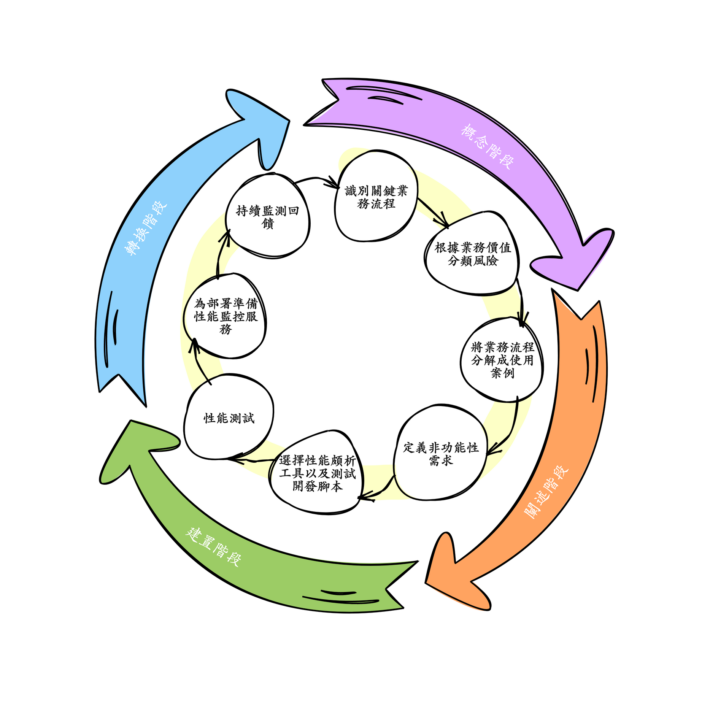

# D2 簡介系統性能工程

- 系列：應該是 Profilling 吧？系列 第 2 篇
- Day：2
- 發佈時間：2024-09-02 00:01:55
- 原文：[https://ithelp.ithome.com.tw/articles/10347376](https://ithelp.ithome.com.tw/articles/10347376)

> # 站在未來，規劃現在
>
> 就是可觀測性工程與系統性能工程的核心精神  
> 只有知道系統能有多少容量應付未來的流量，以及知道系統發生哪些事情我們能提早準備  
> 才有可能把 Risk 降到最低。

現代軟體系統中，Log、Metrics 和 Traces 已成為實現系統可觀測的三大遙測信號基石。這些遙測信號幫助我們深入了解系統的運行狀態，識別問題，並提供解決問題所需的上下文。然而，隨著系統的複雜性增加和性能要求的提高，僅依賴這三種遙測信號已不足以滿足現代企業的需求。因此，Profile 性能剖析作為第四種遙測信號，逐漸在**系統性能工程**中扮演著不可或缺的角色。

## Profile 性能剖析的重要性

在傳統開發流程中，工程師通常會在開發完成後紀錄事件 log，設置框架監測 metric 和 trace span，然後將系統部署到具有擴展能力的測試環境中進行負載測試。然而，這樣的流程存在一個主要問題：當性能問題出現時，往往只能依賴基本遙測信號進行推敲，缺乏深入的剖析工具來準確定位問題。

> 舉個現實案例，團隊僅仰賴 log，但真的出問題時，找不到能定位問題的 log，或者能看見很常的錯誤訊息，但通常還是猜，然後在改程式加入更多 log。此時團隊能做的事情只有**觀察**與**等待**。事情未必能很容易再上演。且這過程中，無疑也沒能幫助系統止血或根除原因，因為只做了跟重開機一樣的行為。  
> 但蠻多時候這種事情發生，幾乎是 syscall(I/O)或是服務容量不夠導致的，但這些原因 log 捕捉不到，因為這都是 kernel 等級的資訊。但 profile 可能可以捕捉到一些資訊，例如等待 syscall 完成的時間資訊，每個 goroutine 等執行情況等。

Profile 性能剖析正是在這一背景下應運而生。它能夠深入分析應用程式的資源使用情況，揭示系統的深層次性能瓶頸。這種能力使得 Profile 成為解決 **Unknown-Unknowns** 問題的關鍵工具。

## 系統性能工程的背景

系統性能工程（Performance Engineering）是一個涵蓋系統開發生命週期中各個階段的技術領域，其目的是確保系統性能的非功能需求（如吞吐量、延遲、記憶體/CPU 使用量等）得到滿足。這個領域的重點不僅僅是在開發過程中進行性能優化，還包括在系統運行後的持續監控和優化。

性能工程的目標是多方面的，包括：

- 增加業務收入：確保系統能在所需時間內處理請求，從而提升用戶體驗和業務收益。
- 消除系統開發返工：通過在開發階段就解決性能問題，避免因性能目標失敗而導致的返工。
- 減少硬體成本：通過優化系統性能，減少不必要的硬體資源消耗，從而降低成本。

### 性能工程目標

- 通過確保系統能在所需時間內處理請求來增加業務收入
- 消除由於性能目標失敗而需要報廢和撇帳的系統開發工作
- 消除由於性能問題導致的系統延遲部署
- 消除由於性能問題引起的可避免的系統返工
- 消除可避免的系統調優工作
- 避免額外和不必要的硬體採購成本
- 減少由於正式營運環境中的性能問題而導致的軟體維護成本增加
- 減少由於即興性能修復對軟體的影響而導致的軟體維護成本增加
- 減少由於性能問題而處理系統問題的額外運營開銷
- 通過原型模擬識別未來瓶頸
- 增加伺服器容量的能力

### 性能工程的主要方法

性能工程涉及多種方法論，這些方法在不同的開發階段應用，並通過統一的過程框架（如 RUP）進行管理。

1. 概念階段（Concept Phase）：

   - 識別關鍵業務流程：根據業務價值分類，確定需要優先關注的業務流程。
   - 識別高風險：描述可能影響系統性能的風險，並制定相應的計劃。
2. 闡述階段（Elaboration Phase）：

   - 分解業務流程：將關鍵業務流程分解為具體的使用案例，確保每個步驟的性能需求得到充分考慮。
   - 定義非功能需求（NFR）：包括性能需求在內的所有非功能需求，在這一階段得到明確的定義。
3. 建置階段（Construction Phase）：

   - 選擇性能剖析工具：為開發和測試環境選擇合適的工具，這些工具將用於性能測試和剖析。
   - 性能測試：在接近正式營運環境的預部署環境中進行性能測試，確保系統在實際運行中的表現符合預期。
4. 轉換階段（Transition Phase）：

   - 部署準備：配置操作系統、網路、伺服器和性能監控軟體，以確保系統在運行中的穩定性。
   - 持續運營：在系統部署後，進行定期的性能監控和報告，確保系統性能始終保持在最佳狀態。

這些方法構成了性能工程的基本框架，為系統性能優化提供了科學的指導。

以上只是 [Wiki](https://en.wikipedia.org/wiki/Performance_engineering) 的內容翻譯成中文而已 XD

從這性能工程方法的各階段描述能理解到也是一種測試概念，將這類測試左移至系統分析與設計階段就開始規劃，並且於開發整合環境就能測試，在之後各環境也是能持續地測試取得回饋。

當團隊開始將這樣的工程方法引入在團隊的開發流程中時，其實也像可觀測性工程的 ODD（可觀測性驅動開發）中也有個 OMM（可觀測性成熟度模型），這裡也有 [Performance Process Maturity Model （性能測試成熟度模型）](https://web.archive.org/web/20090227123220/http://test.cmg.org/conference/cmg2004/awards/4083.pdf)。

### 性能剖析工具的選擇與應用

在性能工程中，性能剖析工具的選擇至關重要。這些工具能夠提供對系統內部運行狀態的深度洞察，幫助開發者識別和解決性能瓶頸。

常見的性能剖析工具包括：

- gprof：一種早期的性能剖析工具，用於分析程式的 CPU 使用情況。
- Java VisualVM：Java 開發中的一種可視化性能剖析工具，能夠幫助開發者分析和優化 Java 應用程式的性能。
- Pyroscope 和 Parca：現代化的性能剖析工具，基於 eBPF 技術，能夠在不影響系統性能的情況下進行持續監控。

性能剖析工具的選擇應根據具體的應用需求和技術環境進行調整。在選擇工具時，應考慮其對系統性能的影響、可擴展性以及與現有技術堆棧的兼容性。

## Profile 在系統性能工程中的重要性

前面提到不少次 Profile 能深入分析與解決 **Unknown-Unknowns** 問題：

在傳統開發流程中，當性能問題出現時，開發團隊往往只能依賴基本的 Log、Metrics 和 Traces 來推敲問題的根源。然而，這些遙測信號只能告訴我們「*出了什麼問題*」，卻無法揭示「*為什麼會出現這個問題*」。Profile 性能剖析工具能夠深入剖析應用程式的資源使用情況，揭示深層次的性能瓶頸，幫助團隊定位和解決 Unknown-Unknowns 問題。

**提升系統性能工程的全面性：**

系統性能工程涵蓋了系統開發生命週期中的各個階段，其目的是確保系統性能的非功能需求得到滿足。Profile 性能剖析作為一種深度剖析工具，能夠在性能工程的各個階段發揮重要作用。例如，在建置階段，它可以幫助選擇合適的性能剖析工具，並在性能測試中提供精確的性能數據；在轉換階段，它可以持續監控系統性能，確保系統運行始終保持最佳狀態。

**支持持續優化與改進：**

Profile 性能剖析工具的應用，讓開發團隊能夠在整個系統開發生命週期中進行持續的性能優化。這不僅能幫助團隊及早發現並解決性能問題，還能降低由於性能問題導致的系統開發返工和維護成本。此外，這些工具還能通過數據的持續監控和分析，為未來的系統優化提供寶貴的數據支持，幫助團隊更好地應對系統的複雜性和業務需求的變化。

## 總結

可觀測性驅動開發（ODD）其實各種的開發流程都差不多概念，目的都希望左移（Shift Left），就是希望在設計初期就把這些加入工作項目與完成目標中。可避免不必要的返工，導致工時延宕。或者上線了才發現出問題，只因為沒多點時間一起設計討論。

> 應該蠻多團隊很常嘴邊掛著「先做再說」，通常此話一出，什麼方法論就基本無用武之處了 XD 我相信也不太會重視測試，頂多在意那涵蓋率，但不看內容的。  
> 好一點的團隊記得多復盤系統上遇到的問題以及盤點技術債與問題，能在之後修補問題就好。復盤出事的時空背景，可能的原因，解決的方法，讓大家能一起討論跟了解這些處理的 SOP。也能在這樣的過程中變成 Known-Knowns，就是加入 log 以及對應的 alert 或 SOP。  
> 最怕的就是不復盤、不盤點跟償還技術債，一直疊床架屋的團隊。這種我只能說「很棒！」。
