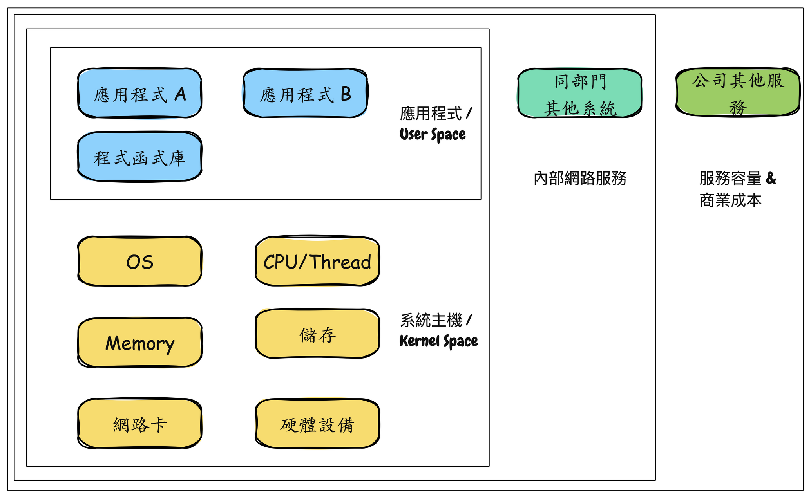
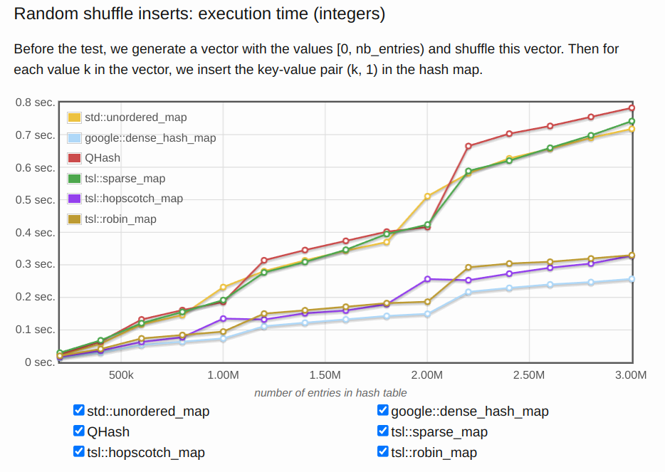

# D4 系統性能工程充滿著挑戰

- 系列：應該是 Profilling 吧？系列 第 4 篇
- Day：4
- 發佈時間：2024-09-04 00:10:27
- 原文：[https://ithelp.ithome.com.tw/articles/10347763](https://ithelp.ithome.com.tw/articles/10347763)

繼前兩天都在提到系統性能工程，今天來多聊一點該領域的東西。  
[D2 簡介系統性能工程](https://ithelp.ithome.com.tw/articles/10347376)  
[D3 性能測試成熟度模型與實踐指南](https://ithelp.ithome.com.tw/articles/10347564)

系統性能指的是對個服務的性能的研究，包括主要硬體與軟體。所有執行路徑與資料路徑上和從儲服務到應用程式上所發生的事情都包括在內，因為這些都有可能影響系統性能。對於分散式系統來說，這益為著更多台的伺服器與應用程式在營運環境上，複雜度幾乎成指數成長。如果我們沒有系統環境的一張全景示意圖，用來顯示資料的路徑，以前我們會自己畫一張，然後在部門同事間流傳。這圖可以幫助我們理解所有組件的關係，並確保我們不會只見樹木不見森林。

系統性能的基本目標是減少 duration 以及降低運行或計算成本，來改善使用者的體驗。可低成本可以通過消除性能低效的地方、提供系統吞吐量和進行常規性能優化來實現。

在系統性能工程中，也有 Full Stack 這名稱 XD。 不同於職位上表示一條龍，這裡的 Full Stack 指的是應用程式到硬體的全部，包含軟體系統、系統底層、硬體本身。系統性能研究的是 Full Stack。研究範圍就是下圖的應用程式與系統主機的區塊。



所有服務的黃色區塊其實就是全公司的硬體容量，也就是營運時必須支出的成本。這時候上層就會有兩種營運思路出現了︰

1. 降低營運成本，那我們就會把總硬體容量降低了。通常在公司不賺錢時 XD 就也別再妄想會有漂亮的分紅了。
2. 不降低營運成本，而是希望大家提高性能以及有效率用率。這樣子的思維那肯定就是公司有賺錢，但希望擴大通路跟客戶數量，以及提昇使用者體驗。

所以如果開發團隊能對系統性能以及資源利用程度有所關心，以及知道如何監測以及分析自己開發的服務。服務運行效能的提昇以及執行性能的優化，能使得成本花在刀口上，讓資源更有效率的被運用。

> 很多公司上雲端，就是照以往的習慣與認知，依樣放上雲端而已。最後都會說怎麼比地端都還貴。交付速度也沒變快多少。或者 ECS. EKS fargate這些以為便宜就最小數量開不少。但其實資源利用率很低很低，效能不好以為能仰賴數量做補救，但其實就是用鈔能力來提高系統容量，並沒作到優化這事情。

往往我們所設計的解決方案以及撰寫的程式碼近乎直接影響了服務的質量，也間接決定了使用者的去留。同時這些服務會運行在各種主機上，公司的維運團隊需要部署資料庫以及網路等容量，這些容量的效率就直接影響了公司的運營成本。

所以，程式性能的優化以及容量效率的提昇，其實是每個開發人員的重要工作。正且系統性能工程就是在討論這面向。

## 性能

性能表現其實能體驗在很多指標上，常見的幾個指標有`Throughput`、`Latency`、`Scalability` 和 `Resouce Utilization`。

- Throughput︰單位時間內能處理請求的數量。老闆總是希望 throught 越多越好 XD
- Latency/Duration︰使用者請求的處理時間。老闆總希望Latency 越快越低越好。
- Scalability︰系統在`高度負載`的情況下能不能正常處理請求。老闆總希望 scalability 越即時越好。
- Resource Utilization︰單位請求處理所需要的資源量（比如 CPU、記憶體、頻寬或連線等）。老闆總希望utilization越高越省$$ ^^

這裡講的都不會是單個，主要是整體。只是別忘記`木桶理論` 或 `短板理論`。

> 一個木桶盛水的多少，並不取決於桶壁上最高的那塊木塊，而是取決於桶壁上最短的那塊。

當我們知道這四個基本指標時，就能簡單評斷自己設計撰寫的服務的表現如果不好，那就是 throughput 少、latency 高、scalability 差又慢、resource utilization 低（帳面資源需求很高）。那麼這服務肯定會提高不少營運上的成本。

所以團隊以及開發人員還是需要關心自己的程式碼的性能表現。而在這系統性能工程上掌握度越高的工程師，往往也是在團隊中相對資深或對該語言或很多系統底層掌握度高的人員。

### 舉例說明

1. 二維陣列操作

   這裡都是針對二維陣列進行存取操作。只是一個先從內層`j` 開始走訪，再走訪`i`，令一個則是反過來。

```go
func TwoDimArrayBad() {
    x := [4000][4000]int{}
    for i := 0; i < 4000; i++ {
        for j := 0; j < 4000; j++ {
            x[j][i] = i + j
        }
    }
}

func TwoDimArrayGood() {
    x := [4000][4000]int{}
    for i := 0; i < 4000; i++ {
        for j := 0; j < 4000; j++ {
            x[i][j] = i + j
        }
    }
}
```

讓我們執行benchmark測試，

```go
func BenchmarkTwoDimArrayBad(b *testing.B) {
	b.ResetTimer()
	for i := 0; i < b.N; i++ {
		TwoDimArrayBad()
	}
}

func BenchmarkTwoDimArrayGood(b *testing.B) {
	b.ResetTimer()
	for i := 0; i < b.N; i++ {
		TwoDimArrayGood()
	}
}
```

```
go test -bench=. 
goos: linux
goarch: amd64
pkg: demo/TwoDimArrayBench
cpu: AMD Ryzen 5 3600 6-Core Processor              
BenchmarkTwoDimArrayBad-12            13          83757417 ns/op
BenchmarkTwoDimArrayGood-12           54          25308850 ns/op
```

我們能看到`TwoDimArrayBad`每次操作平均花費 83,757,417 納秒（約 83 毫秒）。而`TwoDimArrayGood` 每次操作平均花費 25,308,850 納秒（約 25 毫秒）。後者快了約3倍之多。且陣列操作是很常見的場景。

`TwoDimArrayGood` 會這麼快是因為利用了 CPU cache，在 CPU 的L1/L2的記憶體中甚至在一般的記憶體中，陣列都是連續空間來儲存的。還有就是利用了 `Spatial locality` （資料局部性原則），因為連續的資料存取是在鄰近的記憶體空間中。而如果每次操作都要切換令一個很大的陣列元素，那麼自然快不起來。

所以知曉一些底層的知識，以及知道怎麼做測試來改善程式碼，會是工程師一門重要的修為。

2. Map 結構操作

   我們時常會用到 Map 來存放 Key-Value 這樣的大量資料於記憶體中做操作。通常每種程式語言都會提供很多種的泛型容器，如果我們開發者不夠清楚自己的存取場景與方式，以及不清楚這些容器的差別與適用場景。那麼在性能表現上也會很明顯。

以下是 C++ 的常見 map容器。今天存取場景是`隨機插入`。可能常見的會選擇`std::unordered_map`，可是 `google:dense_hash_map` 相比於 `std::unordered_map` 是非常的快好幾倍。

但這些性能指標的benchmark報表也都是實驗測試出來的。



[圖片參考自 tessil.github.io](%5Bhttps://tessil.github.io/2016/08/29/benchmark-hopscotch-map.html%5D(https://tessil.github.io/2016/08/29/benchmark-hopscotch-map.html))

3. 濫用 Thread 或 coroutine

濫用Thread或Coroutine會導致系統資源的浪費，因為CPU數量有限，過多的Thread或Coroutine會導致上下文切換開銷過高。合適地使用這些技術，並根據實際需求進行性能測試和優化，是提高系統性能的重要方法。

這段程式會針對不同數量的Goroutine進行基準測試，從而瞭解系統在不同情況下的表現。

> 以下程式碼存成 `main_test.go`，使用 `go test -bench=. -benchmem` 執行。

```go
package main

import (
	"fmt"
	"sync"
	"testing"
	"time"
)

type WorkerPool struct {
	tasks chan func()
	wg    sync.WaitGroup
}

func NewWorkerPool(size int) *WorkerPool {
	pool := &WorkerPool{
		tasks: make(chan func(), size),
	}
	for i := 0; i < size; i++ {
		go pool.worker()
	}
	return pool
}

func (p *WorkerPool) worker() {
	for task := range p.tasks {
		task()
	}
}

func (p *WorkerPool) Submit(task func()) {
	p.wg.Add(1)
	p.tasks <- func() {
		defer p.wg.Done()
		task()
	}
}

func (p *WorkerPool) Wait() {
	p.wg.Wait()
}

// BenchmarkGoroutines 直接建立大量 Goroutine，作為對照組
func BenchmarkGoroutines(b *testing.B) {
	for _, n := range []int{10, 100, 1000, 10000} {
		b.Run(fmt.Sprintf("%d-Goroutines", n), func(b *testing.B) {
			b.ResetTimer()
			for i := 0; i < b.N; i++ {
				var wg sync.WaitGroup
				for j := 0; j < n; j++ {
					wg.Add(1)
					go func() {
						defer wg.Done()
						time.Sleep(time.Millisecond)
					}()
				}
				wg.Wait()
			}
		})
	}
}

// BenchmarkWorkerPool 使用 Goroutine 池，重用 Worker 減少建立開銷
func BenchmarkWorkerPool(b *testing.B) {
	for _, n := range []int{10, 100, 1000, 10000} {
		b.Run(fmt.Sprintf("%d-WorkerPool", n), func(b *testing.B) {
			pool := NewWorkerPool(100) // 池的大小可以根據需要調整
			b.ResetTimer()
			for i := 0; i < b.N; i++ {
				for j := 0; j < n; j++ {
					pool.Submit(func() {
						time.Sleep(time.Millisecond)
					})
				}
				pool.Wait()
			}
		})
	}
}
```

```
go test -bench=. -benchmem
goos: linux
goarch: amd64
pkg: demo/coroutine
cpu: AMD Ryzen 5 3600 6-Core Processor
BenchmarkGoroutines/10-Goroutines-12         	    1110	   1082729 ns/op	    1002 B/op	     21 allocs/op
BenchmarkGoroutines/100-Goroutines-12        	    1028	   1164214 ns/op	    9633 B/op	    201 allocs/op
BenchmarkGoroutines/1000-Goroutines-12       	     638	   1884204 ns/op	   96252 B/op	   2002 allocs/op
BenchmarkGoroutines/10000-Goroutines-12      	     214	   5376712 ns/op	  966349 B/op	   20048 allocs/op
PASS
ok  	demo/coroutine	5.742s
```

這些benchmark結果提供了有關不同數量Goroutine對系統性能影響的信息。讓我們逐行解析這些數據：

1. **BenchmarkGoroutines/10-Goroutines-12**：

   - **ns/op**（每操作納秒數）：1,082,729 ns（約1.08毫秒），表示每次運行這個測試需要的平均時間。
   - **B/op**（每操作的字節數）：1,002 B，表示每次操作分配的記憶體量。
   - **allocs/op**（每操作的分配數量）：21次，表示每次操作記憶體分配的次數。
2. **BenchmarkGoroutines/100-Goroutines-12**：

   - **ns/op**：1,164,214 ns（約1.16毫秒），比10個Goroutine的情況略微增加。
   - **B/op**：9,633 B，分配的記憶體明顯增加。
   - **allocs/op**：201次，記憶體分配次數也增加。
3. **BenchmarkGoroutines/1000-Goroutines-12**：

   - **ns/op**：1,884,204 ns（約1.88毫秒），隨著Goroutine數量的增加，時間也增加。
   - **B/op**：96,252 B，記憶體分配量顯著增加。
   - **allocs/op**：2002次，記憶體分配次數也大幅增加。
4. **BenchmarkGoroutines/10000-Goroutines-12**：

   - **ns/op**：5,376,712 ns（約5.38毫秒），顯著增加。
   - **B/op**：966,349 B，記憶體分配接近1MB。
   - **allocs/op**：20048次，記憶體分配次數非常多。

### 解釋和分析

1. **時間（ns/op）**：

   - 隨著Goroutine數量的增加，每次操作所需的時間也在增加。這是因為更多的Goroutine會增加調度和Context switch的開銷。
2. **記憶體佔用大小（B/op）**：

   - 隨著Goroutine數量的增加，每次操作分配的記憶體量也在增加。更多的Goroutine需要更多的記憶體來存儲其狀態和棧。
3. **記憶體分配次數（allocs/op）**：

   - 記憶體分配次數也隨著Goroutine數量的增加而增加。這是因為每個Goroutine的創建和銷毀都會涉及記憶體分配和釋放。

### 改善方法

1. **使用Goroutine池**：

重用Goroutine而不是每次都創建新的Goroutine，這可以顯著減少記憶體分配和context switch 的開銷。

2. **優化記憶體使用**：

減少每個Goroutine需要的記憶體量，確保Goroutine的工作量和記憶體需求是合理的。

> 以下程式碼存成 `main_test.go`，使用 `go test -bench=. -benchmem` 執行。

```go
package main

import (
	"fmt"
	"sync"
	"testing"
	"time"
)

type WorkerPool struct {
	tasks chan func()
	wg    sync.WaitGroup
}

func NewWorkerPool(size int) *WorkerPool {
	pool := &WorkerPool{
		tasks: make(chan func(), size),
	}
	for i := 0; i < size; i++ {
		go pool.worker()
	}
	return pool
}

func (p *WorkerPool) worker() {
	for task := range p.tasks {
		task()
	}
}

func (p *WorkerPool) Submit(task func()) {
	p.wg.Add(1)
	p.tasks <- func() {
		defer p.wg.Done()
		task()
	}
}

func (p *WorkerPool) Wait() {
	p.wg.Wait()
}

// BenchmarkGoroutines 直接建立大量 Goroutine，作為對照組
func BenchmarkGoroutines(b *testing.B) {
	for _, n := range []int{10, 100, 1000, 10000} {
		b.Run(fmt.Sprintf("%d-Goroutines", n), func(b *testing.B) {
			b.ResetTimer()
			for i := 0; i < b.N; i++ {
				var wg sync.WaitGroup
				for j := 0; j < n; j++ {
					wg.Add(1)
					go func() {
						defer wg.Done()
						time.Sleep(time.Millisecond)
					}()
				}
				wg.Wait()
			}
		})
	}
}

// BenchmarkWorkerPool 使用 Goroutine 池，重用 Worker 減少建立開銷
func BenchmarkWorkerPool(b *testing.B) {
	for _, n := range []int{10, 100, 1000, 10000} {
		b.Run(fmt.Sprintf("%d-WorkerPool", n), func(b *testing.B) {
			pool := NewWorkerPool(100) // 池的大小可以根據需要調整
			b.ResetTimer()
			for i := 0; i < b.N; i++ {
				for j := 0; j < n; j++ {
					pool.Submit(func() {
						time.Sleep(time.Millisecond)
					})
				}
				pool.Wait()
			}
		})
	}
}
```

```
go test -bench=. -benchmem
goos: linux
goarch: amd64
pkg: demo/coroutine
cpu: AMD Ryzen 5 3600 6-Core Processor
BenchmarkGoroutines/10-Goroutines-12         	    1110	   1081654 ns/op	     994 B/op	       21 allocs/op
BenchmarkGoroutines/100-Goroutines-12        	    1029	   1149538 ns/op	    9626 B/op	      201 allocs/op
BenchmarkGoroutines/1000-Goroutines-12       	     624	   1937192 ns/op	   96108 B/op	     2001 allocs/op
BenchmarkGoroutines/10000-Goroutines-12      	     201	   5689357 ns/op	  967234 B/op	    20025 allocs/op
BenchmarkWorkerPool/10-WorkerPool-12         	    1110	   1088607 ns/op	     266 B/op	       10 allocs/op
BenchmarkWorkerPool/100-WorkerPool-12        	    1036	   1164913 ns/op	    2424 B/op	      100 allocs/op
BenchmarkWorkerPool/1000-WorkerPool-12       	     100	  11163591 ns/op	   24341 B/op	     1003 allocs/op
BenchmarkWorkerPool/10000-WorkerPool-12      	      10	 110927755 ns/op	  242182 B/op	    10024 allocs/op
PASS
ok  	demo/coroutine	11.775s
```

### 分析和解釋

1. **時間（ns/op）**：

   - 在Goroutine的基準測試中，隨著Goroutine數量的增加，執行時間也逐漸增加。這是因為創建和調度大量Goroutine需要更多的時間。
   - 在Worker Pool的基準測試中，當Goroutine數量較少時，執行時間相對穩定，但隨著數量增加，時間顯著增加，這是因為Worker Pool需要管理大量的任務。
2. **記憶體佔用大小（B/op）**：

   - 在Goroutine的基準測試中，記憶體使用量隨著Goroutine數量的增加而顯著增加，這是因為每個Goroutine都需要分配記憶體來儲存其狀態。
   - 在Worker Pool的benchmark中，記憶體使用量明顯較少，這是因為Goroutine池重用了Goroutine，減少了記憶體分配的開銷。
3. **記憶體分配次數（allocs/op）**：

   - 在Goroutine的基準測試中，記憶體分配次數隨著Goroutine數量的增加而顯著增加。
   - 在Worker Pool的benchmark中，記憶體分配次數較少，這是因為Worker Pool減少了Goroutine的創建和銷毀次數。

### 改善建議

1. **使用Goroutine池**：對於需要創建大量Goroutine的應用，使用Goroutine池可以顯著減少記憶體使用和記憶體分配次數，提高性能。
2. **調整池大小**：根據實際需求調整Goroutine池的大小，以達到最佳性能。
3. **進行性能剖析**：使用性能剖析工具，如`pprof`，進一步分析和優化程式碼中的性能瓶頸。

通過這些措施，您可以更好地利用Goroutine池，提高應用程序的性能和資源利用效率。

## 小結

每個開發者應該需要關心程式碼性能。如果不了解性能優化的相關知識，是也能寫出可執行但性能非常不好的程式碼。但一個對待自己開發維護的服務負責的開發人員一定會發現，應能不好的程式碼無異於在製造技術債，還會像艾倫一樣，在製造更多工作機會。

如果一開始在設計時，就考慮到一些性能問題，並且提前在開發過程中解決，經過測試來驗證。這樣子的開發者相信到哪裡服務都會是團隊中的骨幹。

---

就延伸我在用Go做些範例的地方，其實常見的還有如**I/O性能優化**、**資料庫查詢優化**、**或網路延遲優化**。不然上面會很冗長。

- **I/O 操作**  
  I/O 往往是系統性能瓶頸的一個重要來源，因為與 CPU 和記憶體相比，I/O 操作通常會慢得多。優化 I/O 性能的策略可以顯著提升系統的整體效率。  
  [這網站能了解從1990-2020這些年來 CPU-Mem-Disk-SSD 的讀寫效能、一些瓶頸時間](https://colin-scott.github.io/personal_website/research/interactive_latency.html)

1. Async I/O 處理  
   方法：將 I/O 操作設計為 Async 方式，讓程式在等待 I/O 操作完成的同時，可以繼續執行其他任務。

說明：Async I/O 可以防止因等待 I/O 操作完成而導致的 CPU 空閒，從而提高系統的**吞吐量**。例如，在網路請求或文件讀寫時，使用異步 I/O 能夠更有效地利用系統資源。

2. 批量處理  
   方法：將多個 I/O 操作合併為一次操作，減少每次 I/O 的開銷。

說明：批量處理可以減少 I/O 操作的頻率，降低每次 I/O 的時間開銷。例如，在需要多次寫入文件時，將多次寫入操作合併為一次批量寫入，能顯著減少 I/O 的總耗時。

3. Cache 機制  
   方法：使用 Cache（如記憶體Cache或硬碟Cache）來減少對硬碟或網絡的直接 I/O 操作。

說明：Cache 機制可以顯著降低 I/O 操作的延遲。例如，在讀取經常使用的數據時，先查詢 Cache，只有當 Cache 中不存在時才進行 I/O 操作。

4. Zero Copy機制  
   資料從硬碟或網路設備直接傳輸到最終目標，不需要經過 User space 的多次 copy。例如，在 Linux 中，使用 sendfile() 函數可以將文件中的數據直接從 File descripter 傳輸到 socket，而不經過 user space 的中間步驟。

- **網路延遲優化**  
  在分散式系統中，網路延遲往往是導致性能問題的一個重要因素。優化網路性能可以顯著提升系統的響應速度。

1. 減少網路跳數  
   方法：優化系統架構，減少數據在不同節點之間的傳輸次數。

說明：每次網路跳數都會增加延遲，因此減少節點之間的傳輸次數可以降低延遲。例如，在 CDN 中將內容儲存到距離用戶最近的節點，可以顯著降低延遲。

2. 使用壓縮  
   方法：在網路傳輸中使用壓縮技術，減少需要傳輸的數據量。

說明：壓縮可以減少數據包的大小，從而降低網路傳輸所需的時間。例如，對於文本數據，使用 GZIP 壓縮可以大幅減少傳輸時間。

3. 優化協議  
   方法：選擇和優化網路協議，如使用 HTTP/2 或 QUIC 來替代 HTTP/1.1，以提高數據傳輸效率。

說明：現代協議如 HTTP/2 支持多路複用，允許多個數據流在單個連接上並行傳輸，這可以顯著減少延遲。例如，使用 HTTP/2 可以減少瀏覽器在加載網頁時的資源請求時間。
