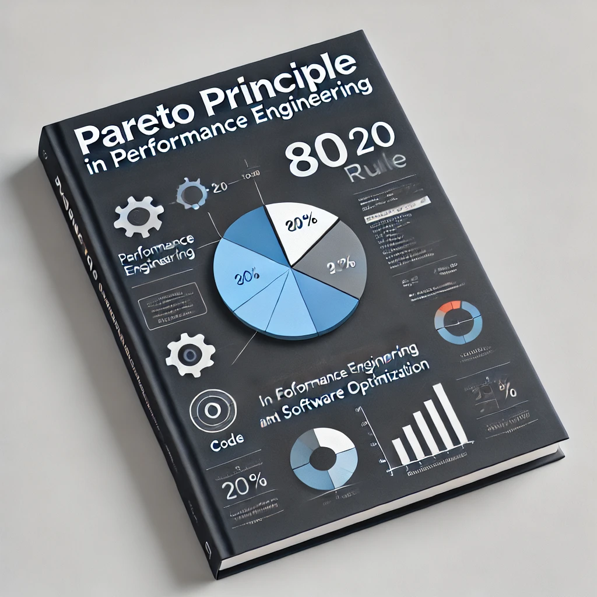
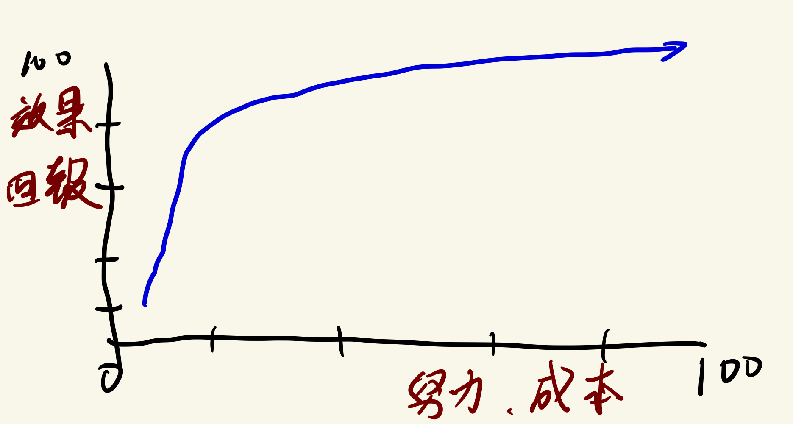

# D6 性能工程基本定律 - 80/20 法則

- 系列：應該是 Profilling 吧？系列 第 6 篇
- Day：6
- 發佈時間：2024-09-06 00:12:13
- 原文：[https://ithelp.ithome.com.tw/articles/10348115](https://ithelp.ithome.com.tw/articles/10348115)

今天來介紹性能工程在進行時，可以遵守這幾天介紹的基本法則，來決定團隊優先進行什麼測試或改善。今天先介紹 80/20 法則。

**Pareto Principle** 又被稱為 **80/20 法則**、**關鍵少數法則**。在很多場景下，大約 20% 的因素操控著 80% 的局面。也就是說，所有的變數中，比較重要的通常只有 20%，是所謂的關鍵少數。其餘 80% 的因素則相對次要。

當我們將 Pareto Principle 應用到 性能工程 或 性能測試 之中，它可以為優化策略提供清晰的指引，幫助我們有效利用資源，解決系統中的關鍵性能瓶頸，並且避免浪費過多精力在次要問題上。以下是一些針對 性能工程 和 性能優化 的擴展應用場景及其具體意義：

## 性能工程中的 80/20 法則應用場景

1. 性能測試覆蓋範圍

   - 套用法則：80% 的系統性能問題來自於 20% 的操作場景或路徑。
   - 具體意義：在進行性能測試時，應集中測試那些最常被使用的功能或路徑，因為這些部分最有可能暴露性能問題。例如，在負載測試中，優先測試關鍵交易流程或核心業務模塊，而非針對所有場景進行等同測試。這樣可以最大化發現性能瓶頸並優化資源利用。
2. 性能瓶頸識別

   - 套用法則：80% 的性能瓶頸來自於 20% 的系統資源或程式碼區段。
   - 具體意義：在性能分析中，集中資源進行針對性分析，例如使用 Profiling 工具（如 pprof 或 Flamegraph）來找出使用最多 CPU 或 I/O 資源的關鍵程式碼區段，並對其進行針對性優化。這樣可以避免將精力浪費在次要功能模組上，從而更快速地改善系統性能。
3. 資料存取與 I/O 優化

   - 套用法則：80% 的 I/O 時間集中在 20% 的資料操作上。
   - 具體意義：大部分 I/O 操作耗時都來自於少數頻繁訪問的資料或資料表。因此，在優化 I/O 性能時，應優先處理那些頻繁讀寫的資料，進行快取優化、索引調整，或使用 Zero Copy 技術來減少資料複製開銷，從而提升系統整體的 I/O 性能。

> 冷熱資料分離，也是一種優化方式

4. 性能指標收集
   - 套用法則：80% 的性能指標意義來自於 20% 的關鍵指標。
   - 具體意義：在性能測試和運維監控中，收集和監控所有的指標並不總是必要的。應聚焦於關鍵性能指標，如 CPU 使用率、記憶體占用、請求延遲、吞吐量 等，這些關鍵指標能最直接地反映系統性能的健康狀況。通過優先處理和分析這些指標，能夠大幅提高性能監控的效率。

> 下一段，有提供常見服務類型的關鍵性能指標

5. 性能優化的資源分配

   - 套用法則：80% 的性能改進來自於優化 20% 的程式碼或架構設計。
   - 具體意義：在進行性能優化時，應根據數據分析找出系統中的熱點程式碼或瓶頸所在，集中精力優化這些部分。這包括優化算法、提升資源管理效率，或解決 CPU 飽和、I/O 阻塞等問題。優化這 20% 的程式碼區段將能顯著提升整體系統的效能，避免浪費大量資源在次要程式碼上。
6. 服務擴容與縮容

   - 套用法則：80% 的系統資源消耗集中在 20% 的高負載業務上。
   - 具體意義：在雲端環境中進行服務擴容或縮容時，應集中分析和處理那 20% 的高負載業務模塊，針對其進行垂直擴容（增加單台伺服器資源）或水平擴容（擴大伺服器集群）。這樣能有效利用資源，並確保系統在高峰期仍能保持穩定性。
   > 題外話，但擴容的上限就是系統容量的最大值，不能在超過，如果能知道系統容量的最大值，能搭配 Rate Limit（Token/Leakey bucket 等來控制）。
7. 服務與架構的模組化優化

   - 套用法則：80% 的系統延遲可能來自 20% 的服務或模組間通訊交互。
   - 具體意義：在分散式系統中，服務間的通訊交互效率會直接影響系統的延遲和回應時間。應優先分析服務間的網路通訓、RPC 等場景，通過優化服務架構、減少網路跳數或增加資料傳輸的批次處理來提升性能。這可以顯著減少整體的網路延遲和系統反應時間。
8. 資料庫性能優化

   - 套用法則：80% 的資料庫性能問題集中在 20% 的查詢或操作上。
   - 具體意義：資料庫的性能瓶頸通常來自於少數幾個查詢或操作，這些查詢可能佔據了大部分的資料庫資源。通過優先優化這 20% 的高負載查詢（例如添加索引、優化查詢語句、使用分區等），可以顯著提升整個系統的資料庫性能，減少查詢延遲。
9. 使用者訪問模式分析與優化

   - 套用法則：80% 的使用者訪問集中在 20% 的時間段內。
   - 具體意義：應根據使用者流量的分佈情況，優先優化使用者高峰期的系統負載。例如，提前進行系統升級、資源調配和負載預測，確保系統在高峰期內仍能穩定運行。此外，使用 自適應擴容 和 CDN 優化 技術，幫助應對流量高峰。
10. 自動化運維流程

    - 套用法則：80% 的人工手動運維操作來自於 20% 的重複性任務。
    - 具體意義：應優先將重複性高、影響範圍廣的手動操作自動化，例如自動化部署、持續整合與持續交付等。這樣可以顯著提升運維效率，降低手動操作帶來的人為錯誤風險。
11. 安全漏洞修補

    - 套用法則：80% 的安全漏洞集中在大約 20% 的程式碼路徑或配置上
    - 具體意義：應優先檢查並修補這些容易暴露漏洞的程式碼區段或配置項。

這些場景進一步擴展了 Pareto Principle 的應用範疇，使得法則在軟體開發的各個層面都能發揮其影響力。通過識別和優先處理這些「關鍵少數」，可以在資源有限的情況下，取得最大化的效率和效果。

這一法則的核心價值在於：**先解決 20% 最關鍵的問題，便能達到 80% 的效果。而剩餘 80% 的問題，即便投入大量資源，也只能獲得相對有限的改進。**

服務提供的各種功能中，只要跟營收或所謂的**核心競爭力**有直接影響關係的功能，肯定是關鍵部份，絕對是要關注相關問題來處理並持續優化的。

## 各種服務類型的關鍵性能指標

針對不同的服務類型，應根據其特性來選擇關鍵性能指標。以下是各類服務的常見性能指標，根據 Pareto Principle 的應用，我們可以聚焦於這些關鍵指標來提高性能監控的效率：

1. API 服務  
   API 服務的核心是為客戶端提供穩定、快速的資料訪問。因此，以下關鍵指標最能反映 API 服務的健康狀況：

   - 請求延遲（Latency）：反映 API 請求處理的時間，通常用於衡量使用者體驗。
   - 吞吐量（Throughput）：每秒處理的請求數，反映 API 的處理能力。
   - 錯誤率（Error Rate）：失敗請求的比例，反映 API 服務的穩定性。
   - CPU 使用率：反映服務的資源消耗情況，過高的使用率可能表明性能瓶頸。
   - 記憶體使用率：反映應用的記憶體管理情況，過高的記憶體使用可能會導致性能下降或 OOM（Out of Memory）。
   - API 回應時間的分佈：查看請求回應時間的不同分佈區間，幫助定位潛在的性能問題。
2. 2. 資料庫服務  
      資料庫的核心性能指標與數據的讀取、寫入、查詢效率密切相關。關鍵性能指標包括：
   - 查詢延遲（Query Latency）：單次查詢的處理時間，反映資料庫的查詢性能。
   - 查詢吞吐量（Query Throughput）：每秒處理的查詢數量，反映資料庫的並發能力。
   - 索引命中率（Index Hit Rate）：反映查詢是否有效利用了索引，過低的命中率可能會導致性能問題。
   - 慢查詢（Slow Queries）：執行時間超過預定閾值的查詢次數，這些查詢往往會拖慢整個系統。
   - 資料庫連接數：反映資料庫連接池的健康狀況，過多的連接數可能導致連接池資源耗盡。
   - IOPS（Input/Output Operations Per Second）：讀寫操作的速率，反映資料庫的 I/O 性能，特別是當資料量較大時。
3. 快取服務（Cache Service）  
   快取服務的性能直接影響系統的響應時間和資源使用效率。關鍵指標包括：

   - 快取命中率（Cache Hit Rate）：成功從快取中獲取數據的比例，反映快取的有效性。
   - 快取未命中率（Cache Miss Rate）：無法從快取中獲取數據的比例，過高的未命中率可能表明快取配置不當。
   - 記憶體使用率：快取服務通常依賴內存，應確保記憶體使用合理。
   - 吞吐量：每秒處理的讀取/寫入操作次數，反映快取的性能表現。
   - 延遲（Latency）：快取服務處理每次請求的時間，應盡量保持低延遲以提高整體系統性能。
4. Message Queue  
   Message Queue 的性能對於確保系統內部組件之間的非同步通訊至關重要。關鍵性能指標包括：

   - 訊息吞吐量（Message Throughput）：每秒處理的訊息數，反映隊列的處理能力。
   - 訊息延遲（Message Latency）：訊息從入列到被消費的時間，反映系統的通信效率。
   - 訊息積壓（Message Backlog）：未處理的訊息數量，積壓增多表明消費者無法及時處理訊息。
   - 消費失敗率（Consumption Failure Rate）：消費訊息時的失敗比例，過高的失敗率可能會引發訊息丟 \* 失或重複處理問題。
   - 訊息重試次數：訊息處理失敗後的重試次數，過高的重試次數表明系統有潛在的處理問題。
5. 控制後台（Admin Console）  
   控制後台主要負責系統管理與監控，關鍵性能指標應包括數據響應和系統管理效率：

   - 回應時間（Response Time）：後台每次操作的回應速度，反映管理操作的及時性。
   - API 使用率：後台調用的 API 次數，反映管理活動的頻繁程度。
   - 後台查詢延遲：系統管理所進行的各種查詢操作的延遲情況，延遲過高可能影響管理效率。
   - 資源消耗（CPU、記憶體使用）：確保後台管理不會占用過多系統資源。
6. 排程服務（Scheduled Tasks / Cron Jobs）  
   排程服務負責定期執行任務，這些任務的性能指標往往與任務的成功率和執行效率相關：

   - 任務執行成功率（Task Success Rate）：反映排程任務的執行成功率，失敗率過高可能需要深入分析原因。
   - 任務延遲（Task Latency）：從任務排程到實際執行的延遲，反映排程的準時性。
   - 任務執行時間（Task Execution Time）：每個排程任務的執行時間，應確保長時間運行的任務不影響系統性能。
   - 錯誤率（Error Rate）：執行任務中的錯誤數量，應及時排查和解決錯誤問題。
   - 資源使用（Resource Usage）：排程任務的 CPU 和記憶體使用情況，確保不會過度消耗系統資源。

不同服務類型對性能指標的要求不同，這是因為每種類型都有主要提供給使用者的**核心價值**，根據 Pareto Principle，我們可以聚焦於最能反映系統健康狀況的 20% 關鍵指標，這些指標能顯著影響整體性能和系統穩定性。這樣做能夠最大化地提升性能監控的效率，幫助團隊及時發現並解決潛在的性能瓶頸問題。

## 小結

Pareto Principle 在性能工程和性能測試中的應用，能幫助開發者和運維團隊**集中**精力處理對系統**影響最大**，但也相對明確範圍較小可控制的問題，從而更有效地提升系統整體性能。這一法則指導我們優先解決 20% 關鍵的性能瓶頸，這些瓶頸往往對系統的 80% 性能影響負責。透過合理應用這一法則，我們可以在有限的資源和時間內，取得顯著的效能提升，並且避免過度優化或資源浪費。

在性能測試、優化和運維自動化中，Pareto Principle 提供了一個強大的策略性框架，幫助團隊識別關鍵少數，優化最具影響力的部分，達到事半功倍的效果。
