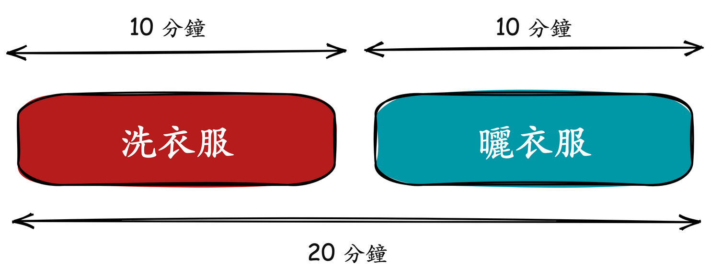
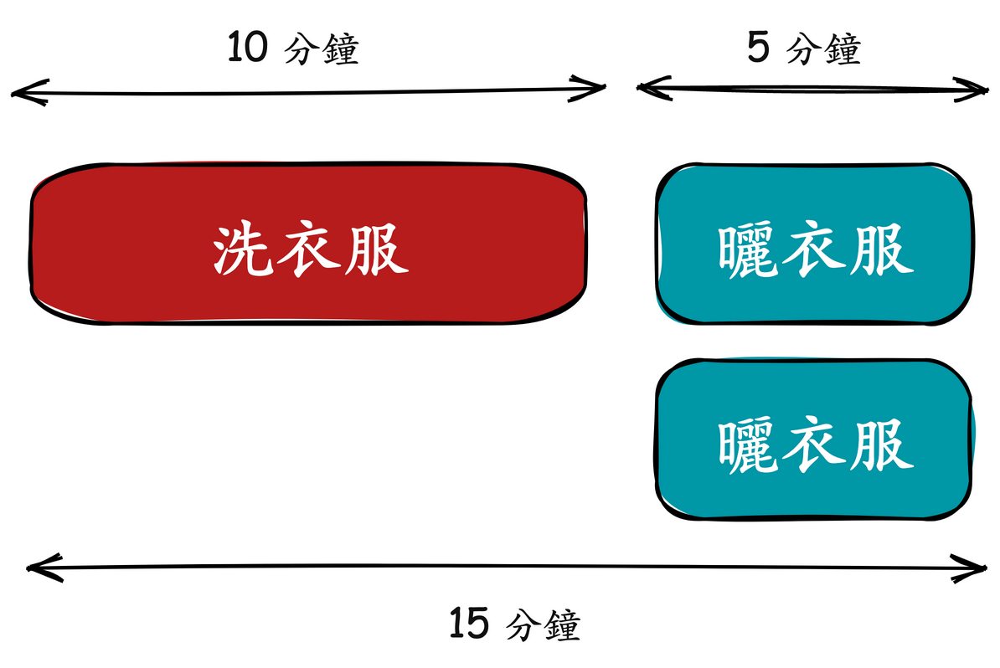

# D7 性能工程基本定律 - Amdahl's Law

- 系列：應該是 Profilling 吧？系列 第 7 篇
- Day：7
- 發佈時間：2024-09-07 02:50:11
- 原文：[https://ithelp.ithome.com.tw/articles/10348351](https://ithelp.ithome.com.tw/articles/10348351)

昨天我們討論了 Pareto Principle，強調在各種服務類型中的關鍵性能指標如何遵循 80/20 法則，並指導我們聚焦在少數會產生最多影響的問題上。

今天，我們將進一步探討 Amdahl's Law，其著重於系統在多核心併行處理時的性能提升限制。透過這個法則，我們可以更深入理解，當我們嘗試優化多核系統性能時，哪些部分能夠實現最大化的加速，哪些部分卻是無法簡單透過增加硬體來解決的。這正如我們在生活中做兩件事情的例子：洗衣服和曬衣服，即使曬衣服的速度加快了，但如果不對洗衣服進行優化，總時長的提升也會受限。

接下來，我們將進一步探討如何應用 Amdahl's Law 來優化程式的併行能力。

---

## Amdahl's Law

衡量 CPU 運行併發處理時總體性能的提昇度。

用個生活例子洗衣服與曬衣浮來說明，洗衣服與晒衣服都需要 10 分鐘才能完成，總時長需要 20 分鐘才能完成這件事。

如果我們能把晒衣服給加快成 5 分鐘就能完成。晒衣服的速度就提昇了 2倍。總時長來到 15 分鐘。

這樣的思維繼續優化下去。都需要至少 10 分鐘才能完成這整件事情，是因為我們沒對洗衣服進行優化。所以整體加速比並不會高過 2 。

又例如一個大型 e-commerce 平台，每秒處理數千個訂單，訂單處理系統中的某些部分（如支付流程）必須是串行的，而某些部分（如物流分配）可以併行處理。這樣的場景能夠更具體地說明 Amdahl's Law 如何影響系統設計和硬體資源投資的決策。

> 許多線上支付的流程也都必須對同一個帳號進行串行處理，不然一定會出現同時要扣款先檢查餘額，但可能兩個都檢查覺得自己餘額夠扣款支付，結果其實餘額只夠一個扣款。但如果將可用餘額或該帳戶給進行鎖定，那麼同帳戶的操作就只能等前面完成。  
> 同帳戶同時有多筆在不同設備中支付，不覺得也很怪嘛 XD  
> 但自動化交易就是能這樣，因為是程式執行並觸發對方的支付扣款 API 的。

又比如超商排隊結帳，兩個櫃台人員每次就只能處理兩筆結帳動作。但如果有第三位店員可能可以協助一次取很多網購的物品給櫃台去結帳。

而根據 Amdahl's Law 描述，如果我們能使用多個 CPU 來平行處理以達到加速時，其實總時常還是受限於程式所需的串行時間百分比。比如一段處理邏輯其中的 50%只能串行，而其他一半可以平行，那麼最大的加速比就是 2，不會更高了，無論買再多顆 CPU 或多快都不會將加速比提高到大於 2。

當我們面對系統瓶頸時，盲目地增加硬體資源並不總能解決問題，這是 Amdahl's Law 的關鍵。在當前的 DevOps 或性能優化計畫中，開發者需要平衡增加硬體資源（如 CPU 數量）和對程式碼進行深層次的性能優化之間的取捨。因此如果在這種情況下，改善程式碼串行流程與邏輯的可能會比無腦使用多核心平行處理來的有用。

這裡提供公式能計算，如果整體執行時間長度是 1，其中要進行優化加速的功能模組運行時長是 P。如果對這模組的加速比是 N，那麼優化加速後的時間會是

如果要與舊有線上運行的時間相比來算出加速比，公式如下

所以 Amdahl's Law 主要是給我們方向，

1. 優先優化佔用時間最常的功能模組/流程，因為這樣可以最大限度的提昇加速比。
2. 針對一個性能優化的計畫，我們可以根據這樣的計算給出準確的效果預估和整體系統的性能預算。

上圖顯示的是 **Amdahl's Law** 的視覺化結果。它描述了在某種情況下，增加處理器數量對系統性能（加速比）的影響。

- **X軸** 代表處理器的數量，從 1 到 65536。
- **Y軸** 代表加速比（Speedup），即增加處理器數量後系統的性能提升程度。
- 圖中有四條不同的曲線，分別表示在不同的「可併行比例」（Parallel portion）下，隨著處理器數量增加所能達到的加速比：

  - **50%**（淺藍色實線）：當程序有 50% 可以併行執行時，隨著處理器數量的增加，加速比增加有限，並在處理器數量增加到一定程度後幾乎不再上升。
  - **75%**（紅色虛線）：當程序有 75% 可以併行執行時，加速比會比 50% 高，但依然會隨著處理器數量增加而趨於平緩。
  - **90%**（紫色點劃線）：當程序有 90% 可以併行執行時，加速效果更加明顯，但同樣隨著處理器數量的增加，最終加速比也會趨於飽和。
  - **95%**（綠色虛線）：當程序有 95% 可以併行執行時，加速比相對前面幾個比例更高，但最終也會達到極限。

能發現隨著可併行比例的提高（從 50% 到 95%），可以看到加速比有明顯的提升，但無論可併行比例多高，最終都會出現加速比飽和的現象，即增加更多的處理器已經無法帶來顯著的性能提升。

這個現象表明，即使是高度可平行的程序，在某一點之後，非平行部分（程序中無法平行的部分）會成為整個系統性能提升的瓶頸。

這張圖旨在說明 Amdahl's Law 的核心：即使增加處理器數量也有其效果的上限，這個上限受限於程序中無法併行的部分。

### 與 Profiling 的關聯：

Profiling 是一種技術，用來分析應用程式的性能瓶頸，找出哪部分程式碼消耗了最多的資源或時間。通過 Profiling，開發者可以更清楚地了解哪些部分是系統的「熱點」，即主要的串行瓶頸。這正是 Amdahl's Law 中需要優化的部分。 根據 Amdahl's Law，只有優化了這些佔用大量時間的部分，才能最大限度地提升系統的整體性能。因此，Profiling 給出了明確的優化方向：找到最需要改進的瓶頸程式碼部分進行優化，而不是盲目地增加硬體資源。

> 每一個性能優化決策不應該依賴於假設，而是應根據 Profiling 和 Observability 收集的數據進行判斷。> 在一個優化計畫中，應該對每個關鍵模組的串行時間、資源消耗等數據進行詳細測量。  
> 根據 Amdahl's Law 的計算，優先集中資源在那些會產生最大提升的部分，而避免浪費資源在無效的優化上。

### 與 Observability 的關聯：

Observability 涵蓋了系統的可觀測性，包括 Logging、Tracing、Metrics 和 Profiling。Observability 允許我們在分佈式系統中跟蹤和分析系統的行為及其性能表現。 透過 Observability，我們可以在運行時精確地看到哪部分系統是串行的、哪部分是併行的，並且能夠對這些部分進行實時的監控和分析。這樣可以及時發現和修正可能的性能瓶頸，並驗證所做的優化是否真正有效。 同時，Observability 讓我們能夠在不同環境中觀察到 Amdahl's Law 所描述的現象，並提供足夠的數據來預測系統在不同硬體配置下的行為。

### 小結

Amdahl's Law 可以作為性能優化的理論基礎，指導開發者通過 Profiling 來找出最有效的優化點，而 Observability 提供了實施這些優化後的反饋回路，幫助驗證優化的成效。 在實際的系統中，藉由 Observability 和 Profiling，可以確保我們所做的每一個性能優化都是基於數據驅動的決策，並能夠在系統整體性能中看到顯著提升。 這樣的結合可以幫助你在性能優化和可觀測性建設中達到更好的效果，從而確保系統能夠在現有資源下達到最佳性能表現。

明天會引入其他相關理論如 Little's Law 和 Utilization Law，來幫助我們進行更全面的性能分析。
