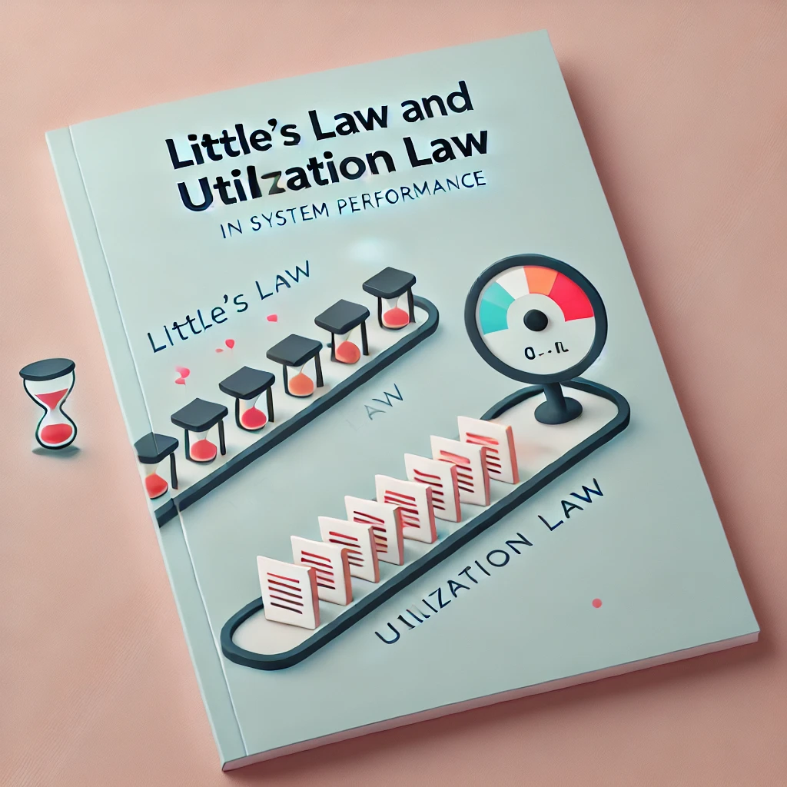
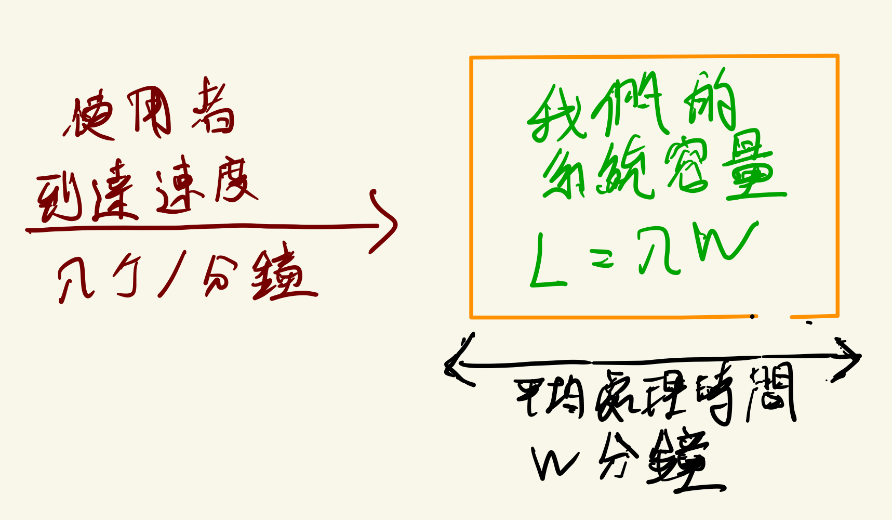
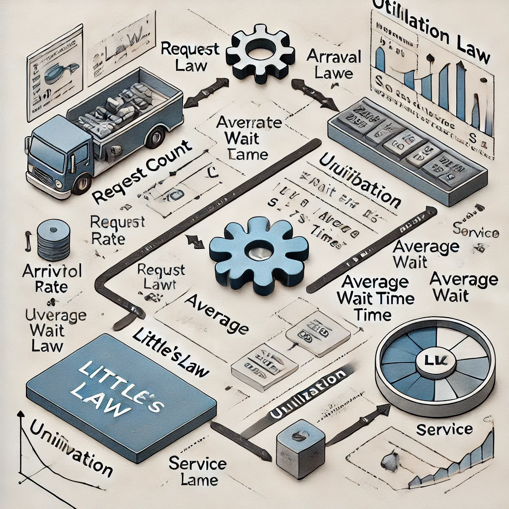

# D8 性能工程基本定律 - 排隊理論

- 系列：應該是 Profilling 吧？系列 第 8 篇
- Day：8
- 發佈時間：2024-09-08 00:17:27
- 原文：[https://ithelp.ithome.com.tw/articles/10348486](https://ithelp.ithome.com.tw/articles/10348486)

在前兩天的討論中，我們探討了 Pareto Principle 和 Amdahl's Law，前者強調了在性能優化中聚焦於少數能帶來最大影響的因素，而後者讓我們理解了並行處理的極限和瓶頸。今天，讓我們將焦點轉向 Little's Law，它通過排隊理論為我們揭示了系統在穩定狀態下的運行特徵，幫助我們分析系統的容量和等待時間。這與之前的討論相輔相成，進一步豐富我們對系統性能分析的理解。

接下來我們將詳細探討 Little's Law 的應用，並結合實際例子，說明如何透過這個法則來設計和優化系統性能。

## Little's Law

Little's Law 是性能分析和基於**排隊理論**中的基本定律，適用於任何穩定的系統或流程中、非搶佔式（先來先服務，不能插隊）的系統中，該系統或流程存在進入、處理和離開三個基本環節。這個定律可以幫助我們理解系統中請求或客戶的平均數量、到達速率和平均等待時間之間的關係。

### 適用條件

Little's Law 有幾個重要的前提條件：

- 穩定系統: 系統必須是穩定的，即長時間內進入系統的請求數量與離開系統的請求數量相等，否則L會無限增長。
- FIFO（先進先出）或其他服務策略: 雖然Little's Law不依賴於具體的服務策略，但在FIFO（先進先出）的策略下，W的計算更為簡單和直接。
- 平均值: Little's Law 基於長期平均值的概念，因此它描述的是在**長期穩定狀態**下的系統行為。

其內容為：在一個穩定的系統中，長期的平均使用者人數（L），等於長期的有效抵達率（λ），乘以顧客在這個系統中平均的等待時間（W）； 或者，我們可以用一個代數式來表達： **L = λW**

#### 參數解釋

- L (Average number of items in the system): 系統中的平均請求數量，也可以理解為在系統中同時存在的平均客戶數量（工作進行量 (WIP)）。在計算機系統中，這可以表示為當前正在處理或等待處理的請求數。
- λ (Arrival rate): 系統的到達速率，即每單位時間內到達系統的請求數量（通常以每秒請求數，RPS，表示）。這表示系統中流入的客戶或請求的速率，或換個說法每個時間單位完成的物品數量。
- W (Average time in the system): 請求在系統中的平均時間，這包括了從請求進入系統到離開系統的整個過程時間，包括排隊時間和實際處理時間。

是不是看不懂？換個角度就容易理解了。如下圖所示，使用者按照一定的速度持續地請求我們的系統，假設這個速度是每分鐘 λ 個使用者。每個使用者的請求在系統的平均處理時間是 W 分鐘。

按照這法則計算，如果系統處理速度恰好滿足使用者到速度的話，一方面系統就不會有空閒浪費，且使用者也不需要排隊在系統外等待。在這樣的穩定狀態下，我們系統的總容量恰好等於系統裡面正在處理的使用者請求數量。也就剛好 L = λW。

如果我們的系統面臨著使用者訪問速度是每秒鐘 1000 個使用者，每個使用者在我們服務花費的平均時間是 0.2 秒。那麼根據 little's law 我們的系統將容納 1000 \* 0.2 = 200 個使用者請求。這表示系統中平均同時有 200 個使用者請求在被處理或等待處理。但如果使用者的併發訪問速度增大到每分鐘 2000。

在這種情況下，我們能應對的方法如下︰

1. **把使用者的處理時間減半**，從 0.2 秒減半成 0.1 秒。這樣可保持系統容量不變。因為處理時間減半，但剛好可以應對訪問速率加倍的請求。系統容量等於 2000 \* 0.1 = 200。
2. **擴大系統容量**。維持處理時間不變還是 0.2 秒。但因為使用者訪問速度加倍了，所以系統容量也要加倍，變成 4000。假如本來的系統背後是5台主機，那麼現在就變成需要 10 台主機。

## 應用範例

[應用範例出處影片 Little's Law - How to Calculate WIP, Lead Time and Throughput Rate | Rowtons Training](https://youtu.be/c5HNkn6ZibY?si=IPcHP_rVboPAS_vY)

### 1. 工廠生產流程

一家工廠每天生產 1000 個產品，整個生產過程需要 5 天。根據 Little's Law，我們可以使用公式 L = λW 來計算系統中的最小工作進行量 (WIP)。

λ 是吞吐率，即每天生產的產品數量 (1000 個)。  
W 是產品在系統中的生產時間，即 5 天。  
因此，L = 1000 \* 5 = 5000。這意味著在任何時刻，這家工廠至少需要 5000 個產品正在生產或等待生產，才能保持系統正常運作。如果覺得 WIP 過高，工廠可以選擇：

減少吞吐率，即每天減少生產的產品數量。  
減少生產時間，例如將 5 天縮短為 3 天，這樣可以減少系統中的 WIP。

### 2. 電話客服中心

在影片的第二個範例中，說明了一個客服中心的運作。該中心每小時處理 1000 位客戶，系統中同時有 500 位客戶正在等待或接受服務。根據 Little's Law，我們要計算每個客戶在系統中的平均等待時間。

L 是系統中的客戶數量，即 500 位客戶。  
λ 是每小時處理的客戶數量 (1000 位)。  
因此，W = L / λ = 500 / 1000 = 0.5 小時，也就是每位客戶平均需要等待 30 分鐘來完成整個流程。如果想要縮短等待時間，客服中心可以：

減少系統中的客戶數量 (L)，這可以通過減少同時處理的客戶數來實現。  
提高吞吐率 (λ)，即加快處理速度，如增加客服人員的數量來處理更多客戶。

從這裡的範例與討論就能看到 Little's Law 在優化工作中的兩種用途︰

1. **協助我們設計性能測試的環境**。如果我們需要模擬一個固定容量的環境時，這法則能協助我們設定使用者請求速度與每個請求的處理時間。
2. **協助我們驗證測試結果的正確性**。

在深入探討 Little's Law 之後，我們已經了解了系統中請求數量、到達速率和等待時間之間的關係。這些資訊能幫助我們理解系統在穩定狀態下的表現，尤其是在高負載情況下的行為。

然而，僅僅瞭解系統中的請求數量和等待時間還不足以完全掌握系統的性能狀況。接下來，我們需要關注的是系統資源的利用率，特別是核心資源（如 CPU、記憶體、I/O）的使用情況。這正是 Utilization Law 發揮作用的地方，它能夠幫助我們深入理解系統在不同負載下的行為，並揭示系統何時會達到資源的極限。

透過結合 Little's Law 和 Utilization Law，我們可以更全面地分析系統性能，不僅知道系統中的請求數量和等待時間，還能掌握資源的利用狀況，從而進行有效的性能優化。

## Utilization Law

Utilization Law 是計算機系統性能分析中的重要法則，描述系統資源的利用率。它表示系統中資源的繁忙程度，尤其是 CPU、I/O 設備等關鍵資源。當系統利用率 U 接近 1（100%）時，這意味著資源幾乎完全被佔用，此時任何額外的負載都可能導致系統性能下降，甚至是崩潰。

### 公式與參數解釋

**U=λS**

- U (Utilization): 系統的利用率，是一個從0到1（或0%到100%）的數值，表示資源在時間範圍內的使用情況。U=1表示資源完全被佔用，U=0表示資源閒置。
- λ (Arrival rate): 與Little's Law中的 λ 相同，表示系統的到達速率（每秒請求數）。
- S (Service time): 每個請求的平均服務時間，即資源處理一個請求所需的時間。

### 適用條件

**線性關係**: Utilization Law假設服務時間和到達速率之間存在線性關係，這在大多數情況下是合理的。

**資源單一性**: Utilization Law通常應用於單個資源的利用率計算，而不適合直接用於分析多個資源的複合利用率。

**理想化情境**: 利用率通常在理想情境下計算，但實際情況可能更為複雜，包括資源的上下線時間、不同優先級的請求等。

### 應用範例

假設一個系統的處理能力是每秒100個請求（λ=100 RPS），每個請求的平均服務時間為0.02秒（S=0.02秒），則該系統的CPU利用率為：  
𝑈 = 100 × 0.02 = 2

這表示系統的理論利用率為200%，但實際上，當利用率超過100%時，系統就會開始產生延遲或瓶頸，這表明系統處於超負荷狀態。

綜合應用與實例說明  
在實際應用中，Little's Law 和 Utilization Law 可以結合使用來分析和優化系統性能。以下是一個綜合應用的例子：

### 綜合範例

### 1. 支付系統

假設一個在線支付系統，其到達速率（λ）為500 RPS，每個請求的平均服務時間（S）為0.005秒。利用Utilization Law，我們可以計算出系統的CPU利用率（U）：

𝑈 = 500 × 0.005 = 2.5

這意味著系統的利用率為250%，明顯超過了100%的合理上限，因此系統處於過載狀態，可能會導致處理延遲或請求排隊。

接著，我們利用Little's Law來分析系統中的平均請求數量和平均等待時間。如果我們觀察到系統中同時存在的請求數量（L）約為50，則可以計算平均等待時間（W）：  
𝑊 =𝐿 / 𝜆 = 50 / 500 = 0.1秒

這意味著每個請求在系統中平均需要等待0.1秒來完成處理。如果這個等待時間超過了用戶的接受範圍，則需要考慮升級系統資源或優化服務流程。

### 2. 停車場與高速公路

**線性關係**: 在停車場和高速公路的情境下，Utilization Law 假設服務時間（車輛停留時間或行駛時間）和到達速率（車輛進入停車場或高速公路的速率）之間存在線性關係。當車輛進入的速率增加時，總體的利用率會隨之提高，這在大多數情況下是合理的。

**資源單一性**: Utilization Law 假設停車場或高速公路的容量是一個單一資源，通常是停車位數量或車道容量。每輛車在系統中的停留時間是唯一影響系統的變數，這樣的單一資源是 Utilization Law 最適合應用的場景。

**理想化情境**: 在停車場和高速公路的情況下，系統利用率的計算基於理想狀態下的資源分配。然而，實際情況中可能存在變數，例如停車場可能有不同行駛路徑的複雜性，高速公路可能會因交通事故或施工等因素而影響車輛通行速率。

#### 停車場

假設一個停車場有 100 個停車位，車輛到達速率為每小時 50 輛（λ=50），每輛車平均停留 2 小時（S=2 小時）。根據 Utilization Law，我們可以計算出停車場的利用率（U）：

𝑈 = 50 × 2 = 100%

這表示停車場已經達到 100% 的利用率，所有停車位都被佔用。如果更多的車輛到達，則會開始出現排隊等候車位的現象。

然而，若車輛的停留時間增加到 3 小時，即使車輛到達速率不變，利用率也會超過 100%，導致系統無法滿足所有進入需求，停車場將出現過載狀態，並產生長時間的等待。

又假設一個停車場可以容納 50 輛車（容量為 50 個停車位），平均每輛車停留 1.5 小時，且每小時有 30 輛車進入停車場。我們利用 Utilization Law 計算該系統的利用率：

𝑈 = 30 × 1.5 / 50 = 90%

此時，利用率為 90%，仍有空餘的停車位。然而，若車輛停留時間延長到 2 小時，或每小時進入的車輛數增加，利用率將超過 100%，導致系統過載，車輛無法立即進入停車場，必須等待。

#### 高速公路

假設一條高速公路有 3 條車道，每小時可處理 600 輛車（每條車道 200 輛）。車輛的行駛速率為每小時 60 英里，行駛時間為 1 小時（S=1 小時），車輛到達速率為每小時 550 輛（λ=550）。

𝑈 = 550 × 1 / 600 = 91.67%

在這種情況下，利用率接近 100%，接近飽和狀態。若車流量進一步增加，車道容量將達到最大，並導致車輛減速，增加行駛時間，最終形成瓶頸。

在高速公路上，當車流量增加或行駛速度變慢時，會導致高速公路的擁堵，減少整體吞吐量並增加延遲。通過這些法則，我們可以分析停車場和高速公路的運營，並找出最佳的資源利用和優化方案。

儘管停車場和高速公路的情境雖然不同，但它們的行為模式在 Utilization Law 下是類似的。當系統利用率達到 100% 時，無論是停車場還是高速公路，都會出現瓶頸效應，導致等待時間大幅增加。

當停車場滿載時，進入的車輛會被迫在外面等待，類似於高速公路接近飽和時，車輛速度減慢，等待更長的時間才能通過擁堵路段。因此，管理這些系統時，必須控制利用率，避免超過 100%。

### Little's Law 與 Utilization Law 的綜合應用

在實際應用中，Little's Law 和 Utilization Law 是相互補充的。Little's Law 幫助我們理解系統中請求的數量和等待時間，而 Utilization Law 則告訴我們資源的使用情況。

例如，當我們發現系統中的平均請求數量（L）大於預期時，我們可以通過檢查系統的利用率（U）來了解是否因為資源過度利用導致的等待時間增加。如果 U 接近或超過1，則表明系統資源已經達到了極限，這就需要我們考慮升級資源或優化處理流程來降低 S 或增加系統的處理能力。

當這兩個定律結合使用時，我們能夠全面地分析系統的性能，識別出哪些資源過度使用，哪些部分的處理時間過長，從而做出更明智的優化決策。這樣，我們可以在資源有限的情況下，通過調整系統資源和優化處理流程，最大限度地提升系統的效能，確保它在高負載下依然運行良好。

## 小結

透過 Little's Law 和 Utilization Law，我們能更深入理解系統的性能表現。Little's Law 幫助我們量化了系統中請求的數量、到達速率和等待時間之間的關係，從而提供了一個**穩定狀態**運行下的系統基準（Baseline）。這個基準反映了系統在日常運行中的常態表現。Baseline 可以作為我們監控系統性能的參考點，用來衡量系統是否按預期表現，並協助發現系統負載異常或效率低下的情況。

當系統負載逐漸增加時，Utilization Law 提供了關於資源使用率的洞見，告訴我們系統何時會接近資源飽和點。這使我們能夠在資源利用接近極限時及時進行調整或擴展資源，從而防止系統崩潰或性能急劇下降。

總結來說，透過 Little's Law 確立的 Baseline，持續關注並更新 Baseline，是性能優化的基石。透過不斷優化 Baseline 的表現，我們可以確保系統在日常運行中的穩定性持續提升。實施優化策略後，借助 Metrics、Logs 和 Traces 持續監控系統表現，形成反饋回路，進行持續改進。此外，隨著負載變化，動態調整資源分配（如 Auto scale）也是保持系統高效運行的重要策略。

接下來，我們可以基於這些理論探討更多性能優化的實際策略，進一步完善我們的系統設計與優化計畫。
