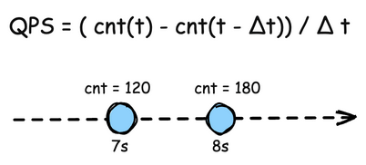
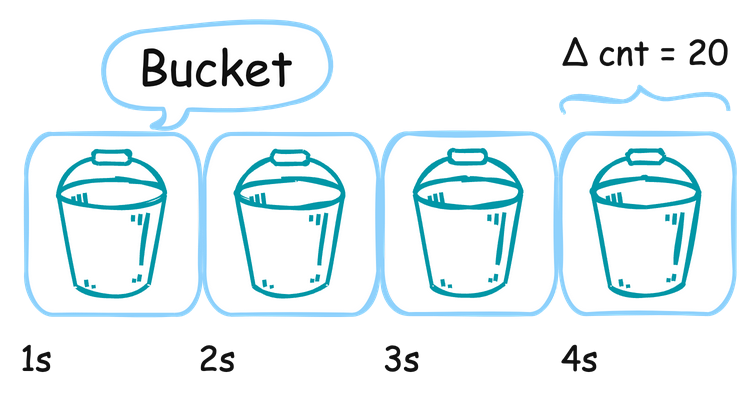
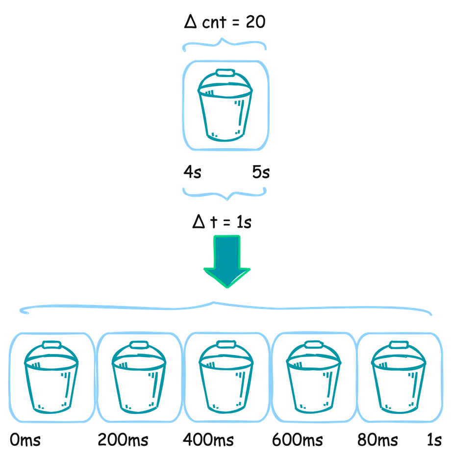
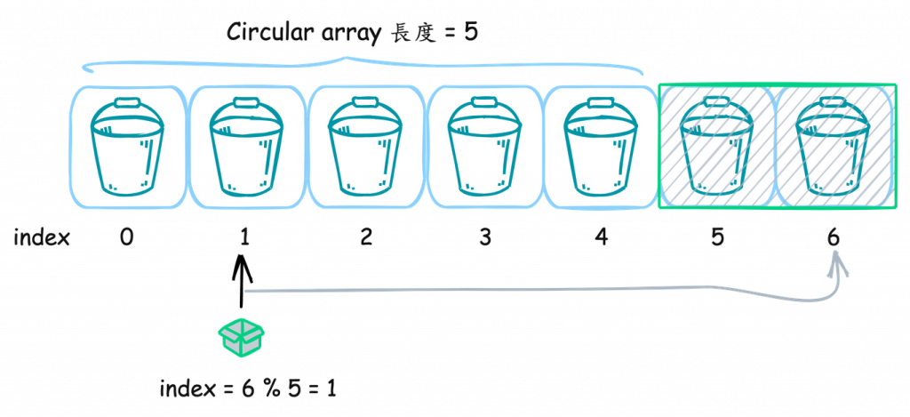
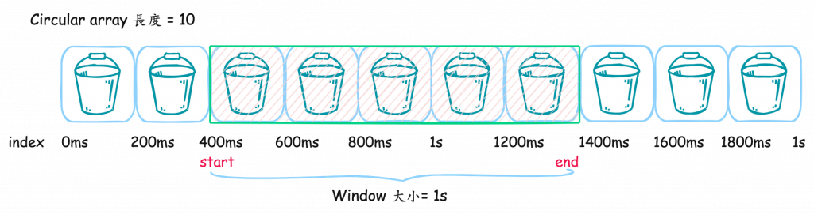

# D10 深入探討 RPS、QPS 和 TPS 的概念與應用

- 系列：應該是 Profilling 吧？系列 第 10 篇
- Day：10
- 發佈時間：2024-09-10 01:50:11
- 原文：[https://ithelp.ithome.com.tw/articles/10349002](https://ithelp.ithome.com.tw/articles/10349002)

在上一篇文章中，我們深入探討了性能分析中的4個外部指標：Service Latency、Throughput 和 Resource Utilization、Error Rate。這些指標為我們提供了對系統性能的直觀理解。然而，當談到實際的系統設計和性能優化時，這些外部指標還需要與系統容量進行結合考量。本文將進一步探討系統容量如何影響 RPS、QPS 和 TPS 這些衡量指標，並分析如何通過這些指標來提升系統的併發能力和穩定性，從而在動態變化的負載環境中保持高效運行。

在現代高併發系統設計中，RPS（Requests Per Second）、QPS（Queries Per Second）和 TPS（Transactions Per Second）是衡量系統性能的關鍵指標。這些指標不僅幫助我們了解系統能夠處理的請求數量，也讓我們掌握系統在不同併發情境下的表現。本文將深入探討這三個指標的基本概念、應用及其在不同系統中的挑戰。

# 系統容量與併發能力

在高併發的情境中，系統容量是決定系統能夠處理多少請求的關鍵因素。這裡所指的系統容量，包含了 CPU、記憶體、I/O 和網路頻寬等資源。當系統需要處理高併發請求時，這些資源必須能夠支撐大量的併發操作。這裡，我們就要談到 RPS、QPS 和 TPS 這三個衡量系統併發能力的重要指標。

## RPS（Requests Per Second）

RPS，即每秒請求數，是指系統每秒鐘能夠處理的請求數量。這個指標通常用於衡量一個系統在高併發情境下的性能。例如，一個 API 服務的 RPS 可以告訴我們該服務在單位時間內能夠處理多少個客戶端請求。 計算公式如下：

```
 RPS = 總請求數  / 完成總時間（秒）
```

範例說明： 如果一個系統在 10 秒內處理了 5000 個請求，那麼 RPS 計算如下： `RPS = 5000 / 10 =500 RPS`

### 實際應用中的挑戰

舉例說明： 假設一個電子商務網站在平常的情況下，每秒處理 100 個 RPS。但是在大型促銷活動期間，RPS 突然飆升到 1000。此時，如果系統的容量未能及時擴展，便會出現處理延遲上升、錯誤率增加等問題。這時候，透過自動擴展（auto-scaling）來動態增加系統資源，能夠有效應對這樣的情況，確保服務的穩定性。然而，應用層的擴展往往還需要與後端資料庫的擴展同步進行，這樣才能真正實現高併發能力的提升，否則資料庫成為瓶頸可能會導致整體系統的性能下降。

然而，電子商務系統往往不僅僅依賴於單一服務，而是由多個服務組成，包括後端的資料庫。資料庫作為系統的核心組件之一，其擴展性通常比應用層服務更加困難。這主要是因為資料庫需要處理資料的一致性、完整性和可靠性，而這些特性在高併發的情況下尤為重要。

RPS 是衡量系統性能的重要指標之一，但它並不是單獨存在的。在實際應用中，RPS 與系統容量以及延遲等其他性能指標密切相關。當 RPS 增加時，不僅需要考慮應用層的擴展，資料庫作為後端支持的核心也必須能夠承受住更高的負載。然而，與應用層服務相比，資料庫的擴展性往往面臨更多的挑戰。接下來，我們將探討在高併發情境下，資料庫擴展所遇到的主要困難以及可行的解決方案。

## QPS（Queries Per Second）

QPS，即每秒查詢數，是指系統每秒鐘能夠處理的查詢數量。這個指標通常應用於`資料庫系統`中，衡量其在高併發讀取或寫入操作下的性能。

計算公式如下： `QPS = 總查詢數 / 完成總時間（秒）`

範例： 如果一個資料庫在 20 秒內處理了 100,000 次查詢，那麼 QPS 計算如下： `QPS = 100,000 / 20 = 5000 QPS`

### 如何計算 QPS：步驟與最佳實踐

計算 QPS 的基本過程如下：

QPS 基本計算公式： 使用 QPS 的標準公式來表示：

```
QPS = (cnt(t) - cnt(t - Δt)) / Δt
```

其中 cnt(t) 代表時間 t 的請求數，Δt 是時間間隔。透過對比不同時間點的請求數增量來計算 QPS。

1. **使用 Bucket 儲存增量**： 通常，我們會使用 bucket（桶）來儲存每個時間區段內的請求數增量。這些 bucket 是一個數組，其中每個元素代表一個時間段內的查詢增量。例如，如果在第 7 秒 cnt 是 120，第 8 秒 cnt 是 180，那麼在第 7 到第 8 秒間的 QPS 就是 (180 - 120) / (8 - 7) = 60。





2. **提升 QPS 計算的精細度**： 為了獲得更細緻的查詢速率，我們可以將時間段細分，例如將每個 bucket 的時間間隔設置為 200ms。這樣可以更準確地捕捉到系統中的變動情況，並通過更加靈敏的數據增量監測來即時反應系統的性能。



3. **Circular array 的使用**： 長時間的 QPS 計算需要保證數據的持久性和內存使用效率，這時我們可以使用Circular array。Circular array 是一種固定長度的數組，用來儲存最新的 bucket 值，而較舊的 bucket 會被新的數據覆蓋。這樣可以避免內存不斷增長的問題，同時保證計算的即時性。



4. **Sliding Window 技術**： 在計算實時 QPS 時，我們可以應用 Sliding Window 口技術。Sliding Window允許我們靈活定義需要計算的時間範圍，並計算這段時間內的 QPS。透過指定 Window 的開始與結束時間，系統可以在每個 bucket 內累加增量，從而計算出更精確的 QPS 值。



### 平均請求處理時間

有了 QPS 還能計算平均請求處理時間，是一個非常實用的概念，特別是在性能分析和監控系統中，了解某個函數的平均請求處理時間（Latency）可以幫助我們更準確地評估系統的回應效率。這裡我們可以結合 QPS 的計算過程來說明如何使用 bucket 和 Sliding Window 來計算平均請求處理時間。

#### 計算平均請求處理時間的步驟

計算平均耗時的過程其實與計算 QPS 非常相似，只是這次我們不僅統計請求的次數，還需要統計每次請求的延遲時間（Latency）。以下是具體的步驟：

1. 統計請求次數 (cnt)：每次函數被執行時，我們仍然像計算 QPS 那樣，使用 cnt 來統計請求次數。
2. 統計延遲時間 (Latency)：每次函數執行後，記錄其延遲時間，並將這個延遲時間加到 bucket 內的 Latency 變數上。每個 bucket 中存儲的就是一段時間內的總延遲時間。
3. Sliding Window 技術：與 QPS 的 Sliding Window 相似，我們會設置一個時間範圍，通過 Sliding Window 來確定應該計算哪一段時間內的延遲總和。當窗口滑動時，從窗口內的 bucket 取得總延遲時間（Latency）和總請求次數（cnt）。
4. 計算平均請求處理時間：當我們有了這段時間內的總延遲時間與總請求次數後，便可以通過以下公式來計算函數的平均請求處理時間：

[參考 Go - sentinel-golang](https://github.com/alibaba/sentinel-golang/blob/master/core/stat/base/sliding_window_metric.go)

```
平均請求處理時間 = 延遲總和 (Latency) / 請求次數總和 (cnt)
```

**具體例子**  
假設在 10 秒內某個函數的總請求次數為 100 次，總延遲時間為 2000 毫秒，那麼平均耗時的計算如下：

```
平均請求處理時間 = 總延遲時間 (2000ms) / 總請求次數 (100) = 20 ms
```

這意味著，在這段時間內，該函數的平均請求處理時間為 20 ms。

#### 整合到 QPS 計算過程

既然我們已經在 QPS 計算中使用了 bucket 和 Sliding Window 來記錄每個時間段內的請求數，那麼我們可以在這些 bucket 中再添加一個用來統計延遲時間的變數 Latency。每次函數執行後，我們除了增加請求次數外，也將該請求的耗時加到 Latency 變數中。

**新增步驟**

1. 延遲時間的累加：每當函數執行完畢，我們不僅增加 cnt，還將此次執行的延遲時間累加到當前 bucket 中的 Latency。
2. Sliding Window 計算平均請求處理時間：Sliding Window 計算過程與 QPS 類似，我們通過 Window 範圍內的所有 bucket，將其中的延遲總和與請求次數總和分別累加起來，並通過這兩個總和來計算出指定時間段內的平均請求處理時間。

這個方法在很多應用中非常實用，特別是在性能分析和監控中，可以幫助我們：

- 了解某個 API 或函數在高併發環境下的回應時間。
- 分析系統中不同時間段的性能波動，幫助找出瓶頸。
- 結合 QPS，進一步優化系統在高負載下的行為。

整合這個過程可以幫助我們更全面地掌握系統的性能，從而能夠做出更加精確的調整和優化。

與 RPS 類似，QPS 的提高通常會直接影響到資料庫的資源消耗，特別是 I/O 操作的頻率。如果 QPS 過高，而資料庫未能及時進行優化（例如增加索引、分片、優化查詢語句等），可能會導致資料庫的性能下降，進而影響整個應用程式的回應時間。

### 實際應用中的挑戰

舉例說明： 在一個社交媒體應用中，使用者每次刷新動態都會觸發多次資料庫查詢操作。在系統設計初期，QPS 可能處於較低的水準，伺服器可以輕鬆應對。然而，隨著用戶數量的增長和使用頻率的提高，QPS 也會逐漸增加。如果不對資料庫進行優化，最終會導致系統無法滿足使用者需求，體驗變差。因此，對於資料庫系統的 QPS 監控和優化是確保系統能夠穩定運行的關鍵。

## TPS（Transactions Per Second）

TPS，即每秒交易數，主要用於金融系統中，衡量一個系統在單位時間內能夠完成的交易次數。與 RPS 和 QPS 不同，TPS 更加注重交易的完整性和一致性，因為金融交易通常涉及多個步驟和系統之間的交互。

計算公式如下： `TPS = 總交易數 / 完成總時間（秒）`

範例： 如果一個支付系統在 30 秒內完成了 600 筆交易，那麼 TPS 計算如下： `TPS = 600 / 30 = 20 TPS`

在高併發情境下，TPS 的增長意味著系統需要在更短的時間內處理更多的複雜操作，這對系統的穩定性和可靠性提出了更高的要求。例如，在支付系統中，TPS 的提升往往伴隨著更高的風險管理需求，因為任何一個失誤都可能導致嚴重的財務損失。

### 實際應用中的挑戰

舉例說明： 一家大型銀行的支付系統在日常運營中，每秒鐘處理 500 TPS。然而，在支付高峰時段，如節假日或大型購物節，TPS 可能會增至 2000 甚至更多。為了應對這樣的情況，系統必須具備良好的擴展性和容錯機制，以確保每筆交易的安全和完整。同時，對於金融系統而言，TPS 不僅僅是衡量性能的指標，更是衡量系統可靠性的關鍵。

## 小結

在現代的高併發系統設計中，RPS、QPS 和 TPS 這三個指標是評估系統性能的重要工具。這些指標能夠幫助我們了解系統在不同負載情境下的併發能力，並揭示系統的瓶頸和優化空間。

RPS 提供了系統能夠處理的請求數量，是評估應用層性能的關鍵指標，尤其適用於 API 服務和前端系統。  
QPS 更加側重於資料庫系統的性能，反映系統在高併發查詢情境下的表現，能夠幫助優化讀寫操作和 I/O 資源的使用。  
TPS 則特別應用於金融系統，評估交易處理能力及其一致性和可靠性。  
在計算 QPS 及進一步深入到系統優化中時，我們探討了使用 bucket 來儲存增量數據、利用 Sliding Window 計算實時 QPS，以及如何透過這些技術來優化系統性能。特別是針對\*\*平均請求處理時間（Latency）\*\*的計算，進一步提供了實際應用場景中的具體操作方法，這對於系統的即時性能監控至關重要。

這些指標之間不是孤立存在的，而是彼此相互影響。例如，提升 RPS 不僅需要優化應用層，還需要保障後端資料庫和交易系統能夠支撐更高的負載。因此，只有在整個系統架構中平衡這些指標，才能真正提升系統的併發能力和穩定性。

除了 RPS、QPS 和 TPS 這三個常見的性能指標，還有一些其他重要的指標能幫助我們更加全面地評估系統的運行狀態，特別是在高併發和大規模負載下。這些指標包括 Error Rate（錯誤率）、Saturation（飽和度）、Latency（延遲）、Resource Utilization（資源利用率）等。整合這些指標，能夠更深入地了解系統的健康狀況，並指導我們進行針對性的優化和調整。這些指標能參考 [OpenTelemetry 入門指南](https://github.com/tedmax100/OpenTelemetryEntryBeook)第 3 章介紹的四個黃金信號與 U.S.E. method 以及 R.E.D. method。
