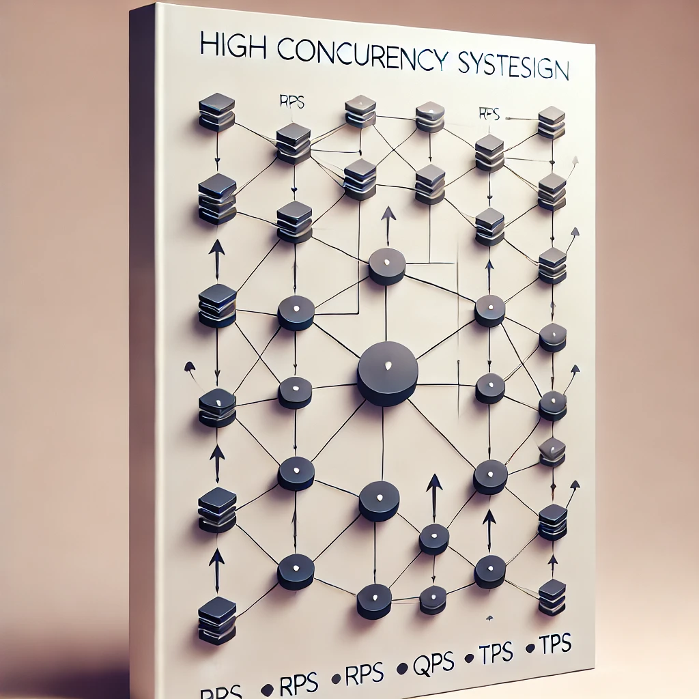
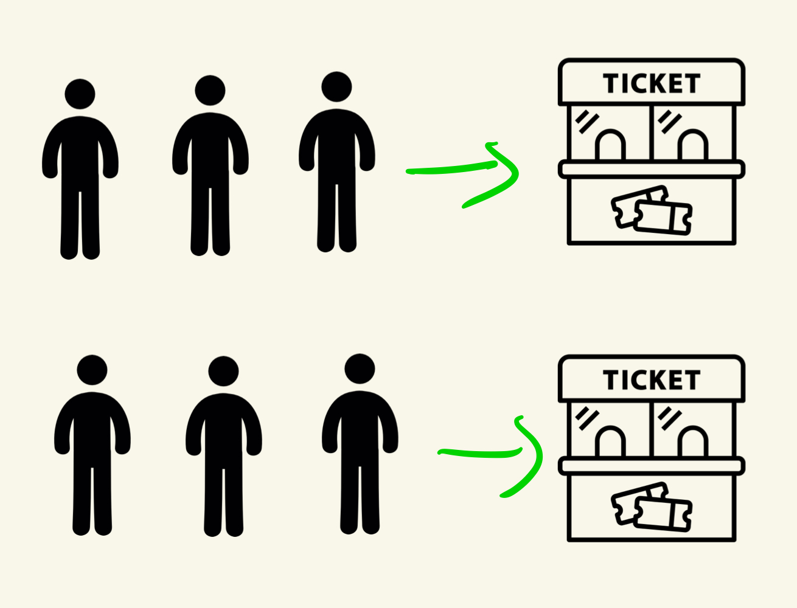
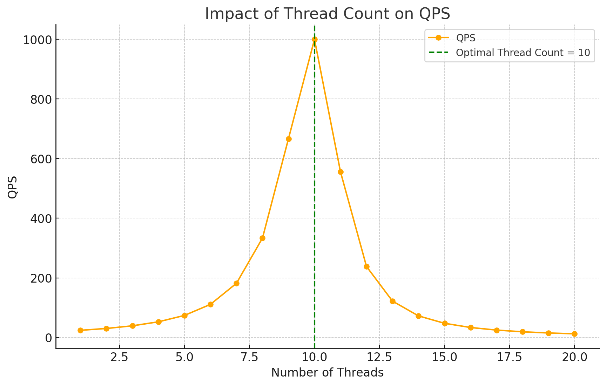
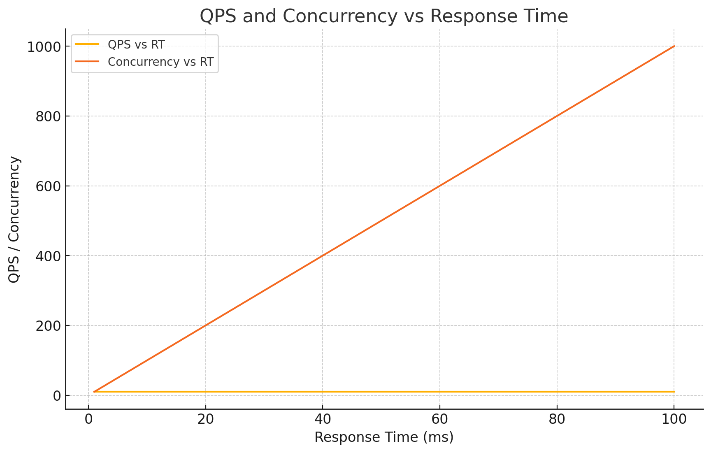
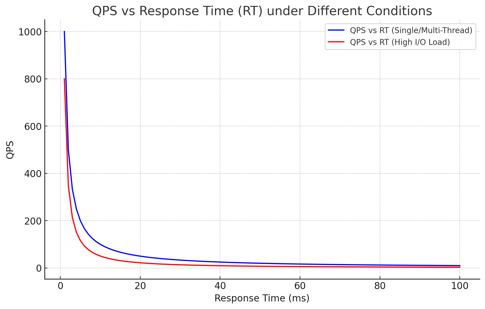

# D11 高併發系統設計中的實踐與挑戰

- 系列：應該是 Profilling 吧？系列 第 11 篇
- Day：11
- 發佈時間：2024-09-11 00:58:58
- 原文：[https://ithelp.ithome.com.tw/articles/10349235](https://ithelp.ithome.com.tw/articles/10349235)

在高併發系統設計中，RPS、QPS 和 TPS 這三個指標與系統的整體性能、資源利用率和架構設計有著直接關聯。我們需要確保系統能夠在不同的負載下，高效處理大量的併發請求，並保持穩定的響應速度。以下內容會更具體地闡述每個最佳實踐如何直接影響這些關鍵指標。

昨天在 RPS 的討論中提到，電子商務系統中常見的是動態地根據負載增加系統節點（auto scaling），來增加系統資源。但現實架構中，關聯式資料庫幾乎很難動態地擴展節點。



## 關聯式資料庫擴展的挑戰

在高併發的情境下，關聯式資料庫面臨著更多的挑戰，[Day 4 我們曾提過短板理論](https://ithelp.ithome.com.tw/articles/10347763)，恰巧這裡的場景下，資料庫常常是整個系統中的短板，但要能進行關聯式資料庫擴展以增加吞吐量，則會面臨以下幾個困難點：

- **資料一致性問題**︰在關聯式資料庫擴展時，特別是在進行分片或複製的情境下，維護資料的一致性變得更加複雜。當多個節點同時進行讀寫操作時，如果沒有適當的同步機制，可能會導致資料不一致的情況，進而影響系統的穩定性和數據準確性。
- **資料分片的複雜性**︰資料分片是實現水平擴展的一種有效方式，但它帶來的挑戰包括如何選擇適當的分片鍵、如何在不同分片之間進行查詢，以及如何處理跨分片的交易。這些問題不僅增加了系統的複雜性，還可能導致查詢效率降低。  
  小弟在[服務開發雜談系列 第 32 篇 分庫分表 Sharding & Partition - 2](https://ithelp.ithome.com.tw/articles/10250630)有簡單介紹分片方式。

### 解決方案與實踐

儘管關聯式資料庫擴展存在諸多挑戰，但通過合理的設計和實踐，我們仍然可以有效提升資料庫在高併發情境下的性能：

- **讀寫分離**：通過將讀取操作和寫入操作分離到不同的資料庫實例中，可以減輕主資料庫的負擔，提高系統的讀取性能，從而提升整體併發能力。
- **資料分片**：根據業務需求對資料進行分片，將資料分佈到多個資料庫節點中，以分散壓力並提高查詢效率。
- **使用快取**：在資料庫查詢之前，先檢查快取，減少直接訪問資料庫的頻率，這樣可以有效降低資料庫的讀取壓力，提升系統響應速度。
- **CDN 與邊緣計算**：對於靜態內容，使用 CDN 或邊緣計算將資料快取到更靠近使用者的節點，減少資料庫的讀取需求，從而降低伺服器負載。
- **NoSQL 資料庫**：在一些非結構化資料或高吞吐量需求的場景中，考慮使用 NoSQL 資料庫（如 MongoDB、Cassandra），這些資料庫在某些情境下更易於擴展，能夠有效應對高併發的需求。
- **自動擴展**：儘管資料庫擴展困難，但仍可通過自動擴展技術來動態調整資料庫節點的數量，以應對突發流量，確保系統的穩定性和高效性。

總的來說，關聯式資料庫的擴展雖然具有挑戰性，但在高併發情境下，其穩定性和性能對整個系統至關重要。合理應對這些挑戰，才能確保整個系統在高併發情境下穩定運行。

## 併發數（Concurrency）

我們一直講高併發， 什麼是併發？就是系統能同時處理多個任務。現在其實每個程式語言都能作到，且幾乎沒有哪個伺服器是還在單核心，除了大部分應用用的容器，很多會限制在 0.25 ~ 1 Core，成本考量。所以**併發數**代表系統在某一時刻同時處理的請求數量。它是衡量系統同時處理多個任務的關鍵指標，特別是在高併發系統設計和優化中起著至關重要的作用。

如下圖所示，兩個隊列的請求被一個購票窗口處理，這代表請求是輪流處理的，但其實窗口可以同時處理這些請求，只是處理速度很慢。  


當我們擴充一個購票窗口後，兩個隊列的請求被兩個購票窗口同時處理，顯示出併發數的提升對系統性能的增益。



### 併發數的影響因素

併發數的大小會直接影響系統的性能，特別是在以下幾個方面：

- **資源使用**：當併發數增加時，系統中可用的資源（如 CPU、記憶體、I/O 等）會被更多的請求所消耗。如果系統資源不足，則可能會導致請求處理的延遲增加，甚至引發資源瓶頸。
- **回應時間**：系統的響應時間通常會隨著併發數的增加而增加，因為更多的請求需要等待資源的分配。這種情況在 I/O 密集型應用中特別明顯。
- **吞吐量**：在一定的併發數範圍內，系統的吞吐量（即每秒處理的請求數）會隨著併發數的增加而提高。但是，當併發數超過系統的最佳臨界點後，吞吐量可能會下降，因為系統資源變得過於分散，導致效率降低。

### 併發數與 QPS 之間的關係

如昨天所述，QPS（是每秒查詢數，與併發數有著密切的關聯。兩者之間的關係可用以下公式表示：

```
QPS = 併發數 / 平均回應時間
併發數 = QPS * 平均回應時間
```

在系統設計中，確定最佳 Thread 數量是提高系統併發處理能力的關鍵。最佳 Thread 數量是剛好消耗完伺服器的瓶頸資源的臨界 Thread 數，小弟自己用的公式如下：

```
最佳 Thread 數量 = （（Thread 等待時間 + Thread CPU 時間）/ Thread CPU 時間）* CPU 數量
```

其中Thread 等待時間︰Thread 在等待資源（如 I/O 操作、資料庫查詢等）時所花費的時間。  
Thread CPU 時間︰Thread 實際在 CPU 上執行的時間。

**舉例說明：**  
假設一個系統有 4 個 CPU 核心，每個 Thread 的 CPU 執行時間是 20 ms，而每個 Thread 的等待時間（如等待 I/O 操作完成的時間）是 80 ms。

我們可以計算出最佳 Thread 數量如下：

最佳 Thread 數量 = ( ( 80ms+20ms)/20ms) \* 4 = 20

所以，這個系統的最佳 Thread 數量是 20。

這意味著在這個特定系統配置下，同時運行 20 個Thread將是最優的配置。如果超過這個數量，系統可能會出現Thread之間的競爭，導致 QPS 開始下降，並且系統的 RT 會增加。因此，找到並維持這個最佳Thread數量是提高系統性能的關鍵。

下圖表展示了 Thread 數量對 QPS 的影響。隨著 Thread 數量的增加，QPS 先上升，達到最佳 Thread 數量時 QPS 達到最高值，隨後隨著 Thread 數量的繼續增加，QPS 開始下降。

這展示了在一個系統中，當 Thread 數量超過其最佳臨界點時，資源的競爭會加劇，導致 QPS 不再增加，甚至開始下降。同時，系統的 RT 也會隨之增加，這表明在最佳 Thread 數量之上繼續增加 Thread 數量並不會帶來性能的提升，反而可能降低系統的整體效率。

每個系統都有其最佳 Thread 數量，但在不同的狀態下，這個數量會有所變化。瓶頸資源可能是 CPU、記憶體、鎖資源或 I/O 資源。一旦超過最佳 Thread 數量，將導致資源的競爭加劇，響應時間隨之增加。



下圖表則展示了 QPS 和併發數與回應時間 RT 之間的關係。圖中可以看到：

QPS vs RT：隨著回應時間增加，QPS 保持不變。這是因為 QPS 是根據併發數與回應時間的比率計算出來的。響應時間增加，QPS 不變，說明在同樣的併發數下，單位時間內能夠處理的查詢數量沒有變化。

Concurrency vs RT（回應時間）：隨著響應時間增加，併發數也逐漸增加。這表明在系統中，隨著處理每個請求的時間延長，能夠同時處理的請求數量增加，這通常是由於請求處理的等待時間增加所致。



在實際應用中，理解這些指標之間的關係可以幫助我們更好地設計和優化系統，尤其是在高併發情境下。當響應時間降低時，併發數可以減少，系統能夠以更高的效率處理請求。相反，當響應時間增加時，併發數也會相應增加，這可能會導致資源競爭加劇，進而影響系統性能。

### RT 回應時間與 QPS 之間的關係

下圖展示了在不同情境下，QPS 與 RT（回應時間）之間的關係：

在單 Thread 或多 Thread 的情境下（藍線）：在這種情境下，QPS 與 RT 呈現明顯的負相關關係。當 RT 減少時，QPS 顯著增加。這表明在 CPU 資源主要消耗於計算的情況下，通過降低RT 可以有效提升系統的 QPS。

而在高 I/O 負載情境下（紅線）：在高 I/O 負載下，QPS 與 RT 之間的負相關關係更加顯著。這意味著當系統需要大量 I/O 操作時，響應時間對 QPS 的影響會更加明顯。隨著響應時間的增加，QPS 下降得更快，顯示了 I/O 操作對於系統性能的更大影響。



這些圖表說明了在不同的系統負載情境下，優化 RT 是提升 QPS 的關鍵，尤其是在高 I/O 負載的情境下，這種優化尤為重要。理解這些關係有助於我們在系統設計和性能優化過程中做出更為精確的決策。

## 高併發的概念與挑戰

高併發指系統同時處理大量請求的能力，這需要有效的資源管理和調度來保持穩定性和高效性。高併發系統的特點包括：

- **大量同時請求**：在高併發情境下，系統需要同時處理大量來自不同用戶或設備的請求。這些請求可能是讀取資料、寫入資料、計算操作或其他需要系統資源的操作。
- **資源競爭激烈**：由於同時有大量操作需要處理，系統中的資源（如 CPU、記憶體、網路、I/O 等）可能會出現競爭，導致某些操作需要等待其他操作完成才能繼續。
- **延遲敏感性**：在高併發情境下，任何一個操作的延遲都可能會被放大，進而影響整體系統的響應時間。因此，系統需要優化延遲以確保用戶體驗。
- **高可靠性要求**：當系統處於高併發狀態時，任何一個組件的故障都可能導致大範圍的影響，因此系統需要具備高可靠性和容錯能力，以避免單點故障造成的影響。

### 常見的高併發場景

高併發應用場景包括大型電子商務活動、熱門社交平台、在線支付系統和多人在線遊戲等。這些場景中，系統需要處理大量來自不同用戶的即時請求，並保持高效的回應速度與資料一致性。

### 高併發的挑戰

實現高併發系統面臨多種挑戰，包括但不限於以下幾點：

- **資源管理與競爭**  
  高併發系統中的第一個挑戰就是如何有效管理有限的系統資源（如 CPU、記憶體、I/O）。當系統承受大量並發請求時，資源的競爭會變得激烈，這直接影響 RPS、QPS 和 TPS 的性能上限。

所以當 RPS 提升時，若資源管理不當，CPU 和記憶體資源將迅速飽和，這會限制系統的吞吐量，降低 RPS。因此，必須優化資源使用，確保系統能在高負載下高效運行。

QPS 主要受到 I/O 操作的影響，特別是在資料庫系統中，頻繁的讀寫操作可能導致查詢延遲增加，限制 QPS 的提升。

TPS 同樣依賴系統的資源分配能力，當交易量劇增時，如果資源競爭加劇，交易處理速度將下降，進而影響 TPS。

- **Lock 競爭與同步機制**  
  多個併發請求同時對資料進行讀寫操作時，系統中的 Lock 機制和同步管理成為提高性能的關鍵。 Lock 競爭過多會顯著降低系統性能，甚至流程管理不當會增加產生 Dead lock 的風險。

RPS 受鎖競爭的影響，如果系統設計中無法有效管理鎖衝突，請求的處理速度將下降，從而限制 RPS 的增長。

QPS 也會因為鎖衝突或數據同步不當而受到影響，特別是在高併發讀寫情境下，鎖競爭會增加查詢延遲，降低 QPS。除非像是 MVCC 機制的資料庫，或是使用較低等級的 isolation level，否則光是查詢也是有可能會受 lock 競爭而被影響。

同步機制下，不論是同步至 Replica sets 還是同步至快取服務（Redis、Memcached...）上，有可能因為同步延遲，而讓使用者查詢不到有效的資料，這樣子雖然回應很快，但不能算是有效的查詢。

TPS 要求更高的數據一致性，若同步機制設計不當，將直接影響交易操作的完整性，從而降低 TPS。

- **資料一致性挑戰**  
  在高併發情境下，資料的一致性問題尤其嚴峻，特別是在分散式系統中，當多個節點同時進行讀寫操作時，確保資料的一致性變得至關重要，需要使用分散式一致性協議（如 Paxos 或 Raft）來保證多個節點之間的數據同步。

小弟在以前[服務開發雜談系列 第 13 篇 etcd Raft淺談](https://ithelp.ithome.com.tw/articles/10239673)有簡單聊過 Raft。

QPS 的提升通常會受限於資料一致性協議的效率，過多的數據同步操作可能會延長查詢時間，限制 QPS。

TPS 尤其強調數據的一致性，尤其是在金融交易系統中，確保每筆交易的正確性與完整性至關重要，這與資料一致性直接相關。

- **快取技術的應用**  
  快取技術是提高系統性能的重要手段之一，特別是在需要快速回應的情境中，快取可以顯著減少後端系統的負擔。

RPS 可以透過快取減少後端的負荷，當請求頻繁且數據變動不大時，快取能有效提高系統回應速度，進而提升 RPS。

QPS 對於資料庫的查詢量往往非常大，通過快取技術，可以降低資料庫的負擔，提高 QPS。

TPS 在涉及交易一致性的情況下，雖然對快取的需求較低，但在某些場景下，快取也能用來預處理交易結果，加快響應速度。

- **負載均衡與自動擴展**  
  負載均衡和自動擴展是處理高併發請求的核心技術，能確保系統在負載激增的情況下保持穩定。

當 RPS 提升時，負載均衡技術可以確保請求均勻分佈到多個伺服器上，避免單點過載，確保系統能持續處理大量請求。  
QPS 和 TPS 也受益於自動擴展技術，特別是在突發負載下，動態增加節點可以確保系統持續高效運行。

- **故障恢復與容錯**：高併發系統必須設計為具備強大的故障恢復能力，能夠在部分組件出現故障時保持正常運行，並且能迅速恢復故障部分的功能。

### 高併發系統設計的基本策略

為了應對高併發場景，設計高併發系統通常會採取以下策略：

- 分散式系統架構：將系統的不同功能模塊分散到多個伺服器或節點上，利用水平擴展來提高併發處理能力。
- 高併發設計策略：應用快取技術可減少對後端系統的負擔，非同步處理適合不需即時回應的操作，而負載均衡則確保請求能均衡分配到多個伺服器，避免資源過載。這些策略在高併發系統中能有效提升處理能力與穩定性。
- 資源隔離：將不同類型的資源進行隔離（如 CPU、記憶體等），確保高優先級的操作不會被低優先級的操作所干擾。

在高併發情境下，系統必須能夠同時處理大量的請求。這可以通過併發或併行的方式來實現。並發處理意味著系統內部有多個隊列等待同一種資源（如上圖所示，兩個隊列對應一個高鐵購票窗口），而併行處理則意味著系統有多個資源可以同時處理多個隊列中的請求（如上圖所示，兩個隊列對應兩個高鐵購票窗口）。

總結來說，高併發系統是現代軟體工程中的一個重要領域，面臨著資源管理、數據一致性和故障恢復等多重挑戰。通過合理的架構設計和技術選擇，這些挑戰是可以被有效克服的，從而保證系統在高併發情境下依然保持高效穩定的運行。

## RPS 的量級與高併發的標準

RPS 的量級在不同的環境和應用情境中會有不同的標準和認知。確實，沒有一個放諸四海皆準的「高併發」標準，因為高併發是相對於系統的設計能力和應用場景而言的。

### 相對性的重要性

高併發的定義和對應的 RPS 量級與系統所處的具體環境、使用者基數和應用場景密切相關。在某些情況下，100 RPS 可能已經對一個系統構成挑戰，而在另一個情境下，1,000 RPS 仍屬於可輕鬆應對的範疇。因此，RPS 是否構成高併發，必須考量以下幾個因素：

- 應用類型：例如，金融交易系統的高併發要求通常會比普通電商網站更高，因為其對交易的一致性和即時性要求更為嚴格。
- 基礎設施能力：基礎設施的能力（如伺服器規模、資料庫性能、網路頻寬）會直接影響系統處理併發請求的能力。
- 目標使用者群體：如果系統主要服務於大眾市場，則高併發量級通常會高於專業市場或企業內部應用。
- 地域影響：不同地區的互聯網基礎設施和使用者行為習慣也會影響 RPS 的量級標準。例如，台灣的互聯網應用可能更多地集中在特定高峰時段，因此即使平時 RPS 不高，但在特定活動期間會瞬間飆升。

在台灣，許多企業應用服務仍以中小型為主，因此 100 到 1,000 RPS 通常被視為較高的併發量級，特別是對於中小型企業和新創公司而言。但對於一些大型電商平台、熱門社交媒體應用或提供全國性服務的公司而言，1,000 到 10,000 RPS 可能才算進入「高併發」的範疇。

在台灣的通路環境中，超過 10,000 RPS 的情況通常比較少見，多半出現在如大型購物節（如雙十一、雙十二）或是大型活動的短時間內。此外，對於台灣的一些技術先驅公司或雲端服務提供商而言，10,000 RPS 以上的量級也不是不可能的，只是需要更強的技術支援和基礎設施投入。

總的來說，將 RPS 分為不同量級（小型、中型、大型、超大型之類的）的方式固然有助於初步理解和分類，但這並不是一個固定的標準，更多地應該根據具體的業務需求和技術能力來定義。因此，在回答這類問題時，應根據具體場景給出相對的解釋，而不是一概而論。

因此，你在處理這類問題時，可以引導問題的提出者考慮其具體場景，包括系統的設計能力、使用者規模、業務特性等，來定義什麼樣的 RPS 才算是高併發。這樣能提供更具體且有價值的建議。

RPS 是否達到「高併發」的標準是相對的，需要根據系統的具體情境和目標來判斷，並不是一個可以統一適用於所有情境的絕對標準。

## 小結：系統容量與高併發之間的平衡

RPS、QPS 和 TPS 作為衡量系統併發能力的重要指標，它們與系統容量之間的關係是相輔相成的。這些指標不僅幫助我們評估和優化現有系統的性能，還在系統設計階段提供了至關重要的參考。要實現高併發能力，必須在系統容量、架構設計、資源分配與管理等多方面進行全面的優化與調整。

在實際應用中，隨著系統負載的增長，透過對這些指標的監控和分析，我們可以及時識別性能瓶頸，並採取相應的優化措施，確保系統在高併發情境下依然能夠穩定運行。同時，合理的系統架構設計、有效的資源利用率優化以及靈活的自動擴展技術，都是提升系統併發能力的重要手段。

最終，理解並掌握 RPS、QPS 和 TPS 這些指標，以及它們與系統容量之間的關聯，是確保系統在高併發情境下運行良好的關鍵。通過科學的性能分析和合理的優化策略，我們可以在有限的資源下，最大限度地提升系統的效能，為使用者提供更加流暢的體驗。
