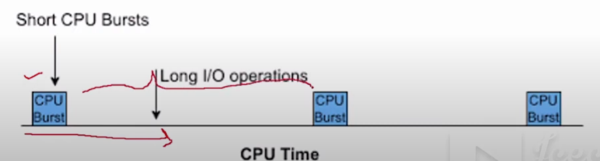
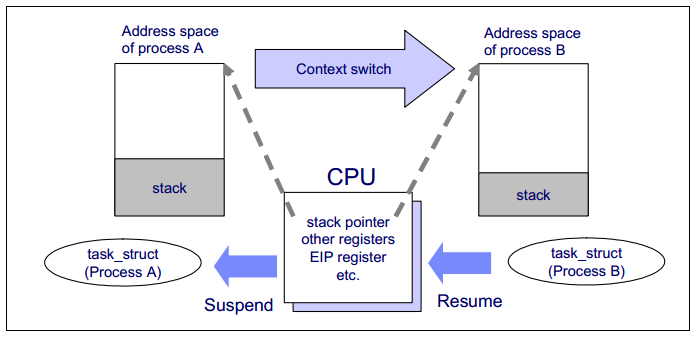
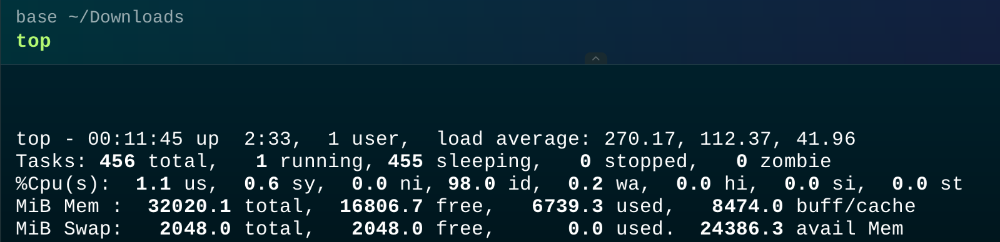
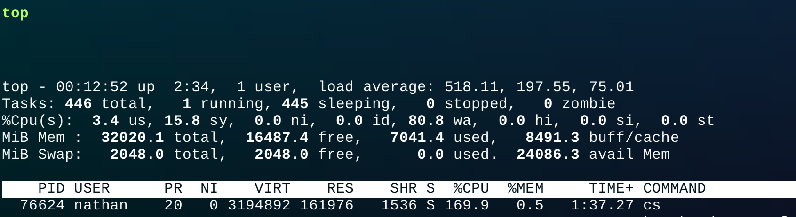

# D13 閒聊I/O密集型任務與 Context Switch

- 系列：應該是 Profilling 吧？系列 第 13 篇
- Day：13
- 發佈時間：2024-09-13 00:45:02
- 原文：[https://ithelp.ithome.com.tw/articles/10349747](https://ithelp.ithome.com.tw/articles/10349747)

突然今天想寫這篇是因為 Line 社群有網友問到 I/O密集型任務 如果開大量 Thread 或是將這個任務以容器啟動了數十個容器在消費從 Message Queue 接收到的事件，然後做大量的 I/O 密集任務。會不會導致 Context Switch ？以及如果真要提高吞吐量與處理效能，開大量 Worker 是常見的方式，但要怎能知道開多少數量的 Worker 在這台機器上適合呢？

今天先從資源使用情況來看，明天在從任務的執行時間來分析。

今天會講比較多基本知識先了解打底用，也能當我在混天數吧 :）

---

在我們討論過系統容量與高併發的挑戰之後，我們引入了排隊理論來理解請求的排隊與等待時間，並藉由80/20法則和Amdahl's Law 更深入地探討系統性能的優化可能性。這些概念幫助我們看清在處理高併發的情況下，系統的性能瓶頸往往不僅僅來自於計算資源的不足，更多時候是受到 I/O 的延遲和上下文切換的影響。今天，我們將從資源使用的角度來探討這些因素如何影響到 I/O 密集型工作負載，並進一步分析 CPU 的使用情況及過度的上下文切換如何成為限制吞吐量的潛在原因。

## CPU 使用率

CPU 的使用率可以透過測量一段時間內 CPU 忙於執行任務的時間比例獲得，通常以百分比 % 表示。也可以透過測量 CPU 未執行 kernel idel 的時間得出，這段時間內 CPU 可能會執行一些 user level 的應用程式，或其他的 kernel 程式，或者在處理 interrupt。

CPU 使用率高不代表一定有問題，只能說系統有在工作。也有人認為這是投資回報率（ROI）的指標，畢竟機器買了租了就用好用滿。CPU 資源高度被利用的系統認為有著較好的 ROI，而空閒太多的系統則是浪費。這點與硬碟（I/O）有著很大的不同。

> ROI 很重要，一開始就用的好，則花費都用在刀口上。
>
> 後期才投入分析的話，那就是省運行成本，看能否跟老闆凹，省下來的10%當bonus吧！
>
> 在OpenTeletetry 入門指南，第 2 章也有提到可觀測性工程對於數位轉型的 ROI 是否幫助的。

CPU 使用率高，不等於應用程式的性能跟著出現顯著的下降！因為 kernel 支援優先級別的處理、搶佔處理和分時共享處理。這些概念組合起來讓 kernel 決定了什麼應用程式或執行緒的優先級更高，並保證它優先執行。

CPU 的時間花費在處理 user space 的時間稱為 User-CPU-Time，而執行 kernel 類型的時間稱為 System-CPU-Time。 System-CPU-Time 包含系統底層調用、kernel 執行緒和處理 interrupt 的時間。在整個系統範圍內進行量測時，User-CPU-Time 與 System-CPU-Time的比例揭示了該系統執行的負載類型。

如果User-CPU-Time 比例很高，那麼可能就在處理像是影像處理、機器學習、數學運算或數據分析等。

反之，如果 System-CPU-Time 很高，則可能是 I/O Intensive Workload，通過 kernel 在進行 I/O 操作。

## I/O Intensive Workload

又稱 I/O-bound 或 I/O 密集型工作負載。這裡的 bound 或 intensive，指「受限於」或「受制於」。當我們說一個任務是「I/O-bound」時，意思是這個任務的性能或速度主要受限於 I/O 操作的速度，而非 CPU 的處理能力。

當一個任務是 I/O-intensive 時，系統的其他資源（例如 CPU、記憶體等）可能無法被充分利用。這是因為系統必須等待 I/O 操作完成，而在這段等待時間內，其他資源可能處於閒置或低效狀態。也就是說，儘管 CPU 可能有足夠的能力處理更多的計算任務，但由於 I/O 操作成為瓶頸，整個系統的資源利用率會受到限制。

例如，在一個 I/O-bound 系統中，即使 CPU 的利用率很低，系統整體的性能也可能達不到預期，因為它主要受限於磁碟或網路 I/O 操作的速度和容量。這種情況下，即便增加更多的 CPU 或記憶體資源，也無法顯著提高系統性能，因為真正的瓶頸是 I/O 操作。

相呼應的是速度，系統在處理這類任務時，CPU 的計算能力可能有富餘，但由於需要等待 I/O 操作（例如讀取磁碟、網路請求、文件讀寫等）完成，整體系統的速度和性能會受到這些 I/O 操作的制約。因此，任務的執行效率主要取決於 I/O 操作的效率，而不是計算的速度。

舉例來說，假設一個應用程序需要頻繁地從磁碟讀取數據並進行處理，如果磁碟讀取速度較慢，即使 CPU 再快，也要等待數據讀取完成後才能繼續處理。這時候，我們就可以說這個任務是「I/O-bound」，因為它的性能主要受限於磁碟的 I/O 速度。



[YouTube **I/O Bound Process**](%5Bhttps://youtu.be/6CegqIE-yxk?t=204%5D(https://youtu.be/6CegqIE-yxk?t=204))

該影片用圖簡單闡述，I/O Bound 的處理，其實真正用到 CPU 的時間很少很少。但對於一個I/O操作具體什麼時候能回應，其實是未知的。由於 I/O 操作的延遲不可預期，這就導致了系統在等待 I/O 回應的過程中，CPU 的資源可能無法被充分利用。在這些等待期間，CPU 可能切換到另 一個可以利用 CPU 資源任務的執行，這就引出了 CPU Context Switching 的概念。

## CPU Context Switching

### Context

這裡指的 Context，指的是該應用程式/Thread/Coroutine 等等在執行時的環境，包含了所有的 Register 的內容、該應用程式正在使用的文件（或你說 FileDescriptor）、記憶體中的等變數內容（MMU）等等。



[圖片來源 CPU Context Switching](%5Bhttps://jaminzhang.github.io/os/CPU-Context-Switch/%5D(https://jaminzhang.github.io/os/CPU-Context-Switch/))

上圖示意，同一個 CPU 從 Process A 切換至 Process B 來執行的流程跟需要用到的 context 內容，過程中會進行現有 context 的儲存，已經載入新的 context。

其實 CPU context swithing 細說有三種，Process context switching、Thread context switching 與 Interrupt Context Switching。有興趣能根據這關鍵字去搜尋學習。

### Context Switching 成本分析

在系統運行的過程中，context switching 是無法避免的操作，尤其在高併發和 I/O 密集型任務中，頻繁的上下文切換可能會對系統性能造成嚴重影響。Context switching 的成本主要來自於 CPU 從執行一個 goroutine（或 thread）切換到另一個的過程中所需的資源和時間開銷。

#### Context Switching 的開銷

上下文切換的過程中，CPU 需要暫停當前正在運行的 goroutine，保存當前任務的狀態（即 context），並加載下一個要執行的 goroutine 的狀態。這些操作涉及到寄存器狀態的保存和恢復，page table 切換，記憶體快取的刷新等操作。雖然對於單次上下文切換，這些開銷看起來是很小的，但在高併發或 I/O 密集型任務中，大量的 goroutine 會導致頻繁的 context switching，累積起來的開銷可能對系統的整體性能造成明顯的影響。

上下文切換的成本分為三大類型：

- **Process Context Switching**: 這是最昂貴的，因為涉及到切換不同的應用程序（process）間的記憶體空間和系統資源。
- **Thread Context Switching**: 相較 process switching，thread switching 較輕量級，因為在同一個 process 內切換，不涉及 page table 的更新，但依然需要保存和恢復寄存器等資料。
- **Goroutine Context Switching**: Go 語言的 goroutine 由 runtime 管理，進行調度時，開銷比系統級別的 thread 較小，但在高併發的情況下，goroutine context switching 依然可能對系統性能產生影響。

這三種類型的 context switching 切換的成本依序是 Process context switching > Thread context switch > Interrupt Context Switching。

在 Linux 系統中，這些 context switching 共同協作，以確保系統能夠多任務併發運行，並及時回應各種事件和操作。但這些 switching 其實都有成本與開銷，如果設計軟體時沒設計好，就會產生巨量的 context switching 其實反而沒達到當初想要的吞吐量與效能，反而表現的會更差。

因此在 I/O 密集型工作場景中，常見的一個現象是，儘管系統的瓶頸主要來自 I/O 操作，CPU 仍可能達到飽和狀態，進而導致整體性能下降。這通常發生在系統同時處理大量 I/O 任務時，尤其是在高併發的情境下，CPU 必須頻繁地進行 context switching 來協調不同的 I/O 操作與計算任務。在這種情況下，如何優化 I/O 操作便成為了提升性能的關鍵。常見的優化手段包括使用非同步 I/O，以減少 CPU 的閒置等待時間，或是採用批量處理 I/O 任務的方式，將多個 I/O 請求合併處理，以降低 context switching 的頻率。這些方法能有效減少系統因 I/O 導致的延遲，同時提高 CPU 資源的利用率，進一步改善整體性能。

## 用 Go 產生大量的 context switching

通過增加大量的 Worker 或 Thread 來提高吞吐量是一種常見的優化方法，但我們需要謹慎地評估系統的 context switching 頻率，因為過多的 context switching 可能會使問題更加嚴重。

Go 有個函式 [`Gosched()`](https://pkg.go.dev/runtime#Gosched) 可以強制讓該 goroutine 釋放所佔有的 CPU，來讓其他 gorouine 能使用該 CPU 處理事情。搭配 [`GOMAXPROCS()`](https://pkg.go.dev/runtime#GOMAXPROCS) 限定該程式最多使用 1 個 CPU 核心。透過模擬單核心環境中的行為，這樣所有的goroutine 都必須在同一個 CPU 上執行，這也意味著它們需要更多的 context switching 來共享這個 CPU 處理時間。

```go
package main

import (
	"flag"
	"fmt"
	"log"
	"os"
	"os/signal"
	"runtime"
	"sync"
	"syscall"
)

func excessiveWorker(id int, wg *sync.WaitGroup) {
	defer wg.Done()
	for {
		// 模擬大量的磁碟 I/O 操作
		data := make([]byte, 1024*1024*1) // 1MB 大小的資料
		err := os.WriteFile(fmt.Sprintf("/tmp/testfile_%d", id), data, 0644)
		if err != nil {
			continue
		}

		_, err = os.ReadFile(fmt.Sprintf("/tmp/testfile_%d", id))
		if err != nil {
			continue
		}

		runtime.Gosched()

		// 模擬取得資料後的計算
		sum := 0
		for i := 0; i < 1000; i++ {
			sum += i
		}
	}
}

func main() {
	numWorkers := flag.Int("workers", 1000, "number of workers to start")
	procs := flag.Int("procs", 1, "number of go max procs")

	flag.Parse()

	runtime.GOMAXPROCS(*procs)

	sigChan := make(chan os.Signal, 1)
	signal.Notify(sigChan, syscall.SIGINT, syscall.SIGTERM)

	var wg sync.WaitGroup

	for i := 0; i < *numWorkers; i++ {
		wg.Add(1)
		go excessiveWorker(i, &wg)
	}
	fmt.Printf("Running workers: %d", *numWorkers)
	go func() {
		<-sigChan
		log.Println("Received signal, shutting down...")
		os.Exit(0)
	}()

	wg.Wait()
}
```

```
go build -o cs main.go
./cs
```

Context Switching 的具體影響  
透過這樣的程式，我們可以實際觀察到系統在進行大量上下文切換時的性能變化，這包括：

- **CPU 利用率的下降**：儘管系統內有很多 goroutine 在運行，CPU 的利用率並沒有達到最高，這是因為 CPU 的大部分時間花費在上下文切換上，而非執行實際的計算任務。
- **吞吐量的下降**：隨著 goroutine 數量的增加，context switching 的成本越來越高，這會直接導致系統吞吐量的下降。這意味著即便有更多的 goroutine，系統也無法更有效地處理任務。
- **性能瓶頸**：通過觀察上下文切換的開銷，我們可以得出系統的瓶頸可能並非來自於 CPU 或記憶體，而是由於過多的 context switching 造成的性能損耗。這時，我們可以考慮調整 worker 或 thread 的數量，減少不必要的切換開銷來提高系統效能。

通過這些觀察和分析，我們可以針對特定的應用場景來調整系統的設計和配置，從而在 I/O 密集型任務中找到最佳的工作者數量，減少 context switching 的成本，提升整體的系統性能。

在我執行該程式後，首先我先使用 [top](https://linux.die.net/man/1/top) 這工具做簡單的觀察，

執行程式之前



執行程式之後



能看見load average 瞬間來到五百多。`load average: 518.11, 197.55, 75.01`分別表示系統在過去 1 分鐘、5 分鐘和 15 分鐘內的平均負載。這些數值非常高，表示系統的運行隊列中有大量的程式在等待 CPU 資源。

然後 CPU 情況，`%Cpu(s): 3.4 us, 15.8 sy, 0.0 ni, 0.0 id, 80.8 wa, 0.0 hi, 0.0 si, 0.0 st`，其中`80.8 wa`: 等待 I/O 操作完成的時間百分比。這是主要的負載來源，表示 CPU 大部分時間在等待磁碟或其他 I/O 操作完成。

然後能看到這程式使用了 `VIRT` 3.1 GB， `RES` 佔用了 160MB。`%CPU 169%`: 該程式大約 1.7 個 CPU 核心。

`RES` 是我們這程式佔用的實際物理記憶體大小，佔用 160MB，因為我們有把文件內的資料讀取進去程式中。`VIRT` 來到了 3.1 GB，這是由於大量的 goroutine 分配或HTTP 請求的高併發處理，以及 Go 運行時記憶體管理所致。這些因素在大量併發的情況下累積，會導致 `VIRT` 看起來非常大，但實際上未必消耗了同樣多的物理記憶體。

這次 `top` 的輸出顯示了系統處於極高負載的狀態，主要表現在高 `load average`、高 `wa` 值和幾乎耗盡的記憶體。這些數據表明系統可能正在執行大量 I/O 密集型任務，導致 CPU 大部分時間在等待 I/O 完成，記憶體資源緊張，並且進程競爭 CPU 資源非常激烈。如果不加以優化，系統性能可能會進一步惡化，影響到正常運行。

# 小結

今天我們介紹了 CPU 使用率與 I/O 密集型任務之間的關係，並且深入探討了 CPU context switching 如何影響多 worker 的高併發場景。這些知識為我們了解如何正確設置系統中的 worker 數量奠定了基礎。

明天，我們將重點關注任務執行時間的分析，通過更詳細的測量來找出系統的性能瓶頸，並且研究如何根據系統的實際表現來動態調整 worker 的數量，以達到最佳的吞吐量與效能。

希望這篇文章能夠幫助社群中的網友對 I/O 密集型任務有更深入的理解，也能幫助大家更有效率地使用系統資源。
