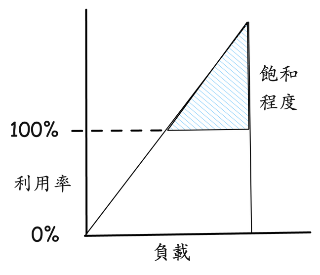
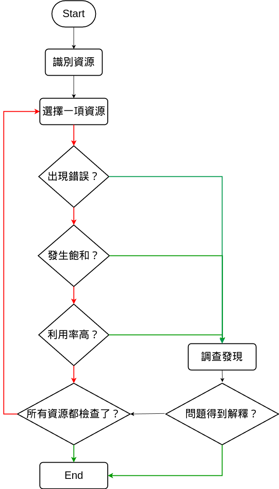
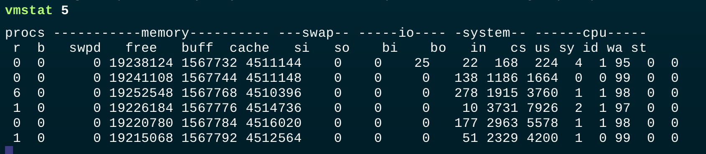
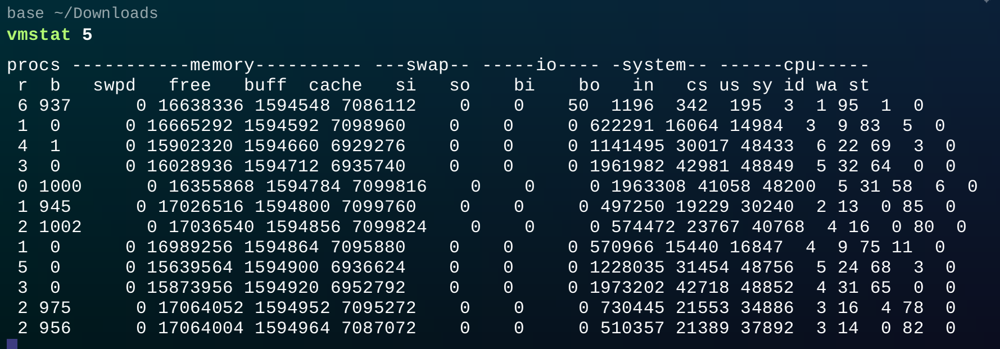
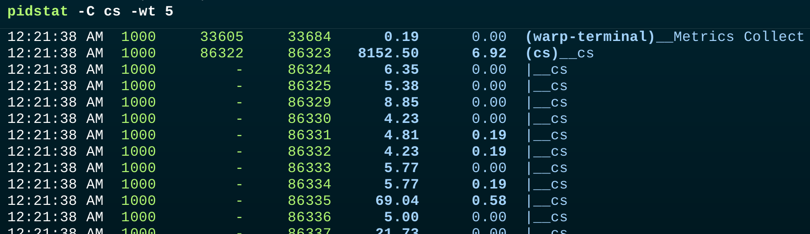

# D14 CPU 觀測工具 vmstat 與 pidstat

- 系列：應該是 Profilling 吧？系列 第 14 篇
- Day：14
- 發佈時間：2024-09-14 01:17:31
- 原文：[https://ithelp.ithome.com.tw/articles/10350171](https://ithelp.ithome.com.tw/articles/10350171)

昨天我們在[D13 閒聊I/O密集型任務與 Context Switch](https://ithelp.ithome.com.tw/articles/10349747) ，我們探討了 I/O 密集型任務與 CPU 上下文切換之間的關係，並以範例程式展示了如何觀察系統在高併發情況下的資源使用情形。透過這些觀察，我們了解到過多的 worker 不僅可能無法有效提升系統效能，還會因上下文切換過於頻繁而造成額外的性能損耗。

今天，我們將延續這個話題，進一步探討如何使用 vmstat 和 pidstat 等觀測工具來深入分析 CPU 的使用情況，找出系統的性能瓶頸。這將幫助我們更清楚地了解任務的執行時間與資源利用，進而為後續的優化提供依據。

---

## U.S.E. 方法

關於 U.S.E. 方法，其實以前在鐵人賽有很簡略的介紹過[淺談DevOps與Observability系列 第 19 篇](https://ithelp.ithome.com.tw/articles/10294346)

U.S.E.（Utilization、Saturation、Errors）方法，應用於性能研究，主要用來識別系統瓶頸。對於所有的資源，能看見並分析它的利用率、使用程度和錯誤。

- 資源︰之前一直在提，所有主機裡的物理元件（CPU、記憶體、硬碟網卡等）。某些軟體的資源其實也能被算入其中。
- **利用率**︰在規定的時間間隔內，資源用於服務工作的時間百分比。雖然資源繁忙，但是資源來有餘力接受更多的工作。主要用來告訴我們資源有多忙碌。
- **飽和程度/壓力**︰過量的工作或排隊的工作量，這可以說明資源是否已經超載。
- **錯誤**︰錯誤事件的個數。

對於某些資源類型，這裡的利用率指的是資源所用掉的容量。因為利用率有兩種，基於容量和基於時間。

### Utilization 利用率

#### 基於時間的利用率

基於時間的利用率是使用排隊理論做正式定義的，有關排隊理論能參考本系列的[D8 性能工程基本定律 - 排隊理論](https://ithelp.ithome.com.tw/articles/10348486)。  
`主機或資源繁忙的平均值`  
公式 `U = B/T`

U 是利用率，B 是 T 時間內系統的繁忙時間，T 是觀測週期。  
像硬碟監測工具 iostat(1) 調用的指標 `%b` 就是一秒內硬碟的忙碌百分比。

基於時間的利用率這個指標高速我們該資源的忙碌程度。當這個資源的利用率達到了100%，資源就會發生競爭時性能會有嚴重的下滑。這時候方便我們檢查其他指標以確認該資源是不是已經成為系統的瓶頸。

但還是有某些資源能夠併行的為多個操作提供服務。因此在 100% 利用率的情況下，性能下滑的幅度會比較有限，因為它們還是能接受更多的工作。以電梯大樓的電梯為例，當電梯在樓層間移動時，他是正在被使用中的，當它閒置等待時，它是不被使用的。然而，即使電梯處於 100% 忙碌上下移動時，它依然能夠接受更多乘客的。因為這裡討論的不是容量而是時間。

當硬碟處於 100% 忙碌時也還是能接受更多的工作，因為它具備有 Buffer，能把寫入的資料寫進 Buffer，稍後在完成寫入硬碟的動作。因此級便當它在 100% 忙碌時，依然有空閒來接受更多工作。

#### 基於容量的利用率

基本上容量的利用率是在容量規劃時，由 IT 們決定的。

`系統和硬體元件都能提供一定的吞吐量。不論性能好壞，系統和硬體元件都工作在其容量的某一比例上。這個比例就是容量的利用率。`

與基於時間的利用率不同的是，容量處於 100% 利用率的硬碟就不能再接受更多的工作了。但若用時間看，100% 的利用率只是指時間上的100%忙碌。

> 大家應該很常發生突然主機就很多操作就失敗了，甚至卡住了。進去主機看才發現是硬碟滿了。這就是容量處於100%忙碌的最佳例子。或者資料庫主機的連線數只開放500條連線，而有服務沒用 connection pool 導致有 500 個請求同時處理時，就把資料庫主機的連線數這容量也使用完了，資料庫主機就無法接受更多請求處理了。

所以再次回到電梯的例子，當電梯是 100% 容量時，才是意味著裝不下更多的乘客了。

### Saturation 飽和程度/壓力

隨著工作量增加而對資源的請求處理超過資源所能處理的程度叫做飽和程度。飽和程度發生在 100% 基於容量的利用率時，這時過多個工作將無法被處理，進而開始排隊。

隨著負載/壓力的持續上升，上圖的飽和程度在超過基於容量的 100% 利用率的標記後線性增長。因為時間花在了等待上，所以任何程度的資源飽和都是性能瓶頸。而對於基於時間的利用率，排隊和飽和程度可能就不發生在 100% 利用率時，這取決於資源處理任務的併行能力。

> 像資料庫的 update，如果多筆同時要 update 就會受限於 row lock 而排隊。但讀取卻是shared lock。

在我們理解利用率與飽和程度後，對於性能瓶頸的排查就多了一分認識。

而錯誤也需要被調查，因為也會損害性能表現。

### U.S.E. 的排查過程

U.S.E. 會將方法引導至一些關鍵指標上，這樣可以盡快地核實所有系統資源。如果通過該方法核實所有系統資源還是沒找到問題，那麼就能使用其他方法來繼續深入查找。

首先檢查錯誤，因為資源的錯誤通常可以很快被解釋。在開始調查其他指標之前排除掉錯誤是很省時的。  
接著要排查的是飽和程度檢查，因為這個比利用率更好解釋，任何資源級別的飽和都可能是性能瓶頸問題。只是也未必一開始找到的資源飽和，就是主因 :(

這裡以 [D11 的購票窗口](https://ithelp.ithome.com.tw/articles/10349235)為例，利用率就相當於有多少購票窗口忙於購票和收費。利用率 100% 表示著我們找不到一個空閒的購票窗口，必須排隊在別人的後面（這就是飽和）。如果總經理跟老闆會報，一整天購票窗口的利用率是 40%，這老闆能判斷當天是否有人在某一時間排過隊嘛？很可能在高併發時期確實排過隊，因為那時所有的購票窗口的利用率都是 100%，但是這在一天的平均值上試看不出來的。

> 老闆永遠只看到大家平均工作才 4hr，就是沒發現都某幾天都忙到炸了。  
> 我在[可觀測性工程一書](https://www.tenlong.com.tw/products/9786263246850?list_name=srh)也翻譯到使用第一原則的除錯工作流程，工具怎用都很容易學，但知道這工具具體提供什麼樣的數據，能解決什麼問題？以及有沒有一個標準化的作業流程來處理，是可觀測性工程想要倡導的精神之一。

## CPU 性能監測

當我們知道了 U.S.E.後，就不難發現 CPU 的關鍵指標是**利用率（繁忙百分比）**和**飽和程度（從負載推算出來的運行佇列長度）**。

Linux 對於 CPU 有蠻多工具可以使用，uptime/top 用來檢查平均負載。mpstat 用來檢查每個 CPU 的統計資訊。perf/profile 從 user space 或 kernel space 的角度剖析 CPU 的使用。以及今天要介紹的 vmastat 用來檢查 CPU 的使用情況。pidstat 將 CPU 使用情況分解成 user space 和 kernel space 來顯示。

這些工具主要是基於時間的利用率來進行資源的觀測和分析，而不是基於容量的利用率。

top：展示了系統的當前狀態，包括 CPU 使用率、記憶體使用情況、進程信息等，主要反映了系統在一段時間內的資源使用狀況，屬於基於時間的觀測工具。

vmstat：提供了 CPU、記憶體、虛擬記憶體、磁碟、系統過程等的統計數據，特別強調了 CPU 在一段時間內忙碌的比例，包括 user time 和 system time，也屬於基於時間的工具。

pidstat：可以將 CPU 的使用情況按照 user space 和 kernel space 拆解展示，同樣是在一段時間內進行資源的使用率分析，屬於基於時間的利用率觀測工具。

基於時間的利用率，主要反映資源在觀測週期內的繁忙程度，而不會直接涉及到容量飽和問題。這些工具的數據可以幫助我們了解系統的忙碌程度和性能瓶頸，尤其是在資源接近 100% 時，能夠提示潛在的性能問題，但它們並不會直接反映資源的容量利用狀況，例如硬碟空間是否滿了等。

## VMSTAT

[VMSTAT](https://linux.die.net/man/8/vmstat) 是個 Linux 工具能夠動態監看 OS 的 CPU、記憶體、I/O 等活動。我們能透過 TOP 看到資源的使用情況，但還是看不到有在發生 context switching。其中在 VMSTAT 提供了 system 中提供了 `cs` （context switches per second）。還有 CPU 的資訊像是 `us`（user time） 和 `sy`（system time）、`id`（idle）和 `wa`（waiting for IO）。

以下是每個欄位的解釋：  
**procs (處理程式)**  
r: 可運行的處理程式數量（處於運行佇列中的處理程式）。如果該數字高於 CPU 核心數，表示系統處於過載狀態。  
b: 等待 I/O 操作完成的處理程式數量（被阻塞的處理程式）。

**memory (記憶體)**  
swpd: 使用的虛擬記憶體大小（以 KB 為單位）。若系統記憶體不足，系統會將部分內存交換到硬碟，該數值會上升。  
free: 空閒的物理記憶體大小（以 KB 為單位）。  
buff: 用於緩存硬碟的記憶體大小（以 KB 為單位），一般是用來做 I/O 操作的快取。  
cache: 用於快取檔案的記憶體大小（以 KB 為單位），這些快取的檔案可以快速地被重複讀取而不需要從硬碟讀取。

**swap**  
si: 由硬碟進入虛擬記憶體（swap-in）的數量（以 KB 為單位）。  
so: 從虛擬記憶體移至硬碟（swap-out）的數量（以 KB 為單位）。當這兩個數值很高時，表示系統可能記憶體不足，頻繁進行 swap 會嚴重影響性能。

**io (I/O)**  
bi: 從硬碟讀取的數量（以 KB/s 為單位）。  
bo: 寫入到硬碟的數量（以 KB/s 為單位）。如果 bo 很高，通常表示系統正在進行大量的 I/O 操作。

**system (系統)**  
in: 每秒的中斷次數，這包括硬體中斷和軟體中斷。  
cs: 每秒的 context switch 次數。當該數值過高時，表示系統頻繁在不同的處理程式或 thread 之間切換，可能會導致性能問題。

**cpu**  
us: user space 應用程式佔用的 CPU 時間百分比（user time）。  
sy: kernel space 系統執行緒佔用的 CPU 時間百分比（system time）。  
id: CPU 空閒時間的百分比（idle time）。  
wa: CPU 等待 I/O 操作完成的時間百分比（I/O wait time）。  
st: 虛擬化環境中，其他虛擬機佔用的 CPU 時間百分比（steal time），該值通常在虛擬化環境下才會有。

看下圖，`vmstat 5` 表示我每5秒統計顯示一次數據，這裡面的 cs 是這5秒內，每秒平均發生 context switching的次數。可以看見我平時大概每秒3000次上下的context switching。大多數情況下 us 和 sy 僅有 1% 到 2% 的 CPU 使用，這表示系統在執行較少的計算任務。然後 CPU 大部分時間處於 Idle，顯示 95% 到 99% 的 idle 時間。這表示系統在當前負載下有足夠的資源。

接著來啟動 go cs程式。可以看見下圖，第 2 行開始有很顯著的不同了。Context switching 次數從數百次到數千次迅速增加到每秒幾千次甚至超過一萬次。，這正是由於我建立了大量 goroutine 並在單個 CPU 核心上運行所導致的結果。這樣的情況會顯著增加系統的調度負擔，導致更多的 context switching。我們能通過 VMSTAT 該工具觀察。

此外這裡還透漏很多資訊。b: 正在等待 I/O 操作完成的thread數量。這裡的數字非常高，大約在 1000，這與我們程式設定的 `numWorkers` 一致，這表示有大量的進程因為等待 I/O 操作（例如磁碟讀寫）而被阻塞。I/O 的 bo 寫入量很高，這是能理解的，畢竟我們真的有寫資料的動作。

重點在於 System 與 CPU 的部份。 `in`: 每秒進行的 interrupt 次數。in 值大幅增加，有時高達 11,827 次，表示系統正在處理大量的中斷。`cs`: 每秒上下文切換的次數。cs 值大幅增加，有時高達 17,219 次，表示大量的 context switching，系統負載非常高。`us`: User space 程式佔用的 CPU 百分比。通常在 0% 到 4% 之間，這表示 CPU 的計算資源大部分用於處理系統操作和 I/O，而不是應用程式邏輯。`id`: 空閒時間百分比。大部分時間 id 非常低，甚至達到 0%，這表明 CPU 幾乎沒有空閒時間，完全被利用。`wa`: I/O 等待時間百分比。wa 值非常高，達到 94% 甚至更高，這表明 CPU 大部分時間在等待 I/O 操作完成。這是 I/O 密集型負載的特徵。

這些統計資料表明系統處於非常高的負載狀態，特別是在 I/O 操作上，CPU 大部分時間都在等待磁碟 I/O 完成。相比於平常，系統的記憶體和 I/O 資源消耗非常嚴重，Context switching 次數大幅增加，CPU 幾乎無空閒時間。這樣的情況可能會導致系統性能下降或回應變慢，特別是在 I/O 密集型應用場景下。

## PIDSTAT

剛剛 VMSTAT 能看到整體情況，但要是我們想往更細緻的方向去排查分析，通常就要依賴 pidstat 這工具了。 [pidstat](https://man7.org/linux/man-pages/man1/pidstat.1.html) 主要用來監控和報告個別處理程式的各種性能指標，包括 `%CPU`（CPU 使用率）、記憶體使用率、I/O 操作、Context switching 等。

以下是每個欄位的解釋：  
**UID**  
使用者識別碼（User ID），指該處理程式的擁有者。UID 是用來標識處理程式屬於哪個用戶的。

**TGID**  
處理程式組識別碼（Thread Group ID），也稱為處理程式識別碼（PID）。它表示處理程式或 thread 組的主 ID。在multi thread 的情況下，所有thread 共享同一個 TGID。

**TID**  
Thread 識別碼（Thread ID），也稱為thread ID。這是每個 thread 的唯一標識符，用來區分同一處理程式內的不同 thread。

**cswch/s**  
每秒自願上下文切換次數（Context Switch per second, Voluntary）。這表示該 thread 自願釋放 CPU 進行 I/O 操作或等待其他資源時，發生的上下文切換次數。

**nvcswch/s**  
每秒非自願上下文切換次數（Non-Voluntary Context Switch per second）。這表示該 thread 被 OS 強制停止運行並切換到其他thread 時，發生的上下文切換次數。通常是因為該thread 已經耗盡了它的 CPU 時間配額，或者系統資源競爭激烈。

**Command**  
顯示當前thread /處理程式的名稱或正在執行的命令。

其中 `-w` 是用來顯示處理程式的Context switching次數，包括 `cswch` 自願 Context switching（由處理程式自身引起）和 `nvcswch` 非自願Context switching（由操作系統引起）。

能看見下圖所示，PID 128422 (cs)：此處的 cs 處理程式在報告時間內每秒發生了 4701.70 次 cswch，並且有 11.89 次 nvcswch/s。這表明該處理程式頻繁地進行了 I/O 操作或其他等待操作，導致了大量的 cswch。

那我們就能抓到是哪個程式沒設計好，導致 CPU 的資源忙於 Context switching上。

## 小結

今天我們深入探討了如何利用 vmstat 和 pidstat 來分析系統的 CPU 使用情況和上下文切換的問題。透過這些工具，我們能夠觀察到 I/O 密集型任務在高併發情境下，如何引發頻繁的上下文切換，並進而影響系統的整體性能。我們還解釋了如何通過自願與非自願上下文切換數據，來識別系統中的性能瓶頸與潛在的設計缺陷。這些觀察為進一步優化系統性能奠定了基礎。明天，我們將進一步探討如何使用 Go 的工具來深入發現和解決這些問題。

其他參考  
[知乎 - Linux 記憶體問題定位方法](https://zhuanlan.zhihu.com/p/733963294)
