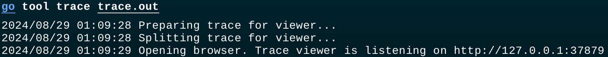
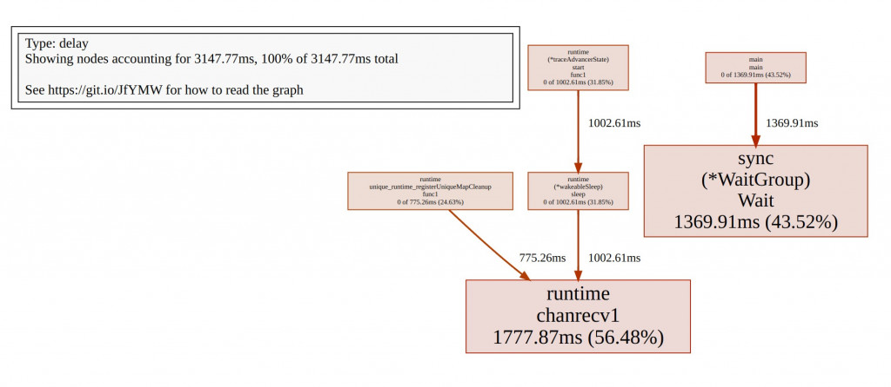
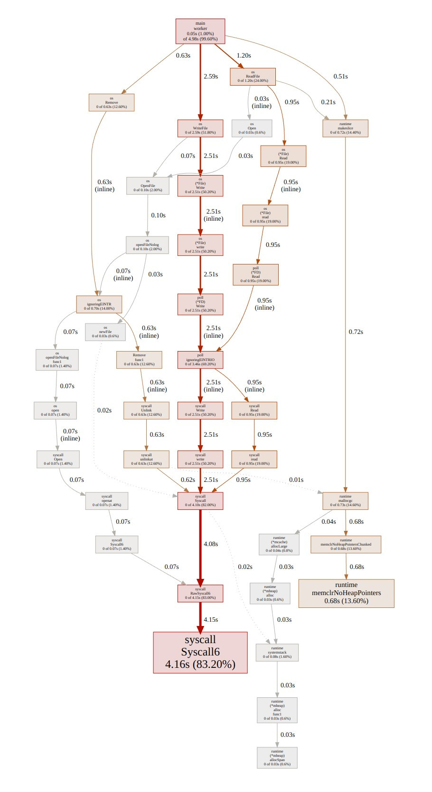
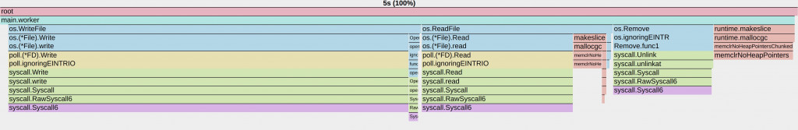

# D15 淺談 Go Tool Trace - 1

- 系列：應該是 Profilling 吧？系列 第 15 篇
- Day：15
- 發佈時間：2024-09-15 01:03:12
- 原文：[https://ithelp.ithome.com.tw/articles/10350656](https://ithelp.ithome.com.tw/articles/10350656)

在昨天的文章中，我們探討了 I/O 密集型任務與 CPU 上下文切換的關係，並利用觀測工具 vmstat 和 pidstat 分析了系統在高併發情況下的資源使用情形。我們看到了過多的 worker 會導致上下文切換的頻率大幅增加，從而對性能產生負面影響。

今天，我們將繼續延伸這個主題，轉向 Go 語言的生態圈，探討如何利用 Go 自帶的追蹤工具，如 Go Trace，深入分析程式的效能瓶頸。我們將展示如何通過對程式的執行時間、I/O 操作和 goroutine 的調度進行追蹤，來發現潛在的性能問題，並利用這些工具進一步了解系統的資源使用情況。這將使我們能夠更有效地解決高併發環境下的效能挑戰，並為未來的優化提供有力依據。

---

## Go Trace

在 Go 的診斷工具中，Tracing 是一種用於分析程式碼延遲和執行路徑的重要工具。透過追蹤程式碼的執行，可以深入了解應用程式在處理請求或任務時的各個階段的延遲情況，識別出效能瓶頸。

### Trace 概述

Tracing 是一種透過對程式碼進行追蹤，從而分析整個呼叫鏈中的延遲的技術。它不僅能幫助我們理解單一請求的執行時間，還能用於分析複雜系統中分散式請求的效能。

### Trace 在 Go 中的實現

Go 提供了一個執行時間執行追蹤器（runtime execution tracer），用於在指定時間段內擷取各種執行時間事件，如排程、系統呼叫、垃圾收集（GC）、Heap 大小等。這些事件可以透過 go tool trace 進行視覺化和分析。透過 Trace，可以識別 CPU 使用率、網路或系統呼叫是否導致了 goroutine 的搶佔，以及系統的整體並行執行情況。

### Trace 的用途

- 分析應用程式延遲：透過追蹤和分析應用程式的延遲，可以了解每個元件對整體延遲的貢獻，從而識別效能瓶頸。
- 理解 goroutine 的執行方式：Trace 提供了對 goroutine 執行的詳細分析，幫助識別哪些 goroutine 有延遲或阻塞問題。
- 檢查並行執行問題：Trace 能幫助偵測程式是否有併發化不足的問題，例如是否有因 Lock 競爭而導致的串列執行。

因此將範例程式新增 `runtime/trace` 。

```go
package main

import (
	"flag"
	"fmt"
	"log"
	"net/http"
	"os"
	"runtime"
	"runtime/pprof"
	"runtime/trace"
	"sync"
	"time"
)

// 模擬一個從 Message Queue 中接收任務並處理的 Worker
func worker(id int, tasks <-chan int, wg *sync.WaitGroup) {
	defer wg.Done()
	for task := range tasks {
		// 模擬 I/O 操作 (寫入和讀取文件)
		filename := fmt.Sprintf("/tmp/testfile_%d_%d", id, task)
		data := make([]byte, 1024*1024*2) // 生成 2MB 的數據

		// 模擬寫文件 I/O
		err := os.WriteFile(filename, data, 0644)
		if err != nil {
			log.Printf("Error writing file: %v\n", err)
		}

		// 模擬讀文件 I/O
		_, err = os.ReadFile(filename)
		if err != nil {
			log.Printf("Error reading file: %v\n", err)
		}

		// 刪除文件
		os.Remove(filename)

		// 模擬其他 CPU 任務
		sum := 0
		for i := 0; i < 100000; i++ {
			sum += i
		}
	}
}

func main() {
	// 使用 flag 來設置 worker 的數量
	numWorkers := flag.Int("workers", 10, "number of workers to start")
	numTasks := flag.Int("tasks", 1000, "number of tasks to process")
	procs := flag.Int("procs", 1, "number of go max procs")
	flag.Parse()

	// 設置最大 CPU 核心數，這裡可以嘗試不同的設定來觀察效果
	runtime.GOMAXPROCS(*procs)

	// 啟動 pprof 監控
	go func() {
		log.Println(http.ListenAndServe("localhost:6060", nil))
	}()

	// 設置 Trace 和 CPU Profile
	cpuFile, err := os.Create("cpu.prof")
	if err != nil {
		log.Fatalf("could not create CPU profile: %v", err)
	}
	defer cpuFile.Close()
	if err := pprof.StartCPUProfile(cpuFile); err != nil {
		log.Fatalf("could not start CPU profile: %v", err)
	}
	defer pprof.StopCPUProfile()

	traceFile, err := os.Create("trace.out")
	if err != nil {
		log.Fatalf("could not create trace file: %v", err)
	}
	defer traceFile.Close()
	if err := trace.Start(traceFile); err != nil {
		log.Fatalf("could not start trace: %v", err)
	}
	defer trace.Stop()

	// 定義不同的 Worker 數量來測試
	start := time.Now()

	// 控制任務數量
	//numTasks := numTasks

	// 創建一個 Channel 作為任務隊列
	tasks := make(chan int, *numTasks)
	var wg sync.WaitGroup

	// 啟動多個 Worker
	for i := 0; i < *numWorkers; i++ {
		wg.Add(1)
		go worker(i, tasks, &wg)
	}

	// 模擬向 Message Queue 中發送事件
	for i := 0; i < *numTasks; i++ {
		tasks <- i
	}
	close(tasks)

	// 等待所有 Worker 完成
	wg.Wait()

	elapsed := time.Since(start)
	fmt.Printf("Workers: %d, Elapsed Time: %s\n", *numWorkers, elapsed)
}
```

一樣編譯後執行該程式，會發現產生了 `trace.out`這檔案。

## Go Tool Trace

Go 有提供幾個工具，都能在 [go/cmd](https://pkg.go.dev/cmd@go1.23.0) 底下找到︰

- [pprof](https://pkg.go.dev/cmd/pprof@go1.23.0)
- [test2json](https://pkg.go.dev/cmd/test2json@go1.23.0)
- [pack](https://pkg.go.dev/cmd/pack@go1.23.0)
- [objdump](https://pkg.go.dev/cmd/objdump@go1.23.0)
- [nm](https://pkg.go.dev/cmd/nm@go1.23.0)
- [link](https://pkg.go.dev/cmd)
- [fix](https://pkg.go.dev/cmd/fix@go1.23.0)
- [trace](https://pkg.go.dev/cmd/trace@go1.23.0)

`go tool trace` Go 提供的一個工具，用於檢視和分析程式的 Trace 檔案。這個工具可以幫助開發者深入理解程式的執行時間行為，特別是在並發程式的調度、系統呼叫、Atomic Primitives（如鎖定和通道）以及網路 I/O 等方面。以下是 go tool trace 的主要功能和使用方法的詳細說明：

go tool trace 需要 `Trace`來進行分析，而產生`Trace` 有三種方式︰

- runtime/trace.Start
- net/http/pprof package
- go test -trace

我們主要展示的是第一種，能看見上述的範例 import `runtime/trace`。

### **查看 Trace 檔案**

產生 Trace 檔案後，你可以使用以下命令在瀏覽器中查看 Trace 檔案的詳細內容：

```
# 假設檔名是 trace.out
go tool trace trace.out
```



然後瀏覽器就會被自動開啟了。細節等等在介紹。

#### 產生 Pprof 類似的 Profile

除了查看 Trace 檔案外，你還可以使用 go tool trace 從 Trace 資料中提取類似 pprof 的 Profile。這些 Profile 可以幫助你分析程式的效能瓶頸。

支援的 Profile 類型包括：

- net: 網路阻塞
- Profile sync: 同步阻塞
- Profile syscall: 系統呼叫阻塞
- Profile sched: 調度延遲 Profile

#### net：網路阻塞 Profile

用途：

net Profile 用於分析程式中 Goroutine 因為網路 I/O 操作（如網路請求、資料傳輸等）而導致的阻塞情況。這個 Profile 可以幫助識別網路操作中導致程式延遲的瓶頸，例如網路連線、資料讀取或寫入時的延遲。

**典型場景：**

當一個 Goroutine 發起網路請求（例如透過 net/http 套件進行 HTTP 請求），如果網路較慢或目標伺服器回應時間較長，Goroutine 就會因為等待網路 I/O 操作完成而阻塞。 如果程式經常進行網路通訊，網路延遲或頻寬限制可能會顯著影響程式的回應時間和吞吐量。

**如何使用：**

產生 Trace 資料後，可以使用下列命令產生 net Profile：

```
go tool trace -pprof=net trace.out > net.prof
```

然後使用 go tool pprof net.prof 進行分析，查看哪些網路操作引起了最長時間的阻塞。

**net Profile 分析的具體內容：**

連線阻塞：當 Goroutine 嘗試建立網路連線（如透過 Dial 方法）時，可能會因為網路不通或連線耗時過長而阻塞。 net Profile 會記錄這些情況。 資料讀取阻塞：Goroutine 從網路連線讀取資料時，若網路傳輸速度較慢或對端回應時間長，Goroutine 會等待資料流完成，導致阻塞。 資料寫入阻塞：Goroutine 透過網路連線傳送資料時，如果網路頻寬有限或對端接收速度慢，也會導致寫入操作的阻斷。

**典型使用場景**

- Web 服務：對於需要處理大量 HTTP 請求的 Web 服務，透過 net Profile 可以識別哪些請求處理因網路延遲而受阻，從而優化網路請求的分發或增加連線池。
- 分散式系統：在分散式系統中，節點之間的通訊至關重要。使用 net Profile 可以幫助開發者找到網路通訊中的瓶頸，並優化節點之間的資料傳輸效率。
- API 用戶端：對於需要頻繁呼叫外部 API 的用戶端應用，透過分析 net Profile，可以優化請求的策略（如 Timeout、Retry 等）以減少網路延遲的影響。

**如何利用 net Profile 進行最佳化**

- Connection pool 最佳化：如果發現大量連線阻塞，可以考慮使用 Connection pool以減少建立新連線的開銷。
- 逾時設定：在網路請求中設定合理的逾時，可以避免因網路問題導致的長時間阻塞。
- 並發請求控制：透過限制並發請求數，防止網路頻寬被耗盡，從而減少請求間的相互影響。
- 快取和負載平衡：對於頻繁存取的資源，使用快取或負載平衡技術可以降低單點的網路負擔，提升整體效能。

#### sync：同步阻塞 Profile

**用途：**

sync Profile 用於分析程式中因使用同步原語（如 Mutex、RWMutex、Cond、WaitGroup、Channel 等）而導致的 Goroutine 阻塞情況。這個 Profile 可以幫助開發者辨識鎖定競爭、mutex 爭用等問題，從而優化同步機制，減少不必要的阻斷。

**典型場景：**

鎖定競爭：當多個 Goroutine 同時嘗試取得一把鎖（如 Mutex 或 RWMutex），如果鎖的持有時間過長，其他 Goroutine 就會在取得鎖定時被阻塞，這可能導致程式的整體效能下降。 Channel 阻塞：Goroutine 在等待從 Channel 接收或發送資料時，如果 Channel 被填滿或為空，Goroutine 可能會被阻塞，直到操作能夠繼續進行。 條件變數（Cond）阻塞：使用條件變數時，Goroutine 可能會等待某個條件滿足而被阻塞。

**如何使用：**

產生 Trace 資料後，可以使用下列命令產生 sync Profile：

```
go tool trace -pprof=sync trace.out > sync.prof
```

然後使用 go tool pprof sync.prof 進行分析，查看哪些同步原語導致了最長時間的阻塞。

**sync Profile 分析的具體內容：**

- 鎖（Mutex/RWMutex）阻塞：在多 Goroutine 環境下，鎖是用來保護共享資源的常用機制。當一個 Goroutine 持有鎖時，其他嘗試取得鎖的 Goroutine 將被阻塞，直到鎖被釋放。 sync Profile 能夠幫助你辨識出這些鎖爭用的情況，並查看這些鎖阻塞了哪些 Goroutine 以及阻塞時間有多長。
- Channel 阻塞：Channel 是 Go 中用於 Goroutine 之間通訊的主要機制。如果一個 Goroutine 嘗試向一個已滿的 Channel 發送資料，或從一個空的 Channel 接收資料，那麼它就會被阻塞。 sync Profile 可以顯示這些阻塞情況，幫助你理解程式的瓶頸所在。
- 條件變數阻塞：條件變數（sync.Cond）允許 Goroutine 等待某個條件滿足。多個 Goroutine 可能會同時等待相同的條件，因此可能會導致阻塞。 sync Profile 可以顯示這些等待的 Goroutine 及其等待的時長。

```
go tool trace -pprof=sync trace.out > sync.prof
go tool pprof sync.prof

(pprof) top
(pprof) web
(pprof) list
```

這個指令會從 Trace 檔案中提取調度延遲的 Profile，並將其儲存為 sched.prof 檔案。

由這些範例不難發現，trace 檔案的副檔名我們習慣使用 `.out`，而 pprof檔案的副檔名則是 `.prof`，與標準習慣一致是比較好的。

常見的指令有 top、list、web

```
(pprof) top
Showing nodes accounting for 3147.77ms, 100% of 3147.77ms total
      flat  flat%   sum%        cum   cum%
 1777.87ms 56.48% 56.48%  1777.87ms 56.48%  runtime.chanrecv1
 1369.91ms 43.52%   100%  1369.91ms 43.52%  sync.(*WaitGroup).Wait
         0     0%   100%  1369.91ms 43.52%  main.main
         0     0%   100%  1002.61ms 31.85%  runtime.(*traceAdvancerState).start.func1
         0     0%   100%  1002.61ms 31.85%  runtime.(*wakeableSleep).sleep
         0     0%   100%   775.26ms 24.63%  runtime.unique_runtime_registerUniqueMapCleanup.func1
```

top 這裡主要提供兩個指標：

- **flat** 表示某個函數自身花費的時間。
- **cum** 表示該函數和它調用的所有子函數花費的總時間。

也能top加數字，例如top3 顯示佔用比例最高的前三名。

接著我們就能複製 top 中你想深入調查的函数名稱。

```
(pprof) list main                  
Total: 3.15s
ROUTINE ======================== main.main in /home/nathan/Project/OpenTelemetryEntryBeook/additional_examples/context_switch/cs1/main.go
         0      1.37s (flat, cum) 43.52% of Total
         .          .    108:           tasks <- i
         .          .    109:   }
         .          .    110:   close(tasks)
         .          .    111:
         .          .    112:   // 等待所有 Worker 完成
         .      1.37s    113:   wg.Wait()
         .          .    114:
         .          .    115:   elapsed := time.Since(start)
         .          .    116:   fmt.Printf("Workers: %d, Elapsed Time: %s\n", *numWorkers, elapsed)
         .          .    117:   //}
         .          .    118:}
```

113: wg.Wait()：這行程式顯示，程式在 sync.WaitGroup.Wait() 函數上花費了 1.37 秒，佔總執行時間的 43.52%。這表示相當大的一部分時間都花在了等待所有的 worker 完成工作上。

\*\* WaitGroup 的作用\*\*  
WaitGroup.Wait() 是一個同步 Primitives，它會阻塞主執行緒，直到所有的 worker goroutine 完成任務。這部分時間反映了 worker 處理任務所需的總時間。由於這段時間佔了很大比例，說明 worker 的運行可能存在效能瓶頸或阻塞，導致主執行緒需要長時間等待。

由於 wg.Wait() 函數是用來等待所有 worker 結束工作，所以它所花費的時間表明：  
任務的處理時間較長：每個 worker 的執行時間較長，這可能是因為 I/O 操作或大量計算，導致整體處理時間增長。

```
(pprof) web
```

下圖就是 pprof 跑出來的函式依賴圖（Call Graph），能清楚理解函式之間的依賴方向，以及所佔用的成本。  
線條越粗，表示佔用的相對成本是越高的。  


也能通過瀏覽器直接開啟 pprof 來提供可視化的分析結果。

```
go tool pprof -http :8080 cpu.prof
```

首先會先出現一個跟上圖很像也是 Call Graph，類似剛之鍊金術師裡面的賢者之們的圖。



也能顯示火焰圖（Flame Graph）  


火焰圖結構的結構組成有**橫軸**與**縱軸**。

**橫軸**代表了程式執行過程中的時間片段，每個橫向區塊表示某個函數的執行時間。火焰圖的每個區塊的寬度表示這個函數佔用了多長的 CPU 時間。因此，寬度越寬的函數，佔用的 CPU 時間就越多。  
整體圖的寬度代表了整個程式的運行時間（在這個例子中是 5 秒）。

**縱軸**展示了函數之間的調用關係。底層函數被上層函數調用，最底層的區塊代表耗時最多的函數，它們是性能瓶頸的最直接原因。

從上往下逐層展示函數調用堆疊，頂層的函數調用其他函數，然後函數間逐步向下傳遞。  
具體分析這張圖：

最頂層的函數：main.worker：這是程式中的主要 worker 函數，它調用了多個 I/O 操作（如讀取、寫入和刪除文件）。從這裡開始向下查看，表示程式的主要運行邏輯。

平常分析也是從底層看橫軸最寬的來開始著手分析。像這裡就是os.WriteFile那隻函數最寬。

**典型使用場景 高並發 Web 服務：**

在處理大量並發請求時，鎖的設計和使用至關重要。透過 sync Profile，可以發現哪些部分有嚴重的鎖爭用，從而優化鎖的粒度或使用無鎖資料結構。 多執行緒資料處理：在並發資料處理任務中，多個 Goroutine 可能需要協調處理共享資料。 sync Profile 可以幫助你辨識這些協調中的瓶頸，例如 Channel 阻斷或條件變數等待。 資源管理：在需要嚴格同步的場景中，例如管理共享資源池，透過 sync Profile 可以找到資源取得和釋放的瓶頸。

**如何利用 sync Profile 進行最佳化**

- 減少鎖的持有時間：如果發現鎖爭用嚴重，可以考慮縮短鎖的持有時間，盡量將鎖的範圍限制在必要的最小程式碼區塊內。
- 分解鎖：將一個大鎖拆分為多個小鎖，降低鎖的競爭粒度，使不同的 Goroutine 可以並發執行而不互相阻塞。
- 使用 lock-free 資料結構：在某些場景下，可以使用無鎖的資料結構（如 atomic 操作、CAS 等）來替代鎖，從而減少阻塞。
- 最佳化 Channel 使用：如果 Channel 阻塞嚴重，可以考慮增加 Channel 緩衝區的大小，或重新設計 Goroutine 通訊的策略。

#### syscall：系統呼叫阻塞 Profile

**用途：**

syscall Profile 用來分析程式中 Goroutine 因為系統呼叫（Syscall）而導致的阻塞情況。系統呼叫是程式與作業系統核心互動的主要方式，例如檔案 I/O、網路 I/O、處理程序控制等操作。 syscall Profile 可以幫助開發者辨識出哪些系統呼叫導致了 Goroutine 阻塞，以及這些阻塞如何影響程式的效能。

**典型場景：**

- 檔案 I/O：當 Goroutine 進行檔案讀取或寫入操作時，如果硬碟效能較差或 I/O 操作耗時較長，Goroutine 就會在系統呼叫處阻塞，等待操作完成。
- 網路 I/O：網路通訊涉及的系統呼叫（如 send, recv, connect 等）如果遇到網路延遲、頻寬限製或對方伺服器回應緩慢，Goroutine 也會阻塞，等待網路操作完成。
- 處理程序控制：例如呼叫 fork, exec 或其他與處理程序管理相關的系統呼叫時，Goroutine 可能會因為系統資源或操作的複雜性而阻塞。

**如何使用：**

產生 Trace 資料後，可以使用下列命令產生 syscall Profile：

```
go tool trace -pprof=syscall trace.out > syscall.prof
```

然後使用 go tool pprof syscall.prof 進行分析，查看哪些系統呼叫導致了最長時間的阻塞。

**syscall Profile 分析的具體內容：**

- 系統呼叫阻塞：Goroutine 在執行系統呼叫時，通常會交出控制權給作業系統 kernel，等待系統執行完成並傳回結果。在此期間，Goroutine 會處於阻塞狀態，無法執行其他操作。 syscall Profile 記錄了這些阻塞的發生位置和持續時間。
- I/O 阻塞：檔案和網路 I/O 是最常見的系統呼叫操作。如果系統 I/O 效能不佳或資源競爭嚴重，Goroutine 可能會長時間等待，syscall Profile 可以協助識別這些問題。例如，在檔案寫入時，硬碟效能下降或檔案鎖定競爭激烈都會導致 I/O 阻斷。
- 資源爭用：某些系統呼叫涉及作業系統資源的爭用，例如檔案鎖、Port 綁定等。 syscall Profile 可以幫助你找到這些爭用點，進而最佳化系統資源的使用。

**典型使用場景**

- 高負載 Web 服務：在 Web 服務中，頻繁的網路請求處理和 log 檔案寫入操作可能會導致系統呼叫阻塞。透過 syscall Profile，可以找出哪些系統呼叫是效能瓶頸，並進行對應的最佳化。
- 分散式系統：在分散式系統中，各個節點之間的通訊通常依賴網路 I/O。如果網路效能不佳，可能會導致大量的系統呼叫阻塞，影響整體系統的效能和回應時間。
- 高效能運算：在需要大量資料處理和檔案 I/O 的高效能運算任務中，syscall Profile 可以幫助識別哪些系統呼叫導致了效能瓶頸，從而優化資料讀取和寫入的策略。

**如何利用 syscall Profile 進行最佳化**

- 非同步 I/O：如果某些系統呼叫導致了嚴重的阻塞，可以考慮使用非同步 I/O 操作（如 select, epoll, kqueue 等），以減少阻塞時間，提高並發處理能力。
- 增加快取：在檔案或網路 I/O 中引入緩存，可以減少直接與系統互動的頻率，從而減少系統呼叫的阻塞時間。
- 最佳化資源分配：如果阻塞是由於系統資源（如檔案鎖、連接埠等）爭用導致的，考慮調整資源的分配策略，或透過增加資源數量來降低競爭。
- 分析並最佳化 I/O 效能：對於檔案 I/O 阻塞，可能需要進一步分析磁碟效能或檔案系統配置，以提高整體 I/O 效能，減少系統呼叫阻塞。

#### sched：調度延遲 Profile

**用途：**

sched Profile 用於分析 Go 程式中 Goroutine 調度中的延遲情況。調度延遲是指 Goroutine 已經準備好運行，但因為沒有可用的 CPU 或其他原因而沒有立即得到調度執行的時間。這種延遲可能是系統負載過高、CPU 資源緊張、或調度器策略導致的。 sched Profile 可以幫助開發者識別這些調度延遲的根源，從而優化程式的並發效能。

**典型場景：**

- 高併發環境下的 CPU 爭用：當系統中存在大量 Goroutine 競爭有限的 CPU 資源時，部分 Goroutine 可能會因為沒有可用的 CPU 而被延遲調度。這種情況在 CPU 密集型任務或系統負載較高時尤其明顯。
- 調度器策略：Go 的調度器負責在多個 Goroutine 之間分配 CPU 時間片。如果調度器分配不均衡或策略有問題，可能會導致某些 Goroutine 被延遲調度。
- 系統資源爭用：某些系統資源（如記憶體、I/O 等）的爭用也可能間接導致 Goroutine 調度延遲，因為這些資源的爭用會影響到 Goroutine 的執行和調度。

**如何使用：**

產生 Trace 資料後，可以使用下列命令產生 sched Profile：

```
go tool trace -pprof=sched trace.out > sched.prof
```

然後使用 go tool pprof sched.prof 進行分析，查看哪些 Goroutine 因為調度延遲而受到了影響。

sched Profile 分析的具體內容：

- 調度延遲：sched Profile 記錄了 Goroutine 準備好運作與實際得到 CPU 調度執行之間的延遲時間。這種延遲時間如果過長，可能會導致程式的回應時間增加，特別是在即時性要求較高的系統中。
- 調度頻率：sched Profile 還可以幫助你分析 Goroutine 的調度頻率，也就是某個 Goroutine 被調度執行的頻率如何。如果某個 Goroutine 的調度頻率過低，可能表示它受到其他高優先任務的壓制，或是系統資源緊張。
- context switching：在高並發環境中，頻繁的 context switching也可能導致調度延遲。調度器需要在不同的 Goroutine 之間切換執行，這個過程會帶來開銷。如果context switching 過於頻繁，反而會影響整體效能。

```
go tool pprof sched.prof

(pprof) top
      flat  flat%   sum%        cum   cum%
  547.51ms 99.43% 99.43%   547.58ms 99.44%  main.main
       3ms  0.54%   100%        3ms  0.54%  runtime.selectnbsend
         0     0%   100%     3.02ms  0.55%  main.worker
         0     0%   100%        3ms  0.54%  runtime.clearpools
         0     0%   100%        3ms  0.54%  runtime.gcStart
         0     0%   100%        3ms  0.54%  runtime.makeslice
         0     0%   100%        3ms  0.54%  runtime.mallocgc
         
(pprof) list main
Total: 550.64ms
ROUTINE ======================== main.main in 

ROUTINE ======================== main.worker in cs1/main.go
         0     3.02ms (flat, cum)  0.55% of Total
         .          .     17:func worker(id int, tasks <-chan int, wg
```

來看這段就很有趣了。

`main.main` 函數佔用了 99.44% 的 CPU 時間：

絕大部分的時間（547.51ms）花費在 `main.main` 函數內，這意味著主要的 CPU 開銷來自於這裡的執行邏輯。  
`runtime.selectnbsend` 函數只佔用了 3ms 的 CPU 時間（0.54%）：

這個函數與 Go 語言中的非阻塞 select 語句有關，主要用於在非阻塞的情況下從 channel 發送數據。由於它佔用的時間較少，並不是一個明顯的性能瓶頸。

`main.worker` 函數佔用了 0.55%（3.02ms）的時間：  
這表示 worker 在實際執行任務的時候所消耗的 CPU 時間很少，因為 worker 的大部分時間可能都花在等待任務或 I/O 操作上。

**main.main 函數分析︰**  
在 list main 的輸出中，我們可以看到大部分的 CPU 時間花費在 main.main 函數內的第 103 行，也就是：  
`go worker(i, tasks, &wg)`  
這表示大量的 CPU 時間被用來啟動 goroutine（即 `go worker(...)`），這裡的開銷來自於 Go 調度器需要管理和分配這些 goroutine。這並不意味著每個 worker 本身消耗了大量的 CPU，而是 Go 調度器在處理這些 goroutine 時花費了大量時間。

**為何調度開銷如此之高？**  
雖然 worker 本身只佔用了很少的 CPU 時間（0.55%），但啟動和調度它們花費了大量的 CPU 時間。可能的原因包括：

**大量的上下文切換**：當有大量的 goroutine 被創建並且需要 CPU 時，Go 調度器需要頻繁地進行上下文切換。這些上下文切換會帶來額外的 CPU 開銷，特別是在多核環境下，調度器需要不停地在不同的 goroutine 之間切換。

**GOMAXPROCS** 設置過低：在程式中，你將 GOMAXPROCS 設為 1（即只使用一個 CPU 核心來運行 goroutine）。這意味著所有的 goroutine 都必須在一個核心上調度，這會導致更多的調度延遲和上下文切換開銷。

**典型使用場景**

- 高並發伺服器：對於處理大量請求的伺服器應用程序，調度延遲可能會導致請求處理時間增加。透過 sched Profile，你可以辨識出哪些 Goroutine 的調度延遲較長，從而優化伺服器的資源分配策略。
- 即時性應用：在需要即時回應的系統中，調度延遲可能會導致回應時間超出預期。使用 sched Profile 可以幫助你分析和最佳化 Goroutine 的調度策略，以確保關鍵任務能夠及時執行。
- CPU 密集型任務：對於 CPU 密集型應用，Goroutine 之間的調度競爭可能非常激烈。 sched Profile 可以幫助你辨識並優化這些競爭，減少排程延遲。

**如何利用 sched Profile 進行最佳化**

- 優化 Goroutine 的數量：減少同時活躍的 Goroutine 數量，以減少調度器的負擔，避免因過多的 Goroutine 導致調度延遲。
- 調整 GOMAXPROCS：透過調整 runtime.GOMAXPROCS 的值，優化 CPU 核心的使用率。確保程式在多核心 CPU 上能充分利用所有核心，以減少調度延遲。
- 減少不必要的 Goroutine 創建：避免過度創造 Goroutine，尤其是在高並發環境中。可以透過使用 Goroutine 池或限制 Goroutine 的同時數量來減少調度延遲。
- 優化 context switching：減少頻繁的 context switching，例如避免使用頻繁的鎖定/解鎖操作，或在可能的情況下使用無鎖演算法，減少調度器的負擔。

## 小結

透過深入理解 Go 的追蹤和性能分析工具，我們能夠精確定位程式的性能瓶頸，尤其是高併發系統中的 goroutine 調度和上下文切換問題。這些工具為我們提供了強大的可視化能力，能夠幫助我們在開發和測試過程中對程式進行優化，使其在高併發環境下更加高效地運行。

今天的討論為未來的優化工作提供了基礎，我們將繼續探索如何在實際應用中有效地利用這些工具來進行性能調整與優化。

> 其實是也不用在 code 當中明確的定義寫出要啟用 trace。  
> 改用[`import "net/http/pprof"`](https://pkg.go.dev/net/http/pprof)  
> 啟動程式後在輸入`curl -o trace.out http://localhost:6060/debug/pprof/trace?seconds=5`  
> 一樣就產生了 trace.out 就能用`go tool trace trace.out`  
> 也能再寫單元測試時，使用 runtime/trace  
> 就能深入分析剛剛設計好的程式碼有沒有能優化的地方

```go
func TestMyFunction(t *testing.T) {
	// 開啟 trace 檔案
	traceFile, err := os.Create("trace.out")
	if err != nil {
		t.Fatalf("failed to create trace file: %v", err)
	}
	defer traceFile.Close()

	// 啟動 trace 記錄
	if err := trace.Start(traceFile); err != nil {
		t.Fatalf("failed to start trace: %v", err)
	}
	defer trace.Stop()

	// 在這裡執行你要測試的函數
	MyFunctionToTest()

	// Trace stop 會自動在 defer 中執行
}
```
