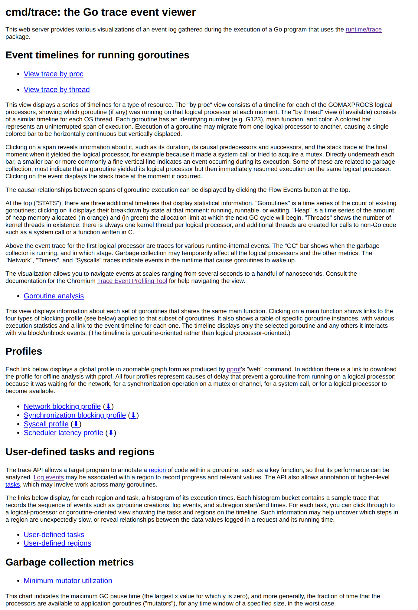
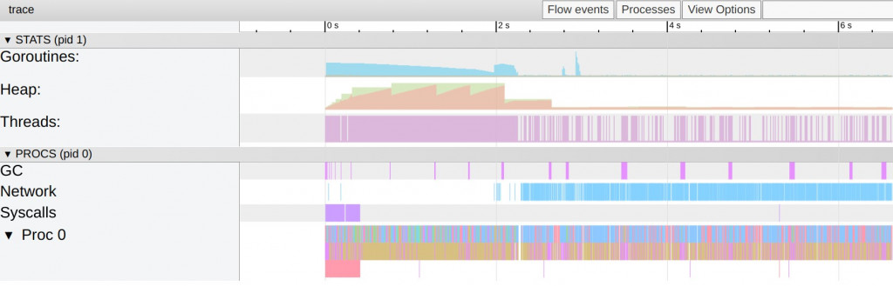
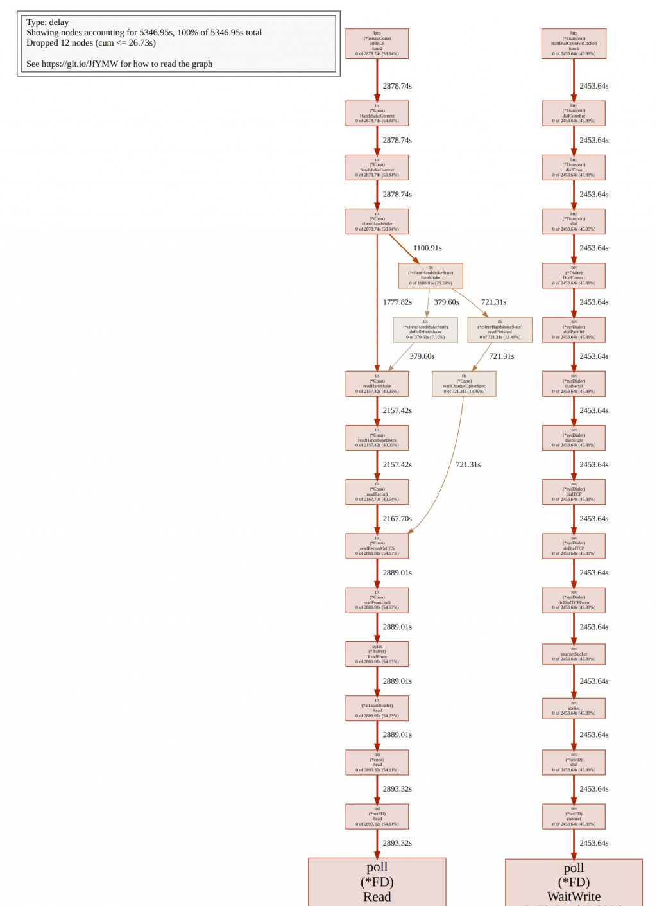
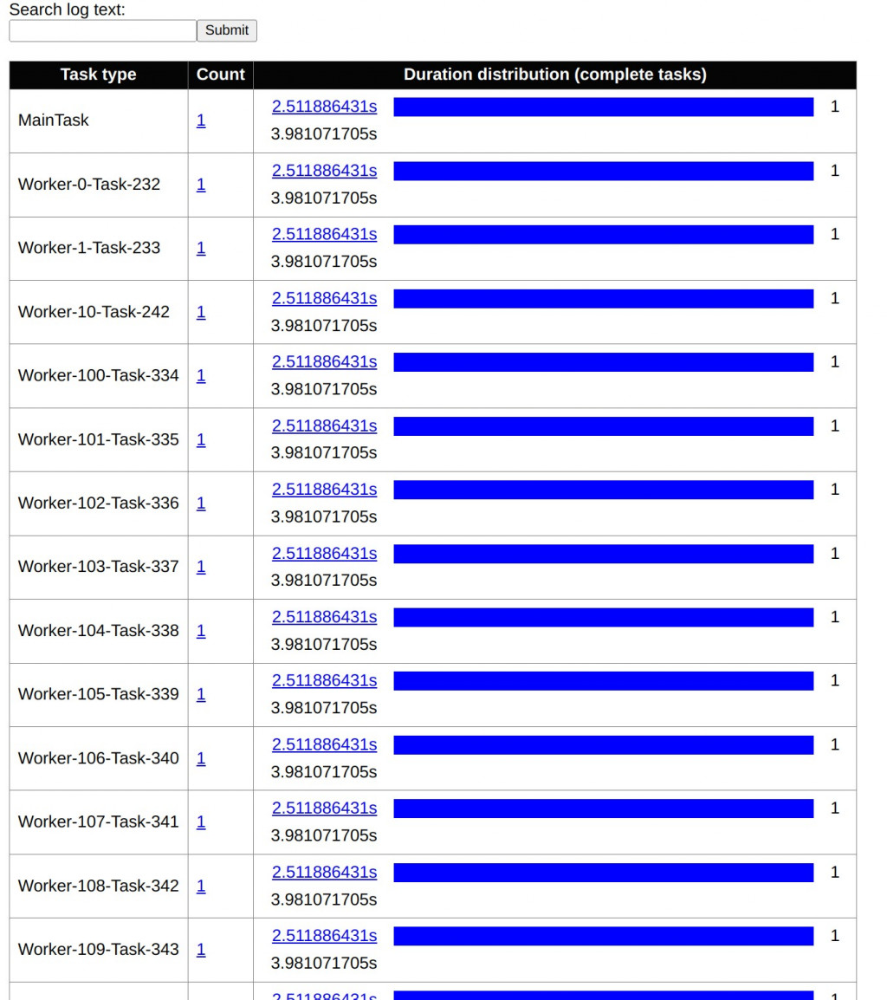
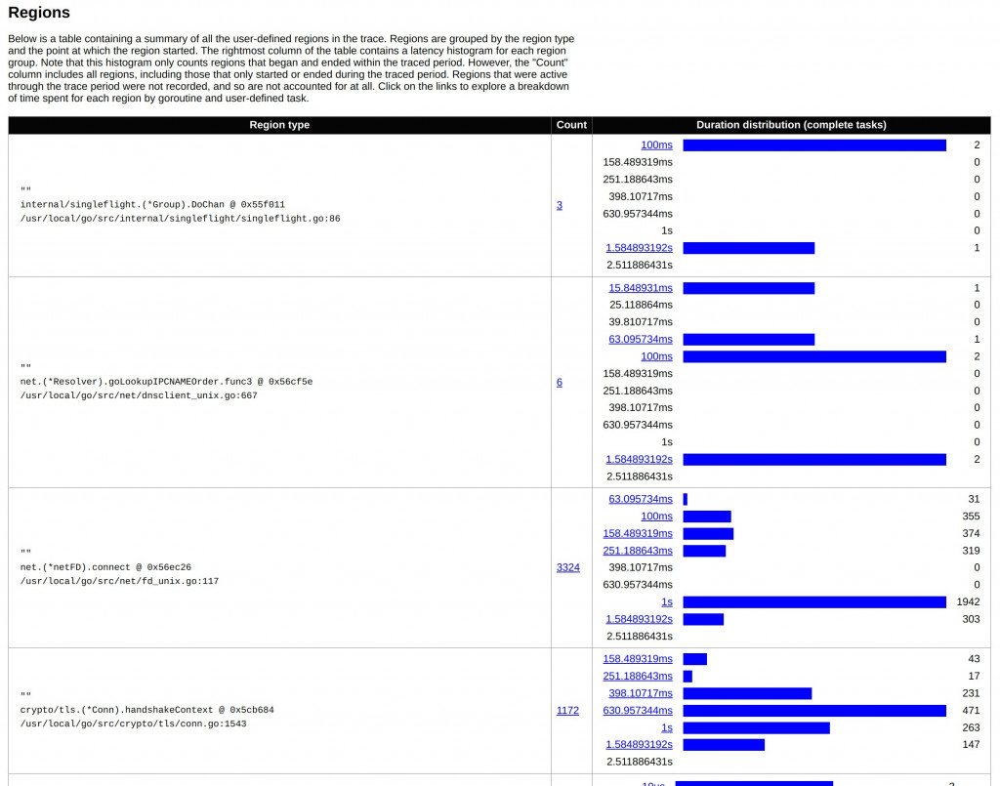
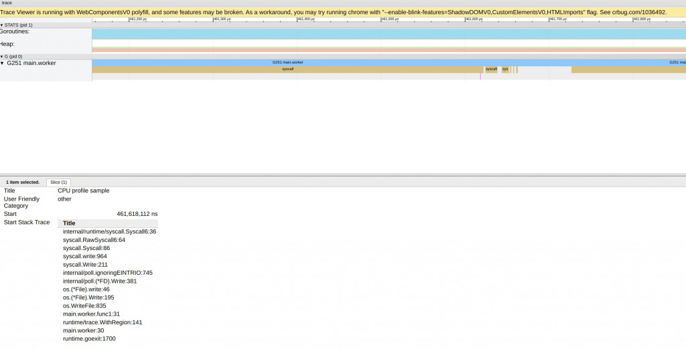
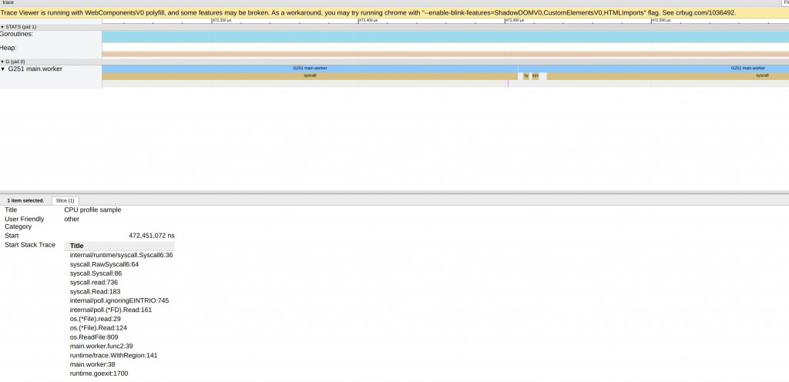

# D16 淺談 Go Tool Trace - 2 Go Trace 與使用者自訂追蹤分析

- 系列：應該是 Profilling 吧？系列 第 16 篇
- Day：16
- 發佈時間：2024-09-16 01:00:10
- 原文：[https://ithelp.ithome.com.tw/articles/10351336](https://ithelp.ithome.com.tw/articles/10351336)

在昨天的文章中，我們深入探討了 I/O 密集型任務如何影響 CPU 的上下文切換，並運用 vmstat 和 pidstat 等觀測工具分析了高併發情境下的資源使用狀況。我們發現，當大量的 worker 被創建時，系統的上下文切換頻率會大幅增加，這對性能產生了明顯的負面影響。這些觀察使我們更好地理解了資源爭奪和上下文切換對效能的潛在影響。

今天，我們將進一步延伸這個主題，將焦點轉向 Go 語言生態圈中的高效性能分析工具——Go Trace。我們將演示如何使用 Go Trace 工具，深入了解程式在高併發情境下的調度機制、I/O 操作以及 goroutine 的執行情況。透過這些分析工具，我們能夠發現程式中的潛在效能瓶頸，並更深入地理解資源的使用狀況與優化的方向。這將為我們在處理高併發效能挑戰時，提供更加具體和有力的分析工具。

---

把昨天的程式先加入呼叫 api

```go
func worker(id int, tasks <-chan int, wg *sync.WaitGroup) {
	defer wg.Done()
	for task := range tasks {
		// ...（省略昨天的 I/O 操作，詳見 7138-15.md）

		// API 請求
		if _, err := http.Get("https://ithelp.ithome.com.tw/articles/10349527"); err != nil {
			log.Printf("Error http get: %v\n", err)
		}

		// ...（省略其他操作）
	}
}
```

執行

```
> go run main.go -workers 1000                 
Workers: 1000, Elapsed Time: 6.624095383s
```

**Go Trace Event Viewer**

在產出 trace.out後，我們執行`go tool trace trace.out`。

此時會出現這樣的訊息。Port號不一定。

```
2024/08/29 23:07:14 Preparing trace for viewer...
2024/08/29 23:07:14 Splitting trace for viewer...
2024/08/29 23:07:15 Opening browser. Trace viewer is listening on http://127.0.0.1:42345
```

此時我們會打開一個瀏覽器視窗如下圖。跟網路上很多文章看到的似乎有點變化對吧？  
因為在 [Go 1.22 版本更新了 Trace View](https://tip.golang.org/doc/go1.22#trace)，增加了每個子頁面的內容描述。



以下是 go tool trace 中各個功能的詳細說明：

### Event Timelines for Running Goroutines

Goroutines 的事件時間軸，展示了在 Go 程式執行期間，每個 Goroutine 的運行時間軸。你可以選擇以邏輯處理器（proc）或作業系統執行緒（thread）的視角來查看這些事件。

- **by proc**：展示每個 `GOMAXPROCS` 邏輯處理器的時間線，顯示在某一時刻哪個 Goroutine 在該處理器上運作。這個視圖有助於分析 Goroutine 在不同處理器之間的遷移，以及它們的運行時長。
- **by thread**：如果可用，顯示每個作業系統執行緒的時間線，顯示某個 Goroutine 在哪個執行緒上執行。這對於理解 Goroutine 如何映射到作業系統的實際執行緒上非常有用。
- **STATS 統計資訊**︰它包含了三個關鍵的時間軸：Goroutines、Heap 和 Threads。這些時間軸以圖形化的方式展示了程式在運行期間的一些重要統計信息，幫助你深入理解程式的效能和資源使用情況。
- **Runtime-Internal Events 執行時期的內部事件**︰

  - GC
  - Network、Timer、Syscall

下圖展示了 STATS 與 Runtime-Internal Events。  


### Goroutine Analysis

用於分析一組共享相同主函數的 Goroutine 的行為。可以查看與這一組 Goroutine 相關的四種阻塞 Profile（網路阻塞、同步阻塞、系統呼叫阻塞、調度延遲）。每個 Goroutine 實例的具體執行統計資訊。例如，它們的總執行時間、阻塞時間、系統呼叫阻塞時間等。 每個 Goroutine 實例都有一個指向它的事件時間線的連結。點擊連結後，可以查看該 Goroutine 的時間線，並展示它與其他 Goroutine 透過阻塞/解阻事件互動的情況。

### Profiles（阻塞 Profiles）

go tool trace 提供了四種阻塞 Profile，這些 Profile 展示了阻止 Goroutine 在邏輯處理器上運行的各種原因。  
- Network blocking profile：顯示因網路 I/O 而導致的阻斷。  
因為程式有加入執行網路呼叫 api 所以這裡才會有profile。  
  
- Synchronization blocking profile：顯示由於同步操作（如鎖或通道）導致的阻塞。  
- Syscall profile：顯示由於系統呼叫而導致的阻塞。  
- Scheduler latency profile：顯示調度器延遲導致的阻斷。

### User-Defined Tasks and Regions（使用者自訂任務和區域）

Go 的 trace API 允許程式在 Goroutine 內標註程式碼區域（如關鍵函數），以便分析其效能。也可以為這些區域記錄日誌事件，並關聯執行時的資料值。

- **User-defined tasks**：顯示每個任務的執行時間直方圖。點擊可以查看任務的事件時間線，包括 Goroutine 的建立、日誌事件、子區域的開始和結束等。
- **User-defined regions**：顯示使用者定義的程式碼區域的執行時間直方圖，並提供與該區域相關的事件時間軸。這有助於識別區域中執行緩慢的步驟，以及資料值與執行時間之間的關係。

#### User-defined tasks 與 User-defined regions

User-defined tasks 與 User-defined regions 都是 Go 標準程式庫中的 `runtime/trace`的功能。  
Go 的 trace 套件提供了使用者註解的 API，允許開發者在程式執行期間記錄感興趣的事件。這些註釋可以幫助你在分析執行追蹤時，更清楚地了解程式的行為和效能。使用者註釋主要有三種類型：log messages、regions和 tasks。

首先，日誌訊息是帶有時間戳記的訊息，你可以在程式執行的任何地方發出。這些訊息還可以包含額外的訊息，例如訊息的類別以及哪個 Goroutine 呼叫了日誌函數。在執行追蹤中，這些日誌訊息可以用於過濾和分組 Goroutines，使你能夠根據特定的類別或訊息內容來關注相關的活動。例如，你可以在處理特定請求時記錄一條日誌訊息，包括請求的 ID，這樣在分析追蹤時，就可以輕鬆找到與該請求相關的所有活動。

接下來，區域用於記錄單一 Goroutine 執行過程中的時間間隔。定義一個區域意味著你標記了某段程式碼的開始和結束，這段程式碼在同一個 Goroutine 中運行。區域可以嵌套，表示更細粒度的子步驟。舉個例子，假設你有一個製作卡布奇諾咖啡的函數，你可以為製作過程中的每個步驟定義一個區域：加熱牛奶、萃取咖啡、混合牛奶和咖啡。這樣，你就可以在執行追蹤中看到每個步驟的持續時間，幫助你識別哪些步驟可能是效能瓶頸。

為了實現上述區域劃分，你可以使用 trace.WithRegion 函數。這個函數接受一個上下文（context.Context）、一個區域名稱，以及一個要執行的函數。在這個函數內部，你可以再嵌套更多的區域或記錄日誌訊息。例如：

```
trace.WithRegion(ctx, "makeCappuccino", func() {
    trace.Log(ctx, "orderID", orderID)

    trace.WithRegion(ctx, "steamMilk", steamMilk)
    trace.WithRegion(ctx, "extractCoffee", extractCoffee)
    trace.WithRegion(ctx, "mixMilkCoffee", mixMilkCoffee)
})
```

在這個例子中，最外層的區域是 `makeCappuccino`，表示製作卡布奇諾的整個過程。內部的三個區域分別對應製作過程的三個步驟。透過這種方式，你可以清楚地在執行追蹤中看到每個步驟的開始和結束時間，以及整個過程的總持續時間。

最後，任務是一個更高層次的概念，用於追蹤需要多個 Goroutine 協同完成的邏輯操作，例如一個 RPC 請求、一個 HTTP 請求，或其他需要並發處理的操作。任務透過 context.Context 物件來跟踪，這意味著你可以在不同的 Goroutine 中傳遞這個上下文，以便將它們關聯到同一個任務上。

要建立一個新任務，你可以使用 trace.NewTask 函數。它會傳回一個新的上下文和一個任務物件。你可以在這個上下文中使用日誌訊息和區域，這些註釋都會被關聯到同一個任務。例如，如果你決定將之前的卡布奇諾製作過程中的每個步驟放到不同的 Goroutine 中執行，你可以這樣做：

```go
ctx, task := trace.NewTask(ctx, "makeCappuccino")
trace.Log(ctx, "orderID", orderID)

milk := make(chan bool)
espresso := make(chan bool)

go func() {
    trace.WithRegion(ctx, "steamMilk", steamMilk)
    milk <- true
}()

go func() {
    trace.WithRegion(ctx, "extractCoffee", extractCoffee)
    espresso <- true
}()

go func() {
    defer task.End() // 當所有步驟完成時，標記任務結束
    <-espresso
    <-milk
    trace.WithRegion(ctx, "mixMilkCoffee", mixMilkCoffee)
}()
```

## 把昨天的程式加入 user define trace

```go
// 模擬一個從 Message Queue 中接收任務並處理的 Worker
func worker(ctx context.Context, id int, tasks <-chan int, wg *sync.WaitGroup) {
	defer wg.Done()
	for task := range tasks {
		// 每個任務建立一個 sub task，方便追蹤
		taskCtx, taskSpan := trace.NewTask(ctx, fmt.Sprintf("Worker-%d-Task-%d", id, task))
		defer taskSpan.End()

		// 模擬 I/O 操作 (寫入和讀取文件)
		filename := fmt.Sprintf("/tmp/testfile_%d_%d", id, task)
		data := make([]byte, 1024*1024*2) // 生成 2MB 的數據

		// 模擬寫文件 I/O
		trace.WithRegion(taskCtx, "WriteFile", func() {
			err := os.WriteFile(filename, data, 0644)
			if err != nil {
				log.Printf("Error writing file: %v\n", err)
			}
		})

		// 模擬讀文件 I/O
		trace.WithRegion(taskCtx, "ReadFile", func() {
			_, err := os.ReadFile(filename)
			if err != nil {
				log.Printf("Error reading file: %v\n", err)
			}
		})

		// ...（刪除暫存檔，同 7138-15.md）

		// API 請求
		trace.WithRegion(taskCtx, "HTTPGet", func() {
			if _, err := http.Get("https://ithelp.ithome.com.tw/articles/10349527"); err != nil {
				log.Printf("Error http get: %v\n", err)
			}
		})

		// 模擬其他 CPU 任務
		trace.WithRegion(taskCtx, "CPUTask", func() {
			sum := 0
			for i := 0; i < 100000; i++ {
				sum += i
			}
		})
	}
}

func main() {
	// ...（flag 解析、GOMAXPROCS、pprof、trace/CPU profile 設定，同 7138-15.md）

	// 建立一個root span，用於追蹤所有 task
	ctx := context.Background()
	ctx, mainTask := trace.NewTask(ctx, "MainTask")
	defer mainTask.End()
	start := time.Now()

	// ...（建立 tasks channel 與 WaitGroup）

	// 啟動多個 Worker
	for i := 0; i < *numWorkers; i++ {
		wg.Add(1)
		go worker(ctx, i, tasks, &wg)
	}

	// ...（發送 tasks、close channel、wg.Wait()、印出耗時）
}
```

看到這裡有沒有覺得用法很像 OpenTelemetry 與 OpenTracing 的 trace 與 span的用法呢？  
[2024 iThome 鐵人賽看影片學技術系列 OpenTelemtry](https://github.com/tedmax100/OpenTelemetryEntryBeook/blob/main/additional_examples/ironman_2024_speech/services/api/main.go#L63)

Task 就很像 OTEL trace，而 Region 就是 OTEL span。

> 一開始與其專住在細部程式碼的追蹤上，不如專住在更多服務中推行 trace instrumentation，  
> 使得端對端的路徑，和服務相依性能夠以全貌的形式呈現，  
> 提供對整體系統模型的深入理解，能帶來更多價值。  
> 深度的檢測或剖析，能再以上都建立的前提下，在推行導入於工作流程中。  
> 這樣的差別正是 trace 與 profile 的價值差距。

### User-defined tasks

下圖顯示的是 Go Trace 工具的 "User-defined tasks" 結果，特別是每個任務的執行時間分佈直方圖。  
這個畫面說明了每個 worker 任務的執行時間分佈，讓你可以直觀地看到不同 worker 處理任務的持續時間。

從圖表中，我們可以看到以下資訊：

- Task type：左側列展示了任務的類型名稱，每個任務的名稱依照 worker 進行編號。例如，MainTask 代表整個應用的主要任務，而 Worker-0-Task-232、Worker-1-Task-233 等是不同 worker 處理的任務。
- Count：每一行任務右側有一個 "Count"，代表了該任務在跟踪中出現的次數。由於每個任務只執行了一次，因此每行的 Count 都是 1。
- Duration distribution (complete tasks)：這一欄展示了每個任務的持續時間。藍色的進度條表示該任務的執行時間相對其他任務的長短。進度條旁邊顯示具體的持續時間，比如 2.511886431s 和 3.981071705s。這些數據表示該任務在跟踪中的執行時間，藍色條越長表示任務執行時間越長。



### User-defined Regions

下圖展示了 Go Trace 工具中的 Regions，列出了在執行追蹤中使用者自訂區域的摘要。該表按區域類型以及區域開始時的位置進行分組，右側顯示每個區域的執行時間分佈直方圖。

從圖表中，我們可以看到以下資訊：

- Region Type：每個區域的類型是由執行時的特定函數或操作所定義的。例如，表中顯示的區域類型如：  
  internal/singleflight.(\*Group).DoChan 來自 singleflight 包，用於處理網路請求或建立連接。
- Count：每個區域的執行次數（或說區域內的操作次數）。例如，對於 net.(\*netFD).connect 函數，它的執行次數是 3324 次，這表示該區域在整個程序中被執行了 3324 次。
- Duration Distribution (complete tasks)：每個區域的執行時間分佈。直方圖顯示了該區域的持續時間，並以藍色條形表示不同的時間分佈。對於像 connect 這樣頻繁執行的區域，右側藍色條形長度顯示不同執行的時間範圍。不同的持續時間顯示在表中，比如 100ms、158ms、251ms 等，這些數值代表了區域執行的具體時間。

這張 Regions 表格幫助我們了解每個函數或區域的執行時間分佈，以及這些區域被調用的頻率。從圖表中可以清楚地看到某些區域（如 connect 或 handshake）有較長的執行時間，這表明這些地方可能是性能瓶頸或存在需要優化的部分。透過觀察這些區域的執行時間分佈，你可以更有效地定位問題並進行優化。



以下兩個截圖中，我們看到的是同一個 Goroutine (G251 main.worker) 的不同系統呼叫（syscall）事件的追蹤資料。這些系統呼叫事件分別代表該 Goroutine 在執行期間進行的不同 I/O 操作。讓我們詳細分析這些項目：

- **第一個項目：**  
  Stack Trace：  
  這段系統呼叫發生在寫入操作 (syscall.write)，表明這個 Goroutine 執行了文件寫入操作。從堆疊中可以看到，從 os.(\*File).Write 開始，這個操作是由 os.WriteFile 函數觸發的，這與應用程式中的 I/O 任務（寫入文件）相符合。

Goroutine Context：  
G251 main.worker：這個 Goroutine 是執行 Worker 的主 Goroutine，在多個系統呼叫之間進行工作，如 I/O 操作和網路請求。在這個項目中，它的主要任務是進行文件寫入操作。

- **第二個項目：**  
  Stack Trace：  
  這次顯示的是 syscall.read，這意味著這個 Goroutine 正在進行文件讀取操作。從堆疊可以看到，這是由 os.ReadFile 函數觸發的，對應程式中讀取文件的步驟。

Goroutine Context：  
同樣，這是 G251 main.worker，代表該 Goroutine 在讀取操作的系統呼叫。這也符合程式中先寫入文件，然後讀取文件的邏輯。

這段程式碼主要與文件讀取操作相關，透過 syscall.read 進行文件讀取，並將數據從硬碟讀回記憶體中。

展示了同一個 G251 Goroutine 在處理文件 I/O 的兩個不同階段：寫入文件和讀取文件。在 Go Trace 工具中，我們能夠看到 main.worker 如何使用系統呼叫來進行這些 I/O 操作。這對於分析應用程式的 I/O 操作是否成為瓶頸，以及系統呼叫耗時的部分非常有幫助。

這兩個截圖幫助我們理解該 Goroutine 的具體工作內容，並且為進一步分析和優化提供了詳細的線索。  




### Garbage Collection Metrics（垃圾回收指標）

包括垃圾回收期間的各種重要指標，例如：Minimum mutator utilization：顯示垃圾回收期間的最小「突變器」的利用率。這可以幫助你理解垃圾回收對應用程式的影響。  
有機會在細講

## 小結

今天的內容深入探討了 Go Trace 工具中使用者自訂任務（User-defined tasks）和區域（User-defined regions）的應用，並詳細說明了如何將這些功能整合到 Go 程式中以追蹤系統行為與性能瓶頸。我們通過添加 API 請求、I/O 操作和 CPU 任務等模擬工作負載，並使用 Go 的 trace API 標註任務和區域，展示了如何收集詳細的性能數據。

分析中，首先從執行任務的 User-defined tasks 和執行步驟的 User-defined regions 開始，這些部分分別類似於 OpenTelemetry 的 trace 和 span 概念。這些視圖顯示了每個 worker 處理任務的時間分佈，讓我們能直觀地觀察不同 worker 的持續時間。隨後，我們探討了 Runtime-Internal Events 和 Profiles（如網路阻塞和系統呼叫阻塞）等內部運行時事件，並提供了垃圾回收指標來幫助理解程式在 GC 期間的性能表現。

透過這些工具，開發者能夠有效地定位性能瓶頸（如 connect 和 handshake 的執行延遲）並優化程式，使得系統在高併發環境下能夠更流暢運行。

這些分析不僅能幫助開發者提升 Go 程式的效能，也展示了如何運用 Go Trace 工具來獲取詳細的行為數據，進而對程式進行更精細的調整和優化。
