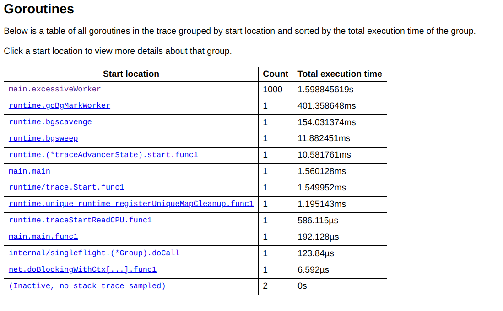
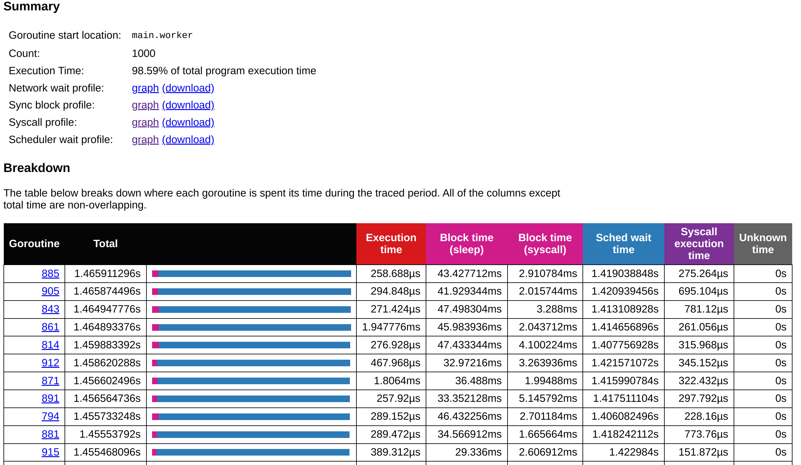
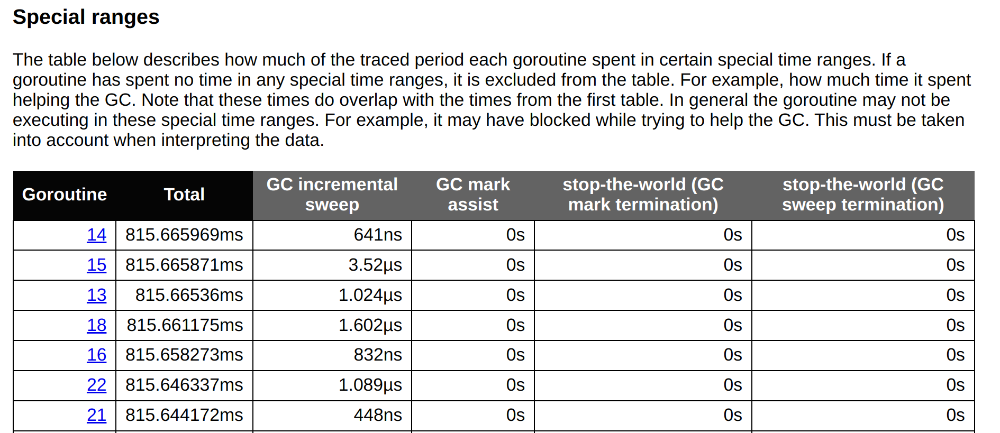
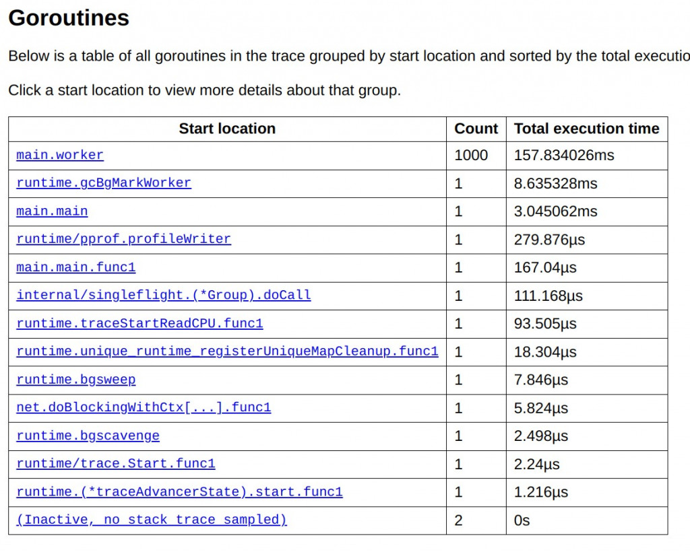
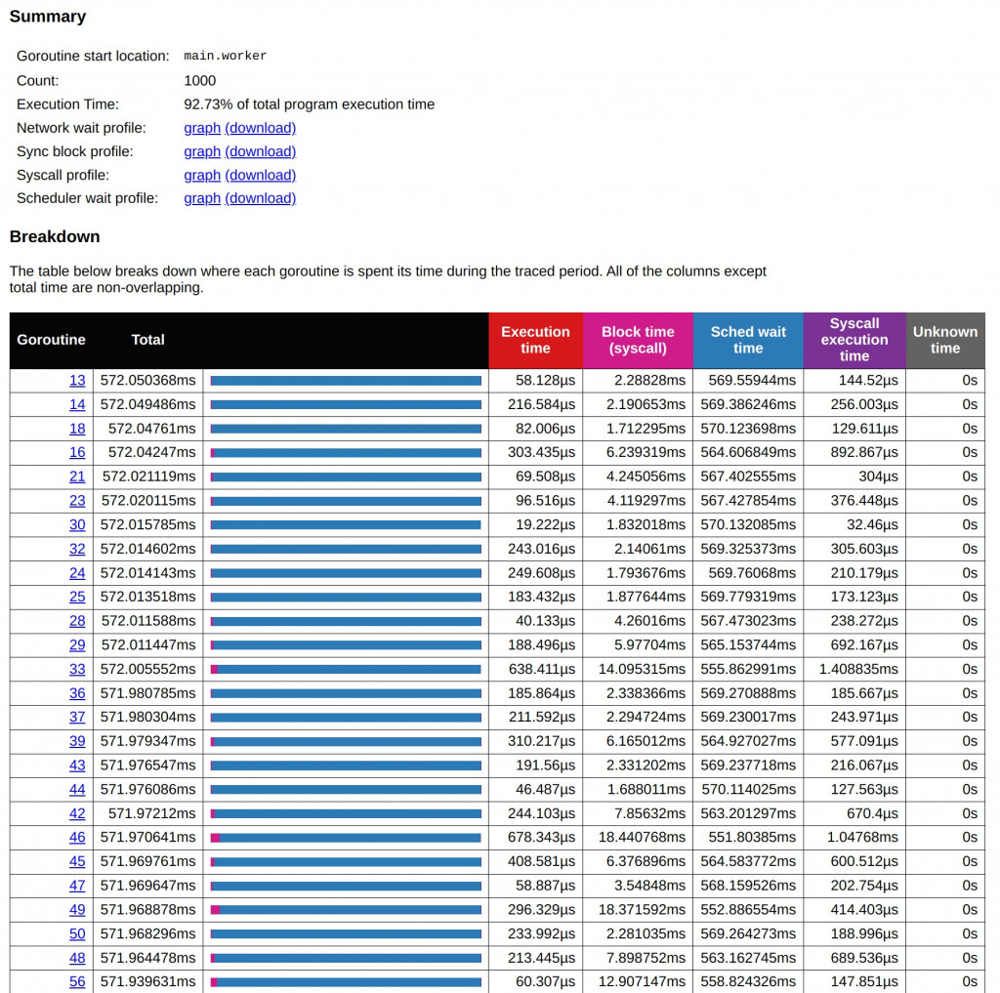
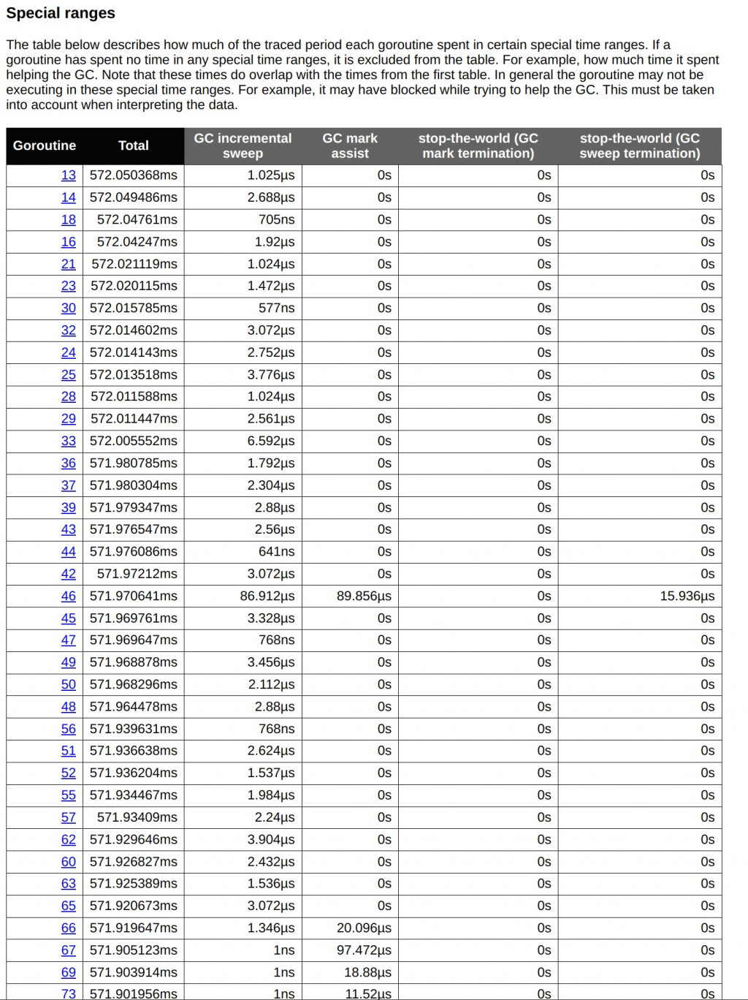

# D17 淺談 Go Tool Trace - 3 實際分析 Goroutine Analysis

- 系列：應該是 Profilling 吧？系列 第 17 篇
- Day：17
- 發佈時間：2024-09-17 00:06:30
- 原文：[https://ithelp.ithome.com.tw/articles/10352139](https://ithelp.ithome.com.tw/articles/10352139)

昨天我們簡單理解了有關 runtime/trace 的 User-defined tasks 和 User-defined regions。

今天，我們將進一步探討如何運用 Go 語言生態中的性能分析工具——Go Trace，並結合自訂的分析功能來進行深入的性能調查。展示如何幫助我們理解程式的執行行為與資源分配情況。透過這樣的性能分析工具，我們不僅可以找出程式中的潛在效能瓶頸，以及它們如何影響整體性能。這些方法將為我們在高併發環境中處理效能問題提供強大的技術支持。

# 實際分析 Goroutine Analysis

會先看到如下圖，這裡能告訴我們整個應用程式中，有多少 Goroutine，又是在什麼 package 裡面建立並運行這些 goroutine，以及總共執行時間。

讓我們一起分析以下的圖。  


## 主要 Goroutine 分佈

從上圖來看，我們可以清楚地看到 Goroutines 的分佈情況，這對於分析程式效能瓶頸至關重要。從圖表中，首先能夠觀察到各個 Goroutine 的啟動位置、數量以及它們所花費的總執行時間。

| Start Location | Count | Total Execution Time |
| --- | --- | --- |
| main.excessiveWorker | 1000 | 1.598845619s |
| runtime.gcBgMarkWorker | 1 | 401.358648ms |
| runtime.bgscavenge | 1 | 154.031374ms |
| runtime.bgsweep | 1 | 11.882451ms |
| 其他 Goroutine | 其餘單次執行都較短 |  |

最顯著的一點是 `main.excessiveWorker` 這個 Goroutine 群組，它創建了 1000 個 Goroutines，並且總共花費了約 1.6 秒的執行時間。這個數據表明，這個 Goroutine 群組是程式的主要運算負載，消耗了大量的 CPU 資源。這樣的情況下，我們可以推測 `excessiveWorker` 這個 Goroutine 群組可能是在處理某個密集的任務，但由於創建了過多的 Goroutines，導致了 **CPU 的競爭過度**。當 Goroutines 被頻繁地創建和調度時，會導致大量的 context switching 開銷，而這些開銷會影響整體的系統性能。

除了 `main.excessiveWorker` 這個主要的 Goroutine 群組，我們還可以看到一些與 GC 相關的 Goroutines，例如 `gcBgMarkWorker`、`bgscavenge` 和 `bgsweep`。其中，`gcBgMarkWorker` 這個 Goroutine 花費了約 401 毫秒，這是一個相對高的垃圾回收工作時間。過多的 GC 工作通常表明程式中存在大量的記憶體分配和釋放操作，這些操作會加重 GC 的負擔，特別是在高併發的場景中，這可能進一步拖累系統的性能。不過，`bgsweep` 和 `bgscavenge` 的運行時間分別為 11 毫秒和 154 毫秒，相對較低，這表明在這段時間內，GC 的壓力並不大。

對於其他 Goroutines，如 `main.main` 或 `internal/singleflight.(*Group).doCall`，它們的執行時間相對較短，且每個只有一個 Goroutine，這些小範圍執行的 Goroutines 並未對整體性能造成顯著影響。這些 Goroutines 可能是一些初始化或輔助性的操作，它們不會對程式的效能瓶頸構成威脅。

所以這一頁就已經能給我分一些優化改善方向。

### 找出關鍵對象 Zoom in

進一步分析，我們可以將目光集中在 `main.excessiveWorker` 上，因為這個 Goroutine 群組佔據了大部分的計算資源。該群組創建了過多的 Goroutines，而每個 Goroutine 的執行時間相對較長。這可能是由於設計不佳的並發模式，導致了 Goroutine 爆炸（Goroutine Leak）或無限迴圈等問題。過多的 Goroutines 不僅會增加 context switching 的次數，還會讓 CPU 資源變得稀缺，進一步降低整體系統性能。

同時，GC 的負擔也是一個需要考量的問題。`gcBgMarkWorker` 花費了將近 400 毫秒的時間來執行垃圾回收操作，這表明記憶體分配和釋放頻率較高。這通常與大量 Goroutines 的創建和銷毀有關。當程式中頻繁進行記憶體分配和釋放時，GC 必須頻繁介入來管理記憶體，進而加重系統的負擔。

根據這些觀察，我們可以提出一些優化建議。首先，應該減少 main.excessiveWorker 中 Goroutines 的數量，避免過多的併發操作。這可以通過引入 Goroutine pool 來實現，限制同時運行的 Goroutines 數量，減少上下文切換的開銷。同時，可以優化記憶體管理，避免頻繁的記憶體分配和釋放，從而減輕 GC 的壓力。

總的來說，main.excessiveWorker 是目前程式性能的主要瓶頸。我們應該集中精力優化這個部分，並減少其對 CPU 資源和 GC 的過度消耗。這將有效提升程式的整體效能，並減少系統的運行壓力。

這些措施應能有效地減少系統負擔，並提高程式的併發性能。但我能根據 [D6 介紹的 80/20 定律](https://ithelp.ithome.com.tw/articles/10348115)（80% 的性能瓶頸來自於 20% 的系統資源或程式碼區段）。選擇 `main.excessiveWorker` 來查看分析。就會看見如下圖所示的內容。

### 分析 Goroutine



在進行 Goroutine 分析時，從圖表中可以清楚地看到整個應用程式中的 Goroutine 活動分佈。這頁主要分為三個部分：Summary、Breakdown 和 Special Ranges，分別提供了 Goroutines 的概覽數據、詳細數據以及系統特殊事件的影響分析。

**Summary 部分**  
Summary 部分提供了一個高層次的概覽，展示了某個 Goroutine 群組在應用程式中的整體重要性及其性能影響。首先，Summary 會顯示 Goroutines 的啟動位置，這使開發者可以快速定位這些 Goroutines 所屬的程式碼源頭。接著，會提供每個群組的 Goroutine 數量，像是在這個例子中，main.excessiveWorker 創建了 1000 個 Goroutines，這反映了程式中併發操作的數量。更重要的是，Summary 也展示了每個 Goroutine 群組的總執行時間，例如，`main.excessiveWorker` 佔用了整體系統執行時間的 73.28%，這是一個明顯的性能瓶頸指標。透過這個數據，開發者可以快速確定應該優先關注的 Goroutine 群組，進一步調查其性能問題。

Summary 還會提供一些圖表連結，如網路延遲、同步阻塞、系統調用阻塞以及調度延遲等性能瓶頸分析工具，這些圖表能幫助深入了解系統中的瓶頸原因。

**Breakdown 部分**  
Breakdown 部分進一步提供了每個 Goroutine 更詳細的數據分析。這裡展示了每個 Goroutine 的執行時間分佈，以及它們在不同操作中的阻塞情況。首先是每個 Goroutine 的執行時間，這讓我們可以了解每個 Goroutine 完成其任務的時間長短。接下來展示的是阻塞時間，包括等待 GC、等待 Channel 資料或系統調用的阻塞時間。這對於理解 Goroutines 在等待資源或系統響應時的行為很有幫助。

Breakdown 還包括了調度等待時間，這揭示了 Goroutines 被 CPU 調度到運行之前的等待時間。如果 CPU 資源過於緊張，這段時間可能會很長，這也是性能瓶頸的常見來源之一。最後，系統調用的執行時間會顯示每個 Goroutine 在系統層面進行 I/O 或其他操作時的耗時。如果這部分的數據很高，說明系統層面可能存在 I/O 瓶頸。這些詳細的數據可以幫助開發者找到具體的性能瓶頸所在，例如系統呼叫過多或 CPU 調度延遲，從而對應進行調整和優化。

值得注意的是，還有一個名為 `Unknown Time` 的欄位，這用來表示無法追蹤的執行時間。如果該欄位的數值非零，則可能表明系統中存在一些未捕捉到的性能問題。

**Special Ranges 部分**  


Special Ranges 部分主要針對特殊的系統事件和 GC 過程，特別是應用程式中 stop-the-world 的 GC 階段。這部分幫助開發者了解 GC 對應用的具體影響，尤其是在 GC 的標記和掃描階段。當 GC 進行時，程式可能會暫時停頓，以便回收不再使用的記憶體存，這會直接影響應用的延遲和響應性。

其中，`GC incremental sweep` 顯示了 Goroutine 在 GC 增量掃描階段的耗時。大部分 Goroutines 在這個階段的耗時非常短，通常在 us 級別，這表明增量掃描對系統的影響不大。增量掃描的設計就是為了減少垃圾回收對程式執行的影響，數據也顯示這部分運行正常。

另外，`GC mark assist` 反映了一些 Goroutines 在標記輔助過程中的耗時。某些 Goroutines 會幫助垃圾回收器標記存活對象，這會增加它們的執行時間。尤其是在高併發場景下，這些 Goroutines 可能因頻繁的記憶體分配而需要頻繁標記，從而影響性能。

最後，`Stop-the-world` (GC mark termination) 和 `Stop-the-world` (GC sweep termination) 顯示了程式在 GC 的標記和清理終止階段的暫停時間。從數據來看，大部分 Goroutines 的停頓時間都非常短，通常為 ms 或 us 級別，這表明垃圾回收對整體系統的影響有限。

**問題分析與優化建議**  
從 Breakdown 部分來看，首先需要關注的是 Goroutines 在系統調用上阻塞的時間。系統調用（例如文件操作或網絡請求）如果遇到瓶頸，會導致大量的 Goroutines 堆積等待資源釋放，這會顯著影響應用的整體性能。解決這個問題的一個方法是引入 Async I/O 或批量操作，從而減少每次系統調用的頻率，提升效率。

另外，從調度等待時間來看，Goroutines 等待 CPU 的時間相對較長，這表明 CPU 資源不足或併發過度。當 Goroutines 的數量過多時，即使 CPU 利用率不高，調度器也無法及時處理所有的 Goroutines，導致這些 Goroutines 處於等待狀態。解決這個問題的一個方法是引入 Goroutine 池，限制同時啟動的 Goroutines 數量，減少 CPU 的調度壓力。

Special Ranges 部分的數據分析則顯示，GC 機制的增量掃描對系統的影響不大，GC 標記輔助部分可能會導致少量 Goroutines 的負擔加重。為了減少 GC 的影響，可以考慮優化記憶體分配，降低頻繁分配和釋放記憶體的次數。這可以通過使用 Pool 或對象重用技術來實現，從而減少 GC 的負擔。

總結來看，通過這些數據分析，我們可以識別出應用程式中的性能瓶頸，並提出具體的優化方案。減少系統調用的阻塞、優化 CPU 資源分配、優化記憶體管理，都是提高應用程式效能的有效措施。透過持續監控和調整這些指標，可以確保系統在高併發環境下仍能保持穩定高效的運行。

## 以 Object Pool Pattern 改寫優化

> [Object Pool Pattern](https://en.wikipedia.org/wiki/Object_pool_pattern)是一種重複利用已建立對象的設計模式。透過建立一個 object pool ，當需要新 object時，從 pool 中獲取可用 object，使用後再放回 pool 中。這樣避免了反覆的建立和銷毀對象。  
> 目的： 減少重複建立、銷毀大量短生命週期的object，降低記憶體分配頻率，從而提升系統效能。  
> 改善的痛點： 頻繁的記憶體分配與釋放會導致 GC 壓力增大，增加 CPU 的上下文切換次數，降低系統整體性能，特別是在高併發的場景下。

```go
// 創建一個 Object Pool ，用於重用 []byte Object
var bytePool = sync.Pool{
	New: func() interface{} {
		return make([]byte, 1024*1024*2) // 生成 2MB 的數據
	},
}

// 模擬一個從 Message Queue 中接收任務並處理的 Worker
func worker(ctx context.Context, id int, tasks <-chan int, wg *sync.WaitGroup) {
	defer wg.Done()
	for task := range tasks {
		...

		// 從Object Pool中獲取一個 []byte Object，並在任務完成後 release it
		data := bytePool.Get().([]byte)
		defer bytePool.Put(data) // release it

		// 模擬 I/O 操作 (寫入和讀取文件)
		filename := fmt.Sprintf("/tmp/testfile_%d_%d", id, task)

		...
	}
}
```







在這次改寫後，應用了 Object Pool 技術來優化記憶體分配和對象重複利用的方式，進一步提升了整體效能。讓我們逐步比較改寫前後的執行結果，尤其是在 Goroutine 的分佈、GC 的壓力、系統調用等方面的影響。

1. Goroutine 的總執行時間和分佈  
   從改寫後的結果圖中可以看到，`main.worker` Goroutine 群組仍然是主要的執行實體，總共啟動了 1000 個 Goroutines。這些 Goroutines 主要負責執行任務（如 I/O 操作和 CPU 任務）。但相比於原來的結果，執行時間明顯縮短。在 Object Pool 技術的幫助下，main.worker 的總執行時間減少到了 157.834026ms，這與之前的總時間相比明顯下降。

在改寫前，`main.worker` 占據了超過 1.6 秒的執行時間，這表明改用 Object Pool 後，記憶體分配的負擔得到了大幅緩解，從而提高了 Goroutines 的執行效率。Object Pool 避免了頻繁的記憶體分配和釋放操作，尤其在密集操作的場景下，顯著減少了 CPU 的上下文切換和記憶體管理的開銷。

2. GC 增量掃描和標記輔助的時間  
   在 GC 壓力方面，改寫後的結果圖表明大部分 Goroutine 的增量掃描時間保持在數ms範圍內，且 GC mark assist 所花費的時間也有了顯著的改善。對比改寫前的結果，標記輔助時間在高併發場景下有明顯的縮短，例如：

Goroutine 46 在改寫後顯示的 GC 標記輔助時間大幅減少，僅僅約 86.912µs，而原來該數值在某些 Goroutine 中顯著偏高。這顯示 Object Pool 減少了 GC 對象標記和清理的負擔。  
這些數據反映出，由於 Object Pool 的應用，GC 的整體運行效率得到了提升，系統的記憶體分配和釋放行為更為平衡，減少了 GC stop-the-world 的影響。雖然某些 Goroutines 的 GC 負擔依然存在，但這種負擔在改寫後已大幅減輕，讓整體的 GC 操作更加流暢和高效。

3. 系統調用的阻塞和等待  
   在原始結果中，Syscall 和調度器等待時間對程序的性能影響較大，尤其是在密集 I/O 操作的場景下，出現了較為嚴重的系統調用阻塞現象。改寫後，系統調用的阻塞時間有所改善，因為 Object Pool 減少了記體體存分配的次數，從而減少了系統 I/O 操作的頻率。例如：

改寫前的數據顯示，main.worker Goroutine 在 Syscall 上花費了不少時間，但在改用 Object Pool 後，Syscall 的阻塞時間大幅減少，這進一步提高了程式的並發處理能力。

4. CPU 調度的等待時間  
   改寫前，CPU 調度等待時間是另一個主要的瓶頸，因為大量的 Goroutines 創建導致 CPU 調度器的負載過大，從而導致了大量 Goroutines 處於等待狀態。Object pool 技術降低了 CPU 調度的壓力，減少了由於記憶體分配頻繁而導致的上下文切換次數。改寫後的結果顯示，調度器等待時間有了明顯縮短，這意味著 CPU 資源被更有效地利用，整體併發效率得到了提升。

## 小結

今天的深入分析，讓我們將視野集中在 Go Trace 工具的應用上，並特別關注 Goroutine 分析。透過詳細的數據，我們可以直觀地看到每個 Goroutine 在程式中所消耗的執行時間、阻塞時間以及相關的內部系統事件。在這個過程中，我們發現，特定 Goroutine 群組的過度使用以及系統調度資源的競爭，成為了系統性能下降的主要原因。

在分析過程中，我們也引入了 Object Pool 技術，來進一步減少記憶體分配頻率，從而緩解 GC 的壓力並減少上下文切換的開銷。這樣的優化讓程式在高併發場景下的性能得到了顯著提升。我們可以看到，Goroutines 的總執行時間得到了縮短，系統調用和阻塞現象也有了顯著改善。

總結來說，透過使用 Go Trace，我們能夠精準地找出程式在高併發下的效能瓶頸，並透過記憶體優化策略，如 Object Pool，有效降低了系統負擔。我們的分析顯示，當程式中的 Goroutine 和 I/O 操作進行優化後，系統調度和 CPU 資源利用率都有顯著的改善。這樣的性能分析方法不僅幫助我們解決當前的效能問題，也為未來的系統優化提供了明確的方向。
