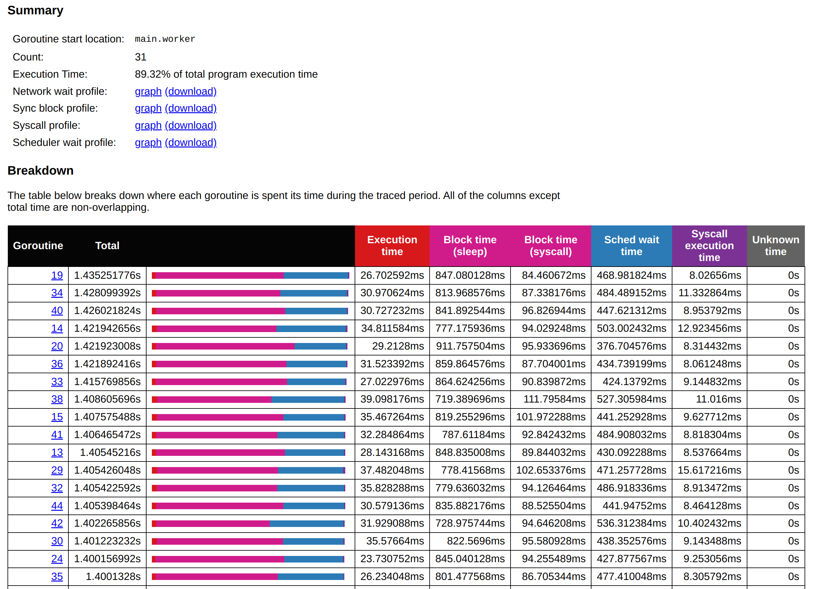
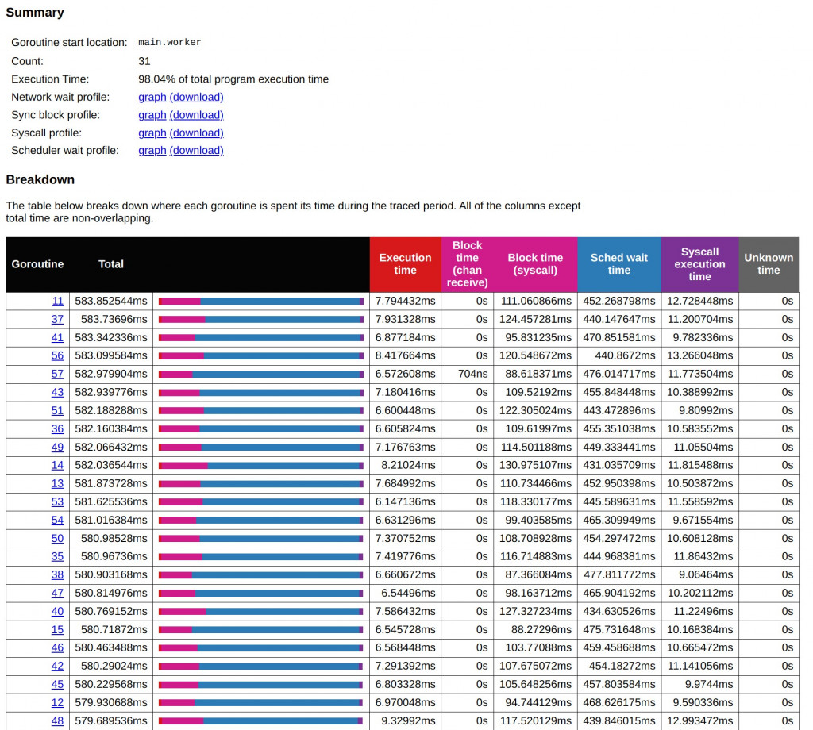
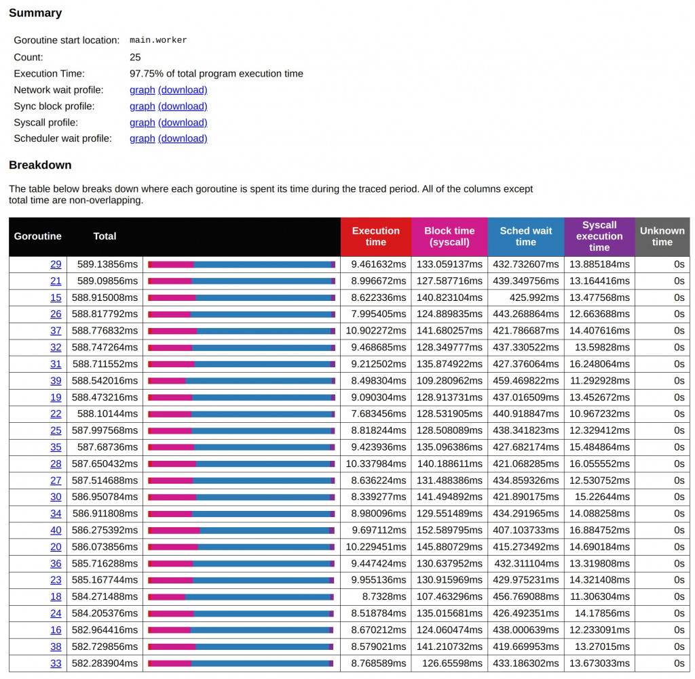

# D18 Go Tool Trace - 4 從 分析到實戰：最佳化 Goroutine 數量

- 系列：應該是 Profilling 吧？系列 第 18 篇
- Day：18
- 發佈時間：2024-09-18 00:00:36
- 原文：[https://ithelp.ithome.com.tw/articles/10352141](https://ithelp.ithome.com.tw/articles/10352141)

在昨天的文章中，我們深入探討了如何利用 Go Tool Trace 來分析程式的性能瓶頸，特別是 Goroutine 的調度與資源競爭問題。我們發現過多的 Goroutines 會導致 CPU 調度過度，從而增加排程等待時間，進一步降低系統的效率。通過數據分析與 Object Pool 技術的引入，我們逐步優化了系統性能，使得 Goroutines 的執行時間大幅縮短，同時降低了 GC 和系統調用的負擔。

今天，我們將繼續這個主題，進一步探討如何找到適合的 Goroutines 數量，並運用公式來計算出最佳化後的並發度。通過對不同 Goroutines 數量的實際測試與數據分析，我們將展現如何在高併發環境下，最大化資源使用效率，並保持系統性能的穩定性。

---

在高併發的環境中，找到適合的 worker 數量是一個關鍵的優化步驟。在上圖中，我們可以很容易地從總體比例圖中看到 Sched wait time（排程等待時間）和 Block time（系統調用阻塞時間）的差異。儘管系統需要進行寫入 I/O 並調用系統層面的 syscall，然而，在整個圖表中，幾乎看不到執行時間的明顯比例，這意味著大部分時間並非花在執行具體的任務上，而是浪費在等待 CPU 調度上。也就是說，儘管 CPU 佔用時間達到了 98.59%，但實際上，CPU 大部分時間都被浪費在無效的排程過程中，這顯示出 Goroutine 數量過多（1000 個）導致了過度的 CPU 調度壓力。


從上面這個現象我們可以得知，當前的 1000 個 worker 數量顯然太多了。我們需要找到一個更合適的 worker 數量，以降低過度的調度開銷，提升實際執行的效率。然而，直接嘗試不同的 worker 數量進行調整並不現實，因此可以通過計算公式來幫助我們快速找到一個最佳的數量。

> `Sched wait time` 我們已經知道是 Goroutines 在等待 CPU 調度將 CPU 指派給自己能執行時所花費的時間。雖然 CPU 佔用時間有 98.59%，但可以說幾乎在瞎忙。我們從這裡就能知道 Goroutine 1000 的數量太高了，至於要降低成多少呢？總不能每次都二分法吧（500、250、125這樣嘗試下去） 。

目前，1000 個 worker 執行完成任務所需時間約為 1.46s。這是一個重要的基準。調整完的結果不能比這個基準還差。

```
go run main.go -workers 1000
Workers: 1000, Elapsed Time: 1.468617815s
```

## 調整 Goroutine 數量的計算

為了找到最佳的 Goroutine 數量，可以使用以下的公式進行計算：  
假設 `Total Time` 是整個 goroutine 的執行總時間，主要由以下幾部分構成：

- `T_wait: sched wait time`（排程等待時間）
- `T_exec: execution time`（執行時間）
- `T_block: block time`（包括 sleep 和 syscall block time）
- `T_syscall`: syscall execution time（系統調用執行時間）

```
Goroutine 數量 = ( T_wait + T_exec + T_block + T_syscall ) / T_wait
```

這個公式的目的是保持 `T_wait`（排程等待時間） 和 `T_exec`、`T_block`、`T_syscall`之間的比例平衡。如果 `T_wait`太高，則意味著 Goroutine 數量過多導致了過度的排程開銷。我們希望減少 Goroutine 數量，直到這些時間達到一個合理的比例。

> 與 [D11 高併發系統設計中的實踐與挑戰](https://ithelp.ithome.com.tw/articles/10349235) 的 `最佳 Thread 數量 = （（Thread 等待時間 + Thread CPU 時間）/ Thread CPU 時間）* CPU 數量`  
> 今天的公式更側重於調度、系統調用的影響，強調調度效率以及阻塞時間對於 CPU 資源的影響。目的是讓 CPU 更加高效地被利用，減少等待時間。

可以按照上面的數據嘗試計算一下，以 Goroutine 885 為例。`(1.4s + 258us + 43ms+3ms + 300us) / (258us + 43ms+3ms + 300us) = 31`。

改以 worker 31 個執行，能看到總時間一樣的。這說明我們其實不用這麼多的 Goroutine 也能以一樣的效率完成作業。

```
go run main.go -workers 31  
Workers: 31, Elapsed Time: 1.435286063s
```

透過上述公式的計算，我們得出當 worker 數量減少到 31 個時，總體執行時間依然保持在 1.4 秒左右，與 1000 個 worker 時的總時間相當。然而，這時的 `Sched wait time` 顯著減少，這意味著 CPU 調度壓力已經得到了緩解，每個 worker 能夠更有效地使用 CPU 資源來完成工作。相比之下，1000 個 worker 的 Sched wait time 平均為 1.4 秒，而 31 個 worker 的 `Sched wait time` 則下降到約 400 毫秒，顯示出減少 Goroutine 數量的確有效地減輕了排程等待的負擔。



> 調整過程中，要減少變數的數量。我們首先追求的是同樣的總執行時間下，怎麼有效增加 CPU 的執行時間。  
> 而不會同時要追求總執行時間下降，又想要有效增加 CPU 的執行時間。

### 比較與分析

在減少 worker 數量之後，系統調用阻塞時間和執行時間也發生了變化。首先，系統調用的阻塞時間並未隨著 Goroutine 數量的變化而大幅改變，這是因為 I/O 操作的本質決定了阻塞時間相對穩定。而執行時間則有所增加，這意味著隨著 worker 數量的減少，CPU 能夠將更多的時間分配給每個具體的任務，而不是花在排程上，這也進一步印證了減少 Goroutine 數量對於提升 CPU 使用效率的有效性。

在這樣的基礎上，嘗試進一步增加 Goroutine 數量至 53 時，總體執行時間略微縮短到 1.2 秒，但 `sched wait time` 也有所上升。這表明，增加 Goroutine 數量會再次增加排程壓力，並未顯著改善吞吐量。由此可見，單純增加 Goroutine 數量並不是提升效能的最佳途徑，特別是在遇到系統調度瓶頸的情況下。

## 組合昨天的 Object Pool

```
go run main.go -workers 31
Workers: 31, Elapsed Time: 582.977589ms
```

此時，能驚訝的發現，整個時間大幅縮短至 583 ms。  


在將這裡的數據套用一次公式計算看看。  
選擇一個 Goroutine（例如 Goroutine 11）來計算：

- Sched wait time (T\_wait) = 452.268789ms
- Execution time (T\_exec) = 7.794432ms
- Block time (T\_block) = 0ms (chan receive) + 111.060866ms (syscall)
- Syscall execution time (T\_syscall) = 12.728448ms

(452.268789ms+7.794432ms+111.060866ms+12.728448ms)/452.268789ms  
=(583.852535ms)/452.268789ms ≈ 1.29

這意味著根據這個 Goroutine 的情況，我們目前的 Goroutine 數量可能已經接近最佳水平，減少 Goroutines 數量不會帶來太多額外的效率提升。在這個情況下，進一步優化可能是調整其他系統層面的資源配置或工作負載。

但還是能將現在的 worker 數量 /1.29 ≈ 25試試看。

```
go run main.go -workers 25
Workers: 25, Elapsed Time: 589.183927ms
```



### 微調後的分析

從 31 個和 25 個 Goroutines 的執行結果對比來看，我們可以觀察到一些關鍵的差異。首先，在 31 個 Goroutines 的情境下，執行時間約為 583 毫秒，並且 CPU Sched Wait Time 大多數集中在 430 到 470 毫秒之間。這表示 Goroutines 雖然啟動了足夠多的執行緒來處理工作，但仍有大量時間浪費在等待 CPU 排程上，尤其是當系統遇到大量系統調用時。

而在 25 個 Goroutines 的狀況下，總體執行時間略有延長，來到了 587 毫秒左右，但 CPU 調度的等待時間也有所減少，排程等待時間主要集中在 420 到 450 毫秒之間。這表明，減少 Goroutines 數量使得 CPU 在排程和資源分配上更加有效率，避免了過度的 Goroutines 爭奪資源導致的頻繁上下文切換。

此外，兩者在 Block Time 上也有所差異。31 個 Goroutines 時，Block Time 在不同的 Goroutine 之間有較大的變化，從 95 毫秒到 130 毫秒不等。相對而言，25 個 Goroutines 的 Block Time 更加集中，大多數 Goroutines 的 Block Time 保持在 120 到 140 毫秒之間，顯示出系統調用更為穩定和一致。

對比下來，減少 Goroutines 數量有助於縮短調度等待時間，並使系統調用的阻塞時間更加集中和穩定。這表明，隨著 Goroutines 數量的減少，系統資源可以更有效地分配，從而提升系統整體性能。與此同時，總執行時間雖然略有延長，但這並未對系統效率產生太大負面影響，反而能夠在高效調度資源的情況下，達到更穩定的性能表現。

總結來說，31 個 Goroutines 提供了更高的並發處理能力，但代價是增加了排隊和調度的時間；而 25 個 Goroutines 則有效降低了調度開銷，使系統調用更加穩定，整體運行更加高效。因此，在實際應用中，應根據系統的具體負載來選擇合適的 Goroutines 數量，以便在並發處理能力和系統資源使用效率之間取得平衡。

## 小結

今天的實驗進一步驗證了昨日分析的結論：過多的 Goroutines 不一定帶來更好的性能，反而會加重 CPU 的調度壓力。通過對不同 Goroutines 數量的測試，我們發現 31 個 Goroutines 已經達到了一個較佳的平衡點，既能保持高併發處理能力，又不會浪費系統資源。在這個數量下，系統的 Sched Wait Time 明顯降低，I/O 操作的阻塞時間保持穩定，整體運行效率得到了顯著提升。

當我們嘗試進一步減少 Goroutines 數量至 25 個時，雖然排程等待時間有所下降，但總體執行時間略有增加，這表明減少 Goroutines 數量的邊際效益已經減少。因此，我們可以得出結論，在處理高併發任務時，選擇合適的 Goroutines 數量對於提升系統效能至關重要。而最佳的 Goroutines 數量並不是越多越好，而是應該根據系統負載進行調整，以達到最佳的資源利用效率。

透過這次實驗與公式應用，我們能夠更科學地計算出合理的 Goroutines 數量，從而在未來的高併發場景中，為系統性能優化提供更明確的方向。

> CPU 使用率很高，真的不代表是有效的被利用在執行程式。需要我們花些時間與大量的知識來調整分析。  
> 但重要的是要有穩定的 Baseline 作為比較的基準點。  
> CPU 使用率很低很低，那老闆才要哭泣。浪費錢租機器跟服務，每個月一樣要付那些費用的。就能考慮降機器規格節省成本。
