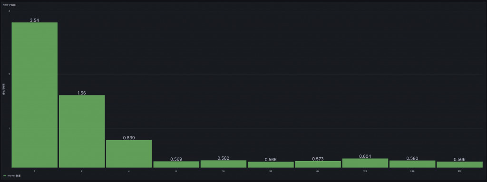

# D19 讓系統數據看得見（可觀測性驅動開發 ODD）

- 系列：應該是 Profilling 吧？系列 第 19 篇
- Day：19
- 發佈時間：2024-09-19 00:01:01
- 原文：[https://ithelp.ithome.com.tw/articles/10353199](https://ithelp.ithome.com.tw/articles/10353199)

在現今的軟體開發中，性能優化不再僅僅依賴開發者的直覺或經驗，而是通過數據的收集和分析來指導優化方向。在昨天的文章中，我們探討了如何通過 Go Trace 工具來分析 Goroutine 的行為，並通過減少 Goroutine 數量和使用 Object Pool 技術來有效提升系統的整體效能。今天，我們將探討另一個有力的工具——可觀測性驅動開發（ODD，Observability-Driven Development），並展示如何通過 Prometheus 和 Grafana 將數據可視化，幫助我們更好地分析決策和優化系統性能。

在本文中，我將展示一個基於 Go 的 demo 程式，通過動態調整 worker 數量並將執行結果推送至 Prometheus Pushgateway，最終通過 Grafana 可視化這些數據。我們將看到，如何在開發過程中，通過收集和可視化性能數據，來做出更為理性且高效的優化決策。

---

可觀測性驅動開發（ODD）強調在軟體開發過程中，通過持續收集應用的運行數據，來幫助開發者理解系統的內部行為並發現問題。這種方法的核心宗旨是：開發者應當在日常的開發和優化工作中，將系統的性能指標可視化，從而能夠通過數據來驅動改進。

與傳統的性能分析工具不同，ODD 更加強調數據的持續性監控和可視化。例如，在優化工作中，我們不僅僅是分析執行時間或記憶體消耗的某一次性結果，而是持續地觀察系統在不同負載或併發情況下的行為變化。這使得 ODD 成為一個強有力的工具，幫助我們做出數據驅動的決策，而不僅依賴於經驗或假設。

> 有了數據，有了儀表板，就不用在說**我感覺**。

## 實例演示

**動態調整 worker 數量**

這個示例程式的設計思想很簡單：每次倍增 worker 的數量，並測量每次執行的時間，然後將這些數據推送到 Prometheus Pushgateway。這些數據最終會在 Grafana 中顯示出來，讓我們一目了然地看到隨著 worker 數量的增加，系統的執行時間是如何變化的。

```go
package main

import (
	"context"
	"flag"
	"fmt"
	"log"
	"os"
	"runtime"
	"runtime/pprof"
	"runtime/trace"
	"sync"
	"time"

	"github.com/prometheus/client_golang/prometheus"
	"github.com/prometheus/client_golang/prometheus/push"
)

var (
	// 定義 Prometheus 指標，使用 worker 作為 label
	workerElapsed = prometheus.NewGaugeVec(
		prometheus.GaugeOpts{
			Name: "worker_elapsed_time_seconds",
			Help: "Elapsed time for workers to complete tasks, labeled by worker count",
		},
		[]string{"worker"},
	)
)

func init() {
	// 註冊 Prometheus 指標
	prometheus.MustRegister(workerElapsed)
}

// 創建一個 Object Pool ，用於重用 []byte Object
var bytePool = sync.Pool{
	New: func() interface{} {
		return make([]byte, 1024*1024*2) // 生成 2MB 的數據
	},
}

// 模擬一個從 Message Queue 中接收任務並處理的 Worker
func worker(ctx context.Context, id int, tasks <-chan int, wg *sync.WaitGroup) {
	defer wg.Done()
	for task := range tasks {
		// 每個任務建立一個 sub task，方便追蹤
		taskCtx, taskSpan := trace.NewTask(ctx, fmt.Sprintf("Worker-%d-Task-%d", id, task))
		defer taskSpan.End()

		// 從Object Pool中獲取一個 []byte Object，並在任務完成後 release it
		data := bytePool.Get().([]byte)
		defer bytePool.Put(data) // release it

		// 模擬 I/O 操作 (寫入和讀取文件)
		filename := fmt.Sprintf("/tmp/testfile_%d_%d", id, task)

		// 模擬寫文件 I/O
		trace.WithRegion(taskCtx, "WriteFile", func() {
			err := os.WriteFile(filename, data, 0644)
			if err != nil {
				log.Printf("Error writing file: %v\n", err)
			}
		})

		// 模擬讀文件 I/O
		trace.WithRegion(taskCtx, "ReadFile", func() {
			_, err := os.ReadFile(filename)
			if err != nil {
				log.Printf("Error reading file: %v\n", err)
			}
		})

		// 刪除文件
		os.Remove(filename)

		// 模擬其他 CPU 任務
		trace.WithRegion(taskCtx, "CPUTask", func() {
			sum := 0
			for i := 0; i < 100000; i++ {
				sum += i
			}
		})
	}
}

func main() {
	// 使用 flag 來設置 task 的數量
	numTasks := flag.Int("tasks", 1000, "number of tasks to process")
	procs := flag.Int("procs", 1, "number of go max procs")
	flag.Parse()

	// 設置最大 CPU 核心數，這裡可以嘗試不同的設定來觀察效果
	runtime.GOMAXPROCS(*procs)

	// 設置 Trace 和 CPU Profile
	cpuFile, err := os.Create("cpu.prof")
	if err != nil {
		log.Fatalf("could not create CPU profile: %v", err)
	}
	defer cpuFile.Close()
	if err := pprof.StartCPUProfile(cpuFile); err != nil {
		log.Fatalf("could not start CPU profile: %v", err)
	}
	defer pprof.StopCPUProfile()

	traceFile, err := os.Create("trace.out")
	if err != nil {
		log.Fatalf("could not create trace file: %v", err)
	}
	defer traceFile.Close()
	if err := trace.Start(traceFile); err != nil {
		log.Fatalf("could not start trace: %v", err)
	}
	defer trace.Stop()

	// 動態增加 worker 數量，從 1 開始，每次倍增直到 1000
	for workers := 1; workers <= 1000; workers *= 2 {
		// 建立一個root span，用於追蹤所有 task
		ctx := context.Background()
		ctx, mainTask := trace.NewTask(ctx, "MainTask")
		defer mainTask.End()

		start := time.Now()

		// 創建一個 Channel 作為任務隊列
		tasks := make(chan int, *numTasks)
		var wg sync.WaitGroup

		// 啟動多個 Worker
		for i := 0; i < workers; i++ {
			wg.Add(1)
			go worker(ctx, i, tasks, &wg)
		}

		// 模擬向 Message Queue 中發送事件
		for i := 0; i < *numTasks; i++ {
			tasks <- i
		}
		close(tasks)

		// 等待所有 Worker 完成
		wg.Wait()

		elapsed := time.Since(start)
		fmt.Printf("Workers: %d, Elapsed Time: %s\n", workers, elapsed)

		// 更新 Prometheus 指標，將 worker 數量作為 label 傳遞
		workerElapsed.With(prometheus.Labels{"worker": fmt.Sprintf("%d", workers)}).Set(elapsed.Seconds())

		pushMetrics()
		// 每次測試結束後休眠 5 秒
		time.Sleep(5 * time.Second)
	}
}

func pushMetrics() {
	if err := push.New("http://127.0.0.1:9091", "workers").
		Collector(workerElapsed).
		Push(); err != nil {

		fmt.Println("Could not push completion time to Pushgateway:", err)
	}
}
```

每次 worker 執行完畢後，我們會將執行時間推送到 Prometheus Pushgateway。每個 worker 的數量作為 Prometheus 指標的標籤，執行時間則作為其值。這樣，我們能夠通過 Grafana 來看到隨著 worker 數量變化，執行時間是如何變化的。



這樣的可視化數據給了我們一個清晰的方向，幫助我們迅速判斷在不同併發量下系統的瓶頸。通過這樣的持續監控，我們能夠動態調整 worker 數量，進行實時的性能優化。

不過這裡我們只能看見總執行時間跟 Worker 數量，其實在前幾天我們已經證明了，在 worker 超過一個數量後，對總執行時間是沒太大影響的。有影響的是 CPU 的有效使用率。應用程式的細部行為與影響還是需要`Profiler`來協助。

## 小結

**可觀測性驅動開發的應用場景**

從這個案例中我們可以看出，可觀測性驅動開發不僅僅是一個技術實現，更是一種思維方式。它強調的是通過數據來驅動決策，通過持續的觀測來指導系統優化。這種方式適用於各種需要精確性能調整的場景，尤其是在高併發、高負載的分佈式系統中。

總結來說，可觀測性驅動開發（ODD）為我們的開發流程帶來了極大的變革。它將傳統的開發流程進一步延伸到運行時數據的收集與分析，幫助我們進行精確的性能優化。通過可視化的數據，我們不再依賴經驗，而是讓數據說話，讓每次性能調整和優化決策都基於真實的運行結果。這樣的方式將在未來的軟體開發中扮演越來越重要的角色。
