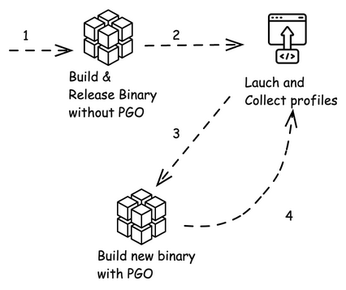
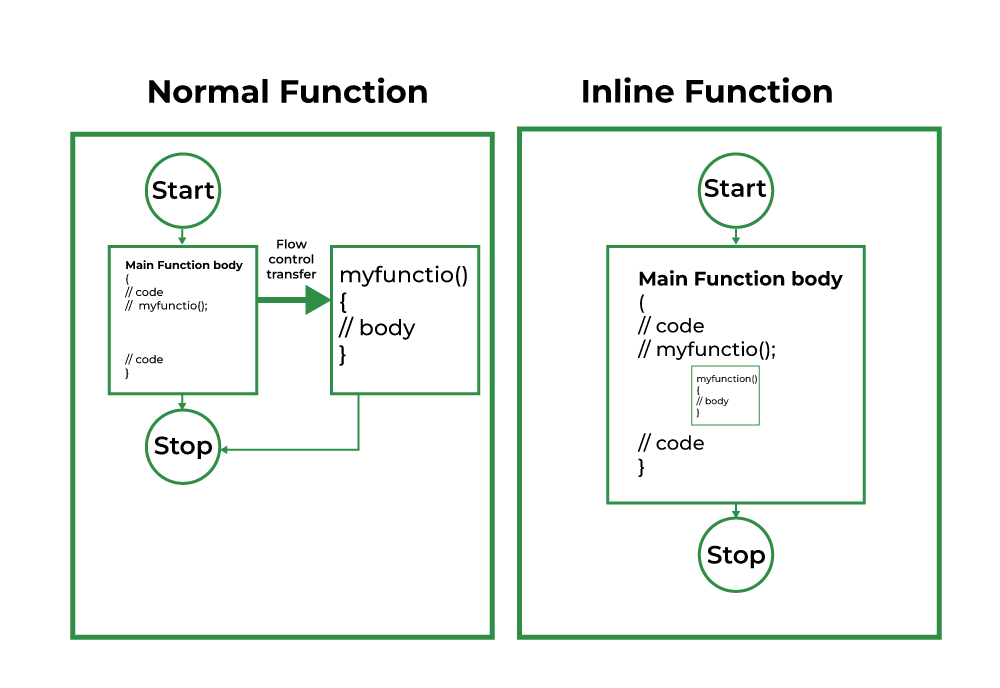

# D20 淺談回饋導向優化 PGO

- 系列：應該是 Profilling 吧？系列 第 20 篇
- Day：20
- 發佈時間：2024-09-20 00:05:19
- 原文：[https://ithelp.ithome.com.tw/articles/10353428](https://ithelp.ithome.com.tw/articles/10353428)

在現代軟體開發的過程中，性能優化往往不僅僅是減少程式的執行時間。更關鍵的是，如何最大限度地提高系統資源的利用效率，從而能夠在同一時間處理更多的工作負載，或是服務更多的使用者請求。這是性能工程的核心精神：不僅關注於系統的表面結果（如總執行時間），而更應該著眼於整體資源使用情況，以及如何有效利用這些資源，提升系統的吞吐量和穩定性。

在我們昨天的示例程式中，通過 Prometheus 和 Grafana 進行性能指標的可視化，我們能夠觀察到不同 worker 數量對總執行時間的影響。而今天，我們將進一步探討如何運用 Profile-Guided Optimization（PGO）技術來優化 Go 應用程式的 CPU 資源利用率。儘管在 PGO 優化前後，我們的總執行時間變化不大，但通過差異分析（Differential Profiling）顯示，我們減少了大量的 CPU 開銷，這將幫助我們系統在相同的時間內，處理更多的請求，並且釋放資源去處理更多的並發任務。

---

我們之前為什麼要先跑出 trace 與 pprof 這些 profile 呢？  
因為 Go 可以通過 profile 來重新編譯及優化，當然這不是 Go 的專屬能力，  
`因為我只會寫 Go`。

# Profile-Guided Optimization 的概述

Profile-Guided Optimization（PGO） 是一種基於程式運行時行為的優化技術。通常編譯器會根據靜態的原始程式碼進行最佳化，然而編譯器無法確切知道哪些程式路徑會在運行時頻繁被執行，因此它必須依賴於靜態分析進行猜測。PGO 的核心概念是利用應用程式的運行資料（稱為 profile）來幫助編譯器做出更準確的決策。例如，如果某些函數在運行中被頻繁調用，PGO 可以指導編譯器更積極地將這些函數進行內聯（inline），以減少函數調用的開銷。

這種基於運行資料進行優化的方式，也稱為 Feedback-Directed Optimization (FDO)。

在 Go 中，編譯器使用 `CPU pprof` profiles 作為 PGO 的輸入資料，這些 profile 可以來自 Go 的 runtime/pprof 或 net/http/pprof 模組。這意味著程式的真實運行資料會被收集，並在下次編譯時使用，從而進行針對性的優化。

[參考來自 Go blog Profile-guided optimization](https://go.dev/doc/pgo#overview)

> 這就是為什麼前幾天都專住在 CPU Profile :)

## PGO 的工作流程

持續採用 PGO 進行優化的工作流程如下：

- 建置並發布未經 PGO 優化的初始 Binary。
- 從營運環境中收集程式運行時的 CPU profile。
- 當準備釋出更新時，基於最新的原始碼進行建置，並使用收集到的 profile 資料來優化編譯過程。
- 重複上述步驟，隨著程式的發展進行迭代優化。

通過這樣的閉環流程，PGO 能夠針對應用程式的運行行為做出更精確的優化，而不僅僅依賴於靜態分析。



## PGO 的性能提升

在 Go 1.21 中，使用 PGO 的程式通常可以獲得 2~7% 的 CPU 使用提升。這些性能增益主要來自於內聯函數優化和條件去虛擬化（Devirtualization）等技術。這些技術使得編譯器能夠更有效地針對熱點代碼進行優化，從而減少函數調用的開銷，並提升應用程式的總體性能。

PGO 主要利用兩種優化技術來提升程式性能：

- 內聯函數（Inlining）：內聯可以消除函數調用的開銷，並使編譯器能夠進一步優化調用者的程式碼，這樣可以減少函數調用的開銷，尤其是那些頻繁執行的小型函數。PGO 根據程式在實際運行時的資料，確定哪些函數是高頻調用的，從而決定是否對這些函數進行內聯處理。

。PGO 能夠根據應用程式的運行資料判斷哪些函數是頻繁調用的，從而更積極地將這些函數進行內聯。  


- 去虛擬化（Devirtualization）：這種技術能夠將 interface 的間接函數調用轉換為直接函數調用，進一步減少函數調用的開銷。PGO 能夠根據運行資料識別出哪些 interface 的具體實現頻繁出現，從而將這些間接調用替換為直接調用，提升性能。

```
var r io.Reader = os.Stdin
r.Read(buf)
```

`io.Reader` 是個介面，在 PGO 優化後，若 PGO 資料顯示 `io.Reader` 幾乎總是被具體的 os.File 所實現，則編譯器會將這個間接調用優化為直接調用：

```
if f, ok := r.(*os.File); ok {
    f.Read(buf)
} else {
    r.Read(buf)
}
```

讓我們把昨天的演示程式給重跑一次取得總時間跟 profile。

Step 1︰建置並發布未經 PGO 優化的初始 Binary。

```
go run main.go               
Workers: 1, Elapsed Time: 3.922600165s
Workers: 2, Elapsed Time: 1.590172501s
Workers: 4, Elapsed Time: 843.42172ms
Workers: 8, Elapsed Time: 564.651138ms
Workers: 16, Elapsed Time: 573.02314ms
Workers: 32, Elapsed Time: 585.480909ms
Workers: 64, Elapsed Time: 574.107537ms
Workers: 128, Elapsed Time: 589.158387ms
Workers: 256, Elapsed Time: 579.098454ms
Workers: 512, Elapsed Time: 584.564918ms
```

Step 2︰從營運環境中收集程式運行時的 CPU profile。  
備份一下 cpu profile，重新命名成 `nopgo.pprof`。

將 cpu profile，重新命名成`default.pgo`。

```
cp cpu.prof nopgo.pprof
mv cpu.prof default.pgo
```

Step 3︰當準備釋出更新時，基於最新的原始碼進行建置，並使用收集到的 profile 資料來優化編譯過程。

```
go build -o app.withpgo

./app.withpgo          
Workers: 1, Elapsed Time: 3.409535771s
Workers: 2, Elapsed Time: 1.728715572s
Workers: 4, Elapsed Time: 809.216133ms
Workers: 8, Elapsed Time: 568.59281ms
Workers: 16, Elapsed Time: 569.385177ms
Workers: 32, Elapsed Time: 585.190489ms
Workers: 64, Elapsed Time: 576.724821ms
Workers: 128, Elapsed Time: 578.651532ms
Workers: 256, Elapsed Time: 571.834141ms
Workers: 512, Elapsed Time: 553.589082ms
```

備份一下 cpu profile，重新命名成`withpgo.pprof`

```
mv cpu.prof withpgo.pprof
```

> 建置帶有 PGO 的程式  
> 一旦 profile 資料被收集，建置帶有 PGO 的程式變得相對簡單。通常情況下，將 pprof CPU profile 儲> 存為 `default.pgo` 檔案並放置在主 package 目錄中，go build 會自動檢測到 `default.pgo` 檔案，並啟用 PGO 優化。  
> 若要更靈活地控制 PGO profile 的選擇，可以使用 go build -pgo 參數。這個參數允許指定不同的 profile 來源，默認值為 `-pgo=auto`，它會自動使用 `default.pgo` 文件。也可以使用 `-pgo=off` 來禁用 PGO 優化，或者指定自定義路徑來使用不同的 profile，如 `go build -pgo=/tmp/foo.pprof`。

## 比較 PGO 優化的前後

Go tool pprof 能使用`-diff_base`來比較兩個pprof。  
在這次的 pprof 分析中，我們進行了差異分析 (differential profiling)，通過比較兩個運行時的 CPU profile (`nopgo.pprof` 和 `withpgo.pprof`) 來識別 PG0 優化的效果。這裡的 -diff\_base 命令會顯示兩個 profile 之間的差異，數值代表 PGO 優化後所增加或減少的 CPU 時間。

```
go tool pprof -diff_base nopgo.pprof withpgo.pprof 
File: app.withpgo
Type: cpu
Time: Sep 19, 2024 at 12:10am (CST)
Duration: 120.50s, Total samples = 31.97s (26.53%)
Entering interactive mode (type "help" for commands, "o" for options)
(pprof) top -cum
Showing nodes accounting for -0.88s, 2.75% of 31.97s total
Dropped 3 nodes (cum <= 0.16s)
Showing top 10 nodes out of 187
      flat  flat%   sum%        cum   cum%
         0     0%     0%     -0.92s  2.88%  main.worker
     0.01s 0.031% 0.031%     -0.89s  2.78%  syscall.Syscall
    -0.88s  2.75%  2.72%     -0.88s  2.75%  internal/runtime/syscall.Syscall6
         0     0%  2.72%     -0.88s  2.75%  syscall.RawSyscall6
         0     0%  2.72%     -0.79s  2.47%  runtime/trace.WithRegion
         0     0%  2.72%     -0.74s  2.31%  internal/poll.ignoringEINTRIO (inline)
    -0.01s 0.031%  2.75%     -0.57s  1.78%  internal/poll.(*FD).Write
         0     0%  2.75%     -0.56s  1.75%  main.worker.func1
         0     0%  2.75%     -0.56s  1.75%  os.(*File).Write
         0     0%  2.75%     -0.56s  1.75%  os.(*File).write (inline)
(pprof) top
Showing nodes accounting for -0.89s, 2.78% of 31.97s total
Dropped 3 nodes (cum <= 0.16s)
Showing top 10 nodes out of 187
      flat  flat%   sum%        cum   cum%
    -0.88s  2.75%  2.75%     -0.88s  2.75%  internal/runtime/syscall.Syscall6
     0.07s  0.22%  2.53%      0.07s  0.22%  runtime.memclrNoHeapPointers
    -0.06s  0.19%  2.72%     -0.06s  0.19%  runtime.futex
    -0.04s  0.13%  2.85%     -0.04s  0.13%  main.worker.func3
    -0.02s 0.063%  2.91%     -0.01s 0.031%  runtime.(*mheap).initSpan
     0.02s 0.063%  2.85%      0.02s 0.063%  runtime.(*mheap).setSpans
     0.02s 0.063%  2.78%      0.02s 0.063%  runtime.(*traceBuf).varint
     0.02s 0.063%  2.72%      0.01s 0.031%  runtime.casgstatus
    -0.01s 0.031%  2.75%     -0.01s 0.031%  context.WithValue
    -0.01s 0.031%  2.78%     -0.01s 0.031%  fmt.(*pp).doPrintf
```

我們來看這些數據的解釋：

### 差異分析的輸出概述

`Showing nodes accounting for -0.88s, 2.75% of 31.97s total`：這表示我們正在顯示兩個 profile 之間的差異，且這些差異的 CPU 使用時間佔總 CPU 樣本時間的 2.75%。差異值是負數（如 -0.88s），表示 withpgo.pprof 中的 CPU 使用時間比 nopgo.pprof 減少了 0.88 秒。

pprof 命令顯示了兩種數據：`top -cum` 用來顯示按累積值排序的結果，這有助於理解函數調用堆疊對總體 CPU 使用的貢獻；`top` 則顯示每個函數單獨的 CPU 使用情況，能幫助我們了解具體函數在性能中的差異。

#### top -cum 分析：

此部分顯示累積數據，意味著每個函數以及它所調用的所有下層函數的總 CPU 使用時間。

**main.worker**：  
main.worker 函數在 withpgo.pprof 中比 nopgo.pprof 減少了 0.92 秒的 CPU 時間，這表示 main.worker 及其調用的其他函數整體上受到了 PGO 的優化。

**syscall.Syscall 和 internal/runtime/syscall.Syscall6**：  
這些與系統調用相關的函數也受到了優化，syscall.Syscall 減少了 0.89 秒的 CPU 時間，Syscall6 減少了 0.88 秒。這些優化通常表明減少了系統層級的 I/O 或調用次數，或是內部函數實現得到了改進。

**trace.WithRegion**：  
trace.WithRegion 函數的 CPU 使用時間減少了 0.79 秒。這是 Go 中用來標記某段代碼進行跟蹤的函數，顯示出 PGO 優化後跟蹤操作的開銷減少，可能是由於內聯或更有效的程式碼路徑選擇所致。

#### top 分析：

此部分顯示每個函數本身的 CPU 使用差異，而不是累積堆疊。

**internal/runtime/syscall.Syscall6**：  
Syscall6 函數的 CPU 使用時間減少了 0.88 秒，這與 top -cum 中觀察到的系統調用減少一致。這可能意味著系統調用的數量減少，或者系統調用的開銷得到了優化。

**runtime.memclrNoHeapPointers**：  
這個函數是 Go 內部用來清除記憶體分配的一部分，CPU 使用時間增加了 0.07 秒。這可能是因為某些記憶體操作被內聯或其他優化操作影響，使得程式碼中進行了更多的記憶體分配操作。

**runtime.futex**：  
futex 是 Go 用來進行同步的內核調用，通常和鎖或信號量有關。這裡的 CPU 使用時間減少了 0.06 秒，表示 PGO 幫助減少了對鎖或同步機制的依賴，從而提升了性能。

**main.worker.func3**：  
main.worker.func3 的 CPU 使用時間減少了 0.04 秒。這是 worker 函數的一部分，說明 PGO 在這部分程式碼進行了優化，可能是通過內聯、減少上下文切換或更高效的內部邏輯實現的。

這次差異分析的結果顯示，PGO 對 Go 應用程序的性能提升是明顯的。系統調用（如 syscall.Syscall 和 Syscall6）的開銷顯著減少，說明 PGO 優化了系統 I/O 和記憶體分配的行為。此外，像 trace.WithRegion 這樣的函數也顯示了減少的 CPU 使用，這表明 PGO 有助於減少運行時的跟蹤和調試開銷。

內聯和去虛擬化這兩種 PGO 的核心優化技術在這裡起到了重要作用，使得應用程式中的熱路徑得到了更有效的優化，從而降低了 CPU 開銷並提升了整體性能。

## 小結

通過這次對 PGO 的初步探討與應用，我們可以清楚地看到，哪怕總執行時間沒有太大的變化，PGO 還是能夠顯著減少系統的 CPU 使用量，尤其是透過內聯（Inlining）與去虛擬化（Devirtualization）等技術。我們的分析結果表明，系統調用、同步機制以及部分記憶體分配開銷都得到了有效優化。

這種優化的結果，並不僅僅是讓程式更快地執行完畢，而是釋放了系統資源，使我們能夠在相同的資源限制下處理更多的工作負載。這對於高併發、高流量的系統而言，尤其重要，因為每一毫秒的 CPU 時間節省，都可能意味著系統可以服務更多的使用者請求。

最後，透過持續的性能優化和可視化數據監控，我們可以實現數據驅動的決策，不再依賴於假設或直覺。通過 Profile-Guided Optimization，我們能夠逐步迭代優化系統，讓每一個程式碼路徑都能夠在真實運行環境中得到最佳的性能表現。這正是可觀測性驅動開發（ODD）的核心精神：以數據為導向，不斷改進系統性能，讓每一次性能優化都基於真實的運行結果。

透過這樣的性能優化方式，我們將不僅僅提高單次請求的執行效率，更能提升系統整體的負載處理能力，為更多使用者提供穩定且快速的服務。

參考以下官方文章︰

[Go Blog Profile-guided optimization in Go 1.21](https://go.dev/blog/pgo)  
[Go Doc Profile-guided optimization](https://go.dev/doc/pgo)

Doc 底下有常見的問題︰

1. 是否可以使用 PGO 優化 Go 的 Standard library？  
   是的。Go 中的 PGO 應用於整個程式。所有的package，包括 Standard library，都會被重建以考慮可能的基於 Profile 的優化。
2. 是否可以使用 PGO 優化依賴模組中的 package？  
   是的。PGO 在 Go 中應用於整個程式。所有的 package，包括依賴模組中的 package，會被重建以進行可能的優化。這意味著應用程式如何使用依賴 package 會影響到該依賴包的優化效果。
3. GO 如何影響二進制檔案的大小？  
   PGO 可能會導致二進制檔案稍微增大，這主要是由於額外的函數內聯引起的。

裡面的常見問題都很值得在團隊中討論是否要使用 PGO。
