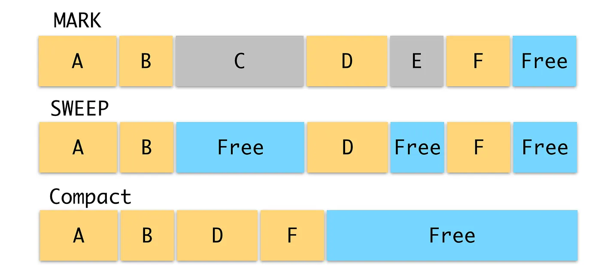
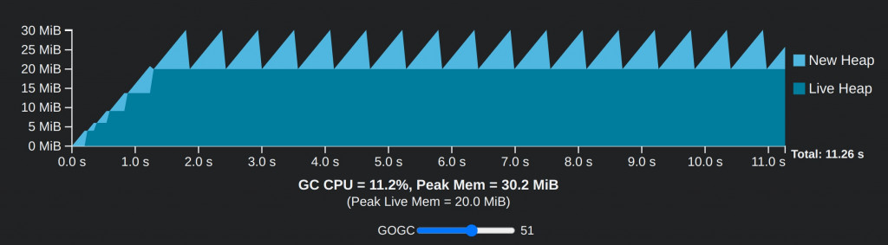
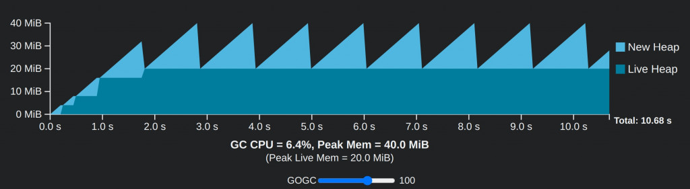
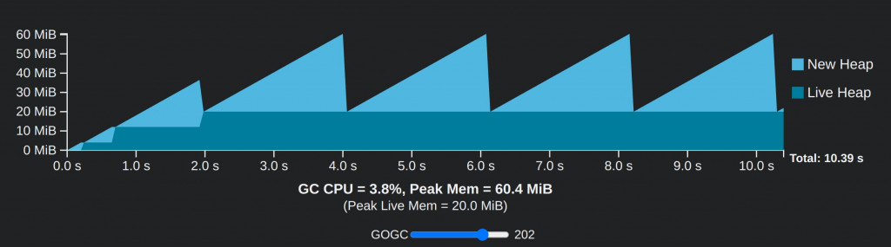
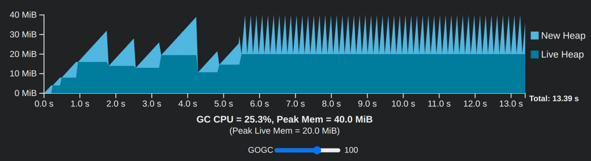
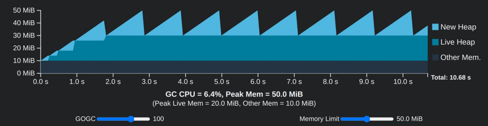
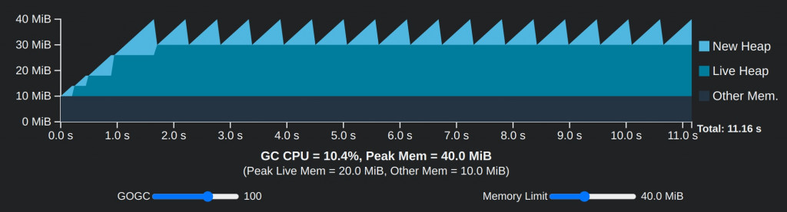
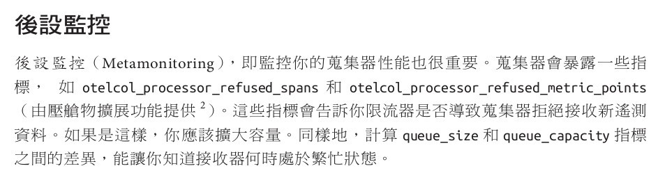
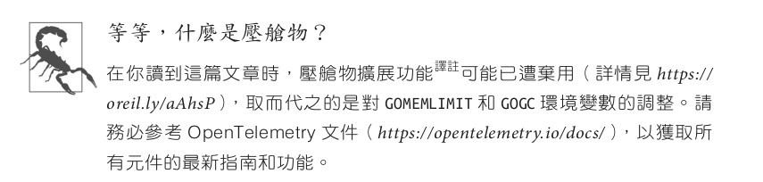

# D21 淺談 Go GC 機制

- 系列：應該是 Profilling 吧？系列 第 21 篇
- Day：21
- 發佈時間：2024-09-21 00:00:41
- 原文：[https://ithelp.ithome.com.tw/articles/10353431](https://ithelp.ithome.com.tw/articles/10353431)

GC 機制幾乎常見的語言都有的機制，只有鮮少的程式語言需自己的規範來撰寫程式碼搭配立刻回收(例如 Rust)。因為 OpenTelemetry Collector 是用 Go 開發的，所以不是寫 Go 的讀者，是維運專長的讀者，也能稍微了解一下 GC 如何影響 OpenTelemetry Collector 的效能與可用程度。

---

# Garbage Collection

垃圾回收機制（Garbage Collector，又稱 GC）。在許多程式語言都有這機制的存在，為了能在應用程式執行過程中，負責管理從記憶體分配出去，以及將分配出去的空間進行釋放。主要是防止記憶體洩漏問題（Memory leak）以及記憶體配置碎片化問題（Managed memory fragmentation）。

## 記憶體洩漏問題

> In computer science, a memory leak is a type of resource leak that occurs when a computer program incorrectly manages memory allocations in a way that memory which is no longer needed is not released. -- From [Wiki](https://en.wikipedia.org/wiki/Memory_leak)

本來該被釋放的記憶體空間，沒被釋放時。就發生了記憶體洩漏問題。而這樣的錯誤管理的行為重複個數次，應用程式就會發生 OOM （Out of Memory）問題，導致應用程式直接崩潰不正常退出。這在營運環境中發生這種情形時，重啟服務也沒用。就算該服務用叢集架構，也只是讓每個實例在短時間頻繁崩潰退出又重啟，勉強靠數量在支撐著。

## 記憶體配置碎片化問題

在提到記憶體配置碎片化問題時，通常都是在講外部空間碎片化。意思是記憶體存在足夠總量的記憶體可用空間。但這些可用空間卻是不連續、分散的小塊空間。當有一個配置請求比任何一個小塊空間都還大時，就無法配置一個完整的連續空間給該配置請求。只能配置數個不連續分散的小塊空間來用。

記憶體配置碎片化問題會對應用程式的效能表現造成負面影響，主要體現在以下幾個方面：

- **效能下降**：由於記憶體配置碎片化會導致記憶體存取效率降低，從而影響應用程式的整體效能。
- **增加 GC 負擔**：當記憶體配置碎片化嚴重時，垃圾回收器需要花費更多時間來尋找和整理可用空間，從而增加垃圾回收的負擔。
- **降低穩定性**：在極端情況下，記憶體配置碎片化可能會導致記憶體分配失敗，從而導致應用程式崩潰。

為了解決以上兩個問題，GC 機制成為了現代程式語言中不可或缺的一部分，它可以幫助開發人員減輕記憶體管理的負擔，提高程式語言的易用性和安全性。在理解垃圾回收機制的基礎上，開發人員可以採取相應措施來避免記憶體洩漏和記憶體配置碎片化問題，以提升應用程式的效能和穩定性。

大部分的常見的程式語言都有 GC 機制，甚至連 FP 程式語言都有該機制。在 Java 和 .Net 的文章中，就蠻常會看見有相關的文章。小弟我比較擅長的程式語言 Go，也有這機制，藉由這次鐵人賽的機會一邊學習一邊分享。

而這幾年的熱門話題語言 Rust 則是通過所有權（Ownership）在管理，當變數擁有者離開作用域時，數值就會被丟棄，該變數佔有的記憶體就被釋放回去配置器了。因為 Rust 沒有 GC 機制，就會少了一些問題，只是在開發時，就需要配合 Rust 的機制在編寫。 [Rust Ownership](https://rust-lang.tw/book-tw/ch04-01-what-is-ownership.html)

## Go GC 概念與週期解析

Go 的 GC 使用`標記-清除（Mark-and-Sweep）`的演算法來管理程式中的記憶體分配與釋放。GC 的目的是回收不再需要的記憶體配置，從而防止應用程式因記憶體可用空間耗盡而崩潰。這個過程會在背景不斷進行，並且由 Go 的運行時環境自動管理。

### 1. Go GC 的運行週期

Go 的垃圾回收週期分為三個階段：

- **標記階段（Mark Phase）**
- **清除階段（Sweep Phase）**
- **非活躍階段（Off Phase）**

  
[Medium Go: Garbage Collection](https://medium.com/@j19950805/go-garbage-collection-5087abe7efee)

在`標記階段`，GC 會遍歷所有可達的物件，並將這些物件標記為`活躍（Live）`。這是非常關鍵的一步，因為只有確認物件仍在使用（即被程序中的其他物件引用）後，才不會被回收。這個過程通過追蹤從`根 Roots`（如全局變數、當前 Stack 等）開始的指標來實現。任何無法從這些「根」指標訪問的物件都會被認為是不再使用的物件。

一旦標記階段完成，GC 進入`清除階段`。在這個階段，GC 會清除那些未被標記的物件，釋放它們所佔用的記憶體空間。這些記憶體空間將可供應用程式再次使用。由於清除過程僅需遍歷已知的非存活物件，因此相對於標記階段，清除階段的開銷較低。

在 GC 完成標記和清除後，系統會進入`非活躍階段`。在此階段，GC 暫時不進行任何回收活動，直到下一次回收週期被觸發。這段時間允許應用程式自由運行，而不受 GC 的影響。

### 2. 理解 GC 的成本模型

Go 的 GC 設計需要在記憶體和 CPU 之間進行權衡，因此理解這些成本是優化 GC 性能的關鍵。

GC 的主要成本來源  
**CPU 時間**  
每次 GC 都會消耗一定的 CPU 資源來標記和清除記憶體配置中的物件。這些 CPU 開銷包括固定成本（如 GC 的初始化）以及與存活物件數量成比例的邊際成本。

**記憶體使用**  
GC 會消耗一定的記憶體來維護 metadata（如標記狀態），同時它會管理應用程式所分配的記憶體 Heap，包括Live Heap 和 New Heap。這些記憶體配置是 GC 必須追蹤的主要對象。

### 3. GOGC：控制 GC 的頻率

Go 提供了一個關鍵的參數 `GOGC`，用來調整 GC 的頻率，從而在 CPU 和記憶體配置之間做出取捨。

GOGC 的值控制了 GC 的運行頻率。具體來說，它決定了在每個 GC 週期中允許分配的記憶體 Heap 大小，從而影響了 GC 的觸發頻率。

GOGC 的設置範圍是通過設定下一個 GC 週期的目標記憶體配置來控制的。當 GOGC 設置為 `100` 時，表示垃圾回收器允許 New Heap 大小為上一個 GC 週期 Live heap 大小的 100%，即一倍；如果設置為 `200`，則允許兩倍的記憶體分配。

GOGC 的值越高：能減少 GC 的頻率，使應用程式能夠使用更多記憶體空間，從而降低 GC 的 CPU 開銷，但會增加記憶體可用空間的消耗。  
GOGC 的值越低：會增加 GC 的頻率，能夠更頻繁地回收記憶體空間，但代價是需要更多的 CPU 時間來處理這些回收操作。

目標最大 Heap 計算公式

```
Target heap memory = Live heap + (Live heap + GC roots) * GOGC / 100
```

例如，假設一個 Go 程式的 Live heap 大小為 8 MiB，GOGC 值為 100，則下一個 GC 週期之前允許的記憶體使用總量將為 8 MiB \* 2，即 16 MiB。

[官方網站有提供一個可視化的模型操作](https://tip.golang.org/doc/gc-guide#Latency)，能更簡單的理解 GOGC的值與 CPU 和 記憶體配置空間等的關係。  






以上這三張圖呈現了不同 GOGC 設定下，Go 程式在 GC 週期中的 CPU 與記憶體使用情況，並展示了如何調整 GOGC 對系統效能的影響。

首先，我們看到 GOGC 設定為 `202` 的圖表。這個設定允許程式在進行 GC 前，佔用的記憶體可以達到Live heap 記憶體的 202%。因此，GC 的頻率較低，CPU 的使用率僅為 3.8%，代表 GC 佔用的計算資源非常少。然而，這也意味著更多的記憶體被佔用，總峰值達到了 60.4 MiB。由於垃圾回收執行較少，因此整體程式的執行時間稍微縮短，總共耗時約 10.39 秒。

接著，我們來看 GOGC 設定為 `100` 的情況。此時，GC 週期變得較為頻繁，因為每次回收前允許的記憶體使用量只有 Live heap 記憶體的 100%。這導致 CPU 使用率上升到 6.4%，顯示更多的計算資源用於垃圾回收。但相對的，記憶體佔用則降低，總峰值只有 40.0 MiB。由於記憶體管理變得更加積極，程式的執行時間略微增加，達到 10.68 秒。這說明當你選擇較低的 GOGC 設定時，會更頻繁地進行 GC，雖然減少了記憶體的佔用，但也提高了 CPU 的負擔。

最後，我們看到 GOGC 設定為 `51` 的圖表。這是一個更為激進的記憶體管理設定，允許在 GC 之前佔用的記憶體僅為 Live heap 記憶體的 51%。結果是，GC 週期更加頻繁，CPU 使用率顯著提升，達到了 11.2%。雖然這減少了記憶體的佔用（峰值僅為 30.2 MiB），但整體程式執行時間延長到了 11.26 秒。頻繁的 GC 過程雖然有效地節省了記憶體，但付出的代價是大量的 CPU 資源被消耗在 GC 上，導致程式的執行效能下降。

綜合來看，這三個圖表呈現了 GOGC 設定對 Go 程式效能的影響。當 GOGC 設定較高時，記憶體佔用較大，但 GC 的頻率較低，節省了 CPU 的使用。而當 GOGC 設定較低時，記憶體管理變得更加積極，導致 GC 的頻率增高，減少了記憶體佔用，但增加了 CPU 的負擔並延長了程式的執行時間。這三張圖表展示了在不同情境下，如何根據需求來平衡 CPU 與記憶體資源的使用。

現實中，更可能如下圖所示，比喻為一個系統突然遭遇大量請求的湧入。當系統的請求數量在短時間內成長時，系統需要快速分配更多的記憶體來處理這些請求，這就導致了圖中所展示的 New Heap 的快速增長。同時，為了避免記憶體溢出，GC 需要更頻繁地運行來釋放已經不再使用的記憶體，因此導致 CPU 使用率顯著上升（達到 25.3%），並且 GC 的週期變得更加密集。



可以用來說明系統在高並發和突發流量下的行為，並展示了在面對大量請求時，GC 的頻繁運行如何影響系統的效能。

所以平常進行`負載測試`的目的是模擬真實場景下的持續穩定負載，來測試系統是否能夠在特定的流量情況下穩定運行。你可以設定一個模擬 5 萬人同時湧入系統的場景，並調整 `GOGC` 參數來觀察對 GC 和效能的影響，調整 GOGC 的值，例如從 GOGC=100 調整到 GOGC=200 或 GOGC=50，觀察系統在不同設定下的 CPU、記憶體佔用和垃圾回收頻率。觀察是否存在 GC 過度消耗 CPU 資源或記憶體不足的問題。。負載測試可讓你確保系統在這種大規模用戶行為下，能保持一定的性能水平。

但如果只有`GOGC`來設定 New Heap 與 Live Heap 的比例，還是有可能突然出現`峰值`，而讓容器或伺服器上的記憶體不夠配置給應用程式作為 New Heap。所以 Go 1.19之後引入了記憶體限制參數 `GOMEMLIMIT`，允許你設置一個記憶體配置上限。當程式的記憶體使用量接近這個限制時，GC 會加速運行，以避免超過記憶體限制。

`GOMEMLIMIT` 是對 `GOGC` 的加強，它能有效地防止程式在突發記憶體分配的情況下用光系統資源。  
當記憶體使用接近設定的限制時，GC 會自動增加回收頻率，以控制記憶體使用。

`GOMEMLIMIT` 特別適用於在資源受限的環境中（如容器）運行的應用程式。它可以幫助應用程式在不超過系統資源的情況下運行更穩定。





以上這兩張圖展示了當設定不同記憶體限制時，Go 程式的 GC 行為和效能表現。在這兩個測試情境中，GOGC 設定為 `100`，表示分配的額外記憶體是現有Live Heap記憶體的 100%。然而，兩者的差異在於對 Memory Limit 的設定，這對整個系統的效能和 GC 週期頻率產生了影響。

第一張圖的記憶體限制被設為 50 MiB。在這個情況下，GC 只佔用了約 6.4% 的 CPU，並且整體系統的峰值記憶體使用量達到了 50 MiB。我們可以觀察到當程式運行時，New Heap 記憶體逐步增加，並且每當達到峰值時，GC 就會啟動來 GC 記憶體。由於系統有 50 MiB 的記憶體限制，GC 週期在一定頻率內進行，並且不會有明顯的記憶體壓力。這意味著在這個限制下，GC 可以有效地在不超過記憶體限制的情況下執行，並且保持相對低的 CPU 開銷。

第二張圖中，記憶體限制降低到了 40 MiB。結果顯示，GC 的 CPU 開銷上升到了 10.4%，且程式的總運行時間略微增加。因為記憶體限制減少，GC 必須更頻繁地運行以避免超出限制，這導致了更高的 CPU 消耗。儘管峰值記憶體使用仍保持在 40 MiB，但由於 GC 週期更密集，程式運行的時間也因此延長。

這兩個情境的差異可以總結為記憶體限制對 GC 頻率與 CPU 負載的影響。在記憶體限制較高的情況下，GC 可以更少地運行，從而減少 CPU 的使用量並縮短總運行時間。然而，當記憶體限制變小時，GC 需要更加頻繁地運行以確保不會超出記憶體限制，這會導致更高的 CPU 使用和較長的程式運行時間。

如果業務場景涉及大量請求湧入且記憶體資源有限，這樣的測試可以幫助確定最佳的 GOGC 設定與記憶體限制，來平衡系統效能和資源使用，以便在高負載情況下維持系統穩定性。

> 為什麼在這系列提到 Go GC呢？  
> 這是因為在小弟我翻譯的新書當中`OpenTelemetry 學習手冊`中第 7 章，曾經提到 OTel collector 會有拒絕接收新的遙測訊號的資料的時候嘛？  
>   
>   
> 有的，因為 OTel collector 也是用 Go 開發的，它正好也是使用這兩個設定在保護 collector 應用程式本身不會因為記憶體沒控制好而崩潰，或是過度忙於 GC 上，而導致遙測訊號處理延遲。  
> 所以才有今天的議題。

## 小結

今天我們深入探討了 GC 機制在程式語言中的重要性。在這個過程中，GC 會自動釋放不再使用的記憶體，從而確保系統的穩定性和效能。

總的來說，我們透過對 Go GC 機制的深入理解，學到了如何優化應用程式的效能，尤其是在高負載和突發流量的情境下。這些知識不僅能幫助我們優化日常開發中的系統效能，還能讓我們更好地應對突發情況的挑戰。

參考文件  
[Go Doc A Guide to the Go Garbage Collector](https://tip.golang.org/doc/gc-guide)
