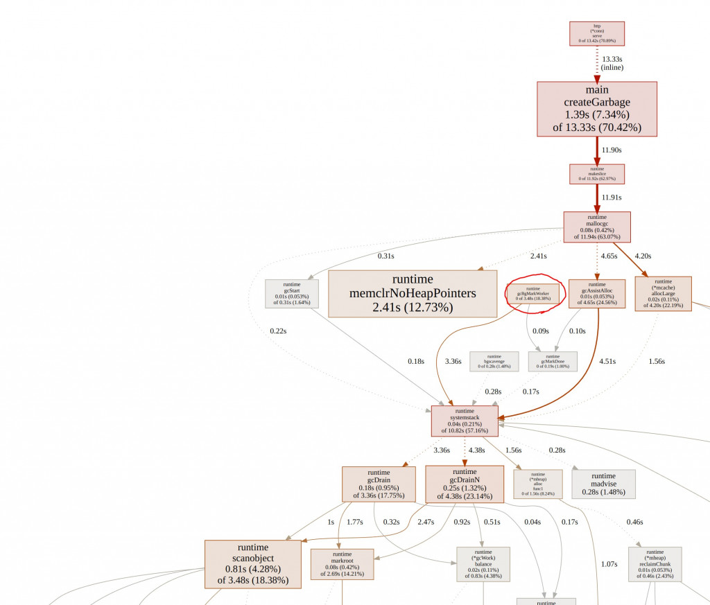
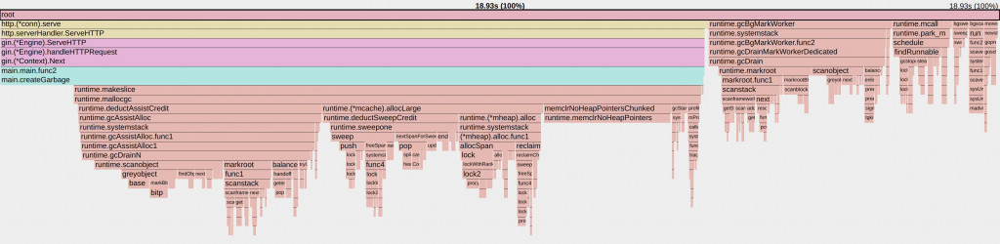
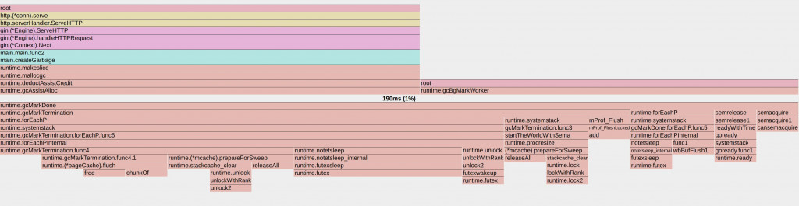
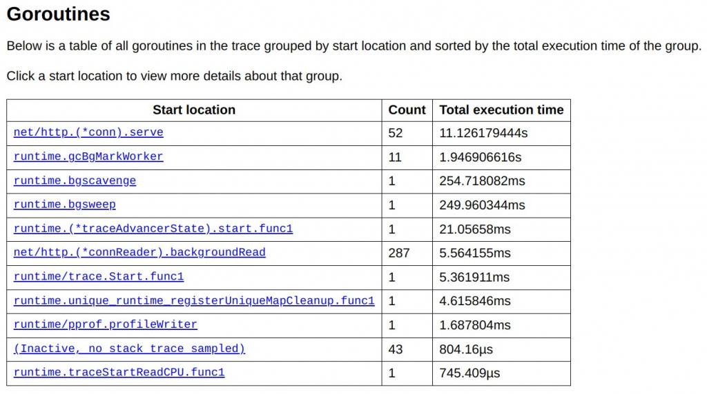
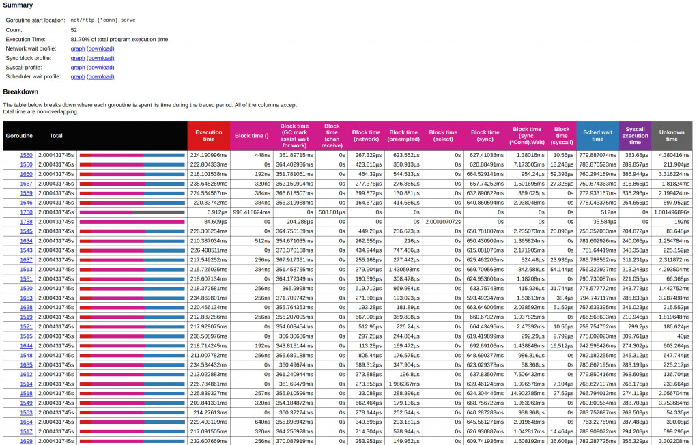
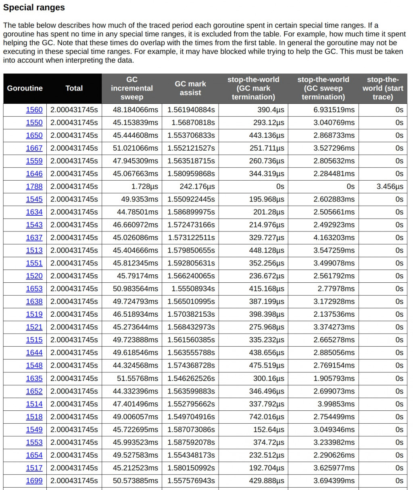
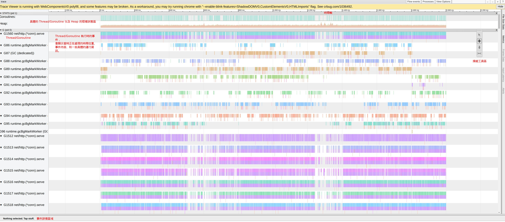
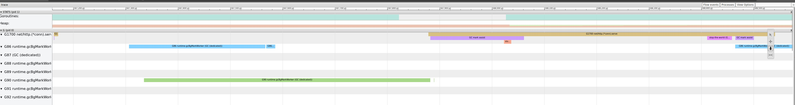
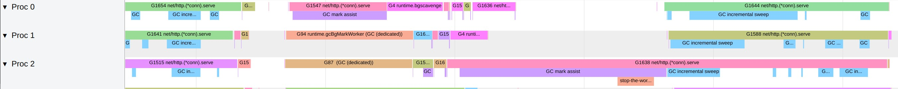
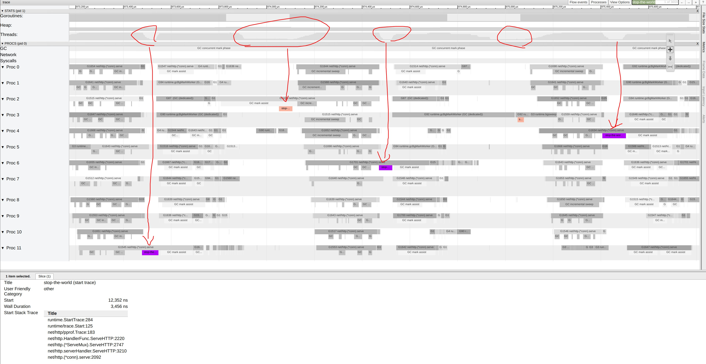

# D22 看見 GC

- 系列：應該是 Profilling 吧？系列 第 22 篇
- Day：22
- 發佈時間：2024-09-22 01:05:03
- 原文：[https://ithelp.ithome.com.tw/articles/10354730](https://ithelp.ithome.com.tw/articles/10354730)

繼昨天淺談 Go 的垃圾回收機制之後，今天我們將透過實際的範例來深入探討如何使用 Profiler 來觀察並分析 Go 程式在執行期間的垃圾回收行為。這將幫助我們更好地理解系統的性能瓶頸，特別是在面對高頻率的 GC 操作時。

在台灣，由於科技業的快速發展，許多公司和開發者都面臨著高負載 Web API 的性能優化問題。透過今天的範例，你將學到如何配置和利用 pprof 工具，這是一個極為寶貴的技能，可以幫助你在實際的工作中快速定位問題並優化程式。

---

昨天簡單的了解了 Go GC 的機制。  
今天來通過簡單的範例程式來看看 Profiler 要怎麼發現系統在 GC 的行為。

上次在[D15 淺談 Go Tool Trace](https://ithelp.ithome.com.tw/articles/10350656)提到能從pprof 直接產生trace profile。今天來展示一下。

以下範例程式，只是模擬 WebAPI 的場景，可能會透過 DB 撈取出資料，並且加工轉換成特定的格式。  
加上分層設計軟體架構中，難免會產生很多短生命週期的物件，這時這些物件就會需要 GC 來處理。

```go
package main

import (
	"flag"
	"fmt"
	"net/http"
	_ "net/http/pprof"
	"os"
	"os/signal"
	"runtime"
	"runtime/debug"
	"syscall"

	"github.com/gin-gonic/gin"
)

func main() {
	gcPercent := flag.Int("per", 100, "number of workers to start")
	memLimit := flag.Int64("mem", 50, "number of tasks to process")
	flag.Parse()

	// Set the target percentage for the garbage collector. Default is 100%.
	debug.SetGCPercent(*gcPercent)

	// Set memory limit. Default is 50 MiB
	debug.SetMemoryLimit(*memLimit * 1024 * 1024)

	defer func() {
		var memStats runtime.MemStats
		runtime.ReadMemStats(&memStats)
		fmt.Printf("總 GC 次數: %v, 暫停總時間: %v ns\n", memStats.NumGC, memStats.PauseTotalNs)
	}()

	// 啟動 Gin 引擎
	r := gin.New()

	// 定義一個處理會觸發大量GC的路由
	r.GET("/gc", func(c *gin.Context) {
		// 不斷創建短命物件，促使 GC 頻繁觸發
		for i := 0; i < 1000; i++ {
			_ = createGarbage(i)
		}
		// 回應客戶端
		c.JSON(200, gin.H{
			"message": "GC triggered, check the server logs!",
		})
	})

	// 啟動一個獨立的 pprof HTTP 伺服器
	go func() {
		fmt.Println(http.ListenAndServe("localhost:6060", nil))
	}()

	go func() {
		// 啟動 HTTP 伺服器，監聽 8080 端口
		r.Run(":8080")

	}()
	signalCh := make(chan os.Signal, 1)
	signal.Notify(signalCh, syscall.SIGINT, syscall.SIGTERM)

	// Wait for termination signal
	<-signalCh
}

func createGarbage(n int) []int {
	data := make([]int, 10000)
	for i := range data {
		data[i] = n
	}

	return data
}
```

搭配上 `Makefile` 方便執行一些指令。  
`run`用來方便指派昨天提到的 `GOGC` 與 `Memlimit`。`load_test`方便我用 wrk 持續打 API，並且能得知 RPS 的統計。`profilling`就是方便通過 pprof 產生 profile 與 trace 用的 cpu profile。

```
.PHONY: run
PER ?= 100
MEM ?= 50
run: 
	go run main.go -per $(PER) -mem $(MEM)

.PHONY: load_test
load_test:
	  wrk -d20s -c30 http://localhost:8080/gc

.PHONY: profilling
profilling:
	go tool pprof -http=localhost:8082 http://localhost:6060/debug/pprof/profile?seconds=3
	curl -o trace.out http://localhost:6060/debug/pprof/trace?seconds=2
```

所以就開三個 terminal 視窗 -.- 分別依序執行 `make run`、`make load_test`與`make profilling`。執行`make run`時能指定參數`make run PER=100 MEM=100`。

以下是 wrk 的 RPS 統計。

```
wrk -d20s -c30 http://localhost:8080/gc
Running 20s test @ http://localhost:8080/gc
  2 threads and 30 connections
  Thread Stats   Avg      Stdev     Max   +/- Stdev
    Latency   435.10ms  102.58ms 672.90ms   61.70%
    Req/Sec    36.00     22.42   121.00     67.59%
  1363 requests in 20.02s, 230.27KB read
Requests/sec:     68.08
Transfer/sec:     11.50KB
```

**平均延遲 (Latency)**：435.10ms，這個數值對於 Web API 來說是相對較高的，意味著每次請求的處理時間接近半秒。這很可能是因為 GC 的頻繁運行導致的延遲。

**標準差 (Stdev)**：102.58ms，表示延遲的波動範圍較大，這表明系統在某些請求上可能表現良好，但在 GC 期間請求的處理時間明顯變長。

**最大延遲 (Max)**：672.90ms，表明某些請求的處理時間接近 700 毫秒，這應該是在 GC 進行的時間段內，系統需要額外的時間來處理分配的內存。

**每秒請求數 (Requests/sec)**：68.08，這個吞吐量並不算高，顯示當前系統在創建和銷毀大量短生命週期物件時，會受到 GC 的嚴重影響。GC 的頻繁觸發導致了性能下降，使得每秒只能處理大約 68 個請求。

### 使用 Profiler 分析

利用 pprof 我們可以生成 CPU profile 和 trace profile，這些工具可以視覺化我們的應用在運行時的性能資料。尤其是 trace 工具，它提供了一個時間線視圖，讓我們可以清晰地看到應用程式中的各種事件，包括 GC 的標記和清掃階段，以及任何 stop-the-world 暫停。

pprof 跑出來的圖，可以看見 Mark 階段就佔用 18%的 CPU 時間了。  


pprof 還提供了火焰圖，這個我們之後有一天會介紹。  
這裡能看見 CPU 所有時間進行了哪些任務。我們可以點 `gcBgMarkWorker`  


就進來到這張圖。能看見更多細節。  


接著執行`go tool trace trace.out`，因為在makefile中  
`curl -o trace.out http://localhost:6060/debug/pprof/trace?seconds=2`  
我們透過pprof將結果輸出成trace profile。

下圖顯示了所有 goroutine 的執行時間，其中一個 goroutine (net/http.(\*conn).serve) 佔用了大部分時間，總共執行了約 11.12 秒，約佔總執行時間的 81.7%。這個 goroutine 是用來處理 HTTP 連線的伺服程序，負責處理來自 wrk 工具的多個並發請求。接下來是 `runtime.gcBgMarkWorker`，該 goroutine 負責 GC 的`標記階段`，總執行時間為 1.95 秒，這反映了垃圾回收在執行過程中花費的顯著時間。其他 goroutine 例如 `runtime.bgscavenge` 和 `runtime.bgsweep`，分別負責垃圾回收的內存清理和掃除階段，但執行時間明顯較短，這表明主要的計算開銷還是在標記階段。



下圖進一步深入到 `net/http.(*conn).serve` 這個 goroutine 的內部，展示了其執行中的細節。圖中紅色表示執行時間，而其他顏色代表不同的「block time」類型，例如 GC 的標記協助時間（GC mark assist）和等待條件同步（sync condition wait）的時間。我們可以看到，多數的 block time 都發生在 GC 協助的階段（GC mark assist），表示這些 goroutine 花了大量時間在幫助 GC 的標記工作。GC 協助的時間大幅影響了整體吞吐量和延遲。



下圖顯示了每個 goroutine 在特定的垃圾回收時間範圍內所花費的時間，包括增量掃描（GC incremental sweep）、GC 標記協助（GC mark assist）和「stop-the-world」（GC 全域暫停）操作。從這裡可以看到，許多 goroutine 花費了大量時間在增量掃描和標記協助上。例如，goroutine 1560 的 GC 增量掃描時間為 48.18 毫秒，這對於大量請求來說是一個顯著的開銷。



接著點擊任何一個 goroutine，會看見如下圖的畫面。但這裡會很 Lag，我習慣把網址後面的goid去掉，變成網址是`http://127.0.0.1:xxxx/trace`。  


這裡我習慣用快捷鍵操作`w`zoom in 放大，`s` zoom out 縮小，`a`和`d`往時間軸的左右移動。  


下圖能看到昨天提到的 Go GC 階段中的標記階段（Mark Phase）（紫色區塊）與清除階段（Sweep Phase）（天空藍區塊）。順序一定是先 Mark 才接著 Sweep。這兩個區塊會使用到 CPU 的執行時間，但還不至於導致系統的吞吐量下降太大。  


下圖的是 Stop-The-World（STW）這個就會使得整個應用程式短暫暫停。這才是影響效能的主因之一。  


[Wiki Stop-the-world vs. incremental vs. concurrent](https://en.wikipedia.org/wiki/Tracing_garbage_collection)

> 因為這系列不是 Go 實戰系列，就不細說怎麼優化及改善這部份。  
> 但了解 GC 的階段以及影響，對於高併發的服務是必備的知識。  
> 對 Go GC STW 有興趣能參閱[Medium Go: How Does Go Stop the World?](https://medium.com/a-journey-with-go/go-how-does-go-stop-the-world-1ffab8bc8846)  
> Design Pattern 中的 [Flyweight](https://www.geeksforgeeks.org/flyweight-design-pattern/) 能透過共享`內在狀態`，你能顯著減少需要建立的物件數量，並且減少頻繁的物件建立和銷毀操作，從而間接減輕了 GC 的負擔。

## 小結

通過今天的範例，我們可以看到 GC 如何在實際的 Web API 應用中影響響應時間和吞吐量。這些知識對於在台灣這樣的高科技環境中工作的開發者來說是非常實用的，特別是在需要處理高併發和大數據處理的場景中。利用 `pprof` 和 `go tool trace` 等工具，我們不僅可以優化現有的應用，還可以在開發過程中預防性能問題的發生，從而提高服務的穩定性和用戶體驗。希望這些工具和技術可以幫助你更好地管理和優化你的 Go 應用。
