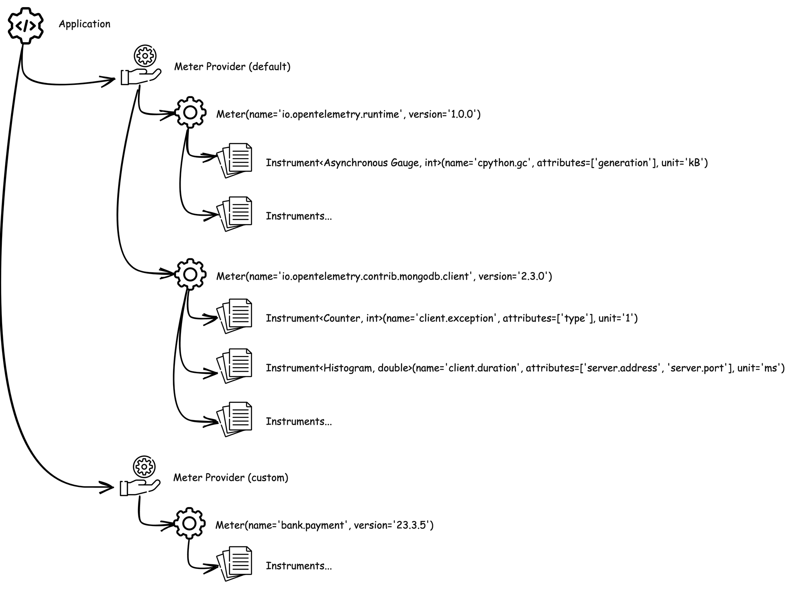
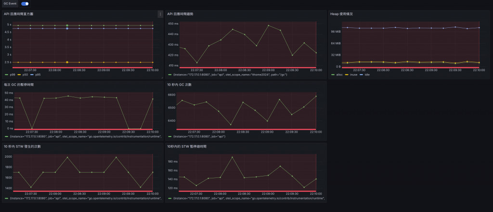
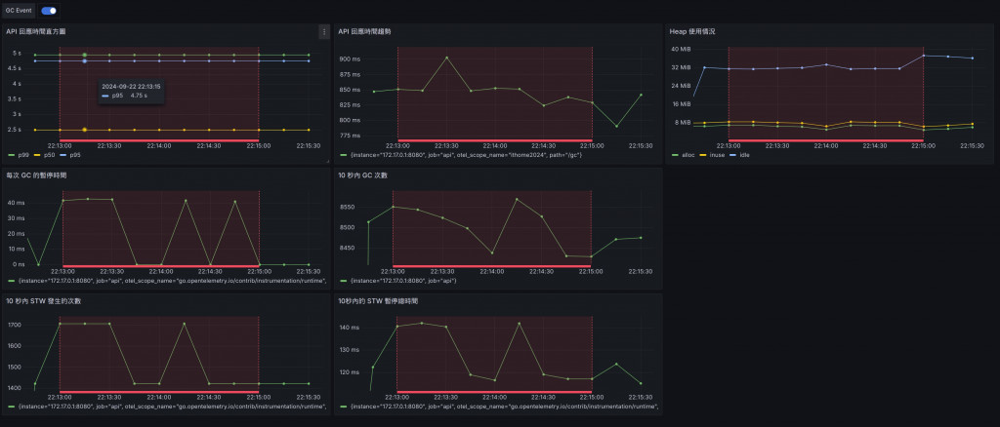
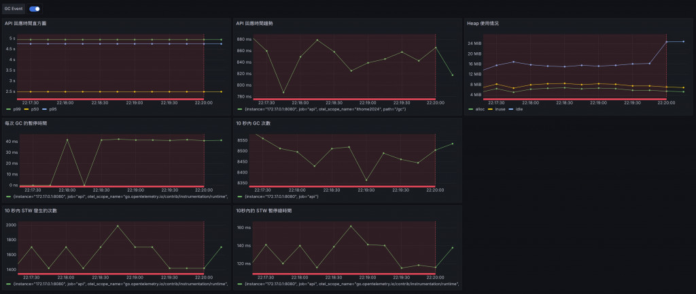

# D23 整合 OpenTelemetry Metrics

- 系列：應該是 Profilling 吧？系列 第 23 篇
- Day：23
- 發佈時間：2024-09-23 00:06:13
- 原文：[https://ithelp.ithome.com.tw/articles/10353488](https://ithelp.ithome.com.tw/articles/10353488)

今天將介绍如何使用 OpenTelemetry 整合Go 應用程式以及產生指標，並透過 Prometheus 和 Grafana 来可視化分析應用服務的性能。我們將重點關注不同的 `GOGC` 和`MEMLIMIT` 設置對 GC、STW 以及 API 回應時間的影響。

以下是整合了 `OpenTelemetry` 和 `Prometheus Exporter` 的 Go 範例程式碼：

```go
package main

import (
	"context"
	"flag"
	"fmt"
	"log"
	"net/http"
	_ "net/http/pprof"
	"os"
	"os/signal"

	"runtime/debug"
	"syscall"
	"time"

	"github.com/gin-gonic/gin"
	"github.com/prometheus/client_golang/prometheus/promhttp"
	"go.opentelemetry.io/contrib/instrumentation/runtime"
	"go.opentelemetry.io/otel"
	exporterProm "go.opentelemetry.io/otel/exporters/prometheus"
	"go.opentelemetry.io/otel/sdk/metric"

	"go.opentelemetry.io/otel/attribute"
	metricapi "go.opentelemetry.io/otel/metric"
)

var (
	meter               metricapi.Meter
	httpRequestsTotal   metricapi.Int64Counter
	httpRequestDuration metricapi.Float64Histogram
	activeConnections   metricapi.Int64UpDownCounter
)

func main() {
	gcPercent := flag.Int("per", 100, "number of workers to start")
	memLimit := flag.Int64("mem", 50, "number of tasks to process")
	flag.Parse()

	// Set the target percentage for the garbage collector. Default is 100%.
	debug.SetGCPercent(*gcPercent)

	// Set memory limit. Default is 50 MiB
	debug.SetMemoryLimit(*memLimit * 1024 * 1024)

	exporter, err := exporterProm.New()
	if err != nil {
		log.Fatal(err)
	}
	provider := metric.NewMeterProvider(metric.WithReader(exporter))
	defer func() {
		err := provider.Shutdown(context.Background())
		if err != nil {
			log.Fatal(err)
		}
	}()
	otel.SetMeterProvider(provider)

	// 初始化 Meter
	meter = otel.GetMeterProvider().Meter("ithome2024")

	// 建立指標
	httpRequestsTotal, _ = meter.Int64Counter(
		"http_requests_total",
		metricapi.WithDescription("Total number of HTTP requests"),
		metricapi.WithUnit("{call}"),
	)

	httpRequestDuration, _ = meter.Float64Histogram(
		"http_request_duration_seconds",
		metricapi.WithDescription("Duration of HTTP requests"),
		metricapi.WithUnit("s"),
	)

	activeConnections, _ = meter.Int64UpDownCounter(
		"active_connections",
		metricapi.WithDescription("Number of active connections"),
		metricapi.WithUnit("{item}"),
	)

	err = runtime.Start(runtime.WithMinimumReadMemStatsInterval(time.Second))
	if err != nil {
		log.Fatal(err)
	}

	// 啟動 Gin 引擎
	r := gin.New()
	r.Use(prometheusMiddleware)
	r.GET("/metrics", gin.WrapH(promhttp.Handler()))
	// 定義一個處理會觸發大量 GC 的路由
	r.GET("/gc", func(c *gin.Context) {
		// 不斷建立短生命物件，促使 GC 頻繁觸發
		for i := 0; i < 100; i++ {
			_ = createGarbage(i)
		}
        
		c.JSON(200, gin.H{
			"message": "GC triggered, check the server logs!",
		})
	})

	// 啟動一個獨立的 pprof HTTP 伺服器
	go func() {
		fmt.Println(http.ListenAndServe("localhost:6060", nil))
	}()

	go func() {
		// 啟動 HTTP 伺服器，監聽 8080 端口
		r.Run(":8080")

	}()
	signalCh := make(chan os.Signal, 1)
	signal.Notify(signalCh, syscall.SIGINT, syscall.SIGTERM)

	// Wait for termination signal
	<-signalCh
}

func createGarbage(n int) [][]byte {
	data := make([][]byte, 100)
	for i := range data {
		// 分配 1KB 的切片
		data[i] = make([]byte, 1024)
	}
	return data
}

// Middleware to track OpenTelemetry metrics
func prometheusMiddleware(c *gin.Context) {
	path := c.Request.URL.Path
	attrs := []attribute.KeyValue{
		attribute.String("path", path),
	}

	// 記錄請求開始時間
	startTime := time.Now()

	// 增加總請求計數器
	httpRequestsTotal.Add(c.Request.Context(), 1, metricapi.WithAttributes(attrs...))

	// 增加活動連接數
	activeConnections.Add(c.Request.Context(), 1)

	// 處理請求
	c.Next()

	// 計算請求持續時間
	duration := time.Since(startTime).Seconds()

	// 記錄請求持續時間
	httpRequestDuration.Record(c.Request.Context(), duration, metricapi.WithAttributes(attrs...))

	// 減少活動連接數
	activeConnections.Add(c.Request.Context(), -1)
}
```

其中`exporter, err := exporterProm.New()`，就是 OpenTelemetry 提供的 [Prometheus 指標資料導出器](https://github.com/open-telemetry/opentelemetry-go/tree/main/exporters/prometheus)。負責將 OpenTelemetry 蒐集到的指標資料轉換成 Prometheus 可以讀取得格式，並且提供一個 HTTP Endpoint。

`provider := metric.NewMeterProvider(metric.WithReader(exporter))`則是將 exporter 註冊到 MeterProvider 中，同時 MeterProvider 也是用來管理 Meter 進行計量數據的蒐集的核心組件。  
  
圖片出自 [OpenTelemetry 入門指南 5.3 Metric](https://github.com/tedmax100/OpenTelemetryEntryBeook/tree/main)

`meter = otel.GetMeterProvider().Meter("ithome2024")`則是建立 Meter，`ithome2024`則是Meter名稱，也是它的scope name。接著就能透過它建立`httpRequestsTotal`、`httpRequestDuration`和`activeConnections`這些指標了。

最後建立 Middleware `func prometheusMiddleware(c *gin.Context)`  來蒐集 API 請求資訊，這裡就能對指標物件進行紀錄操作。

然後我們就能開始做實驗了。

## 實驗與觀察

我們將透過調整 `GOGC` 和 `MEMLIMIT` 的數值，觀察對 `GC`、`STW`和`API反應時間`的影響。

預設：GOGC為`100%`，MEMLIMIT為`100 MiB`。  
降低GOGC：將GOGC設定為`50`，增加GC的頻率。  
降低MEMLIMIT：將MEMLIMIT設定為`50 MiB`，迫使GC更頻繁地運作。

測試場景 `wrk -d240s -c200 http://localhost:8080/gc`  
200個併發請求，維持四分鐘。

1. **GOGC 設定為 100%、MEMLIMIT 設定為 100 MiB** (測試數據為 109077 requests, Requests/sec: 454.46):

API 的回應時間表現相對穩定，平均延遲時間約為 439.71ms，並且擁有較高的請求處理吞吐量，每秒可以處理大約 454.46 次請求。  
從 Heap 使用情況來看，系統內存保持在 100 MiB 左右，STW（Stop-The-World）暫停時間每次大約在 30 ms 左右，並且 STW 發生的次數也較為穩定，約在每 10 秒內發生 1600-1800 次。  
可以看出在 GOGC 和 MEMLIMIT 設定都比較寬鬆的情況下，系統能夠較穩定地進行回收並保持高效能。  


2. **GOGC 設定為 50%、MEMLIMIT 設定為 100 MiB** (測試數據為 46909 requests, Requests/sec: 232.14):

降低 GOGC 設定使得 GC 的執行頻率更高，導致 API 的回應時間變得更高，平均延遲上升至 859.47ms，幾乎是之前測試的兩倍。  
請求的吞吐量也相應地下降，從 454.46 requests/sec 降至 232.14 requests/sec，顯示出 GC 開銷的增加對效能的顯著影響。  
STW 暫停時間和 GC 的頻率也變得更為頻繁，明顯影響了 API 的整體效能。  
這裡能觀察到，GOGC 降低至 50% 後，系統會更頻繁地進行 GC，導致 STW 次數增加和暫停時間變長，影響系統吞吐量與反應時間。  


3. **GOGC 設定為 50%、MEMLIMIT 設定為 50 MiB** (測試數據為 51522 requests, Requests/sec: 231.69):

雖然這次的 MEMLIMIT 減少至 50 MiB，但是請求的吞吐量和 API 回應時間與第二次測試（MEMLIMIT 設定為 100 MiB）相比並沒有明顯的變化，平均延遲時間為 861.31ms。  
這表明 MEMLIMIT 的影響較為有限，因為 GOGC 的降低已經主導了效能下降的主要原因。這可以解釋為即使內存壓縮到 50 MiB，由於 GOGC 仍然很低，GC 的觸發頻率過高導致大量的 STW 暫停。但也能發現這樣配置所佔用的 Heap 記憶體用量也是這三個測試中最低的。



由此我們可以得知在記憶體很有限的情況下，降低 GOGC 會顯著提高 GC 的頻率，導致每次請求的延遲時間上升，並降低整體吞吐量。這說明當 GOGC 設定過低時，系統會因為頻繁的 GC 停止而影響效能。在這樣的規格下，降低 MEMLIMIT 雖然也會促使 GC 更頻繁觸發，但其影響相對於 GOGC 來說較小。即使記憶體壓縮到了 50 MiB，當 GOGC 低時，記憶體配置的影響變得不那麼明顯。

## PGO 回饋優化

透過[D20 淺談回饋導向優化 PGO](https://ithelp.ithome.com.tw/articles/10353428)來產生 CPU profile並編譯優化。

```
curl -o cpu.pprof http://localhost:6060/debug/pprof/profile\?seconds\=30
go build -pgo=cpu.pprof -o ithome main.go
./ithome -per 100 -mem 100

wrk -d240s -c200 http://localhost:8080/gc
Running 4m test @ http://localhost:8080/gc
  2 threads and 200 connections
  Thread Stats   Avg      Stdev     Max   +/- Stdev
    Latency   401.07ms  114.99ms   1.13s    68.67%
    Req/Sec   250.29     44.13   430.00     70.59%
  119602 requests in 4.00m, 19.73MB read
Requests/sec:    498.14
Transfer/sec:     84.16KB
```

回應速度有變快一點點^^

## 小結

通過整合 Prometheus，你可以實時地監控 Go 應用程式的性能，包括響應時間的直方圖、時間序列，還有 GC 相關的指標。這樣你就可以透過 Prometheus 來定位垃圾回收對於應用性能的影響，並且針對 STW 的頻率和持續時間進行優化。此外，搭配 pprof 的火焰圖，你也可以更具體地找出 GC 的瓶頸。

## 補充

[`go.opentelemetry.io/contrib/instrumentation/runtime`](https://github.com/open-telemetry/opentelemetry-go-contrib/tree/main/instrumentation/runtime) 內建的指標說明。  
這些 Go runtime 指標的含義。這些指標對於監控 Go 應用程式的效能和狀態非常有用，尤其是在偵錯和效能最佳化時。

1. **runtime.go.cgo.calls**  
   意義：目前程式中中呼叫 cgo 函數的次數。  
   如果 cgo 呼叫次數過多，可能會影響效能，因為每次呼叫都涉及到 Go 和 C 之間的上下文切換。
2. **runtime.go.gc.count**  
   意義：已完成的 GC 循環次數。
3. **runtime.go.gc.pause\_ns** （單位：奈秒）  
   意義：GC Stop-The-World，STW 暫停所花費的奈秒數。  
   較高的暫停時間可能會導致應用程式回應變慢，需要優化記憶體分配或調整 GC 參數。
4. **runtime.go.gc.pause\_total\_ns** （單位：奈秒）  
   意義：自程式啟動以來，GC STW 暫停的累積奈秒數。
5. **runtime.go.goroutines**  
   意義：目前存在的 Goroutine 數量。  
   過多的 Goroutine 可能導致記憶體和調度器壓力，需要確保 Goroutine 的建立和銷毀得到適當管理。
6. **runtime.go.lookups**  
   意義：運行時執行的指標查找次數。
7. **runtime.go.mem.heap\_alloc** （單位：位元組）  
   意義：已指派的 Heap 的位元組數。  
   表示目前分配在 Heap 上的記憶體大小。用於儲存動態分配的對象，生命週期由垃圾回收器管理。  
   高 Heap 記憶體使用 可能導致更多的 GC，需要優化記憶體使用或檢查是否有記憶體洩漏。
8. **runtime.go.mem.heap\_idle** （單位：位元組）  
   意義：處於 Idle 狀態的 Heap 位元組數。  
   這些記憶體已經從作業系統獲取，但尚未用於分配物件。  
   Heap 記憶體 過多可能意味著記憶體未被充分利用。
9. \*\*runtime.go.mem.heap\_inuse \*\*（單位：位元組）  
   意義：正在使用的 Heap 位元組數。  
   表示實際用於儲存 Heap 上物件的記憶體大小。  
   Heap 使用記憶體 越高，可能會導致更頻繁的垃圾回收。
10. **runtime.go.mem.heap\_objects**  
    意義：已分配的 Heap 對象數量。  
    大量的小物件 可能會增加 GC 的負擔。
11. **runtime.go.mem.heap\_released** （單位：位元組）  
    意義：已歸還給作業系統的空閒 Heap 記憶體位元組數。  
    Go 運行時會將不再需要的 Heap 記憶體歸還給作業系統，以減少應用程式的記憶體佔用。  
    已釋放的堆記憶體 越多，表示記憶體管理更有效。
12. **runtime.go.mem.heap\_sys** （單位：位元組）  
    意義：從作業系統取得的 Heap 總位元組數。  
    這是 Go 運行時向作業系統請求的 Heap 總量，包括正在 inuse 和 idle 的部分。  
    可以用於評估應用程式的記憶體佔用。
13. **runtime.go.mem.live\_objects**  
    意義：存活物件的數量，即累積的分配數減去釋放數。  
    這個指標可以幫助了解物件的生命週期和記憶體佔用。
14. **runtime.uptime** （單位：毫秒）  
    意義：表示應用程式已運行的時間。

這些指標提供了 Go 應用程式在運行時的各種性能和狀態資訊。

- GC 相關指標（如 runtime.go.gc.count、runtime.go.gc.pause\_ns）可以幫助您了解 GC 的行為，優化記憶體分配，減少停頓時間。
- 記憶體使用指標（如 runtime.go.mem.heap\_alloc、runtime.go.mem.heap\_sys）可以幫助您監控記憶體消耗，並偵測記憶體洩漏或過度分配的情況。
- Goroutine 指標（runtime.go.goroutines）有助於了解並發執行的程度，避免過多的 Goroutine 導致資源耗盡。
- 運行時指標（如 runtime.uptime）可以用來計算其他指標的速率或平均值。
