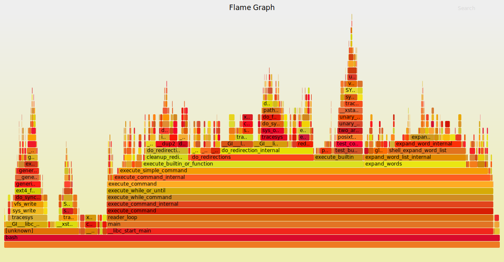
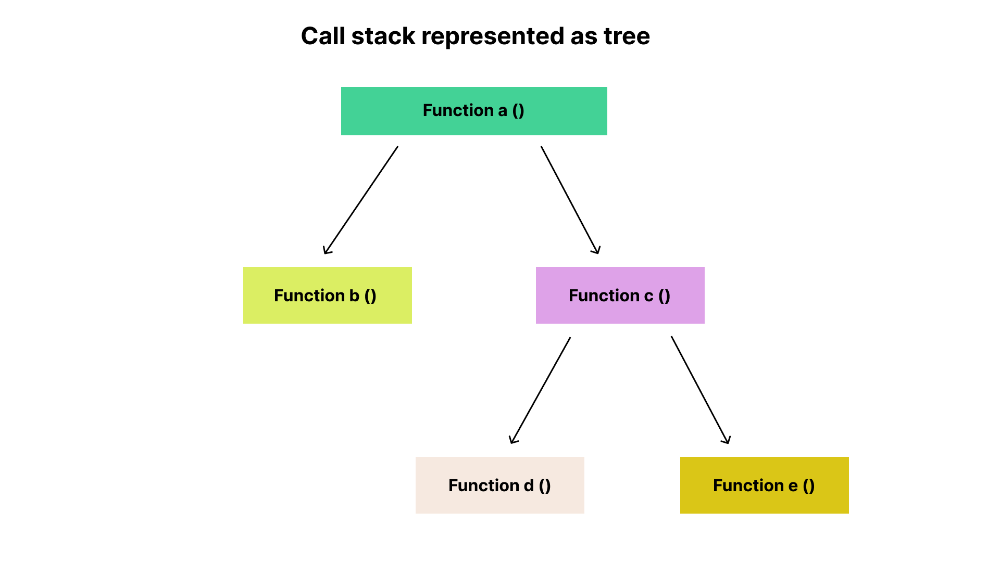
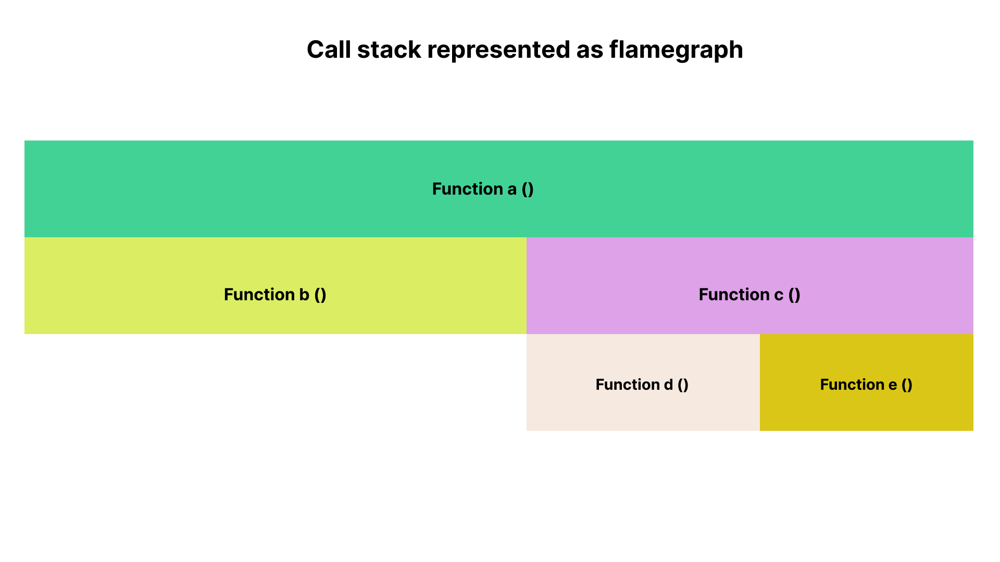
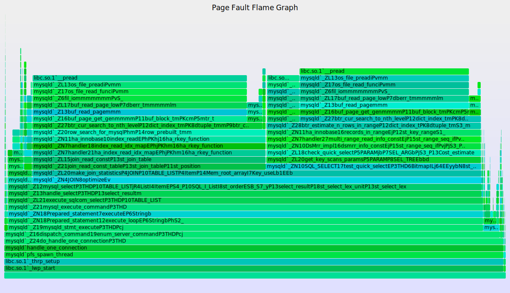
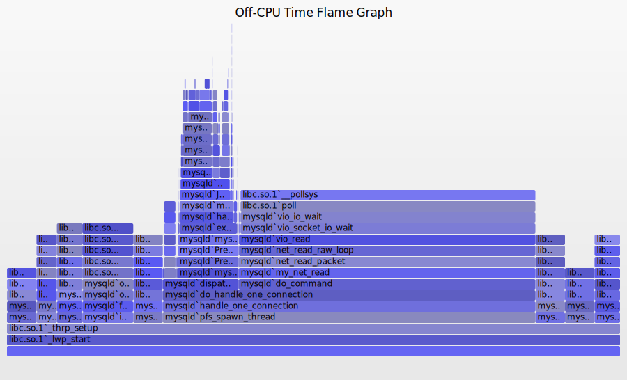
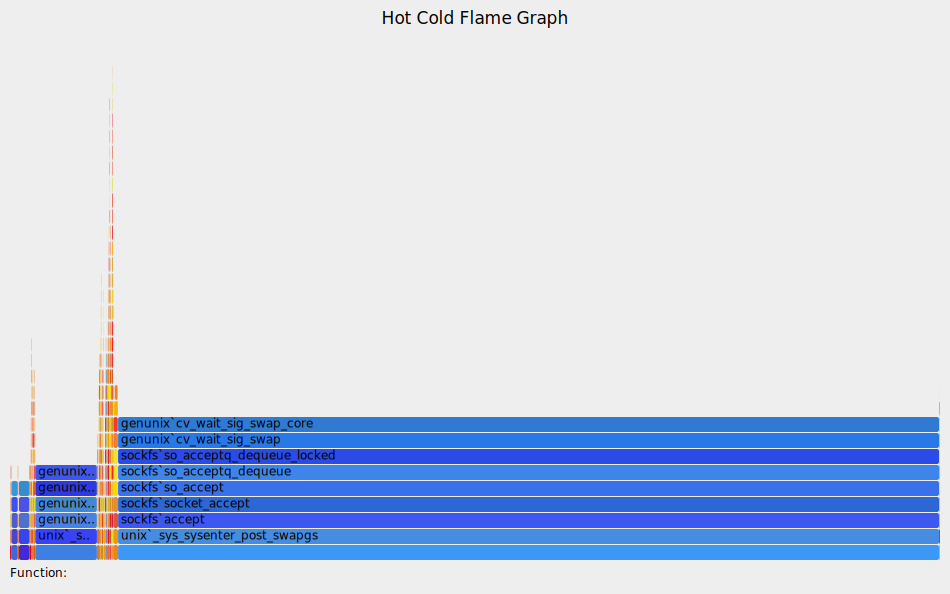
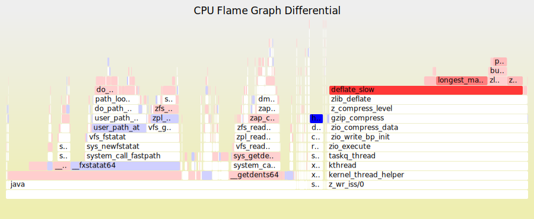
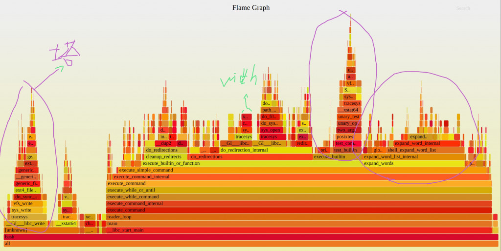
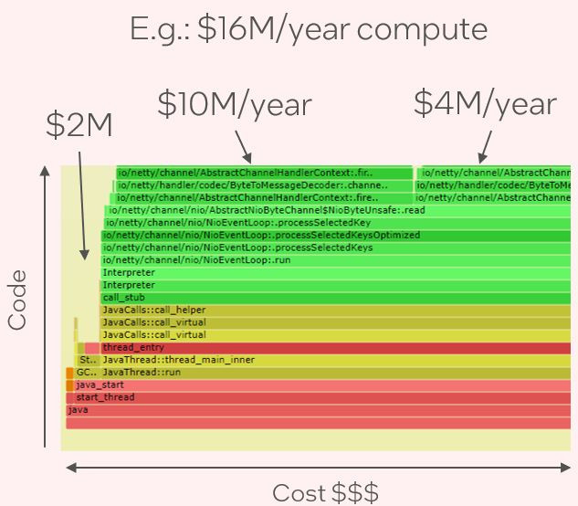

# D24 簡介 Flame Graph

- 系列：應該是 Profilling 吧？系列 第 24 篇
- Day：24
- 發佈時間：2024-09-24 00:03:40
- 原文：[https://ithelp.ithome.com.tw/articles/10356636](https://ithelp.ithome.com.tw/articles/10356636)

效能優化在軟體開發過程中扮演著至關重要的角色。然而，隨著系統的複雜度增加，定位效能瓶頸變得越來越困難。傳統的日誌和監控手段往往無法直觀地展示系統內部的運作。 \*\*火焰圖（Flame Graph）\*\*作為一種新穎的視覺化工具，為我們提供了全局視角，幫助快速識別效能熱點。透過本文的介紹，希望讀者能了解火焰圖的原理和應用方法，並將其運用於實際的效能分析和最佳化。

我們之前在[D22 看見 GC](https://ithelp.ithome.com.tw/articles/10354730)，曾經提到火焰圖（Flame grpah）。今天來簡短介紹它。

## Flame Graph

火焰圖是一種用於可視化層次結構資料的工具，最初是為了直觀展示軟體性能剖析（Profilling）過程中取樣的 Stack trace 資料。它可以快速、準確地識別最頻繁執行的程式碼路徑，也能說是應用程式中最耗費資源的部份。因為由底部開始往上延，又是紅色色調，很像火焰故而得名火焰圖。

[火焰圖](https://github.com/brendangregg/FlameGraph)由 Bredan Gregg 開發的，它可以生成互動式的 SVG。

火焰圖不僅適用於 CPU 效能剖析，還可以用於其他類型的數據，例如：

- 記憶體使用情況（Memory）
- 非 CPU 時間分析（Off-CPU）
- 熱點和冷點分析（Hot/Cold）  
  差異分析（Differential）

此外，火焰圖也可以用於任何層次結構的數據，例如檔案系統內容，並與樹狀圖（Treemaps）和旭日圖（Sunbursts）進行比較。[Flame Graphs vs Tree Maps vs Sunburst](https://www.brendangregg.com/blog/2017-02-06/flamegraphs-vs-treemaps-vs-sunburst.html)

## 火焰圖的結構與原理

- - X 軸（橫軸）：表示 Stack 的樣本數量，通常依照字母順序排序（非時間順序）。這意味著 X 軸上的位置並不代表時間的流逝，而是為了展示所有不同的程式碼路徑。
- Y 軸（縱軸）：表示 Stack 的深度，從底部的零開始計數。每向上一層，就表示 call stack 的更深一層。
- 每個矩形框代表 Stack 裡的一個函數或方法呼叫（即一個 Stack Frame）。
- 矩形框的寬度表示函數在 CPU 上執行，或者是它的上級函數在 CPU 執行的時間（基於採樣計數）。寬框的函數可能會比窄框的函數慢，也可能是因為只是很頻繁的被調用。這裡不會顯示調用計數（且是通過採樣的可能計數也不準）。

矩形的頂部邊緣表示目前正在消耗 CPU 資源的函數。

-矩形的下方表示其所呼叫的祖先函數，即呼叫路徑。

- 色調，色調表示程式碼類型。例如紅色色調表示 user space 層級的程式碼，橙色色調表示 kernel space，黃色表示 C++ 的程式碼等等的。因為平常我們執行都是屬於user space 層級的程式碼路徑所以都是紅色色調。
- 也透過顏色漸變來傳達訊息，例如記憶體使用量或 CPU 耗時。

### 反過來的火焰圖

不難發現之前 pprof 的火焰圖，以及之後要介紹的 Pyrscope 的火焰圖方向正好是上下顛倒了。  
這其實叫`Icicle graph`冰柱圖，不同於火焰圖從底部開始，冰柱圖是從頂部開始。

## 火焰圖的類型

- **CPU 火焰圖**  
  顯示哪些程式碼路徑正在消耗 CPU 資源，以及消耗了多少。  
  幫助識別效能瓶頸和優化機會。
- **記憶體火焰圖**  
  展示記憶體的分配情況，哪些函數在分配更多的記憶體。  
  有助於發現記憶體洩漏或優化記憶體使用。

- **Off-CPU 火焰圖**  
  顯示程式在等待狀態（如 I/O、鎖、睡眠）下的堆疊情況。  
  幫助分析阻塞和等待問題。

- **熱點/冷點火焰圖**  
  熱點圖：強調高頻率的程式碼路徑。  
  冷點圖：強調低頻率的程式碼路徑，可能隱藏著效率低的部分。

- **差異火焰圖**  
  比較兩個火焰圖之間的差異，突出變化的部分。  
  用於在程式碼變更或配置調整前後，觀察效能的改進或退化。

## 如何解讀火焰圖

在解讀火焰圖時，首先要找到最寬的“塔”，也就是由多個堆疊框架堆積而成的區域。這些寬塔代表了消耗最多資源的程式碼路徑。由於空間限制，較窄的塔可能無法顯示函數名稱，但這也意味著它們對整體性能的影響較小。

理解這些寬塔的呼叫關係，可以幫助我們了解程式效能的主要瓶頸所在，從而針對性地進行最佳化。

## 產生火焰圖的步驟

- 收集效能資料：使用效能分析工具（如 perf、dtrace、eBPF 等）收集程式的堆疊追蹤資料。
- 處理資料：使用 Brendan Gregg 提供的腳本（如 stackcollapse.pl）將收集到的堆疊資料折疊成適合產生火焰圖的格式。
- 產生火焰圖：使用 flamegraph.pl 腳本產生火焰圖的 SVG 檔案。
- 檢視與分析：在瀏覽器中開啟產生的 SVG 文件，利用互動功能（如滑鼠懸停顯示詳情、點擊縮放、搜尋功能）深入分析效能問題。

## 火焰圖的優勢

- 直覺性：以圖形方式展示複雜的呼叫關係和資源消耗情況，易於理解。
- 全面性：能夠涵蓋整個程式的效能數據，而不僅僅是某個模組或函數。
- 可互動性：支援放大、縮小和搜索，方便深入分析。
- 高效性：幫助開發者快速定位效能瓶頸，節省調試和優化時間。

## 小結

火焰圖是一種強大的效能分析和視覺化工具，能夠幫助我們深入理解程式的執行情況和資源消耗。透過對火焰圖的解讀，我們可以快速定位效能瓶頸，發現潛在的問題，並指導最佳化工作。無論是在 CPU 效能調優、記憶體最佳化，或是分析阻塞和等待問題，火焰圖都提供了直覺而有效的手段。

[參考 Brendan 個人網站](https://www.brendangregg.com/flamegraphs.html)

---

補充  
A Must read , AI flame graphs by Brendan Greg,

1. Y axis helps visually analyse the call stacks
2. X-axis helps analyse cpu costs , compute costs,

<https://www.brendangregg.com/blog/2024-10-29/ai-flame-graphs.html>
