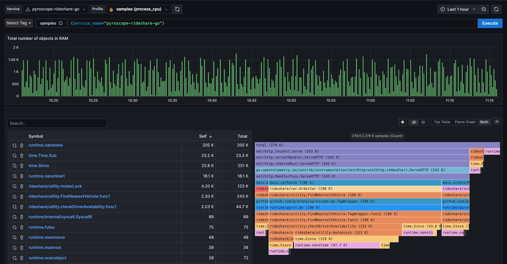
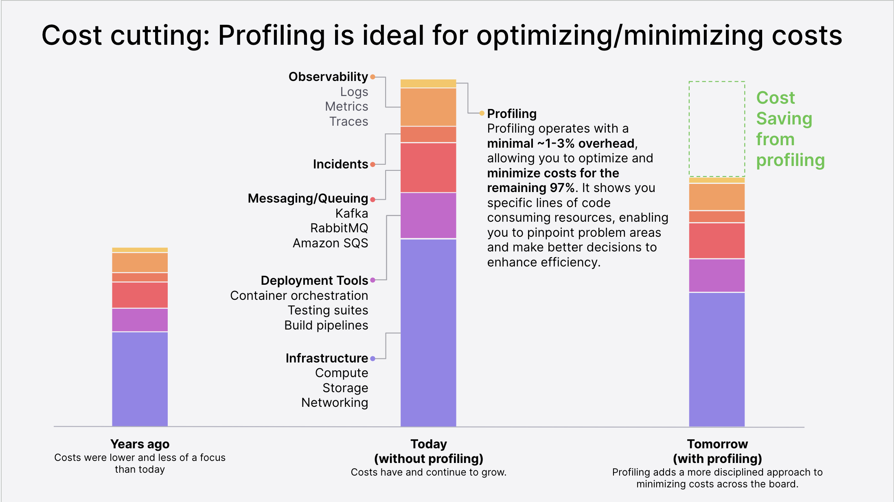

# D25 Pyroscope 與 Profiling

- 系列：應該是 Profilling 吧？系列 第 25 篇
- Day：25
- 發佈時間：2024-09-25 00:01:41
- 原文：[https://ithelp.ithome.com.tw/articles/10353443](https://ithelp.ithome.com.tw/articles/10353443)

終於來到系列主題的 Profiling 了。Profiling作為一種強大的工具，能夠幫助開發者和運維人員深入了解程式在執行過程中的行為，找出資源的主要消耗點，並針對性地進行優化。

---

# Pyroscope

  
[Pyroscope](https://pyroscope.io/) 是一個開源的、專門用來分析應用程式效能的持久化 CPU 和記憶體使用分析工具。它常被用來進行持續的性能剖析，幫助開發者識別出系統瓶頸和性能問題。Pyroscope 會以低開銷（overhead）持續地對應用進行性能數據的收集，並能夠通過直觀的 UI 提供火焰圖等視覺化數據，來展示應用的 CPU、內存和其他資源的使用情況。

## Pyroscope 的核心功能

- **持續性能剖析 (Continuous Profiling)**： Pyroscope 可以持續地對應用進行性能剖析，並且能夠將數據持久化存儲。這樣開發者可以查看系統在不同時間段的性能變化，而不僅僅是單一時間點。
- **火焰圖**： Pyroscope 生成火焰圖，這是一種直觀的方式來展示 CPU、內存等資源的消耗情況。火焰圖的寬度表示方法的資源消耗程度，越寬表示該方法消耗的資源越多。通過火焰圖，開發者能快速找到應用的性能瓶頸。
- **支持多種後端和數據來源**： Pyroscope 支持多種後端存儲，如文件系統、Amazon S3 等，並且它可以與多種數據來源集成，比如：
- Go 語言內建的 pprof
- Python 的 py-spy
- Java 的 async-profiler
- Ruby 的 rbspy
- 低成本開銷 (Low Overhead)： Pyroscope 在進行性能分析時對應用本身的性能影響極小，確保它不會引入額外的瓶頸或資源佔用問題，適合長時間運行的營運環境。
- 歷史數據回顧與比較： Pyroscope 可以回顧過去的性能數據，並允許你將不同時間段的數據進行比較，以了解某些變更（如代碼改動、配置調整）對系統性能的具體影響。

## Pyroscope 的典型使用場景

- 應用性能監控：Pyroscope 常被用於持續監控服務端應用程式的性能，找出 CPU 和記憶體配置的使用瓶頸。它適合在開發和營運環境中進行長期的性能分析。
- 容量規劃與性能優化：Pyroscope 幫助開發者理解應用在哪些操作上消耗了最多的 CPU 或記憶體配置資源，從而能夠進行優化，或提前做容量規劃。
- 診斷性能問題：當應用表現出不可預測的性能問題（如回應太慢或資源使用飆升）時，Pyroscope 能夠快速找到相關的性能瓶頸。

這些場景我們從一開始探討系統資源，性能工程的基本定理、到性能指標，到後面用 Go tool trace 以及 pprof 協助來發現以上場景出現的問題。

接著幾天會介紹更多關於 Pyroscope 的內容。

# Profiling

Profiling 是軟體開發中的一種技術，用來測量與分析程式在運行時的行為。透過 profiling，開發者可以識別出程式中哪些部分消耗了最多的資源，例如 CPU 時間、記憶體或 I/O 操作。這些資訊可用來優化程式，使其運行更快速或使用更少的資源。

Pyroscope 可以用於傳統 Profiling 和持續 Profiling。

## Profiling 類型

### 傳統 Profiling（非持續 non-continuous）

傳統的 Profiling，通常被稱為`基於取樣（sample-based）`或`基於檢測（instrumentation-based）`的 Profiling，有其根源於計算機科學早期發展階段。當時的主要挑戰是了解程式如何利用有限的計算資源。通常是在特定的時間範圍內手動啟動，並收集程式執行狀態的快照。這意味著開發者通常會在開發環境中或在特定的除錯過程中進行一次性的性能剖析。一旦剖析完成，數據就會被儲存並用於後續分析。取樣方法也會被用來減少性能影響。但應用程式還是不會持續收集數據，也不會覆蓋長時間的執行周期。

基於取樣的 Profiling：在此方法中，profiler 會定期中斷程式，捕捉每次的程式狀態。透過分析這些快照，開發者可以推測程式碼中各部分執行的頻率。

基於檢測的 Profiling：在此方法中，開發者會在程式中插入額外的程式碼來記錄其執行情況。這種方法提供了詳細的內容，但可能會改變程式的行為，因為增加了額外的負擔。

### 持續 Profiling

隨著軟體系統的複雜性和規模增長，傳統 Profiling 的局限性日益顯現。某些在開發或測試環境中不易察覺的問題，可能會在營運環境中出現。

因此，持續 Profiling（Continuous profiling）誕生了。這種方法會在後台持續收集 Profiling 數據，且幾乎不影響系統運行。這樣開發者能夠全方位觀察程式的行為，幫助識別偶發或長期的性能問題。持續 Profiling 也是使用 sampling，每隔幾秒取一次程式的執行狀態，來降低對系統的影響。這樣的方式不僅能降低開銷，還能持續收集 CPU 使用率、多執行緒操作、記憶體使用及延遲等資料，從而在不影響使用者體驗的情況下保持性能監控。

#### 傳統 Profiling 的優勢

**精確性**：  
傳統 Profiling 提供非常細緻的數據，能夠深入了解程式中每個具體部分的執行情況。這使得開發者可以精準地定位哪些程式碼佔用了最多的資源，進行針對性的優化。通常用於短期內對性能問題進行診斷。例如，當開發者發現某個函數運行過慢時，可以啟動傳統 Profiling，使用取樣技術來抓取函數調用的快照，然後分析哪裡存在性能瓶頸。

**控制性（Control）**：  
開發者可以根據需要啟動和停止 Profiling，讓其在特定場景下運行，這樣可以更加集中地進行效能測試與分析。

**詳細報告**：  
透過傳統的 Profiling，開發者可以獲取非常詳細的程式執行報告。這些報告能幫助開發者快速識別和定位效能瓶頸，例如哪段程式碼消耗了最多的 CPU 或記憶體。

#### 持續 Profiling 的優勢

**持續監控**：  
與傳統 Profiling 不同，持續 Profiling 提供不間斷的監控，用來識別隨時間變化的性能問題或偶發問題。它讓開發者能夠從整體上持續觀察程式的行為，識別隨著時間變化的性能問題。

**主動檢測效能瓶頸**：  
透過持續收集數據，持續 Profiling 能夠在問題發生前即識別並解決效能瓶頸，從而減少系統停機時間，並確保系統穩定性與順暢運行。

**廣泛的效能視角**：  
持續 Profiling 提供跨平台的洞察，涵蓋各種技術 stack 和 OS。這使得開發者能夠更全面地了解不同環境下的效能問題，並找到潛在的優化點。

> 這是最大的優點，能讓各種profile都能整合在一個分析系統中。

**非侵入式運行**：  
持續 Profiling 專為在背景中以低成本的方式運行而設計，這樣可以不影響現有的營運環境，確保程式能夠平穩運行，不因 Profiling 的操作而出現性能下降。

**即時回應**：  
持續 Profiling 讓團隊能夠即時採取行動，及時解決發現的問題，避免問題在事後再進行處理。這在維持系統高可用性時尤其重要。

> 因為一直在持續的檢測，所以不用等出事了，再來像傳統profiling一樣，才來打開profiling開始錄製，再來分析。可能問題沒法重現而被錄製到，或者分析的時間大大延遲了解決問題的黃金時刻。

#### Profiling 的劣勢

上面都是 profiling 的優勢, 但profiling 之所以在開發團隊中很少有人討論甚至使用就是因為有以下劣勢

**缺少業務屬性**：  
因為關注點都在user/kernel space的執行路徑上,不知道現在這個採樣在哪個時機段為哪個業務行為服務, 除非在很單純的壓力測試場景中, 才好判斷。

**kernel space 的知識太硬核** ：  
kernel space的調用和相關知識對於決大部分開發人員而言太過陌生,導致即使看到了 kernel 相關系統調用比如說 futex 執行時間很長,其實也不能理解這意味著什麼

## 持續 Profiling 使用時機

持續 profiling 是一種系統化的方法，用來收集和分析來自營運系統的效能數據。傳統上，profiling 常作為一種臨時的除錯工具，特別是在 Go 和 Java 等語言中，通常會在本地執行基準測試工具，生成像 Go 的 pprof 文件，或是在 Java 中從營運環境中提取 JFR 文件來進行分析。這些方法適合用來除錯，但對於營運環境並不適用。

持續 profiling 是一種現代化的方法，它更加適合並且能擴展至營運環境。這種方法使用低成本開銷的採樣技術來從營運系統中收集性能分析數據，並將這些數據存儲在資料庫中供日後分析。透過這種方式，開發者能夠獲得更全面的視角來了解應用程式在營運環境中的行為。

### 持續 Profiling 的應用場景

採用像 Pyroscope 這樣的持續 profiling 工具，能帶來許多商業上的優勢：

**降低運營成本**：  
持續監控和優化資源使用，能大幅減少雲端和基礎設施的開銷。透過 Pyroscope 提供的效能洞察，團隊能夠識別並消除低效率的地方，從而在觀測、事故管理、消息排隊系統、部署工具及基礎設施上節省大量成本。

  
上圖說明了使用 Profiling（效能分析）對於優化和降低成本的關鍵作用。圖表分為三個時期：「過去」、「現在（沒有使用 Profiling）」、「未來（使用 Profiling）」。

- 過去（Years ago）：  
  過去的基礎設施、運營和觀測成本較低，成本並不是企業的主要關注點。這段時間，技術環境相對簡單，運營成本不如現在這麼高。
- 現在（Today, without profiling）：

  - Observability：現在的系統需要觀測性工具來監控運行狀況，使用了像是日誌、指標和追蹤的技術，這些都會增加基礎成本。
  - Incidents：事故的管理成本也上升，包括檢測、排查和解決問題的過程。
  - Messaging/Queuing：使用事件佇列（如 Kafka、RabbitMQ 和 Amazon SQS）來處理大型系統間的事件傳遞，這些基礎設施的成本不斷增長。
  - Deployment Tools：部署工具（如容器編排、測試套件和建置流水線）的使用是現代軟體開發和運維的關鍵，它們也帶來了相當的成本。
  - Infrastructure：包括計算資源、儲存和網路，這些是技術基礎的核心支出項目，隨著企業需求增加，這些成本也在不斷上升。
- 未來（Tomorrow, with profiling）：

  - Cost saving from profiling（透過 Profiling 節省成本）：展示了使用 Profiling 所能實現的成本節省。
  - Profiling 只需要額外的 1-3% 的開銷，即可持續監控系統效能，並幫助開發者針對佔用最多資源的程式碼進行優化。 之前提到 PGO 約能帶來2-7%的改善空間，而 pprof 採集成本只需要額外的1-3%，是不是賺！
  - Profiling 能精確指出哪些程式碼行耗費了最多的計算資源，使得開發者能夠針對性地優化程式碼，從而在可觀測性、事故管理、事件佇列 和 基礎設施 的使用上，實現更高效能，節省下剩餘的 97% 成本。
  - 透過持續的 Profiling，企業能夠提升效率並降低不必要的開銷，最終在未來達到更低的成本基線。

> `站在未來，規劃現在`

**降低延遲**：  
Pyroscope 透過識別程式碼層面的效能瓶頸，有助於降低應用程式的回應時間，從而提升用戶體驗。這樣的效能改進還能帶來更好的商業結果，如提升客戶滿意度和增加營收。

**加強事故管理**：  
Pyroscope 能夠快速提供應用程式性能問題的即時洞察，讓團隊能夠迅速定位事故的根源，縮短問題的 MTTR，從而提升系統的穩定性和用戶滿意度。

# 本日小結

持續 Profiling 不僅能夠實現應用程式的精確監控，還為企業帶來了長期的成本優化效益。Pyroscope 作為一個高效能的持續 Profiling 工具，能夠以極低的資源消耗為應用程式提供詳細的性能數據。它不僅能夠揭示即時性能問題，還能通過火焰圖等視覺化工具幫助開發者快速定位瓶頸，從而實現系統的優化與改進。隨著技術的發展，持續 Profiling 已經成為開發者和運維團隊的重要資源，無論是在生產環境中還是在開發過程中，透過持續 Profiling 我們能夠更好地理解系統的行為，並提前預防潛在的性能問題。透過這種全局的性能洞察，我們不僅能提升應用程式的運行效能，還能有效降低企業的運營成本，實現更高的資源利用率和用戶滿意度。
