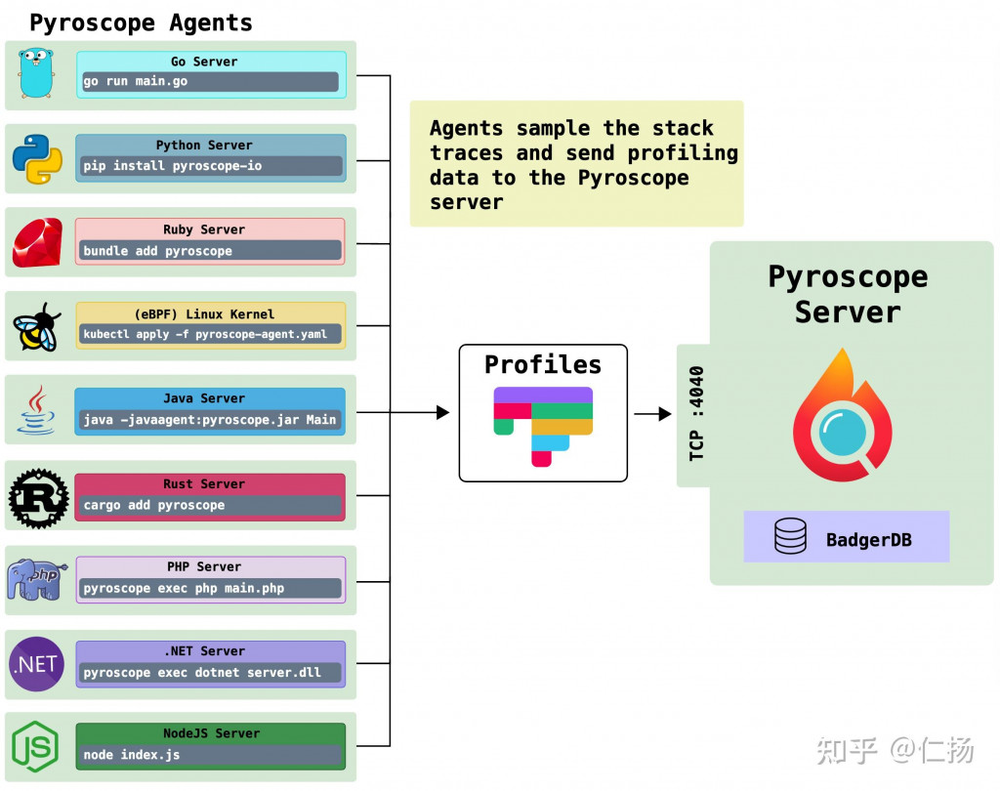
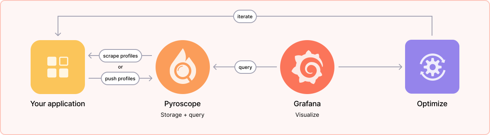
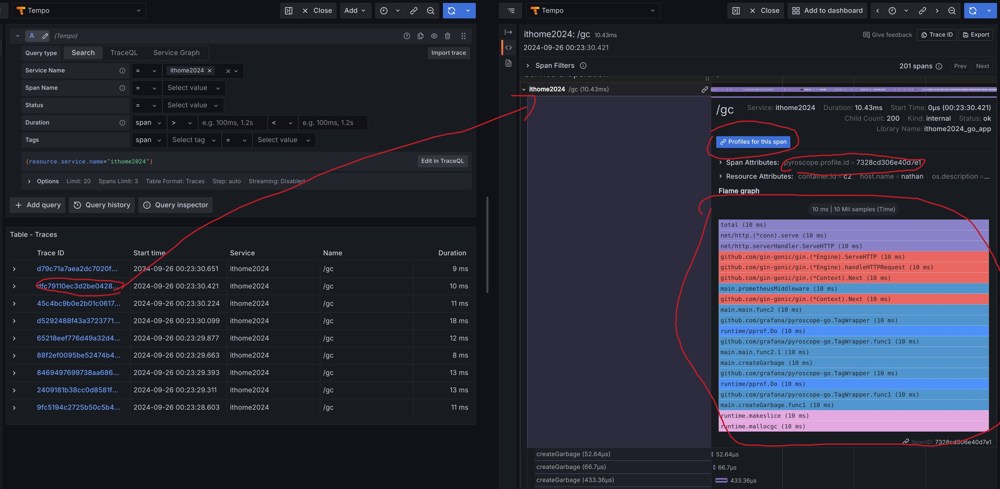
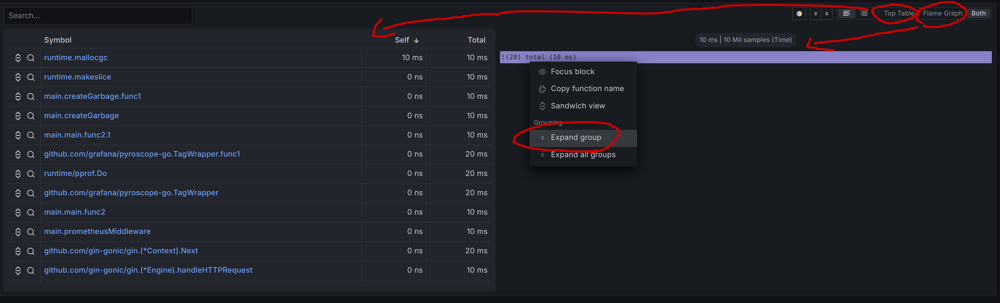
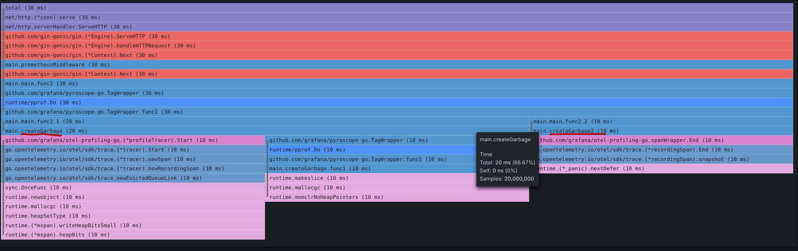

# D26 關聯 Profile 與 Trace

- 系列：應該是 Profilling 吧？系列 第 26 篇
- Day：26
- 發佈時間：2024-09-26 00:58:48
- 原文：[https://ithelp.ithome.com.tw/articles/10354731](https://ithelp.ithome.com.tw/articles/10354731)

# Grafana 與 Pyrscope 的合作

Pyrscope 以前是一個開源的持續 Profiling 專案，[直到 2023 年被 Grafana 收購](https://grafana.com/blog/2023/03/15/pyroscope-grafana-phlare-join-for-oss-continuous-profiling/?pg=blog&plcmt=body-txt)，就成為 Grafana 生態圈中的一員。

在這之前 Grafana 生態圈其實有自己的開源持續 Profiling 專案`Phlare`，於 2022 年推出。但在這時，2021年推出的 Pyrscope 更知名更多公司在用。收購後兩個專案合為一個`Grafana Pyrscope`。所以這裡以後提到 Pyrscope 都是指 Grafana Pyrscope。

OpenTelemetry 已經有計畫將 Profile 作為第四種遙測訊號，所以 Grafana Lab 與其自己開發，不如收購整合已經成熟的 Pyrscope。這裡的成熟指的是針對各種程式語言與 profile 格式的整合程度，Pyrscope 顯然是超過 Phlare 的。



上圖的 Grafana Agent 也能想成是 OpenTelemetry Collector Sidecar 容器一樣的角色，負責收集某一個 k8s pod 中所有容器的 profile，在集中轉發至 Pyrscope 。這種用法，如果有使用過 OpenTelemetry 的讀者想必應該很熟悉。

而左上角中的 Pyrscope SDK 其作用也與 OpenTelemetry SDK 一樣，負責設定與產生、傳送遙測訊號。

以上與 OpenTelemetry 有關的內容，可以參加[OpenTelemetry 入門指南 Ch 5、6、7](https://ganhua.wang/opentelemetry#heading-5pys5pu455uu6yye)

## 迭代過程與 Pyrscope



- Step 1 : 收集分析數據  
  Grafana Pyrscope 從公開pprof端點的應用程式收集 CPU 和記憶體設定檔。
- Step 2︰運行 Pyrscope  
  透過將 Pyrscope 作為單一進程來啟動，只需幾分鐘即可開始。當您準備好從更多應用程式收集設定檔或想要高可用性設定時，只需添加更多主機資源並水平擴展即可。剩下的事情就由 Pyrscope 來處理。
- Step 3︰在 Grafana 中可視化  
  使用 Grafana 的 Pyrscope 資料來源，查詢 Pyrscope 中儲存的資料，並按相關時間範圍和 Label 進行切片和切區塊。 Grafana 的火焰圖、直方圖和表格視圖可讓您以不同的方式視覺化您的分析數據，並從中建立強大的儀表板。
- Step 4︰優化您的程式碼  
  Grafana Pyrscope 可協助您識別程式碼中最慢且最耗記憶體的部分，以便開發人員能夠深入並優化這些區域。這導致：

  - 更快的應用程式
  - 更可靠的應用程式和更少的 OOM 崩潰
  - 使用更少 CPU 和記憶體的經濟高效的應用程序

這樣的流程如同我們在[D19 讓系統數據看得見（可觀測性驅動開發 ODD）](https://ithelp.ithome.com.tw/articles/10353199)與[D20 淺談回饋導向優化 PGO](https://ithelp.ithome.com.tw/articles/10353428) 的結合，我們可以從頭到尾都在一個工具視窗中看見分析與比對，這是很舒服的一件事情。

## 將 Profile 寫至 Pyrscope

首先我們需要安裝兩個套件`github.com/grafana/otel-profiling-go`與`github.com/grafana/pyroscope-go`。

`pyroscope-go`是Pyroscope Golang Client。主要功能是透過 pprof 負責檢測並產生各種 Profile 類型的資料，以及將 Profile 資料傳送至 Pyroscope 後端服務。

而`otel-profiling-go`主要是提供由 OTel 的 trace 標準，將 trace 與 profiling 結合整合。

```go
import (
	otelpyroscope "github.com/grafana/otel-profiling-go"
	"github.com/grafana/pyroscope-go"
)

_, err = pyroscope.Start(pyroscope.Config{
        // 被檢測的盈用程式名稱
		ApplicationName: "ithome2024",
        // Pyroscope 服務位置
		ServerAddress:   "http://localhost:4040",
		Logger:          pyroscope.StandardLogger,
        // 用來方便查詢用的標籤
		Tags: map[string]string{
			"region":             "taiwan",
			"hostname":           "nathan",
			"service_git_ref":    "HEAD",
			"service_repository": "https://github.com/grafana/pyroscope",
			"service_root_path":  "examples/language-sdk-instrumentation/golang-push/rideshare",
		},
        // 指定要產生哪些類型的 profile
		ProfileTypes: []pyroscope.ProfileType{
			pyroscope.ProfileCPU,
			pyroscope.ProfileInuseObjects,
			pyroscope.ProfileAllocObjects,
			pyroscope.ProfileInuseSpace,
			pyroscope.ProfileAllocSpace,
			pyroscope.ProfileGoroutines,
		},
	})
	if err != nil {
		log.Fatalf("error starting pyroscope profiler: %v", err)
	}
```

> [Available Pyroscope Profiling Types](https://grafana.com/docs/pyroscope/latest/view-and-analyze-profile-data/profiling-types/#profiling-types)

## 整合 Trace 與 Profiling

[昨天我們提到 Profiling 的劣勢](https://ithelp.ithome.com.tw/articles/10353443)，是

> 缺少業務屬性：  
> 因為關注點都在user/kernel space的執行路徑上,不知道現在這個採樣在哪個時機段為哪個業務行為服務, 除非在很單純的壓力測試場景中, 才好判斷。

所以我們需要把它與業務屬性或方便與業務做關聯的 `trace` 兩者進行整合。  
在我們設定配置完成 trace provider 時，將 trace provider 包裹進 otelpyroscope 的 trace provider 裡。為的是在 span.Start 時，能取得 `span id` 設置到 `pyroscope.profile.id`屬性上。  
這與上面的 Tag 一樣也是用來查詢的，所以這樣 Trace 與 Profiling 之間就有了關聯。

```
    // 設定配置 otel trace sdk 的 trace provider
	tracerProvider := sdktrace.NewTracerProvider(
		sdktrace.WithSampler(sdktrace.AlwaysSample()),
		sdktrace.WithResource(res),
		sdktrace.WithSpanProcessor(bsp),
	)
    // wrap otel trace provder into otelpyroscope trace provider
    // otelpyroscope.WithRootSpanOnly(false) 讓所有的 span 都會被設置 pyroscope.profile.id
    otel.SetTracerProvider(otelpyroscope.NewTracerProvider(tracerProvider, otelpyroscope.WithRootSpanOnly(false)))
```

下圖點擊`Profiles to the span`按鈕，或是旁邊的迴紋針icon也能。就會跳轉去更完整的火焰圖。也能看見上面註明有`pyroscope.profile.id`，它的值就是該scope 的 root span id。



下圖左側是耗時的排行榜，右邊是火焰圖，而 Both 就是兩個都顯示。我們可以選擇要顯示哪個。



點擊 Expand 之後能看見下圖更細節的火焰圖。  
下圖能看見我程式有呼叫兩個不同名稱的 create garbage 函式，佔了總執行時間的多少百分比等資訊。  


> 原始程式碼的設計與場景等更深入的細節，未來在部落格或是書上再深入做說明。例如什麼是 span scope、trace provider等。

### Grafana 套件

因為這些都並不是原生就預載的功能，需要額外安裝`grafana-pyroscope-app`套件。  
以及開啟該套件的功能`traceToProfiles`與`tracesEmbeddedFlameGraph`，我們才能完成 trace 關聯至 profile的動作。

```
- GF_INSTALL_PLUGINS=grafana-pyroscope-app
- GF_FEATURE_TOGGLES_ENABLE=traceToProfiles tracesEmbeddedFlameGraph
```

## Grafana Pyrscope Demo Site

這裡則是有 Grafana Pyrscope Demo Site 可以試玩。  
[連結](https://play.grafana.org/explore?schemaVersion=1&panes=%7B%225h2%22:%7B%22datasource%22:%22grafanacloud-demoinfra-profiles%22,%22queries%22:%5B%7B%22groupBy%22:%5B%5D,%22labelSelector%22:%22%7Bservice_name%3D%5C%22catalog%5C%22%7D%22,%22spanSelector%22:%5B%5D,%22queryType%22:%22both%22,%22refId%22:%22A%22,%22profileTypeId%22:%22process_cpu:cpu:nanoseconds:cpu:nanoseconds%22,%22datasource%22:%7B%22type%22:%22grafana-pyroscope-datasource%22,%22uid%22:%22grafanacloud-demoinfra-profiles%22%7D%7D%5D,%22range%22:%7B%22from%22:%22now-1h%22,%22to%22:%22now%22%7D%7D%7D&orgId=1)

## 本日小結

Grafana Pyroscope 是一個強大的持續 profiling工具，它融合了 Grafana 的可觀測性平台與 Pyroscope 的持續剖析技術，為開發者提供更全面的性能監控解決方案。通過這個整合，Grafana Pyroscope 能夠在長時間內不間斷地收集應用程式的 CPU 和記憶體資料，並將這些資料可視化呈現，從而幫助開發團隊識別出系統瓶頸，優化應用效能。

這個工具的核心在於它不僅能收集應用程式的性能數據，還能透過火焰圖等視覺化工具，讓開發者能夠直觀地看見問題所在。此外，Pyroscope 能夠與 OpenTelemetry 進行整合，將 trace 和 profile 進行關聯，讓開發者能更精準地分析每個 span 的性能數據，進一步提高調試效率。

透過持續剖析，開發者可以不斷收集系統的長期數據，這讓他們能夠快速發現長期隱藏的效能瓶頸，並透過 Grafana 的視覺化工具及時進行修正，減少系統崩潰和效能下降的風險。最終，這樣的全方位觀測不僅有助於提升應用程式的效能和可靠性，還能讓企業節省計算資源與基礎設施成本，實現更具經濟效益的應用運維策略。
