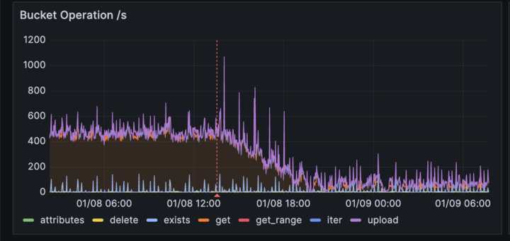
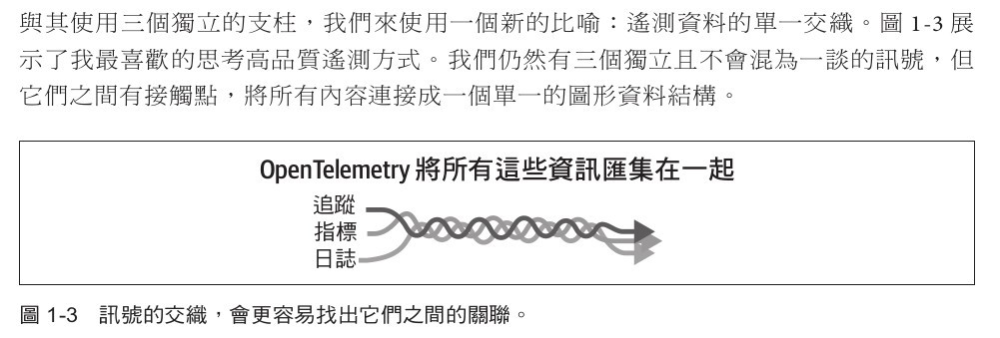
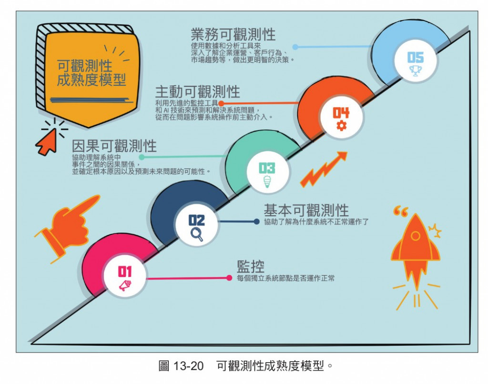
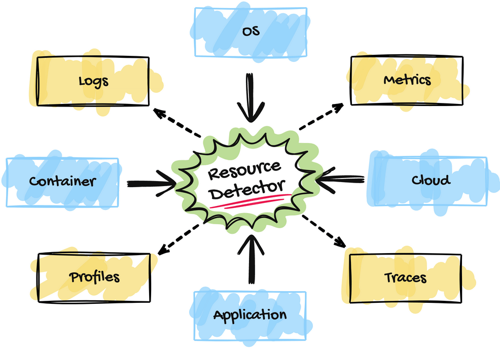
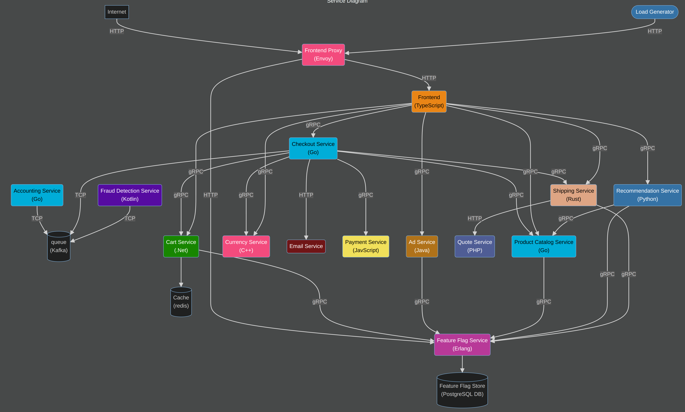
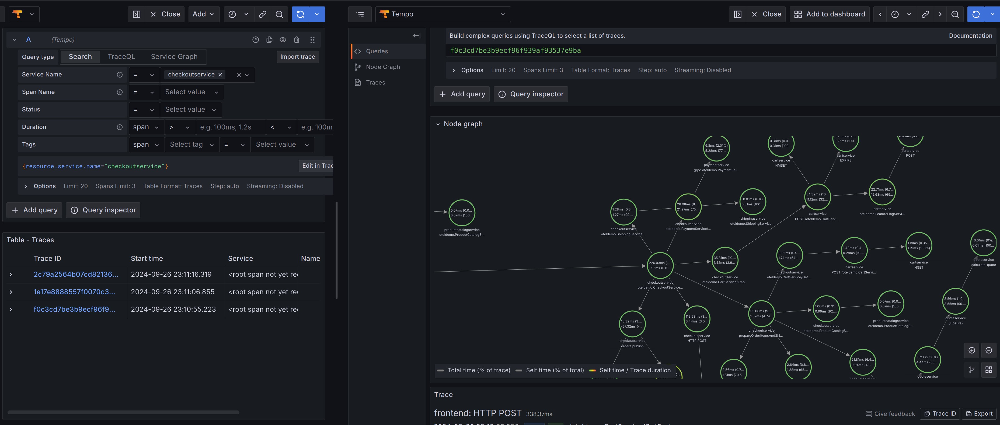
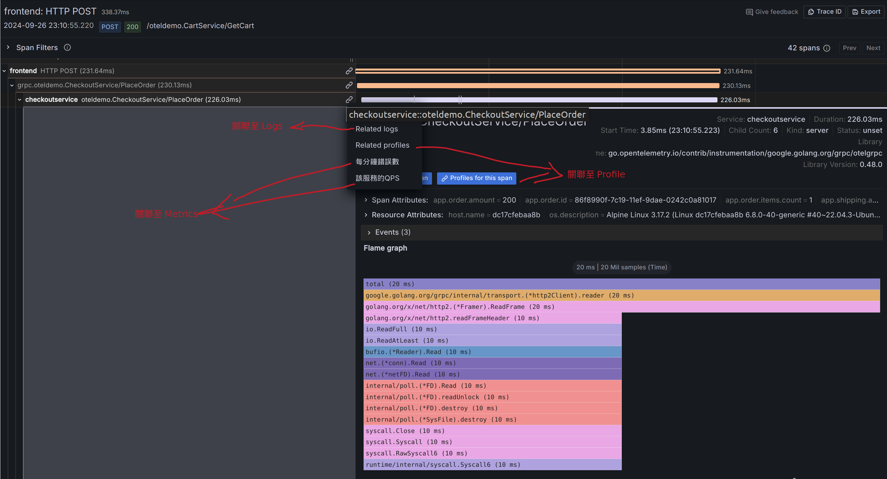
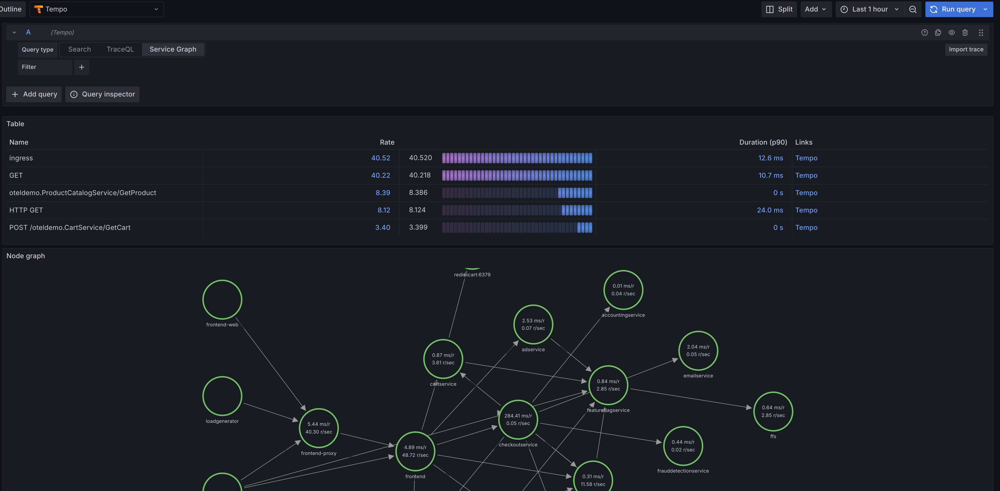
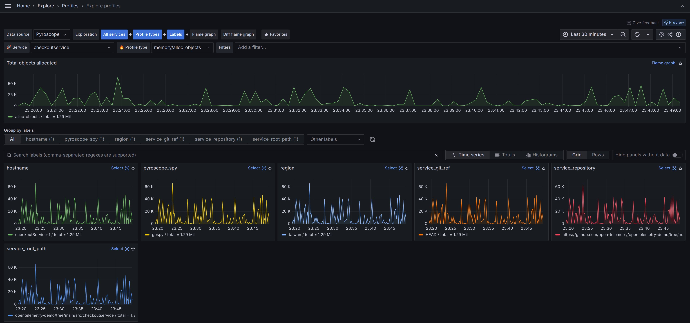
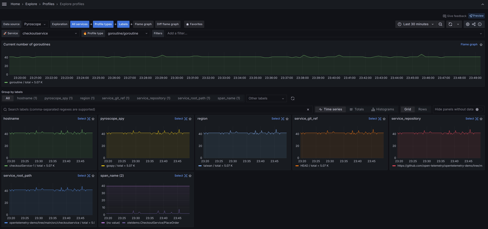

# D27 將四種遙測訊號編織在一起

- 系列：應該是 Profilling 吧？系列 第 27 篇
- Day：27
- 發佈時間：2024-09-27 00:18:04
- 原文：[https://ithelp.ithome.com.tw/articles/10354732](https://ithelp.ithome.com.tw/articles/10354732)

# 昨日補充

昨天我們將 Tracing 與 Profiling 整合起來了。而 Grafana Blog 有篇文章在講這樣做能帶來的商業價值。讓我們用 GPT 快速的給些結論，然後再來開始今天的主題。

[Grafana Blog - Combining tracing and profiling for enhanced observability: Introducing Span Profiles](https://grafana.com/blog/2024/02/06/combining-tracing-and-profiling-for-enhanced-observability-introducing-span-profiles/)

`Span Profiles` 是 Grafana 10.3 中引入的一項嶄新功能，它將應用程式中的 tracing 與 profiling 緊密結合，提供了一種更加精細的分析方式，讓開發者能夠深入了解應用程式的性能表現。與傳統的持續剖析不同，Span Profiles 針對特定的執行範圍，如個別的請求或特定的 trace span，進行動態分析，使得剖析數據與 trace 數據緊密相關，從而提供了更完整的應用程式行為視角。

傳統的 profiling 往往提供整體應用程式的視圖，展示應用程式在固定時間間隔內的性能數據。然而，Span Profiles 則能夠專注於特定的執行範圍，並且直接關聯 trace 數據，這種方式能夠讓開發者更加精確地定位應用程式中的性能瓶頸。通過將 trace 與 profiles 的數據整合，Span Profiles 提供了更加高效的分析工具，讓團隊可以更快地解決性能問題，進而提高應用程式的效能並降低運營成本。

在實際應用中，Grafana Labs 已經通過這種 `traces-to-profiles` 的方法取得了顯著成果。他們在內部使用 Span Profiles 後，提升了 CPU 利用率 4 倍，並減少了對物件儲存服務（OSS）的 API 調用量達到 3 倍，這直接帶來了成本的大幅下降。例如，在 Google Cloud Storage 中的 GET 請求成本，每月節省大約 `8000 美元`。



整合 Span Profiles 到 Grafana 的 trace 視圖中，讓用戶能夠輕鬆地從高層次的 trace 概覽過渡到深入的 profile。這使得開發者能夠具體了解應用程式中的哪段程式碼在特定的執行期間消耗了最多的資源，從而快速找到並解決瓶頸，改善應用程式的整體性能。

總之，Span Profiles 不僅是技術上的進步，更為企業提供了一個強有力的工具來`降低營運成本`，提高性能和效率，並`增強用戶體驗`。它不僅將 tracing 和 profiling 兩者結合，還讓開發者能夠在同一視圖下進行跨數據源的分析，從而實現更強大的可觀測性。

> 這裡真的告訴我們如同[可觀測性工程](https://www.tenlong.com.tw/products/9786263246850)一書的第 8 章的`迭代分析方法`與`First principle` 想讓我們知道的，這些數據與圖表，不是好看和報告用的，最主要的是給我們發現與改善問題提供具體的線索。  
> `First Principle`，就是把所有已知的假設跟理論先擺一旁，從最基本的事實和證據開始思考。將這種思考方式應用於軟體系統的可觀測性，意味著當我們試圖理解或解決一個系統的問題時，我們需要從最基本的、可以直接觀察或測量的事實出發。這就是說，我們不是依賴假設或理論，而是先問自己：「我們能直接看到、測量或確定什麼？」從這些可觀測的事實出發，我們再構建對系統的理解和解決方案。  
> 就是別腦補，觀察找線索，做出假設後做實驗驗證

> 不發這個，我怕今天我湊不到 300 字。

---

今天想介紹這個，是引入 OpenTelemetry 框架最重要的核心精神。  
`將所有遙測訊號編織匯集在一起`

  
圖片出自`OpenTelemetry 學習手冊 設置和操作現代化的可觀測性系統` 一書

如果今天團隊沒辦法將各種類型的遙測訊號，在一個工具視窗中匯集在一起操作。那麼團隊掌握的只會是更多種工具，彼此都是 Silo（穀倉）。面對問題發生時，需要在多個工具視窗中，頻繁的切換去查找線索，最重要的是無法彼此關聯。

下圖示可觀測性成熟度模型（OMM），協助團隊判斷自己系統的可觀測性能力到什麼程度，下一個階段能往什麼方向前進。  
只有匯集在一處的系統，其實才有具備成為可觀測性能力的基本，這時才會來到下圖的`基本可觀測性`的程度。

  
圖片出自`OpenTelemetry 入門指南` 一書

而 OpenTelemetry 就是負責檢測、產生、匯集 context、匯出的遙測訊號框架。  
如下圖，會把 context 給注入到各種遙測訊號裡。這樣每個遙測訊號就能通過共同的 context 相互關聯在一起。  
  
圖片出自[`iThome 鐵人講堂連結 - OpenTelemtry`](https://itplus.ithome.com.tw/webinar-page/234)

## OpenTelemetry Demo Project

緊接著我們可以透過`OpenTelemetry Demo` 專案來體驗。

官方有提供[OpenTelemetry Demo Project](https://github.com/open-telemetry/opentelemetry-demo)

小弟我這裡採用[OpenTelemetry 入門指南 一書第 12 章](https://github.com/tedmax100/OpenTelemetryEntryBeook/tree/main/ch12/opentelemetry-demo)的內容來修改。

下圖是 OpenTelemetry Demo Project 的系統架構圖。  
Astronomy Shop 是一個基於微服務架構的電子商務應用系統,由多個獨立的服務組成。

Astronomy Shop 的目的是讓開發人員、維運人員和其他使用者能夠探索一個「輕量級營運」項目的部署。為了建立一個具有有趣可觀測性示例的有用 演示,包含了一些在「真實」營運環境的應用中不一定會看到的內容,例如模擬故障的程式碼。大多數現實世界的應用,即使是雲端原生的,在程式語言和運行時方面都比這個演示更為同質化的  
應用,而「真實」應用通常會處理更多的資料層和儲存引擎,而不僅僅是這個演示所展示的。



我們可以將整體架構分為兩個基本部分:`可觀測性關注點`和`應用程式關注點`。`應用程式關注點`是處理業務邏輯和功能需求的服務,例如電子郵件服務(負責向客戶發送交易郵件)和貨幣服務(負責在應用中轉換所有支持的貨幣值)。

`可觀測性關注點`負責應用整體可觀測性的某些部分,透過蒐集和轉換遙測資料、儲存和查詢這些資料,或可視化這些查詢。這些關注點包括系統負載生成器、OpenTelemetry Collector、Grafana、Prometheus、Jaeger 和 OpenSearch。系統負載生成器也是一個可觀測性關注點,因為它對演示應用程式施加一致的系統負載,以模擬「現實世界」環境可能的樣子。

接著我在`checkoutservice`專案中安裝了昨天提到的兩個套件`github.com/grafana/otel-profiling-go`與`github.com/grafana/pyroscope-go`。

主要的是我設定了`ApplicationName`與`service_repository`和`service_root_path`。其實這很重要  
方便查詢問題的人，也能知道你這程式的 Git repository 是哪一個。

```
_, err = pyroscope.Start(pyroscope.Config{
		ApplicationName: "checkoutservice",
		ServerAddress:   "http://pyroscope:4040",
		Logger:          pyroscope.StandardLogger,
		Tags: map[string]string{
			"region":             "taiwan",
			"hostname":           "checkoutService-1",
			"service_git_ref":    "HEAD",
			"service_repository": "https://github.com/open-telemetry/opentelemetry-demo/tree/main/src/checkoutservice",
			"service_root_path":  "opentelemetry-demo/tree/main/src/checkoutservice",
		},
		ProfileTypes: []pyroscope.ProfileType{
			pyroscope.ProfileCPU,
			pyroscope.ProfileInuseObjects,
			pyroscope.ProfileAllocObjects,
			pyroscope.ProfileInuseSpace,
			pyroscope.ProfileAllocSpace,
			pyroscope.ProfileGoroutines,
		},
	})
```

緊接著也在`productcategoryservice`專案也做一樣的設定。

```
_, err = pyroscope.Start(pyroscope.Config{
		ApplicationName: "productcategoryservice",
		ServerAddress:   "http://pyroscope:4040",
		Logger:          pyroscope.StandardLogger,
		Tags: map[string]string{
			"region":             "taiwan",
			"hostname":           "productCategoryService-1",
			"service_git_ref":    "HEAD",
			"service_repository": "https://github.com/open-telemetry/opentelemetry-demo/tree/main/src/productcatalogservice",
			"service_root_path":  "opentelemetry-demo/tree/main/src/productcatalogservice",
		},
		ProfileTypes: []pyroscope.ProfileType{
			pyroscope.ProfileCPU,
			pyroscope.ProfileInuseObjects,
			pyroscope.ProfileAllocObjects,
			pyroscope.ProfileInuseSpace,
			pyroscope.ProfileAllocSpace,
			pyroscope.ProfileGoroutines,
		},
	})
```

把 trace provider 設定好，docker compose 中加入 `Psyroscope`即可。

接著在 Grafana Provisioning -> datasource -> default.yaml 中的 tempo json data 加入，  
我們設定從 trace -> profile 時，這裡想透過 service\_name 搭配 span id 來查詢。

> 因為...我懶得寫扣，拿 resource detector 取得的 `hostname` 作為 pyroscope Tags `hostname` 的值。 請原諒我懶，改設定只要一行，寫扣要好幾行。  
> 正式運用肯定是拿 hostname 指到對應主機，可以輔助搭配 service\_name 就是。

```
      tracesToProfiles:
        customQuery: false
        datasourceUid: "pyroscope"
        profileTypeId: "process_cpu:cpu:nanoseconds:cpu:nanoseconds"
        tags:
          - key: "service.name"
            value: "service_name"
```

## Grafana 上操作所有遙測訊號

從下圖，跟[昨天一樣我們能從 Trace 點進去](https://ithelp.ithome.com.tw/articles/10354731)，首先能看見該指定的 tracing ，具體經過哪些服務與端點，然後各自耗費多少時間的一個節點圖。  


然後能發現 Span 上可以關聯至對應的 Logs、Metrics 以及昨天提到的 profile。  
就能再一個視窗內從一個遙測訊號，往下深入探索，也能關聯至其他種類的遙測訊號，進行廣度認知各種維度上的資訊。  


還能從 Trace span 中轉換成 metrics，呈現 R.E.D.指標，用來體現使用者體驗。R.E.D. 方法不僅幫助團隊監控現狀,也是持續改進和調整系統配置的基礎。透過這三個指標的綜合分析,團隊可以更全面地了解服務的運行  
狀況,從而提供更可靠、更快速的服務給最終用戶。此外,這些數據還能幫助預測系統需求,為未來的擴展提供數據支持。  


有興趣的讀者能參考[`OpenTelemetry 入門指南 第 8、12章`](https://github.com/tedmax100/OpenTelemetryEntryBeook/tree/main)，裡面有 logs <-> traces，metrics <-> traces 的介紹與操作。

## 資料探索

Grafana 於 11的版本開始在 Explore 提供了 Logs、Metrics、Traces 與 Profiles 的[資料探索功能](https://grafana.com/docs/grafana/latest/explore/simplified-exploration/)。  
並於今年的 Grafana Conf 2024 中展示了這項功能。  
[ObservabilityCON 2024 - Opening Keynote](https://youtu.be/GlIhZVhH48k?t=1377)

但這些功能都還在 Preview 階段，可以嚐鮮玩看看。

下圖是透過 heap profile，轉成指標後呈現的數據。可以從圖上看見這裡每一個 panel 其實是從我們上面配置 psyroscope 設定的`Tags`。利用每個 Tag 做聚合成現在同一個panel中，方便我們判斷是不是某一個 tag 的值與其他不同，從而辨識出異常。

例如 Region `USA`比起其他 Region 用量特別高。就能縮小查詢範圍了。  


下圖是透過Goroutine/Coroutine profile，轉成指標後呈現的數據。  


[Grafana blog - A queryless experience for exploring metrics, logs, traces, and profiles: Introducing the Explore apps suite for Grafana](https://grafana.com/blog/2024/09/24/queryless-metrics-logs-traces-profiles/)

# 本日小結

OpenTelemetry 框架在這其中起到了關鍵作用，它負責收集、生成、關聯 context，並導出所有的遙測訊號，使不同類型的遙測資料能夠在同一工具中集中管理，避免了資訊孤島的問題。

我們透過 OpenTelemetry Demo Project 體驗了這個整合過程，並在 checkoutservice 和 productcategoryservice 中引入了 Pyroscope 進行效能剖析。在 Grafana 中，我們可以在一個視圖中關聯和操作所有的遙測訊號，包括 Traces、Logs、Metrics 和 Profiles。這使我們能夠從整體到細節，快速發現和解決系統中的問題。

此外，Grafana 11 在 Explore 中提供了簡化的探索功能，支援 Logs、Metrics、Traces 和 Profiles 的資料探索，進一步提升了可觀測性的能力。

總而言之，透過將所有遙測訊號集中在一起，並利用 OpenTelemetry 框架和 Grafana 的新特性，我們能夠更有效地監控和優化系統效能，提升使用者體驗並降低營運成本。
