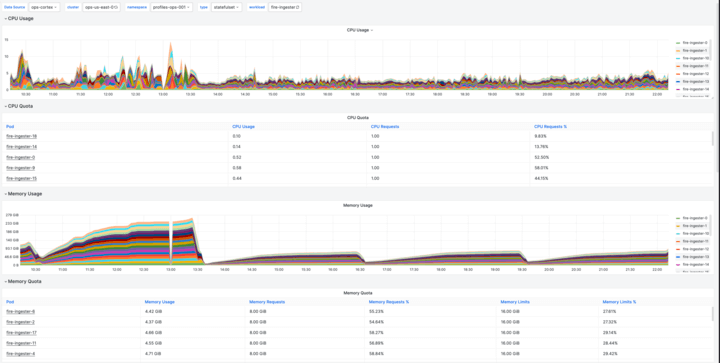
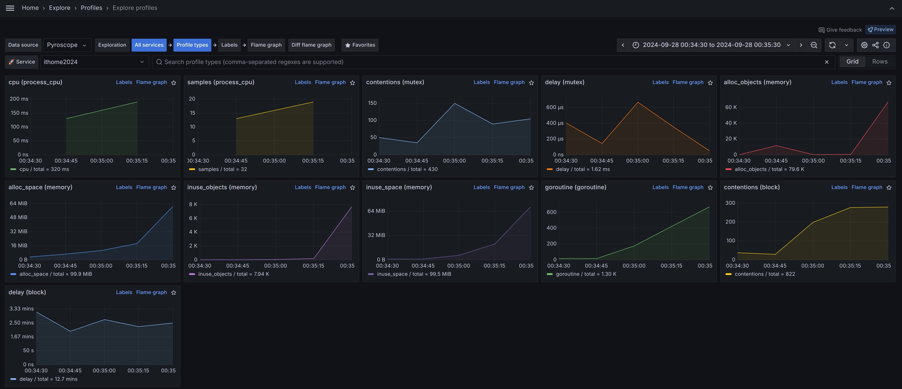
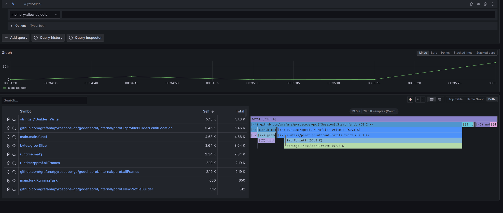
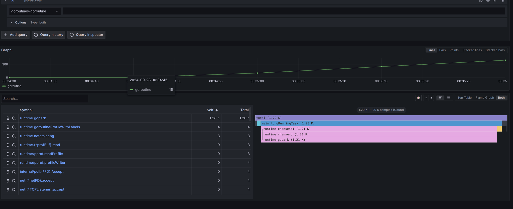
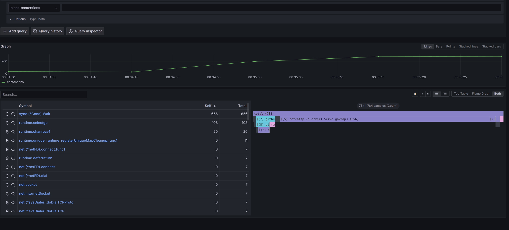
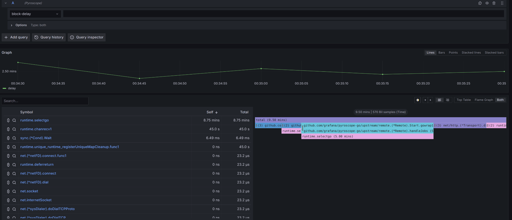
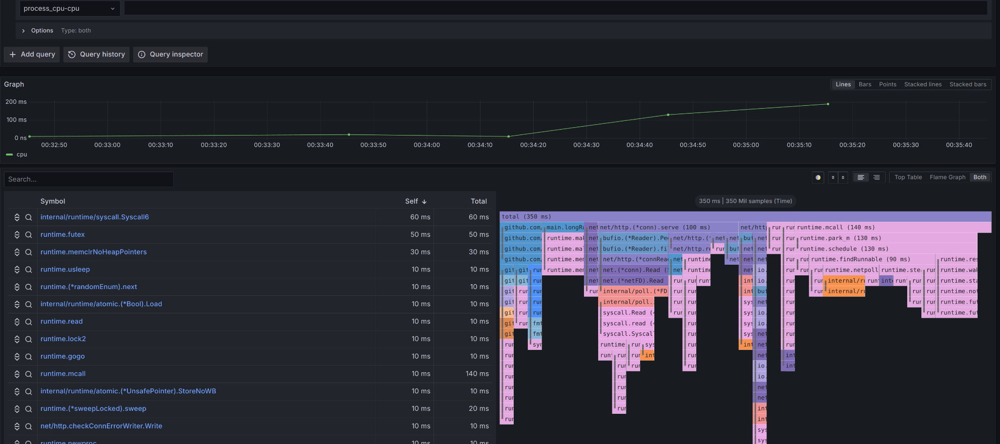
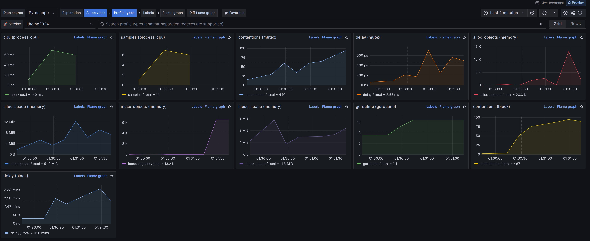
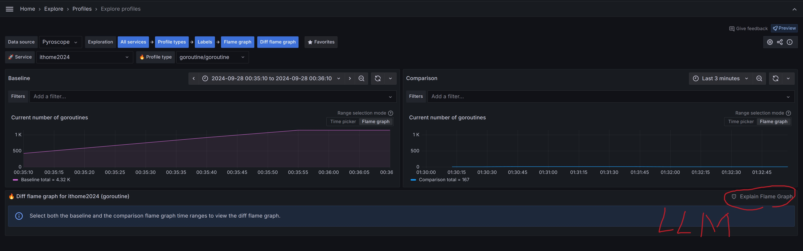

# D28 透過 Grafana Pyroscope 察覺 Memory Leak 並解決

- 系列：應該是 Profilling 吧？系列 第 28 篇
- Day：28
- 發佈時間：2024-09-28 01:36:32
- 原文：[https://ithelp.ithome.com.tw/articles/10354132](https://ithelp.ithome.com.tw/articles/10354132)

接著的三天都會是`幹話`了，不寫扣了，絕對不寫扣了  


任何可觀測性/監控工具都是為了，發覺問題，協助解決問題的。  
因此選了一篇文章，怎麼透過 Grafana Pyroscope 發現程式有 [Memory Leak 問題](https://zh.wikipedia.org/zh-tw/%E5%86%85%E5%AD%98%E6%B3%84%E6%BC%8F)，然後修正。  
[Grafana Blog - How to troubleshoot memory leaks in Go with Grafana Pyroscope](https://grafana.com/blog/2023/04/19/how-to-troubleshoot-memory-leaks-in-go-with-grafana-pyroscope/)

文章首先說明了記憶體洩漏的常見原因，特別是與 Goroutine 相關的問題。例如，當 Goroutine 在結束後沒有正確釋放，或是在程式中無限創建 Goroutine 時，可能導致未被 GC 的記憶體持續消耗系統資源。此外，文章提到了定時器和 Ticker 的使用不當，也可能導致記憶體洩漏。

儘管 Go 語言本身具備 GC 機制，它仍然可能出現記憶體洩漏。記憶體洩漏會導致應用效能下降、系統不穩定，甚至可能觸發 Linux 系統的 [`Out-of-Memory (OOM)` killer](https://linux-mm.org/OOM_Killer)，迫使操作系統終止佔用過多記憶體的程式。

> 因為 Gooutine 沒有被釋放，而被該 Goroutine 建立的資源就也不會被釋放。



記憶體洩漏的檢測通常依賴於監控應用或系統的記憶體使用情況。隨著系統變得日益複雜，追蹤程式碼中的記憶體洩漏點變得更加困難。記憶體洩漏的影響可能是嚴重的，包括：

- 效能降低：記憶體洩漏會逐漸耗盡系統可用的記憶體，導致應用程式運行速度變慢，甚至崩潰。
- 系統不穩定：嚴重的記憶體洩漏可能使整個系統變得不穩定，最終導致系統崩潰或出現其他故障。
- 資源使用增加：隨著記憶體洩漏的發生，系統可能需要花費更多資源來管理記憶體，進而減少其他程式的可用資源，導致系統效率下降。

## 記憶體洩漏的常見原因

記憶體洩漏在 Go 中常常與資源管理不當有關，這些資源可能是開發者未能正確釋放的。當程序中創建了過多的資源而沒有適當管理時，就可能導致洩漏。Go 程式中的記憶體洩漏常見於以下幾個情況：\

1. Goroutine 洩漏：Goroutine 是 Go 語言中輕量級的併發執行單元。Goroutine 的建立與管理由 Go 的運行時系統負責，理論上，你可以創建數百萬個 Goroutine 而不會對系統性能造成顯著影響。然而，未正確管理 Goroutine 的生命周期可能會導致記憶體洩漏。如果一個 Goroutine 在其生命周期中沒有正確終止，它將繼續佔用系統資源，導致記憶體無法被 GC。這樣，隨著時間的推移，應用程式的記憶體使用量將不斷增加，最終導致洩漏。
2. 資源管理不當：例如在程序中建立Timer或 Ticker 而沒有正確釋放。Go 語言的time.After函數在其文件中已提示到這一點，Timer 在到達預定時間之前，不會被 GC，這就可能導致不必要的記憶體佔用。如果你不需要計時器，你應該明確調用`Timer.Stop()`來釋放它。否則，這些資源將無法被回收，從而導致洩漏。
3. 未正確管理 Channel：在併發操作中，未正確管理 channel 可能會導致 Goroutine 被`block`，這將使得它們無法退出，最終造成記憶體洩漏。即使通道中的數據已經處理完畢，如果 Goroutine 仍在等待某些條件，它們就無法被垃圾回收，從而持續佔用記憶體。  
   能參考小弟的文章關於`無緩衝區的 channel`[Channel, goroutine之間的溝通橋樑](https://ithelp.ithome.com.tw/articles/10218923)

## 一個 Goroutine 洩漏的範例

文章提供了一個範例程式來展示如何在 HTTP 伺服器的背景作業中造成 Goroutine 洩漏。該範例中，longRunningTask 函數被用來處理數據，但由於通道（channel）responses 沒有得到處理，Goroutine 被永久阻塞，導致記憶體洩漏：

```go
func main() {
    http.HandleFunc("/", func(w http.ResponseWriter, r *http.Request) {
        responses := make(chan []byte)
        go longRunningTask(responses)
        // 其他處理任務
    })
    log.Fatal(http.ListenAndServe(":8081", nil))
}

func longRunningTask(responses chan []byte) {
    res := make([]byte, 100000)
    time.Sleep(500 * time.Millisecond)
    responses <- res
}
```

在這個範例中，longRunningTask 函數中的 Goroutine 並沒有正確終止，這會導致持續佔用記憶體。如果沒有正確管理這些併發執行，Goroutine 將會一直存在，佔用系統資源。為了解決這個問題，應用程式應確保所有 Goroutine 在完成工作後正確終止，或者通過設置 cancel signal來結束它們。

## 如何使用 Pyroscope 來發現記憶體洩漏

Pyroscope 是一個開源的持續剖析工具，能夠幫助開發者通過持續監控應用程式的記憶體和 CPU 使用情況來檢測性能問題，包括記憶體洩漏。文章介紹了使用 Pyroscope 的步驟來診斷記憶體洩漏。

下圖能看見短短不到一分鐘內，各項 profiling 數據瘋狂上升。  


### 步驟 1：識別記憶體洩漏的來源

首先，你需要通過日誌、指標或追蹤數據來識別系統中的問題區域。例如，你可以從應用程式的日誌中找到重啟訊息，或從 Kubernetes 日誌中查看系統記憶體使用情況的報警訊號。當你確定了系統中的問題部分後，可以使用持續剖析來進一步鎖定問題函數。

### 步驟 2：整合 Pyroscope 到應用程式

要開始對 Go 程式進行剖析，首先需要在應用程式中包含 Pyroscope 的 Go 模組：

```
go get github.com/pyroscope-io/client/pyroscope
```

接著，在應用程式中初始化 Pyroscope，並設置需要追蹤的記憶體和 CPU 剖析數據。以下是一個簡單的配置範例：

```go
import "github.com/pyroscope-io/client/pyroscope"

func main() {
    pyroscope.Start(pyroscope.Config{
        ApplicationName: "simple.golang.app",
        ServerAddress:   "http://pyroscope-server:4040",
        ProfileTypes: []pyroscope.ProfileType{
            pyroscope.ProfileCPU,
            pyroscope.ProfileAllocObjects,
            pyroscope.ProfileInuseObjects,
        },
    })
}
```

這段程式碼初始化了 Pyroscope 並開始持續監控應用程式的 CPU 和記憶體使用情況。

### 步驟 3：深入分析剖析數據

在 Pyroscope 的持續監控下，你可以觀察 Goroutine 的使用情況，並檢視其記憶體使用情況。通過剖析火焰圖（Flame Graph），你可以清楚地看到程式中哪些函數消耗了大量的記憶體資源。

例如，在 Profiling 範例中，你可以發現 longRunningTask 函數一直佔用記憶體，因為它被阻塞在等待通道數據輸出的部分。這樣的阻塞行為會導致 Goroutine 洩漏，而 Pyroscope 的火焰圖可以幫助你發現這些問題。



`strings.(*Builder).Write` 佔據了 57.3K 次的記憶體分配。如果有大量並行請求，這將導致頻繁的記憶體分配，進而引發頻繁的 GC。



`main.longRunningTask` 出現了 1.23K 次的 goroutine 調度，這表明每次 HTTP 請求都會觸發新的 goroutine，而 `runtime.chansend1` 則表示 goroutine 間的 channel 通訊次數較多，這可能導致 context switching增加。





`sync.(*Cond).Wait` 出現了 656 次鎖競爭，表明 goroutine 在某些條件下的等待操作比較頻繁，這可能會導致應用程式的阻塞和性能下降。  
`runtime.selectgo` 消耗了 8.75 分鐘的延遲，這表示在 select 語句中等待 channel 的操作較多，導致了長時間的阻塞。



圖片中顯示 `internal/runtime/syscall.Syscall6` 消耗了 50ms，這意味著 syscall 的呼叫佔據了相對較多的 CPU 資源。因為 `time.Sleep(500 * time.Millisecond)` 這行可能會觸發系統級別的呼叫。

`runtime.futex` 消耗了 50ms，顯示鎖定操作可能存在競爭，導致了鎖操作消耗較高的 CPU 時間。`runtime.futex` 表示有多個 goroutine 在競爭同一資源（例如 channel 的讀寫操作），這會導致 context switch 和同步操作（鎖）的增加。

`runtime.memclrNoHeapPointers` 消耗了 30ms，表明 GC 過程中記憶體清理的開銷不小。

### 步驟 4：確認問題並撰寫測試

在確認問題後，建議先撰寫測試來展示這個問題，以便防止未來其他開發者重複出現類似的錯誤。Go 語言提供了強大的測試框架，你可以利用 go test 來編寫基準測試，並通過 -benchmem 參數來輸出記憶體配置數據。  
`go test -bench=. -benchmem`

```go
package main

import (
	"testing"
)

// 對 longRunningTask 進行基準測試
func BenchmarkLongRunningTask(b *testing.B) {
	// b.ResetTimer() 可以重置計時器
	for i := 0; i < b.N; i++ {
		responses := make(chan []byte)
		longRunningTask(responses) // 但會發現被 block 在這
		<-responses // 消費結果，確保操作完成
	}
}
```

此外，你可以使用 [`goleak`](https://github.com/uber-go/goleak) 套件來檢測是否有 Goroutine 洩漏：

```go
func TestA(t *testing.T) {
    defer goleak.VerifyNone(t)
    // 測試邏輯
}
```

### 步驟 5：修復記憶體洩漏

一旦問題定位清楚，並且你能重現這個問題，就可以開始修復洩漏。修復後，繼續使用 Pyroscope 持續監控應用程式，以確保變更生效，並確認系統的記憶體使用量是否下降。

修正程式。

```go
	http.HandleFunc("/", func(w http.ResponseWriter, r *http.Request) {
		responses := make(chan []byte)
		go longRunningTask(responses)
		// do some other tasks in parallel
		<-responses
	})
```

對比前後  


使用類似 [D26 的差異火焰圖比對](https://ithelp.ithome.com.tw/articles/10356636)功能。  


> 嘿，Grafana 開始也能整合 LLM 做即時的分析建議，但我還不太熟 LLM 明年在介紹。

接著，文章重點介紹了如何使用 Grafana Pyroscope 這個 Profiling 工具來檢測和解決 memory leak。透過持續監控 Goroutine 和記憶體的配置，Pyroscope 可以在長期或快速的洩漏情況下提供詳細的資料，協助開發者找到程式中的問題。

# 總結

這篇文章展示了如何使用 Grafana Pyroscope 來發現並解決 Go 程式中的記憶體洩漏問題。Pyroscope 的持續剖析功能能夠幫助開發者持續觀察應用程式的記憶體和 CPU 使用情況，從而及時發現性能瓶頸。文章強調了持續剖析在現代應用程式中的重要性，並指出透過精確的性能分析，可以幫助開發者優化系統性能，提升應用的穩定性和效能。

最後，文章還介紹了如何將 Pyroscope 與 Go 應用程式整合，通過火焰圖等視覺化工具來發現記憶體洩漏的具體位置，並提供了測試和修復這些洩漏的具體方法。

以下是文章的幾個主要步驟：

1. 確認記憶體洩漏的來源：使用 logs、metrics、或 traces 來識別問題發生的區域。
2. 整合 Pyroscope：將 Pyroscope 的 Go 模組整合到應用程式中，並開始持續監控 CPU 和記憶體使用情況。
3. 深入分析配置：檢視 Goroutine 的狀況和記憶體配置，通過 flamegraph 來觀察每個函式的狀態，找出可能的問題點。
4. 測試並防止洩漏：確認問題後，編寫測試用例以重現並防止未來出現相同的錯誤。使用 Go 的測試框架來進行效能測試，並利用 goleak 來檢測 Goroutine 洩漏。
5. 修正記憶體洩漏：解決問題並部署修正，透過 Pyroscope 持續監控確認變更是否生效。

文章還強調，Pyroscope 的持續剖析功能讓開發者能夠即時觀察程式的效能狀況，並分享記憶體使用下降的數據圖表，以便與團隊分享成功解決的成果。隨著 Pyroscope 與 Grafana Phlare 合併，該工具將進一步提升效能剖析的能力。

總結來說，這篇文章介紹了如何利用 Pyroscope 來監控、發現和修正 Go 程式中的記憶體洩漏問題，並強調了持續剖析工具在效能優化和系統穩定性中的價值。
