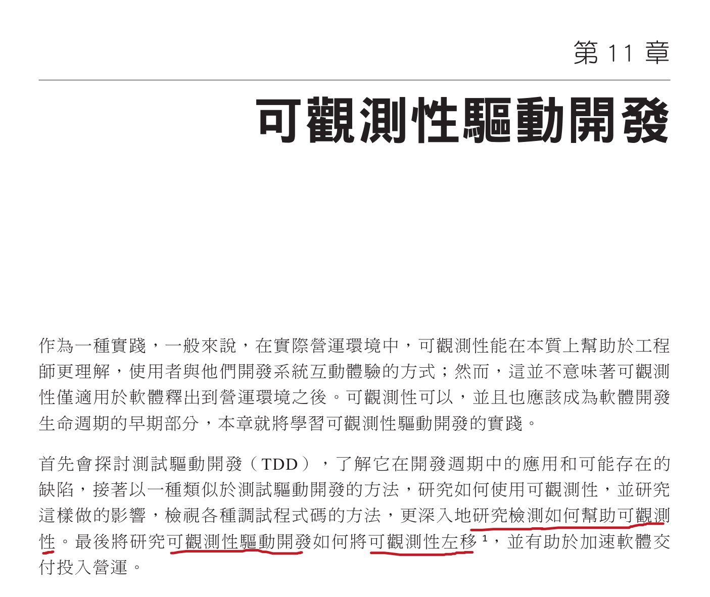
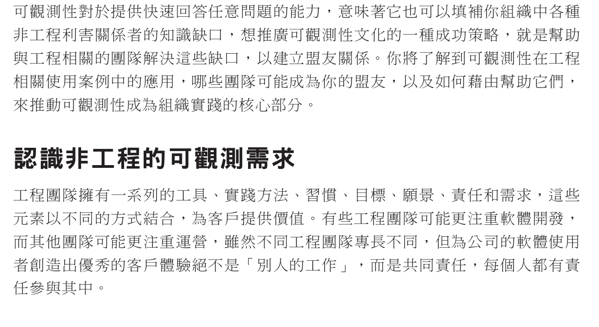
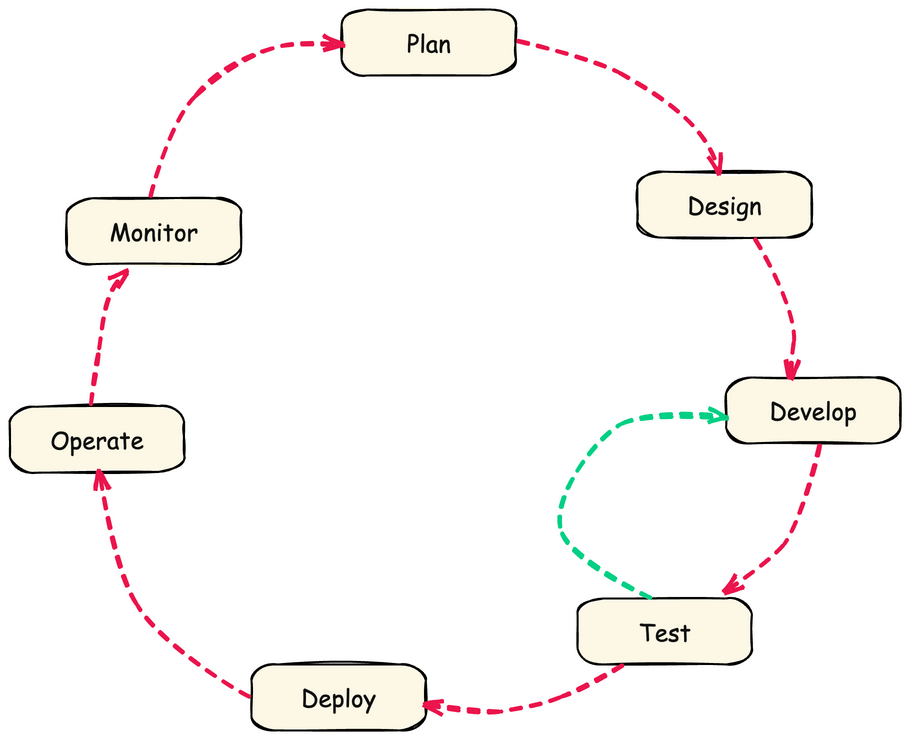
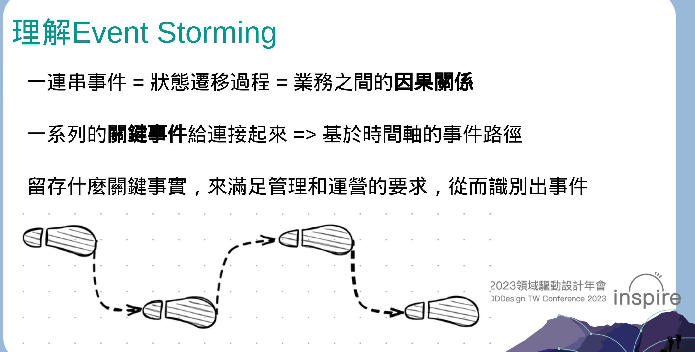
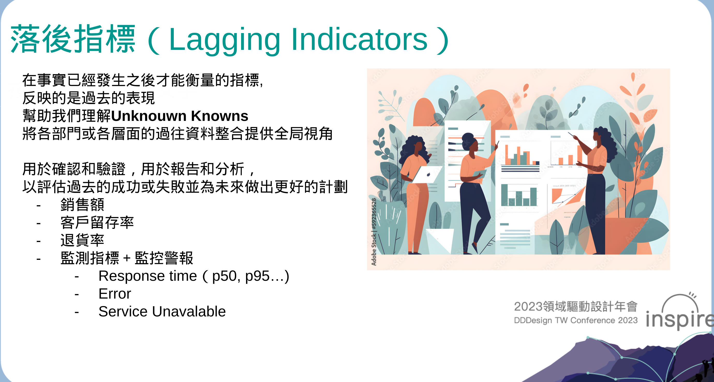
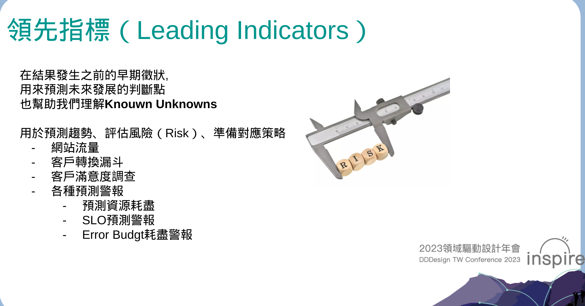
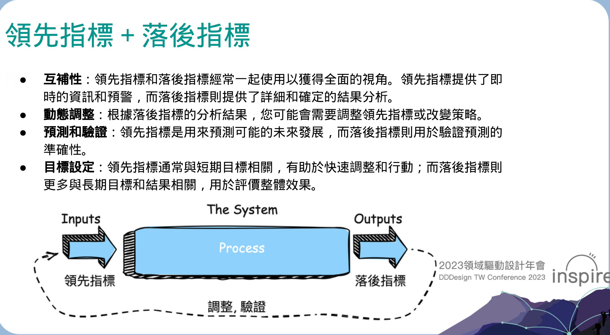
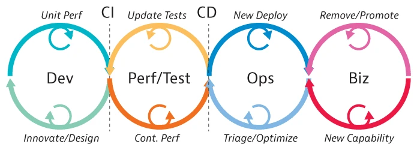

# D29 閒聊可觀測性"驅動"開發

- 系列：應該是 Profilling 吧？系列 第 29 篇
- Day：29
- 發佈時間：2024-09-29 01:38:59
- 原文：[https://ithelp.ithome.com.tw/articles/10353460](https://ithelp.ithome.com.tw/articles/10353460)

今天來閒聊一下`可觀測性驅動開發`（ODD，Observability-Driven-Developemt）。這術語中最容易引起誤解的肯定是`驅動`。

# 驅動

在軟體開發中，`「驅動」`（Driven）通常表示`某種原則`、實踐或工具在開發過程中起引導作用，引導或影響開發者的決策和工作流程。它強調某個特定的關注點或方法對開發過程的核心影響。例如：

- **測試驅動開發**（Test-Driven Development，TDD）：測試引導開發者編寫程式碼。開發者首先編寫失敗的測試，然後編寫程式碼使測試通過。
- **行為驅動開發**（Behavior-Driven Development，BDD）：行為規格驅動開發，強調以使用者行為和需求為核心編寫測試和程式碼。
- **領域驅動設計**（Domain-Driven Design，DDD）：領域模型和業務邏輯驅動系統的設計和架構。

所以這是我們開發流程中，需要遵守的原則，所以才會有後來常聽到的`"左移"`（Shift left）。  
但價值都是要產生出滿足客戶或對齊商業價值的產品與服務。  
  
[可觀測性工程 CH 11](https://www.tenlong.com.tw/products/9786263246850)

## 關於「驅動開發」術語的歷史：

「X驅動開發」（X-Driven Development）的概念起源於軟體工程領域，旨在強調在軟體開發過程中，以特定的關注點或實踐為核心，指導系統的設計和實現。這種方法論透過在開發前明確關注某個方面，幫助開發者做出更好的設計決策。

驅動開發最早始於[1989年Rebecca Wirfs-Brock與Brain Wilkerson在OOPSLA'89發表『責任驅動設計』](https://en.wikipedia.org/wiki/Responsibility-driven_design)的軟體設計方法，後來她們與Lauren Wiener共同寫了一本叫`『Designing Object-Oriented Software』`  
X驅動開發其他例子包括 TDD、BDD 等。這些方法強調在開發前關注特定的方面，如測試或行為，以原則指導設計。

### 權衡與取捨

這些其實都是各種關注點，但我們最終要確保的是交付的產品要能滿足使用者與業務需求。因此在這些關注點的關注程度，要有所權衡和取捨。因為時間與資源是有限的，過份投入在這些關注抵上，可能會導致複雜度提高，專案延遲交付，或是其他關注點的質量有所下降。

所以在專案開發的初期，可以與相關利益者一起確定各種面向的優先權，根據目標來分配資源。當然測試、可觀測性這些的相關利益者不會是你老闆，而是開發團隊、QA Team、SRE Team等等的，如果有業務指標的需求，也能找市場/行銷/客服團隊，別找老闆、經理高層們來費時討論，傳產很愛這樣就是了:)

  
[可觀測性工程 CH 20](https://www.tenlong.com.tw/products/9786263246850)

> 也是蠻多身旁的工程師說，這些不甘它們的事情，都是市場跟行銷的事情。但我想問的是，你不想知道自己每次迭代的東西，到底有沒有人在用跟實際對營運起到作用嘛 XD  
> 曾經我在信義做個 AI 講房，功能不難，上去後幾個月，我就去問有這功能後，成交率有沒有幫助，答案是有！

也能在開發過程中，定期回顧進度與各方面的投入情況，適時調整。也鼓勵大家一起溝通與協作，確保不同的關注點都能得到適當的考量。這些都是權衡，為了實現平衡。

## 誤入魔道

以上常見的開發驅動模式，總是有人誤入魔道。舉例 TDD 就以為要測試涵蓋率 100%，但大幅拉長了交付時間，或是根本盲寫測試案例的，最後交出去也不是用戶要的。然後全部 SUT 都mock只為了達成超高測試涵蓋率。

這時就變成了`XXX 主導了開發` 

但我們`開發`（Development）與`設計`（Design）都是為了提供價值，而不是為了 XXX。  
所以不應該倒過來由 XXX 來主導開發。

這些能參考[Honeycomb blog- What Observability-Driven Development Is Not](https://www.honeycomb.io/blog/observability-driven-development)有更多的說明。

# 可觀測性驅動開發 ODD

開發過程以`系統可觀測性`為核心考量。在編寫程式碼之前，開發者會思考如何讓`系統行為`更易於被觀測和理解。這可能包括決定在哪裡添加檢測程式碼，哪些指標和事件需要監控，以及如何結構化地蒐集遙測資料。

> 我們設計的解決方案，以及編寫的程式碼，最後就行成了`系統行為`。

**可觀測性影響設計與實現決策**：  
開發者可能會為了提高系統的可觀測性而選擇特定的設計模式或架構。例如，拆分模組以更清晰地監控不同組件的效能和行為。因為一個函數就有幾千行的，這種紀錄下去也只會是一筆資料，看不出細部的系統行為。

**持續回饋循環**：  
開發者透過即時的可觀測性數據，持續獲得系統運作的回饋，從而快速迭代並改進程式碼。可觀測性驅動了開發者的調試、最佳化和驗證工作。

  
恩 畫得很醜。  
我們會根據`系統可觀測性`為核心考量，規劃測試目標。以這些為出發點去設計系統與測試計畫。  
接著就能因應讓系統具備可觀測性能力以及滿足測試計畫，而開始開發。

例如透過 DDD 的工作坊方法 Event Storming 討論在現有的流程與新的設計流程中，哪些是關鍵的事件我們可以提早設計加入檢測。  

除了常見的性能監控和[D9 性能的外部指標](https://ithelp.ithome.com.tw/articles/10348720)外，其實還有種與業務相關的落後指標，也能考入加入程式碼的檢測之中。  

有落後指標自然就有領先指標，領先指標能即時立刻反應營運系統的業務現況。  
當然系統的性能指標與使用者相關的指標例如R.E.D.指標也都是屬於領先指標，也能考入加入程式碼的檢測之中。  

> 不知道圖片中的known還是unknown什麼的，能參考[D1 遙測信號在軟體系統中的協同應用](https://ithelp.ithome.com.tw/articles/10347242)

這些相互結合起來，就能在營運之前的測試做一些驗證了。

我個人基本性能測試也會問我們預計想容納多少使用者在使用這些功能或服務，我用來評估目前的設計與系統容量足不足夠，不足夠就安排多點資源。  
已經測試完畢後就能估算出成本，能給上層評估。是下一個階段做優化，還是怎樣的決策。  
又或者詢問是想要用固定的容量，但要能計算出能服務多少使用者與流量，是不是要提早設計rate limit 或其他排隊機制。以確保系統的可用性以及使用者體驗。

系統行為測試，像是微服務架構中常聽到的熔斷，降級，隔離，這些對我們系統產生什麼行為與影響，服務是否還是可用可操作。Feature flag被改變時，系統又會怎麼樣。

驗證失敗就能再回去優化開發的程式與架構或設計。 畫很醜的圖中，綠色線往回指就是這意思。

> 我只是個開發者，我的守備範圍就是根據需求與場景，驗證我的設計是否滿足。  
> 不滿足的服務，我提交出去，也只是拖累未來團隊的進度。

這些都要搭配系統具備一定的可觀測性能力，否則就是通靈，瞎給報告。迭代過程中出問題，就是忙於猜測，下場不是交付延遲，就是硬著頭皮上個已知有問題的。

  
上圖參考 [What is DevOps? How does DevOps work?](https://www.dynatrace.com/news/blog/what-is-devops/)

# 怎讓遺留系統具備基本可觀測性

其實講很多原則，但大多數開發者們面對的不是全新系統，而是很有歷史的遺留系統。  
新的系統當然要加入 OpenTelemetry、Prometheus/Psyroscope client library還不容易？

遺留系統才麻煩，其實這幾天聊的 Profiling 在遺留系統上價值不太高，因為遺留系統（那種十幾二十年的老系統）的主要問題是，細部系統行為與哪些還在使用的不明確性以及版本過低，其實現代化的檢測套件都沒法用，。

很多遺留系統的問題是︰

### 問題一：遺留系統版本過舊，無法引進 OpenTelemetry，日誌也是非結構化的

- **版本限制**：遺留系統可能使用了老舊的程式語言版本、框架或函式庫，無法直接支援現代的可觀測性工具，如 OpenTelemetry。
- **非結構化日誌**：日誌格式不統一，缺乏標準化，可能只是簡單的文字輸出，難以進行有效的解析與分析。  
  團隊協作困難：缺乏統一的日誌語意和規範，團隊成員在理解和使用日誌時可能存在差異，增加了溝通和維護的成本。
- **除了 Error Log，其餘什麼都沒紀錄**。

**可能的解決方式**：

- **改造日誌格式，定義團隊的日誌語意規範**︰:Log 有 Level，上面講的很多關鍵事件，都能用 INFO 來紀錄。且不是什麼都是 ERROR，不造成副作用且沒辦法自我修復問題的，都能用 ERROR。但能夠自我修復，或者能提早判斷出可能造成問題的，就能 Reject ，紀錄成 WARN。
- **引入結構化日誌**：選擇通用的日誌格式：如 JSON、YAML 或 XML。 JSON 常用且易於解析。修改日誌輸出方式：在不大幅度更改業務邏輯的情況下，調整日誌記錄程式碼，使其輸出結構化的資料。
- **定義團隊的日誌語意（Semantics）規格**：  
  關鍵欄位屬性：確定每個日誌應包含的關鍵字段，如時間戳記、日誌等級、訊息、模組名稱 等。還要包含 GIT 資訊。常常出事時，都沒人能立刻從上面看出這是哪一個 commit /tag 去佈署的應用程式，等於你連 redeploy 一樣的版本來演練重現都一時間做不到。（2015年小弟所在的團隊，從 SVN 做 CD 都能做到了...別說 2024 從 GIT 做不到了吧）  
  如果有 SRE 團隊，為了讓它們能再出事情時，好理解問題的嚴重程度安排優先順序處理，有些 ERROR/FATAL log 能多紀錄`Severity`欄位。
- **團隊培訓**：統一認知：確保團隊成員理解新的日誌規格和其重要性。程式碼規格：將日誌規格納入程式碼標準，進行程式碼審查時檢查日誌的正確性。

### 問題二︰不知道系統的行為與表現

**可能的解決方式**︰  
利用主機上的監控和存取日誌

- **收集和分析訪問日誌**：IIS、Nginx 等存取日誌：這些日誌通常包含請求的 URL、狀態碼、回應時間、用戶端 IP 等資訊。
- **工具分析**：使用分析工具（如 GoAccess、AWStats）對存取日誌進行統計，識別高頻存取的服務端點、錯誤率高的介面、回應慢的請求等。
- **識別問題端點**：定位效能瓶頸：根據回應時間和錯誤率，找出需要最佳化的服務端點。
- **安全審計**：透過分析異常的存取模式，發現潛在的安全問題。

**可能的優化**︰  
程式碼最佳化：[D6 性能工程基本定律 - 80/20 法則](https://ithelp.ithome.com.tw/articles/10348115)中提到，先針對最常被使用的功能或路徑效能問題，最佳化程式碼邏輯或資料庫查詢。引入快取機制，減少資料庫或後端服務的壓力。  
資源配置：調整伺服器資源，如增加執行緒池大小、最佳化連線池等。  
設定基準：確定正常的效能指標和錯誤率，作為參考基準。  
警報機制：配置監控工具，當指標超出預設範圍時，及時通知相關人員。

### 問題三︰遺留系統架構簡單，主要依賴資料庫和定時任務，Tracing 價值有限

**簡單架構**：系統可能是單體應用，沒有微服務或複雜的服務呼叫鏈。  
**依賴關係簡單**：主要與資料庫和定時任務交互，缺乏跨服務的調用，因此分散式追蹤（Tracing）可能無法提供太多額外資訊。  
**資源限制**：引進 Tracing 可能會增加系統的開銷，且效益不明顯。

可能的解決方式：  
**聚焦於現有的可觀測性手段**  
強化日誌：在關鍵的業務邏輯和異常處理處添加詳細的日誌訊息，幫助快速定位問題。  
監控關鍵指標：如資料庫連線數、查詢耗時、定時任務執行等，使用監控工具進行追蹤。

**規劃未來的可觀測性**  
為演進做準備：即使當前 Tracing 價值有限，也可以在程式碼中為未來的分散式追蹤預留介面或上下文傳遞機制。

所以能考慮引入 `Correlation/Event ID`：  
產生唯一請求 ID：在每次請求處理開始時產生唯一的 Correlation/Event ID，並在日誌和上下文中傳遞。  
日誌關聯：即使不進行分散式追踪，也可以透過 Correlation/Event ID 將相同請求的日誌關聯起來，方便排查問題。

資料庫監控：使用資料庫自帶的監控工具或第三方工具，分析慢查詢、鎖定等待等問題。  
定時任務監控：記錄定時任務的開始、結束時間、執行結果和異常訊息，確保定時任務能如預期運作。

## 慢慢演化至新的系統與架構

當上面的遺留系統慢慢具備可觀測性能力時，這時候就能有更多本錢與經驗，來重作翻新了。  
重構遺留系統本身就很奇怪。只要版本沒升級，重構大多就只是為了可維護性以及便於單元測試。  
但一直不升級版本的系統本身就會有問題，所以早晚一定會重作的。這時我們就能引入 OpenTelemetry 了。

這時期，我們在意的是`系統全面端到端`的`粗顆粒的鏈路追蹤`。  
如果團隊這時有用 API Gayway 或是全面用服務網格 Istio, 能在這上面啟用 OpenTelemetry 的 tacing功能，就能達成端到端的監控與追蹤，呈現出系統全面的節點圖。

> API Gateway︰ 舉例 [Kong，有支援Opentelemetry](https://docs.konghq.com/hub/kong-inc/opentelemetry/)  
> Service Mesh︰舉例 [Istio，有支援Opentelemetry](https://istio.io/latest/docs/tasks/observability/distributed-tracing/opentelemetry/)

**從關鍵服務開始**：最核心或最複雜的服務先引入 Tracing，累積經驗。  
**最佳化配置**：根據系統負載和效能，調整取樣率和資料上報策略，平衡效能和可觀測性。  
**加強團隊能力建設**  
- 培訓與學習：讓團隊成員了解分散式追蹤的原理與實務方法。  
- 經驗分享：在團隊內部分享引入 Tracing 的心得和遇到的問題，促進知識傳播。  
- 完善監控與告警體系

建立全面的可觀測性體系：結合全面類型的遙測資料，實現對系統行為的全方面認知以及提高系統的全方面觀測能力。  
自動化維運：引進自動化的監控和警告機制，提高反應速度。

當粗顆粒端到端的粗顆粒的鏈路追蹤落實了，再來追求細顆粒度的全面遙測資料的落實。

# 總結

`站在未來 規劃現在`  
循序漸進地提升可觀測性：從改進日誌開始，利用現有的監控手段，逐步為系統引入更多的可觀測性實踐。

根據系統現況選擇合適的工具和方法：在目前架構下，重點強化日誌與監控；在系統演進過程中，再引進Tracing等高階可觀測工具。

為未來做好規劃：即使目前無法引入最先進的工具，也可以透過規格日誌、預留介面等方式，為未來的可觀測性升級打下基礎。

評估成本和效益：在引入任何新工具或實務前，評估其對系統性能的影響和帶來的實際效益，確保投入產出比合理。

重視團隊協作：可觀測性的提升需要開發、維運等多方協作，確保資訊透明化與知識分享。

持續改進：可觀測性建設是一個持續的過程，需要持續根據系統變化和業務需求進行調整和最佳化。

# 推薦讀物

[可觀測性工程 CH 1、5、6、10、11、19、20](https://www.tenlong.com.tw/products/9786263246850)

以下是幾篇 Honeycomb 的文章分享。  
[Honeycomb blog - ODD](https://www.honeycomb.io/blog/observability-driven-development)  
[Honeycomb blog - o11y](https://www.honeycomb.io/resources/intro-to-o11y-topic-1-what-is-observability)  
最重要的一篇[Honeycomb blog- What Observability-Driven Development Is Not](https://www.honeycomb.io/blog/observability-driven-development)
