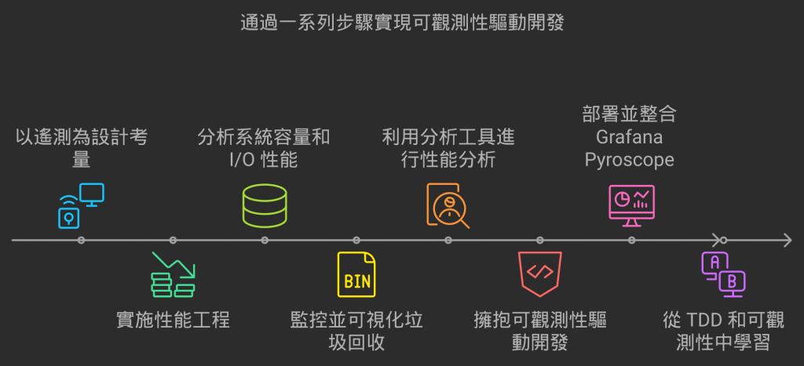
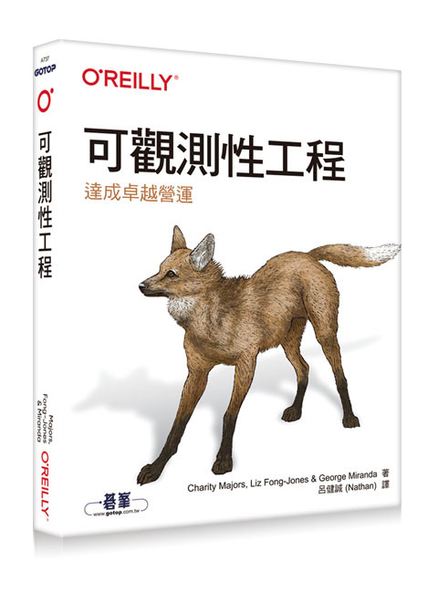
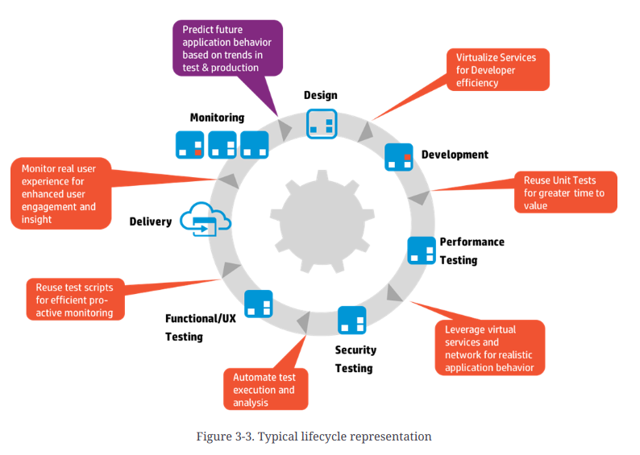
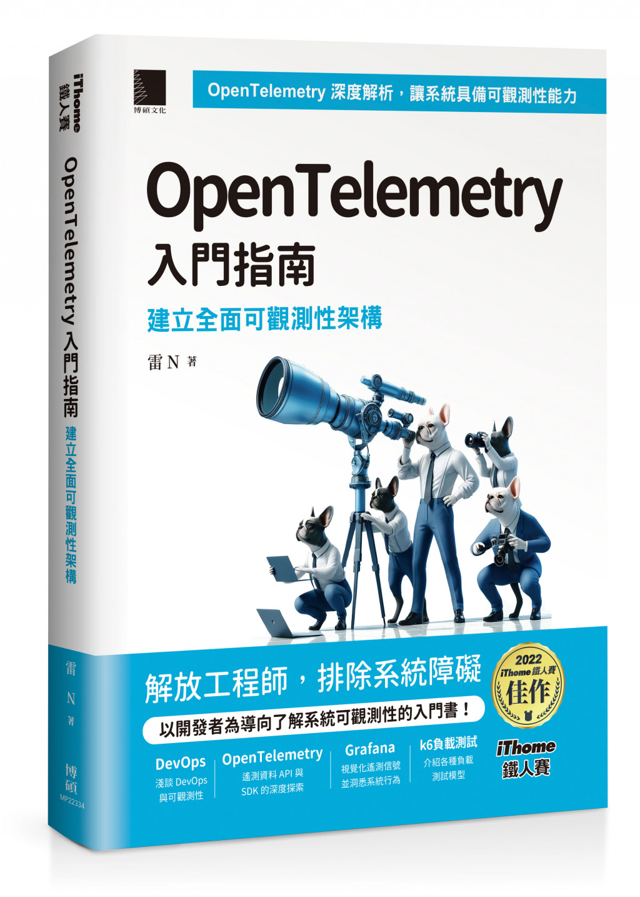

# D30 結尾，推薦讀物

- 系列：應該是 Profilling 吧？系列 第 30 篇
- Day：30
- 發佈時間：2024-09-30 00:19:45
- 原文：[https://ithelp.ithome.com.tw/articles/10352882](https://ithelp.ithome.com.tw/articles/10352882)

最後一天來整理一下這一系列的內容。

[D1](https://ithelp.ithome.com.tw/articles/10347242) 探討`遙測信號`與系統可觀測性之間的關聯。我們得知道各類型遙測信號負責的守備範圍，才好在設計階段，就把這些與系統結合，以滿足需求。遙測信號是系統具備可觀測性的基石，也是 OpenTelemtry 框架的重要價值。

[OpenTelemetry Isn’t the Hero We Need: Here’s Why it’s Failing our Stack](https://devops.com/opentelemetry-isnt-the-hero-we-need-heres-why-its-failing-our-stack/)  
這篇文章的重點在於探討 OpenTelemetry 和 eBPF 兩者在可觀測性領域的不同定位與優劣，並指出 OpenTelemetry 雖然提供了一個標準化、跨系統的觀測性工具，但在實際應用上存在一些問題，特別是效率低下、功能過於廣泛且由於企業介入導致的「特性膨脹」。相對地，作者認為 eBPF 是一個更加高效、輕量的內核層次觀測工具，提供更深入且精確的系統可觀測性。  
OpenTelemetry 適合提供大範圍的分佈式系統觀測，作為「大局觀」的工具；而 eBPF 適合深入系統內部進行精確診斷。合理的可觀測性方案應該將兩者結合使用，以達到全面的系統洞察。

OpenTelemetry 的 [Roadmap 中確實也有 eBPF](https://opentelemetry.io/community/roadmap/#backlog)。

然後也有一些語言的 OpenTelemetry 自動檢測也是採用 eBPF。[opentelemetry-ebpf-profiler](https://github.com/open-telemetry/opentelemetry-ebpf-profiler)、[opentelemetry-go-instrumentation](https://github.com/open-telemetry/opentelemetry-go-instrumentation)

所以接下來我也打算往 eBPF 這方向去研究。

[D2~ D12](https://ithelp.ithome.com.tw/articles/10347376) 則是探討`性能工程`，介紹基本定律、系統容量、外部指標。這也是系統測試工程中的一環。監控固然重要，但沒法左移，而這些都能嘗試左移，在釋出之前就能做出的驗證與評估。

[D13 ~ D18](https://ithelp.ithome.com.tw/articles/10349747) 從`系統容量`的維度，CPU 是系統容量的一項資源。但大部分的後端應用場景，幾乎是以 I/O 密集任務為大宗。許多後端的普片常識是利用 `Async` 來處理，但 Async 就沒問題了？有這麼好用的銀彈？我們怎樣能看到 I/O 密集任務具體有多少在執行，消耗了什麼資源。可以怎麼估算。

[D21 ~ D23](https://ithelp.ithome.com.tw/articles/10353431) 從`系統 GC`的角度，來嘗試檢測並可視化。能讓我們更了解 GC 對系統運行時的行為會有怎樣的影響。

[D24 ~ D27](https://ithelp.ithome.com.tw/articles/10356636) 則是講 `Profiling` 常用到的部份，像是火焰圖，和 Profiling 服務 Grafana Pyroscope 怎麼蒐集這類型遙測訊號後提供分析與展示。

[D19、D20](https://ithelp.ithome.com.tw/articles/10353199)、[D28、D29](https://ithelp.ithome.com.tw/articles/10354132) 都是朝`可觀測性驅動開發`的目標去探討。一個角度是從寫好的程式看見問題後回饋並解決。令一個角度則是`左移`，在設計階段就能考慮近來。以及簡單分享`遺留系統`能怎麼稍加改善，使得遺留系統具有基礎的可觀測性能力。

---

# 推薦讀物

## 可觀測性工程

這本書專注於如何透過現代可觀測性技術，提升軟體在營運環境中的可靠性、性能和可維護性。其主題圍繞可觀測性的概念，解釋如何透過蒐集和分析系統的 logs、metrics、traces 等資料，來診斷、排除和預防營運環境中的問題。

主要內容包括：

- 可觀測性的基礎理論：解釋什麼是可觀測性，與傳統監控的區別，並探討在現代分散式系統中的重要性。
- 實際應用：涵蓋如何在營運系統中實現高效的可觀測性架構，並且融入到開發流程中，以提升團隊在處理異常情況時的反應能力。
- 工具與技術：介紹如何運用如 OpenTelemetry、Prometheus、Jaeger 等觀測性工具來建立統一的可觀測平台，並以實際的技術實踐指導讀者。
- 文化與流程：除了技術面向，書中還強調團隊文化與組織結構如何影響可觀測性成功實施的效果，並鼓勵跨團隊的協作與共享觀測資料。
- 營運環境優化：討論如何利用觀測性數據進行系統調優，最終達到更穩定、更高效的營運運行狀態。  
  總體來說，這本書是為希望深入了解觀測性如何幫助實現軟體工程卓越的工程師、架構師和主管而寫的，特別針對那些管理複雜分散式系統、微服務架構的團隊。

裡面也有推薦一些書

- 《Implementing Service Level Objectives》,Alex Hidalgo 著(O’Reilly)
- 《Distributed Tracing in Practice》,Austin Parker 等人所著(O’Reilly)

## OpenTelemetry 學習手冊

[OpenTelemetry 學習手冊](https://www.tenlong.com.tw/products/9786263249141?list_name=r-zh_tw) 已上架

該書的翻譯版本，在這篇文章的當下已經翻譯完成但還沒上架，十月多就會上架了，也是由小弟翻譯。  
這本書針對開發者，尤其是有興趣導入 OpenTelemetry 的開發團隊。

該系列的 D1 很多概念也是出自此書。對於可觀測性驅動開發、以及 OpenTelemetry 框架有興趣的讀者。這本書是必買的。作者 Ted 本身就是 OpenTelemetry 項目的創始人之一。由它的角度在講解 OpenTelemetry 一定是精準的。

總的來說,這本書主要分為兩部分。在第 1 章至第 4 章中,會討論了監控和可觀測性的現狀,並向你展示了 OpenTelemetry 背後的動機。這些章節幫助你理解支撐整個項目的基礎概念。它們對於首次閱讀者來說不僅價值連城,對於已經實踐可觀測性一段時間的人也同樣寶貴。第 5 章至第 9 章則進入具體的使用案例和實施策略,以之前章節介紹的概念為主,討論其背後的運作原理,並提供指引,好讓你在各種應用和情景中實際實OpenTelemetry。

如果你已經對可觀測性主題非常熟悉,可能會考慮直接跳到書的後半部分,這樣也不是不行,但審視初期章節總能再獲得一些收穫。無論如何,只要你帶著開放的心態閱讀這本書,你應該能從中獲益,並且一次又一次地回來翻閱。我們希望這本書成為你可觀測性旅程下一章的基石。

裡面也有推薦一些書

- Betsy Beyer, Chris Jones, Jennifer Petoff 和 Niall Richard Murphy 編著, 網站可靠性  
  工程:Google 的系統管理之道(O’Reilly,2016)
- Daniel Gomez Blanco 著,Practical OpenTelemetry: Adopting Open Observability  
  Standards Across Your Organization(Apress,2023)
- Alex Boten 著,Cloud-Native Observability with OpenTelemetry: Learn to Gain Visibility into Systems by Combining Tracing, Metrics, and Logging with OpenTelemetry(Packt,2022)
- Sidney Dekker 著,The Field Guide to Understanding “Human Error”(Routledge,2014)
- Brendan Gregg 著,Systems Performance: Enterprise and the Cloud(Addison-Wesley,2020)
- Ronald McCollam 著,Getting Started with Grafana: Real-Time Dashboards for IT and  
  Business Operations(Apress,2022)

## [Foundations of Software and System Performance Engineering](https://learning.oreilly.com/library/view/foundations-of-software/9780133038149/)

這本書專注於軟體和系統性能工程的基礎，提供讀者關於性能優化的系統化方法，並涵蓋從需求定義到測試和擴展性等關鍵主題。其主要目標是幫助軟體工程師、架構師及測試工程師學習如何從設計開始就考慮性能，並在整個軟體開發生命週期中進行有效的性能管理。  
特別的是還有教導如何使用性能建模技術來預測系統在不同負載下的行為，幫助識別性能瓶頸和潛在的擴展性問題。  
探討不同的性能模型，包括排隊論、模擬模型等。

## [The Art of Application Performance Testing](https://learning.oreilly.com/library/view/the-art-of/9781491900536/)

這本書聚焦於應用程式性能測試的實踐與策略，幫助讀者學習如何針對應用程式進行有效的性能測試，並提供解決性能瓶頸的具體方法。書中主要強調如何規劃、設計和執行性能測試，以確保應用在各種負載條件下的穩定性和可擴展性。

這本書適合剛接觸性能測試的初學者和有一定經驗的測試工程師，強調實際操作與理論結合。它為讀者提供了一個清晰的框架，讓他們能夠有效地測試應用程式性能，並提供持續優化的實踐指南。

## [Effective Performance Engineering](https://learning.oreilly.com/library/view/effective-performance-engineering/9781492030164/)

這本書專注於教導讀者如何在軟體開發過程中有效進行性能工程，從而提高系統的可靠性、穩定性和效率。書中的核心理念是將性能考量嵌入到整個開發週期，而不僅僅是留到最後的測試階段。它強調性能工程不僅僅是一組技術，而是涉及到開發流程、工具和文化的整體變革。

也是有提到性能建模，以及解釋性能工程應該是整個 SDLC 的一部分，從需求分析、架構設計、開發到測試、部署和運維，每個階段都應考慮性能問題。強調性能工程不僅是解決性能瓶頸，還包括預防問題的發生。  
一樣呼應了 `站在未來，規劃現在`的口號 :)

## [Art of Scalability, The: Scalable Web Architecture, Processes, and Organizations for the Modern Enterprise](https://learning.oreilly.com/library/view/art-of-scalability/9780134031408/)

這本書著重於現代企業如何設計可擴展的網路架構，並探討如何通過技術、流程和組織結構的協作，實現系統的高可擴展性。書中的主題不僅限於技術層面，還涵蓋企業在成長過程中所面臨的各種管理和運營挑戰，強調技術和組織結構必須同步發展以應對擴展需求。

解釋可擴展性（Scalability）的基本概念，探討如何評估系統是否具備擴展能力，以及在軟體開發和架構設計中如何體現可擴展性的原則。強調擴展不僅是技術問題，也是業務和組織問題，需要跨部門的協作和規劃。

提供多個真實世界的案例研究，展示不同規模的企業如何通過技術和組織策略來實現成功的擴展。  
這些案例涵蓋了從初創公司到大企業的不同擴展需求，幫助讀者理解不同情況下的最佳實踐。  
探討在可擴展性實踐中如何進行風險管理，確保系統在擴展過程中保持穩定性。

蠻值得推薦的一本書

## 推薦演講影片

[Golang UK Conference 2017 | Filippo Valsorda - Fighting latency: the CPU profiler is not your ally](https://youtu.be/Lxt8Vqn4JiQ?si=zho2oXZ947Qe1aD5)  
Filippo Valsorda 的演講**Fighting Latency: The CPU Profiler Is Not Your Ally**聚焦於解釋為什麼僅依賴 CPU profiler 來分析程式中的延遲問題是行不通的。他指出，Go 的 CPU profiler 雖然可以有效捕捉佔用 CPU 的程式運行過程，但卻無法反映出那些由 I/O 操作或網絡延遲引發的問題。Filippo 解釋了 CPU profiler 的工作原理，說明它只能記錄在 CPU 上執行的程式邏輯，對於程式等待 I/O 或外部響應的這些“空閒時間”，它是完全不可見的。

接著，Filippo 強調了 CPU profiler 在改善吞吐量上的有效性，但如果目標是優化延遲，開發者應該考慮使用 Go 的 tracer 工具。透過 tracer 工具，開發者能夠捕捉所有阻塞的事件（如網路等待或檔案操作），這些事件雖然不消耗 CPU，但卻影響了系統的整體性能。他分享了一個具體的例子，展示如何通過分析阻塞事件來發現並解決瓶頸問題，最終優化延遲。

[GopherCon 2017: Rhys Hiltner - An Introduction to "go tool trace"](https://youtu.be/V74JnrGTwKA?si=sOFSApzmiCE__H8w)

Rhys Hiltner 的演講\*\*An Introduction to "go tool trace"\*\*深入探討了 Go 的執行追蹤工具 "go tool trace" 的應用。他強調，Go 語言的並行性使得 goroutine 成為開發者常用的工具，但也因此引發了一些並行相關的問題。"go tool trace" 提供了一種方式，可以幫助開發者直觀地查看goroutine的排程狀況，理解goroutine是如何在多個操作系統 thread 之間切換的，以及它們的執行時間如何影響整體性能。

Rhys 透過實際範例展示了 "go tool trace" 如何幫助解決延遲與競態條件等問題。例如，他分享了 Twitch 的一個營運環境問題，該問題涉及 RPC 系統中的同步邏輯錯誤。透過分析追蹤數據，他發現某些協程因為不正確的配額管理邏輯而陷入長時間的等待，這導致了服務的延遲。他還指出，這個工具不會取代其他分析工具，而是作為 CPU 或記憶體分析工具的補充，幫助開發者進一步理解系統中的延遲問題。

此外，Rhys 還詳細解釋了 "go tool trace" 如何用來分析 Go 程式中的 GC 行為。他展示了如何通過該工具觀察垃圾回收期間goroutine數量的變化、CPU 的使用情況，以及為什麼某些服務在 GC 期間會出現性能下降的問題。他強調了 Go 在不同版本中對 GC 的改進，以及如何利用這些工具進行優化。

總結來說，這兩篇演講雖然都關注 Go 中的性能問題，但著眼點有所不同。Filippo 著重於解釋為什麼單純依賴 CPU profiler 來優化延遲是行不通的，而 Rhys 則深入介紹了 "go tool trace" 如何幫助開發者可視化並理解協程的排程與系統延遲問題。兩位演講者都強調了 Go 語言中這些工具的重要性，並鼓勵開發者在遇到性能瓶頸時靈活應用這些工具來進行深入分析和優化。

[#113 性能优化究竟应该怎么做？](https://youtu.be/cntWx7-MPUg?si=MYfz1b1iLzKF5PuM)  
內容也分成 CPU 使用場景以及 Mem 使用場景在分別說明，也值得一看。重點是中文的。

## 推薦 Blog

[Grafana Blog Tags](https://grafana.com/tags/)  
這裡有 Grafana Blog 所有的 Tag :)

[Honeycomb Blog](https://www.honeycomb.io/blog)  
可觀測性工程一書，就是由 Honeycomb 的眾人分享著作的。

[Elastic Blog](https://www.elastic.co/blog)

[The News stack](https://thenewstack.io/observability/)

[OpenTelemetry Blog](https://opentelemetry.io/blog/2024/)

## 推薦鐵人賽系列

[Grafana Zero to Hero](https://ithelp.ithome.com.tw/users/20162175/ironman/7185)  
[時光之鏡：透視過去、現在與未來的 Observability](https://ithelp.ithome.com.tw/users/20162175/ironman/6445)  
[你以為你在學 Grafana 其實你建立了 Kubernetes 可觀測性宇宙](https://ithelp.ithome.com.tw/users/20149562/ironman/6674)  
[後 Grafana 時代的自我修養](https://ithelp.ithome.com.tw/users/20149562/ironman/7716)  
[論前端工程師如何靠 Grafana 吃飯：從 Grafana App 到前端可觀測性](https://ithelp.ithome.com.tw/users/20152073/ironman/7713)  
[Observability 101](https://ithelp.ithome.com.tw/users/20162577/ironman/6448)  
[全端監控技術筆記---從Sentry到Opentelemetry](https://ithelp.ithome.com.tw/users/20169490/ironman/7963)

---

> 小弟有興趣找有興趣落實可觀測性工程的團隊，也能去貴司進行分享內訓，歡迎聯繫。  
> [小弟的Linkedin](https://www.linkedin.com/in/%E5%81%A5%E8%AA%A0-%E5%91%82-0631b4127/)  
>   
> 小弟今年的著作，有興趣也能多支持 [OpenTelemetry 入門指南](https://github.com/tedmax100/OpenTelemetryEntryBeook)
